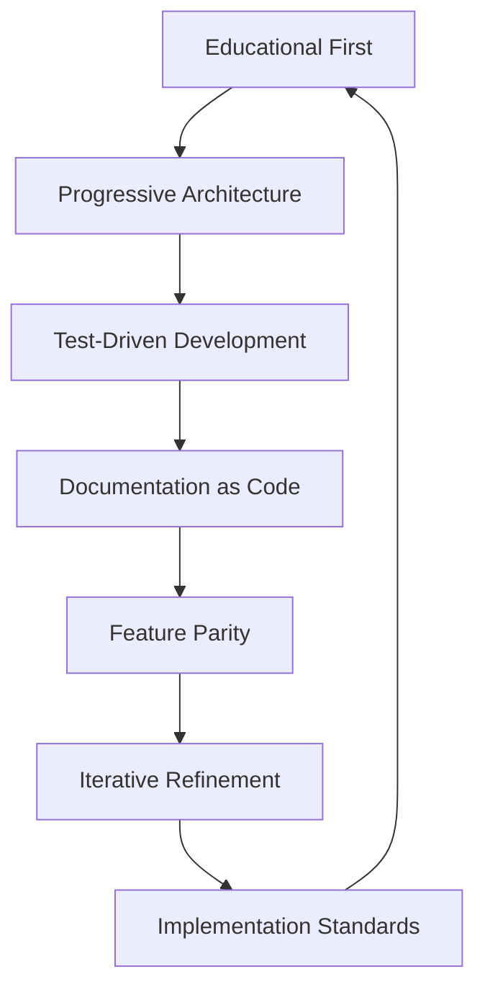

# Design Principles

ZigLlama is governed by a small set of non-negotiable principles.  Every pull
request, every new module, and every documentation paragraph is evaluated
against these tenets.  This page states them explicitly so that contributors
and readers can understand the *why* behind the code.

---

## 1. Educational First, Performance Second

The primary purpose of ZigLlama is **to teach**.  A reader who has never seen a
transformer implementation should be able to open any source file and, by
reading the comments alone, understand what mathematical operation is being
performed, why it matters for language modelling, and how it relates to the
components above and below it in the stack.

!!! definition "Guiding Question"
    *"If a competent Zig programmer who has never read the Attention Is All You
    Need paper opens this file, can they learn the concept from the code and its
    comments alone?"*

### Concrete practices

- Every public function begins with a doc-comment that states the
  **mathematical definition**, the **transformer context**, and a minimal
  **worked example** where appropriate.
- Inline comments annotate non-obvious algorithmic steps with references to the
  corresponding equation numbers in the canonical literature (Vaswani et al.,
  2017; Touvron et al., 2023).
- Where an optimised path coexists with a naive path, both are present in the
  source: the naive version for readability, the optimised version for
  production use.

```zig
/// Rectified Linear Unit (ReLU)
///
/// ## Mathematical Definition
/// ```
/// ReLU(x) = max(0, x) = { x if x > 0, 0 otherwise }
/// ```
///
/// ## Transformer Context
/// ReLU was used in the original Transformer feed-forward network.
/// Modern architectures (LLaMA) have replaced it with SwiGLU.
pub fn relu(x: f32) f32 {
    return @max(0.0, x);
}
```

!!! tip "Why Zig?"
    Zig's comptime generics, explicit allocators, and absence of hidden
    control flow make it an ideal language for educational systems programming.
    Every allocation is visible; every error is handled; there is no garbage
    collector to abstract away memory behaviour.

---

## 2. Progressive Component Architecture

The codebase is organised into **six layers** that build from the simplest
abstractions (tensors, memory maps) to the most complex (text generation,
streaming inference).  This mirrors the way a textbook introduces concepts:
fundamentals first, composition second.

```
Layer 6  Inference
Layer 5  Models
Layer 4  Transformers
Layer 3  Neural Primitives
Layer 2  Linear Algebra
Layer 1  Foundation
```

!!! notation "Dependency Rule"
    A module in layer \( L_i \) may import any module in layer \( L_j \) where
    \( j < i \).  It **must not** import modules in the same layer or in
    layers above it.  This produces a strict DAG.

### Benefits

| Benefit | Explanation |
|---------|-------------|
| **Incremental learning** | A reader can study Layer 1 in isolation before encountering Layer 2. |
| **Testability** | Each layer can be unit-tested against its own contracts without mocking upper layers. |
| **Compile-time safety** | Zig's import system enforces the DAG at compile time -- circular imports are a compile error. |
| **Refactorability** | Replacing the SIMD backend in Layer 2 cannot break Layer 5. |

---

## 3. Test-Driven Development

ZigLlama currently contains **285+ tests** spanning four categories:

| Category | Purpose | Example |
|----------|---------|---------|
| **Unit tests** | Verify a single function or type in isolation. | `tensor.init` returns correct shape. |
| **Integration tests** | Verify cross-layer interactions. | A `TransformerBlock` produces the expected output when composed from attention + FFN. |
| **Reference tests** | Validate numerical results against known-good values from the literature or from a reference implementation (PyTorch / llama.cpp). | GELU approximation matches the Hendrycks & Gimpel (2016) formula to \( < 10^{-5} \). |
| **Performance tests** | Guard against regressions and document scaling behaviour. | SIMD matmul is at least 3x faster than the naive loop for \( n \geq 256 \). |

!!! algorithm "Test Lifecycle"
    1. Write the mathematical specification in the doc-comment.
    2. Derive the expected outputs by hand or from a reference implementation.
    3. Implement the function.
    4. Write unit tests that assert the expected outputs.
    5. Add an integration test that exercises the function in a realistic
       pipeline.

### Test counts by layer

| Layer | Tests |
|-------|------:|
| 1 -- Foundation | 6 |
| 2 -- Linear Algebra | 5 |
| 3 -- Neural Primitives | 9 |
| 4 -- Transformers | 11 |
| 5 -- Models | 45 |
| 6 -- Inference | 47 |
| **Cross-layer / Main** | 2 |
| **Extended suite** | 160+ |
| **Total** | **285+** |

---

## 4. Documentation as Code

Documentation is not an afterthought -- it is a **deliverable** on par with the
implementation.  ZigLlama treats three kinds of documentation as first-class:

### 4.1 Inline documentation (source files)

Every source file opens with a module-level doc-comment that states:

1. **Educational Objectives** -- what the reader will learn.
2. **Mathematical Foundation** -- the relevant equations.
3. **Transformer Context** -- how the component fits into the larger model.

### 4.2 MkDocs site (this documentation)

The MkDocs site provides long-form exposition that cannot fit into source
comments: architectural diagrams, cross-cutting comparisons, learning paths,
and reference tables.  It uses:

- **LaTeX** for inline (\( x \)) and display (\[ \sum_{i=1}^{n} x_i \])
  mathematics.
- **Mermaid** for architectural and data-flow diagrams.
- **Material for MkDocs admonitions** for definitions, theorems, algorithms,
  and warnings.

### 4.3 Historical and theoretical context

Where appropriate, documentation references the original papers, explains the
historical evolution of a technique (e.g. LayerNorm to RMSNorm), and
provides intuition for *why* the technique works, not just *how* to implement
it.

!!! definition "Documentation Triad"
    Every significant component should be documented along three axes:

    1. **Mathematical**: the formal definition with notation.
    2. **Historical**: who introduced it, when, and why.
    3. **Practical**: a worked example or code snippet.

---

## 5. Feature Parity and Beyond

ZigLlama aims for meaningful **feature parity** with llama.cpp, the
industry-standard C++ inference engine.  "Meaningful" is defined as covering
the features that matter for **understanding and using** large language models,
rather than chasing every niche backend or quantisation variant.

### Current parity targets

| Area | Status |
|------|--------|
| GGUF model loading | Full v3 spec compliance |
| Quantisation formats | 18+ formats (Q4_0 through IQ4_NL) |
| Model architectures | 18 (covering ~80% of real-world usage) |
| Sampling strategies | Greedy, Top-K, Top-P, Temperature, Combined, Mirostat, Typical, Tail-Free, Contrastive |
| KV cache | Multi-sequence, sliding window |
| Batch inference | Dynamic batching with request queuing |
| Streaming generation | Thread-safe token streaming |
| Grammar constraints | JSON, Regex, CFG, XML, EBNF |
| BLAS integration | OpenBLAS, Intel MKL, Apple Accelerate, generic fallback |
| SIMD | AVX, AVX2, NEON auto-detection |

!!! info "What llama.cpp has that ZigLlama does not (yet)"
    GPU offloading (CUDA, Metal, Vulkan), 30+ quantisation formats, 94+
    model architectures.  See the [full comparison](llama-cpp-comparison.md).

---

## 6. Iterative Refinement

Development follows a **three-pass** strategy for every component:

### Pass 1 -- Naive implementation

Write the simplest correct version.  Prioritise readability.  Use
\( O(n^3) \) matrix multiplication with three nested loops.  Document
the algorithm thoroughly.

### Pass 2 -- Optimised implementation

Add SIMD, cache blocking, and quantisation paths.  Keep the naive
version in the code (guarded behind a comptime flag or as a separate
function) so that readers can compare.

### Pass 3 -- Documentation and testing

Write the MkDocs page, add performance benchmarks, and record the
speed-up ratios.  This pass ensures that the educational value of the
optimisation is captured, not just its runtime benefit.

!!! complexity "Documenting Trade-offs"
    Every optimisation must document:

    - **Before**: the naive complexity and measured time.
    - **After**: the optimised complexity and measured time.
    - **Trade-off**: what readability or generality was sacrificed.
    - **When to use**: under what workload the optimisation matters.

---

## 7. Implementation Standards

The following standards apply to all contributions.

### 7.1 Code quality

| Standard | Rationale |
|----------|-----------|
| **Clarity over cleverness** | A ten-line readable loop is preferred over a two-line bit-manipulation trick, unless the trick is itself the subject of the lesson. |
| **Explicit allocation** | Every `std.mem.Allocator` parameter is passed explicitly.  No global allocators. |
| **Error handling** | All fallible operations return `!T`.  Error sets are documented. |
| **Naming conventions** | Zig standard: `camelCase` functions, `PascalCase` types, `snake_case` fields. |
| **No hidden control flow** | No async, no hidden allocations, no implicit conversions. |

### 7.2 Documentation standards

| Standard | Rationale |
|----------|-----------|
| **Mathematical notation** | Use LaTeX for any formula with more than one operator. |
| **Historical context** | Cite the introducing paper at least once per major component. |
| **Worked examples** | Include at least one input/output pair in each doc-comment. |
| **Diagram-first** | When explaining data flow, draw a diagram before writing prose. |

### 7.3 Testing standards

| Standard | Rationale |
|----------|-----------|
| **Deterministic** | Tests must not depend on wall-clock time, random seeds, or network access. |
| **Self-contained** | Each test file can be run independently with `zig test`. |
| **Named assertions** | Use `std.testing.expectEqual` with descriptive variable names rather than raw boolean assertions. |
| **Edge cases** | Every numeric function must be tested at 0, negative values, very large values, and NaN/inf where applicable. |

---

## Summary

The seven principles form a coherent whole:



Each principle reinforces the others.  Progressive architecture makes testing
easier; testing makes documentation concrete; documentation keeps education
front and centre; and the implementation standards ensure that the cycle
repeats with every new contribution.
