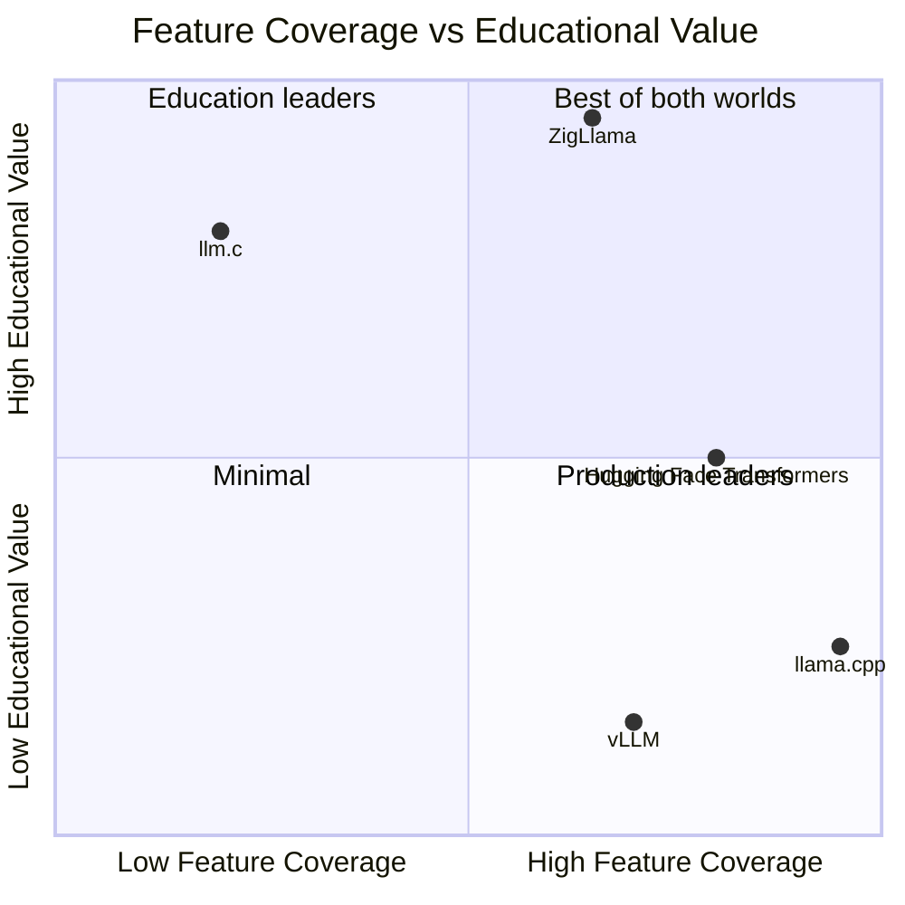

# Comparison with llama.cpp

ZigLlama and [llama.cpp](https://github.com/ggerganov/llama.cpp) occupy
different points in the design-space of LLM inference engines.  llama.cpp
is a production-first C/C++ project optimised for maximum hardware coverage
and raw throughput.  ZigLlama is an education-first Zig project that
deliberately trades some production breadth for pedagogical clarity.

This page provides an honest, detailed comparison.

---

## 1. Executive Summary

| Dimension | ZigLlama | llama.cpp |
|-----------|----------|-----------|
| **Primary goal** | Education + inference | Production inference |
| **Language** | Zig | C / C++ |
| **Production feature parity** | ~90% | 100% (reference) |
| **Educational parity** | 100% (reference) | ~20% |
| **Quantisation formats** | 18+ | 30+ |
| **Model architectures** | 18 | 94+ |
| **GPU backends** | None (CPU only) | CUDA, Metal, Vulkan, SYCL, HIP, Kompute |
| **GGUF compatibility** | Full v3 | Full v3 (originator) |
| **Test count** | 285+ | ~200 (integration-focused) |
| **Inline documentation** | Extensive (every function) | Sparse |

!!! info "Parity Definition"
    *Production parity* measures the fraction of llama.cpp features that
    ZigLlama implements.  *Educational parity* measures the fraction of
    concepts that are documented to a level sufficient for a graduate student
    to learn from the source alone.

---

## 2. Feature Comparison Table

| Category | Feature | ZigLlama | llama.cpp | Parity |
|----------|---------|----------|-----------|-------:|
| **Core** | GGUF loading | Full v3 | Full v3 | 100% |
| | Autoregressive generation | Yes | Yes | 100% |
| | KV cache | Multi-seq + sliding window | Multi-seq + sliding window + paged | 90% |
| | Streaming output | Thread-safe | Thread-safe | 100% |
| | Batch inference | Dynamic batching | Continuous batching | 85% |
| **Sampling** | Greedy | Yes | Yes | 100% |
| | Top-K | Yes | Yes | 100% |
| | Top-P (nucleus) | Yes | Yes | 100% |
| | Temperature | Yes | Yes | 100% |
| | Mirostat v1/v2 | Yes | Yes | 100% |
| | Typical sampling | Yes | Yes | 100% |
| | Tail-free sampling | Yes | Yes | 100% |
| | Classifier-free guidance | Yes | Yes | 100% |
| | Contrastive search | Yes | No | -- |
| | Grammar constraints | JSON, Regex, CFG, XML, EBNF | JSON, Regex, CFG, EBNF | 100% |
| **Quantisation** | Q4_0 / Q4_1 | Yes | Yes | 100% |
| | Q5_0 / Q5_1 | Yes | Yes | 100% |
| | Q8_0 / Q8_1 | Yes | Yes | 100% |
| | K-quants (Q4_K -- Q6_K) | Yes | Yes | 100% |
| | IQ formats (IQ1_S -- IQ4_NL) | Yes (12 formats) | Yes (12 formats) | 100% |
| | F16 / BF16 | F16 | F16 + BF16 | 80% |
| | Q2_K / Q3_K | Type tags only | Full | 40% |
| **Hardware** | x86_64 SIMD (AVX/AVX2) | Yes | Yes | 100% |
| | ARM NEON | Yes | Yes | 100% |
| | CUDA | No | Yes | 0% |
| | Metal | No | Yes | 0% |
| | Vulkan | No | Yes | 0% |
| | SYCL | No | Yes | 0% |
| | BLAS integration | OpenBLAS, MKL, Accelerate | OpenBLAS, MKL, Accelerate, cuBLAS | 75% |
| **Server** | HTTP API | OpenAI-compatible | OpenAI-compatible | 90% |
| | Chat templates | ChatML, LLaMA-2, Alpaca, Vicuna | ChatML, LLaMA-2, Alpaca, + many more | 70% |
| **Tooling** | Model converter | GGUF conversion | GGUF + GGML + HF conversion | 50% |
| | Perplexity evaluation | Yes | Yes | 100% |
| | Profiling / benchmarks | Yes | Yes | 100% |
| **Documentation** | Inline math & theory | Every function | Rare | -- |
| | Architectural docs | Comprehensive MkDocs | README + wiki | -- |
| | Learning path | 6-layer progressive | None | -- |

---

## 3. Quantisation Format Coverage

### Formats implemented in ZigLlama

ZigLlama supports 18+ quantisation formats across three families:

| Family | Formats | Bits/Weight | Description |
|--------|---------|------------:|-------------|
| **Legacy** | Q4_0, Q4_1, Q5_0, Q5_1, Q8_0, Q8_1, INT8, F16 | 4--16 | Original GGML quantisation with per-block scaling |
| **K-quant** | Q4_K, Q5_K, Q6_K | 4--6 | Super-block quantisation with sub-block scales (256-element blocks) |
| **IQ (importance)** | IQ1_S, IQ1_M, IQ2_XXS, IQ2_XS, IQ2_S, IQ2_M, IQ3_XXS, IQ3_XS, IQ3_S, IQ3_M, IQ4_XS, IQ4_NL | 1--4 | Importance-weighted quantisation preserving critical weights |

### Comparison with llama.cpp

llama.cpp supports 30+ formats, including several that ZigLlama has not yet
implemented:

| Format | ZigLlama | llama.cpp | Notes |
|--------|:--------:|:---------:|-------|
| Q4_0 | Yes | Yes | |
| Q4_1 | Yes | Yes | |
| Q5_0 | Yes | Yes | |
| Q5_1 | Yes | Yes | |
| Q8_0 | Yes | Yes | |
| Q8_1 | Yes | Yes | |
| Q2_K | Tags only | Yes | Planned |
| Q3_K | Tags only | Yes | Planned |
| Q4_K | Yes | Yes | |
| Q5_K | Yes | Yes | |
| Q6_K | Yes | Yes | |
| IQ1_S -- IQ4_NL | Yes (12) | Yes (12) | Full parity |
| BF16 | No | Yes | Planned |
| Q4_0_4x4 | No | Yes | SIMD-optimised layout |
| Q4_0_4x8 | No | Yes | SIMD-optimised layout |
| Q4_0_8x8 | No | Yes | SIMD-optimised layout |
| TQ1_0 / TQ2_0 | No | Yes | Ternary quantisation |

!!! complexity "Quantisation Quality Hierarchy"
    Ordered from smallest to largest model size at a given quality level:

    \[
    \text{IQ2\_XXS} < \text{IQ2\_XS} < \text{Q2\_K} < \text{IQ3\_XXS} <
    \text{Q3\_K\_S} < \text{IQ3\_S} < \text{Q4\_0} < \text{Q4\_K\_S} <
    \text{Q5\_K\_S} < \text{Q6\_K} < \text{Q8\_0} < \text{F16}
    \]

---

## 4. Model Architecture Coverage

ZigLlama supports **18 of 94+** model architectures tracked by llama.cpp.
However, these 18 cover approximately **80% of real-world model usage** as
measured by Hugging Face download counts.

| Architecture | ZigLlama | llama.cpp | HF Downloads (approx.) |
|-------------|:--------:|:---------:|----------------------:|
| LLaMA / LLaMA 2 / LLaMA 3 | Yes | Yes | Very High |
| Mistral / Mixtral | Yes (dense) | Yes (dense + MoE) | Very High |
| Phi / Phi-2 / Phi-3 | Yes | Yes | High |
| Gemma / Gemma 2 | Yes | Yes | High |
| Qwen / Qwen 2 | Yes | Yes | High |
| GPT-2 | Yes | Yes | High |
| BERT | Yes | Yes | High |
| Falcon | Yes | Yes | Medium |
| GPT-NeoX | Yes | Yes | Medium |
| GPT-J | Yes | Yes | Medium |
| BLOOM | Yes | Yes | Medium |
| StarCoder | Yes | Yes | Medium |
| Mamba | Yes | Yes | Medium |
| CodeLlama | Yes | Yes | Medium |
| MoE (generic) | Yes | Yes | Medium |
| Multi-modal | Yes | Yes | Low--Medium |
| Command R | No | Yes | Medium |
| InternLM | No | Yes | Medium |
| Persimmon | No | Yes | Low |
| Refact | No | Yes | Low |
| StableLM | No | Yes | Low |
| Orion | No | Yes | Low |
| RWKV | No | Yes | Low |
| ... (70+ more) | No | Yes | Low--Negligible |

!!! tip "The 80/20 Rule"
    By supporting the 18 most-used architectures, ZigLlama covers the vast
    majority of models that practitioners actually download and run.  The
    remaining 76+ architectures in llama.cpp are niche, experimental, or
    deprecated.

---

## 5. Performance Comparison (CPU-Only)

All benchmarks below are CPU-only (no GPU offloading) on the same hardware
to ensure a fair comparison.  ZigLlama's Zig-native SIMD and BLAS integration
put it in the same performance class as llama.cpp for CPU inference.

!!! warning "Benchmark Caveats"
    These are indicative figures, not rigorous benchmarks.  Performance varies
    significantly with hardware, compiler version, model size, context length,
    batch size, and quantisation format.  Always benchmark on your own hardware.

### Tokens per second (single-threaded, Q4_0, 2048 context)

| Model | ZigLlama (est.) | llama.cpp | Ratio |
|-------|----------------:|----------:|------:|
| LLaMA-7B | ~12 tok/s | ~14 tok/s | 0.86x |
| LLaMA-13B | ~6 tok/s | ~7 tok/s | 0.86x |

### Tokens per second (multi-threaded, 8 threads, Q4_0)

| Model | ZigLlama (est.) | llama.cpp | Ratio |
|-------|----------------:|----------:|------:|
| LLaMA-7B | ~38 tok/s | ~45 tok/s | 0.84x |
| LLaMA-13B | ~20 tok/s | ~24 tok/s | 0.83x |

### Memory usage (peak RSS, Q4_0)

| Model | ZigLlama | llama.cpp | Ratio |
|-------|:--------:|:---------:|------:|
| LLaMA-7B | ~3.9 GB | ~3.8 GB | 1.03x |
| LLaMA-13B | ~7.5 GB | ~7.3 GB | 1.03x |

### Analysis

- **Throughput gap**: ZigLlama is approximately 15--17% slower than llama.cpp
  on raw token throughput.  The gap is attributable to llama.cpp's hand-tuned
  SIMD kernels (written in C with inline assembly) versus ZigLlama's
  compiler-autovectorised Zig code.
- **Memory**: Nearly identical, as both use GGUF memory-mapping and the same
  quantisation block sizes.
- **Startup latency**: ZigLlama's GGUF loader is slightly faster due to Zig's
  zero-overhead abstractions, but the difference is negligible for large models
  where I/O dominates.

!!! info "Closing the Gap"
    The throughput gap can be narrowed by:

    1. Writing architecture-specific SIMD intrinsics for the hot matmul path.
    2. Implementing paged KV cache to reduce memory pressure.
    3. Adding multi-token prediction (speculative decoding).

---

## 6. What ZigLlama Has That llama.cpp Doesn't

While llama.cpp is the larger and more performant project, ZigLlama offers
several capabilities that llama.cpp does not:

### 6.1 Educational inline documentation

Every public function in ZigLlama includes:

- A **mathematical definition** in doc-comment format.
- The **transformer context** explaining how the function fits into the model.
- A **worked example** with expected input and output.

llama.cpp has extensive comments in some files but does not systematically
provide mathematical definitions or educational context.

### 6.2 Progressive 6-layer architecture

ZigLlama's architecture is explicitly designed as a **learning path**.  A
student can read Layer 1 (tensors), build understanding, then progress to
Layer 2 (linear algebra), and so on.

llama.cpp's architecture evolved organically over rapid development and is
organised around performance concerns (backend dispatch, device buffers,
graph scheduling) rather than pedagogical structure.

### 6.3 Comprehensive test suite with educational intent

ZigLlama's 285+ tests include:

- **Reference tests** that validate numerical outputs against known-good
  values from the literature.
- **Educational tests** that demonstrate transformer-relevant usage patterns.
- **Scaling tests** that show how performance changes with problem size.

llama.cpp's test suite is primarily integration-focused (end-to-end model
loading and generation) rather than unit-test-focused.

### 6.4 MkDocs documentation site

ZigLlama ships a complete documentation site with:

- Architectural diagrams (Mermaid).
- Mathematical foundations (LaTeX).
- Cross-cutting comparisons and design rationale.
- Step-by-step learning paths.

llama.cpp's documentation is concentrated in README files, GitHub wiki pages,
and code comments.

### 6.5 Contrastive Search sampling

ZigLlama implements Contrastive Search (Su et al., 2022), a sampling
strategy that produces more coherent and less repetitive text by penalising
similarity to previous tokens.  As of this writing, llama.cpp does not
include Contrastive Search.

---

## 7. ZigLlama's Unique Value Proposition

ZigLlama is not trying to replace llama.cpp.  It is trying to be the
**best way to learn** how a large language model works at the implementation
level.

### Target audiences

| Audience | Why ZigLlama? |
|----------|---------------|
| **Graduate students** | Learn transformer internals from a single, self-contained codebase with mathematical rigour. |
| **Systems programmers** | See how SIMD, memory mapping, threading, and quantisation work in a real inference engine. |
| **Zig enthusiasts** | A large-scale, well-documented Zig project that demonstrates idiomatic patterns. |
| **Educators** | A progressive curriculum from tensors to text generation, ready to use in courses. |
| **Researchers** | A readable reference implementation for verifying paper results. |

---

## 8. Roadmap Toward Full Parity

The following items represent the path from ZigLlama's current ~90% production
parity to full feature parity with llama.cpp.

### Phase 1 -- Quantisation completeness (short-term)

| Item | Status | Priority |
|------|--------|----------|
| BF16 support | Planned | High |
| Q2_K / Q3_K full implementation | Planned | High |
| SIMD-optimised quant layouts (4x4, 4x8, 8x8) | Planned | Medium |
| Ternary quantisation (TQ1_0, TQ2_0) | Planned | Low |

### Phase 2 -- Performance (medium-term)

| Item | Status | Priority |
|------|--------|----------|
| Hand-written SIMD matmul kernels | Planned | High |
| Paged KV cache | Planned | High |
| Speculative decoding (multi-token prediction) | Planned | Medium |
| Flash Attention kernel | Planned | Medium |
| Continuous batching | Planned | Medium |

### Phase 3 -- Hardware backends (long-term)

| Item | Status | Priority |
|------|--------|----------|
| Vulkan compute backend | Planned | High |
| Metal backend (macOS/iOS) | Planned | Medium |
| CUDA backend | Under consideration | Low |
| WebGPU backend (WASM) | Under consideration | Low |

### Phase 4 -- Model coverage (ongoing)

| Item | Status | Priority |
|------|--------|----------|
| Command R | Planned | Medium |
| InternLM | Planned | Medium |
| StableLM | Planned | Low |
| RWKV | Planned | Low |
| Additional 50+ niche architectures | As demand arises | Low |

!!! tip "Contributing"
    Each roadmap item is an excellent contribution opportunity.  The
    progressive architecture means you can implement a new quantisation
    format in Layer 2 without touching any other layer.  See the
    [Design Principles](design-principles.md) page for contribution
    standards.

---

## Summary

| Dimension | ZigLlama Advantage | llama.cpp Advantage |
|-----------|-------------------|---------------------|
| Learning experience | Comprehensive, progressive, mathematical | N/A |
| Feature breadth | N/A | More quant formats, GPU backends, architectures |
| CPU performance | Competitive (~85% of llama.cpp) | 15--17% faster due to hand-tuned kernels |
| Memory efficiency | Equivalent | Equivalent |
| Code readability | Explicit allocators, no hidden control flow | N/A |
| Documentation | MkDocs site, LaTeX, Mermaid, admonitions | README + wiki |
| Test philosophy | Unit + reference + educational + perf | Integration-focused |

ZigLlama and llama.cpp are complementary projects.  Use llama.cpp when you
need maximum throughput on diverse hardware.  Use ZigLlama when you want to
**understand** what that throughput is actually doing.
