# Module Dependencies

This page documents the complete import graph of ZigLlama, the public API
surface exported through `src/main.zig`, and the internal modules that are
used within a layer but not re-exported to consumers.

---

## 1. Import Graph

The diagram below shows every source file and its `@import` edges.  Arrows
point **from importer to importee** (i.e., in the direction of dependency).
Colour encodes the layer.

```mermaid
graph BT
    %% ---- Layer 1: Foundation (blue) ----
    classDef L1 fill:#2196f3,color:#fff,stroke:#1565c0
    tensor[tensor.zig]:::L1
    mmap[memory_mapping.zig]:::L1
    gguf_fmt[gguf_format.zig]:::L1
    blas[blas_integration.zig]:::L1
    thread[threading.zig]:::L1

    mmap --> tensor
    blas --> tensor
    blas --> thread
    gguf_fmt --> tensor

    %% ---- Layer 2: Linear Algebra (green) ----
    classDef L2 fill:#4caf50,color:#fff,stroke:#2e7d32
    matops[matrix_ops.zig]:::L2
    quant[quantization.zig]:::L2
    kquant[k_quantization.zig]:::L2
    iquant[iq_quantization.zig]:::L2

    matops --> tensor
    quant --> tensor
    kquant --> tensor
    iquant --> tensor
    gguf_fmt --> quant

    %% ---- Layer 3: Neural Primitives (orange) ----
    classDef L3 fill:#ff9800,color:#fff,stroke:#e65100
    act[activations.zig]:::L3
    norm[normalization.zig]:::L3
    emb[embeddings.zig]:::L3

    act --> tensor
    norm --> tensor
    emb --> tensor

    %% ---- Layer 4: Transformers (red) ----
    classDef L4 fill:#f44336,color:#fff,stroke:#b71c1c
    attn[attention.zig]:::L4
    ff[feed_forward.zig]:::L4
    tb[transformer_block.zig]:::L4

    attn --> tensor
    attn --> matops
    attn --> act
    attn --> norm
    ff --> tensor
    ff --> matops
    ff --> act
    tb --> tensor
    tb --> attn
    tb --> ff
    tb --> norm

    %% ---- Layer 5: Models (purple) ----
    classDef L5 fill:#9c27b0,color:#fff,stroke:#6a1b9a
    llama[llama.zig]:::L5
    cfg[config.zig]:::L5
    tok[tokenizer.zig]:::L5
    gguf_load[gguf.zig]:::L5
    bert_m[bert.zig]:::L5
    gpt2_m[gpt2.zig]:::L5
    mistral_m[mistral.zig]:::L5
    falcon_m[falcon.zig]:::L5
    phi_m[phi.zig]:::L5
    bloom_m[bloom.zig]:::L5
    gemma_m[gemma.zig]:::L5
    qwen_m[qwen.zig]:::L5
    mamba_m[mamba.zig]:::L5
    gptj_m[gptj.zig]:::L5
    gptneox_m[gpt_neox.zig]:::L5
    star_m[starcoder.zig]:::L5
    moe_m[mixture_of_experts.zig]:::L5
    mm_m[multi_modal.zig]:::L5
    chat[chat_templates.zig]:::L5

    llama --> tensor
    llama --> emb
    llama --> norm
    llama --> attn
    llama --> ff
    llama --> tb

    %% ---- Layer 6: Inference (teal) ----
    classDef L6 fill:#009688,color:#fff,stroke:#004d40
    gen[generation.zig]:::L6
    kv[kv_cache.zig]:::L6
    stream[streaming.zig]:::L6
    batch[batching.zig]:::L6
    prof[profiling.zig]:::L6
    advsamp[advanced_sampling.zig]:::L6
    gram[grammar_constraints.zig]:::L6

    gen --> tensor
    gen --> llama
    gen --> tok
    kv --> tensor
    stream --> gen
    stream --> tok
    batch --> tensor
    batch --> llama
    batch --> tok
    batch --> gen
    batch --> kv
    prof --> gen
    prof --> batch
    prof --> kv
    advsamp --> tensor
    gram --> tensor

    %% ---- Entry point ----
    classDef entry fill:#607d8b,color:#fff,stroke:#37474f
    main[main.zig]:::entry
    main --> tensor
    main --> matops
    main --> quant
    main --> act
    main --> norm
    main --> emb
    main --> attn
    main --> ff
    main --> tb
    main --> llama
    main --> cfg
    main --> tok
    main --> gguf_load
    main --> gen
    main --> kv
    main --> stream
    main --> batch
    main --> prof
```



!!! info "Legend"
    | Colour | Layer |
    |--------|-------|
    | Blue | 1 -- Foundation |
    | Green | 2 -- Linear Algebra |
    | Orange | 3 -- Neural Primitives |
    | Red | 4 -- Transformers |
    | Purple | 5 -- Models |
    | Teal | 6 -- Inference |
    | Grey | Entry point (`main.zig`) |

---

## 2. Dependency Rules

### The Layer Rule

\[
\text{layer}(\text{importer}) > \text{layer}(\text{importee})
\]

A module may only import modules from **strictly lower** layers.  This is the
single most important structural invariant in the codebase.

### Consequences

| Property | Guarantee |
|----------|-----------|
| **Acyclicity** | The import graph is a DAG by construction.  The Zig compiler rejects circular imports at compile time. |
| **Isolation** | Changes to Layer 6 (inference) cannot affect the compilation of Layers 1--5. |
| **Testability** | Layer \( i \) tests need only the libraries from layers \( 1 \) through \( i-1 \). |
| **Build speed** | Zig can compile layers in topological order, maximising parallelism. |

### Intra-layer imports

Modules within the same layer **do not** import each other, with one
documented exception:

- `foundation/gguf_format.zig` imports `linear_algebra/quantization.zig` to
  resolve GGML tensor-type tags.  This cross-layer reference is a deliberate
  design choice: GGUF parsing needs to understand quantisation types, and
  duplicating the enum would violate DRY.

!!! warning "Exception Discipline"
    Any new cross-layer or same-layer import must be documented here with a
    justification.  Unjustified exceptions are grounds for refactoring.

---

## 3. Public API Surface

`src/main.zig` re-exports 26 modules organised by layer.  These constitute
the **public API** of ZigLlama -- the interface that examples, tests, and
downstream consumers may depend on.

| # | Namespace | Module path | Description |
|---|-----------|-------------|-------------|
| **Layer 1 -- Foundation** | | | |
| 1 | `foundation.tensor` | `foundation/tensor.zig` | Generic \( n \)-D tensor with row-major storage |
| **Layer 2 -- Linear Algebra** | | | |
| 2 | `linear_algebra.matrix_ops` | `linear_algebra/matrix_ops.zig` | SIMD-accelerated matrix operations |
| 3 | `linear_algebra.quantization` | `linear_algebra/quantization.zig` | Q4_0, Q4_1, Q8_0, INT8, F16 quantisation |
| **Layer 3 -- Neural Primitives** | | | |
| 4 | `neural_primitives.activations` | `neural_primitives/activations.zig` | ReLU, GELU, SiLU, SwiGLU, and variants |
| 5 | `neural_primitives.normalization` | `neural_primitives/normalization.zig` | LayerNorm, RMSNorm, BatchNorm, GroupNorm |
| 6 | `neural_primitives.embeddings` | `neural_primitives/embeddings.zig` | Token, positional, segment, and rotary embeddings |
| **Layer 4 -- Transformers** | | | |
| 7 | `transformers.attention` | `transformers/attention.zig` | Multi-head scaled dot-product attention |
| 8 | `transformers.feed_forward` | `transformers/feed_forward.zig` | FFN with Standard, GELU, SwiGLU, GeGLU, GLU |
| 9 | `transformers.transformer_block` | `transformers/transformer_block.zig` | Encoder, Decoder, EncoderDecoder blocks |
| **Layer 5 -- Models** | | | |
| 10 | `models.llama` | `models/llama.zig` | LLaMA model definition and forward pass |
| 11 | `models.config` | `models/config.zig` | Model size presets and configuration types |
| 12 | `models.tokenizer` | `models/tokenizer.zig` | BPE / SentencePiece tokeniser |
| 13 | `models.gguf` | `models/gguf.zig` | High-level GGUF model loader |
| **Layer 6 -- Inference** | | | |
| 14 | `inference.generation` | `inference/generation.zig` | Autoregressive text generation engine |
| 15 | `inference.kv_cache` | `inference/kv_cache.zig` | Key-value cache for efficient decoding |
| 16 | `inference.streaming` | `inference/streaming.zig` | Token-by-token streaming output |
| 17 | `inference.batching` | `inference/batching.zig` | Dynamic batch processing |
| 18 | `inference.profiling` | `inference/profiling.zig` | Performance profiling and benchmarking |

!!! tip "Accessing the API"
    From any Zig file that depends on ZigLlama:
    ```zig
    const zigllama = @import("zigllama");
    const Tensor = zigllama.foundation.tensor.Tensor;
    const gen = zigllama.inference.generation;
    ```

### Additional modules referenced by `main.zig` test block

The `test` block at the bottom of `main.zig` imports all 18 public module
files to ensure they compile and their tests run.  These 18 paths correspond
to the modules listed above (some namespaces group multiple concepts).

---

## 4. Internal Modules

The following modules are used within their respective layers but are **not**
re-exported through `main.zig`.  Downstream consumers should not depend on
them; their APIs may change without notice.

| Module | File | Layer | Purpose |
|--------|------|-------|---------|
| `AdvancedSampler` | `inference/advanced_sampling.zig` | 6 | Mirostat, Typical, Tail-Free, Contrastive sampling |
| `GrammarConstraint` | `inference/grammar_constraints.zig` | 6 | JSON / Regex / CFG / XML / EBNF constrained decoding |
| `KQuantizer` | `linear_algebra/k_quantization.zig` | 2 | K-quant formats (Q4_K, Q5_K, Q6_K) |
| `IQuantizer` | `linear_algebra/iq_quantization.zig` | 2 | Importance quantisation (IQ1_S through IQ4_NL) |
| `MemoryMap` | `foundation/memory_mapping.zig` | 1 | POSIX memory-mapped I/O |
| `BlasInterface` | `foundation/blas_integration.zig` | 1 | BLAS backend selection and dispatch |
| `ThreadPool` | `foundation/threading.zig` | 1 | Work-stealing thread pool |
| `ChatTemplates` | `models/chat_templates.zig` | 5 | Prompt formatting templates |
| `HttpServer` | `server/http_server.zig` | -- | OpenAI-compatible HTTP server |
| `CLI` | `server/cli.zig` | -- | Command-line interface driver |
| `ModelConverter` | `tools/model_converter.zig` | -- | Weight format conversion utilities |
| `Perplexity` | `evaluation/perplexity.zig` | -- | Perplexity evaluation benchmark |

!!! warning "Stability Guarantee"
    Only modules listed in Section 3 (Public API Surface) carry a stability
    guarantee.  Internal modules may be renamed, merged, split, or removed in
    any release.

### Out-of-layer modules

Three directories fall outside the six-layer model:

| Directory | Contents |
|-----------|----------|
| `src/server/` | HTTP server (`http_server.zig`) and CLI driver (`cli.zig`).  These are application entry points, not library modules. |
| `src/tools/` | Offline utilities: `model_converter.zig` and `converter_cli.zig` for converting between weight formats. |
| `src/evaluation/` | Evaluation harness: `perplexity.zig` for measuring model quality on benchmark datasets. |

These directories depend on all six layers but are not depended upon by any
layer.  They sit at the top of the dependency DAG alongside `main.zig`.

---

## 5. Dependency Matrix

The following matrix summarises which layers depend on which.  A checkmark
indicates that at least one module in the row layer imports at least one
module in the column layer.

|  | L1 Foundation | L2 Linear Algebra | L3 Neural Primitives | L4 Transformers | L5 Models | L6 Inference |
|--|:---:|:---:|:---:|:---:|:---:|:---:|
| **L1 Foundation** | -- | | | | | |
| **L2 Linear Algebra** | Yes | -- | | | | |
| **L3 Neural Primitives** | Yes | | -- | | | |
| **L4 Transformers** | Yes | Yes | Yes | -- | | |
| **L5 Models** | Yes | | Yes | Yes | -- | |
| **L6 Inference** | Yes | | | | Yes | -- |

!!! info "Reading the Matrix"
    Row = importer, column = importee.  The matrix is strictly lower-triangular
    (below the diagonal), confirming that the dependency graph is acyclic and
    respects the layer ordering.

---

## 6. Build-Order Implications

Because the graph is a DAG, the Zig build system can compile layers in
topological order.  On a multi-core machine, layers at the same depth can
compile in parallel:

```
Depth 0:  Layer 1  (Foundation)
Depth 1:  Layer 2, Layer 3  (in parallel -- no mutual dependency)
Depth 2:  Layer 4  (depends on 1, 2, 3)
Depth 3:  Layer 5  (depends on 1, 3, 4)
Depth 4:  Layer 6  (depends on 1, 5)
Depth 5:  main.zig, server/, tools/, evaluation/
```

This means that a change confined to Layer 6 triggers recompilation of only
Layer 6 and the entry points -- Layers 1 through 5 are untouched.  This is a
significant developer-experience benefit in a project of this size.
