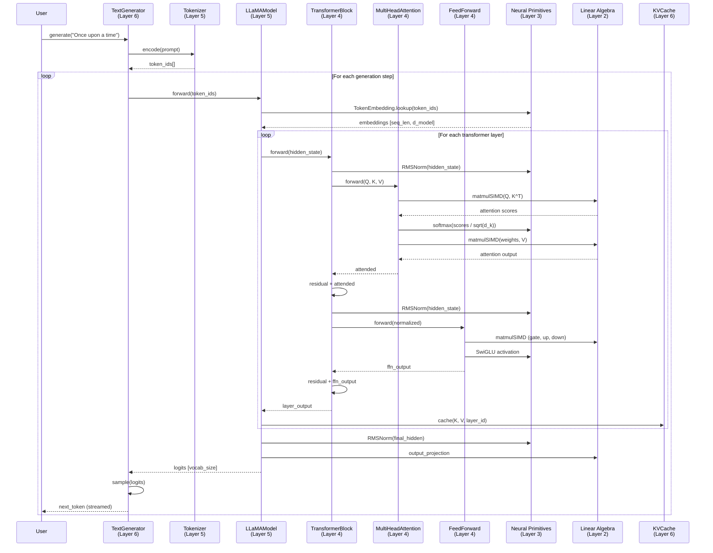

# The 6-Layer Progressive Architecture

ZigLlama decomposes the problem of running a large language model into six
progressively more abstract layers.  A reader can begin at Layer 1 and build
a working mental model before advancing to Layer 2; by the time they reach
Layer 6 they have seen every concept needed to generate text from a transformer.

---

## 1. Architectural Philosophy

### Why progressive layers?

Language models are deep stacks of repeated operations, but they are typically
presented either as opaque library calls or as a wall of linear-algebra code.
Neither approach is good for learning.

ZigLlama's layered design offers a middle path:

| Problem with monolithic code | How layers solve it |
|------------------------------|---------------------|
| "Where does the tensor come from?" | Layer 1 defines tensors in isolation, with full doc-comments and tests. |
| "What is quantisation doing to my weights?" | Layer 2 treats quantisation as a self-contained topic, tested against known-good values. |
| "How does RMSNorm fit into the model?" | Layer 3 implements normalisation as an independent primitive; Layer 4 composes it into blocks. |
| "What is KV caching and why does it matter?" | Layer 6 explains and benchmarks caching without requiring the reader to understand model loading (Layer 5). |

!!! definition "Progressive Disclosure"
    Progressive disclosure is an interaction-design principle: present
    the simplest useful information first, and reveal complexity only when
    the user asks for it.  ZigLlama applies this principle to source code.

### The dependency invariant

\[
\forall\, m \in L_i,\; n \in L_j : \text{imports}(m, n) \implies j < i
\]

Every module in layer \( i \) may depend only on modules in layers strictly
below \( i \).  This invariant is enforced by the Zig compiler (circular
imports are a compile error) and by code review.

---

## 2. Layer Dependency Diagram

```mermaid
graph TB
    subgraph "Layer 6 -- Inference"
        gen[generation.zig]
        kv[kv_cache.zig]
        stream[streaming.zig]
        batch[batching.zig]
        prof[profiling.zig]
        adv_samp[advanced_sampling.zig]
        gram[grammar_constraints.zig]
    end

    subgraph "Layer 5 -- Models"
        llama[llama.zig]
        cfg[config.zig]
        tok[tokenizer.zig]
        gguf[gguf.zig]
        bert[bert.zig]
        gpt2[gpt2.zig]
        mistral[mistral.zig]
        falcon[falcon.zig]
        phi[phi.zig]
        bloom[bloom.zig]
        gemma[gemma.zig]
        qwen[qwen.zig]
        mamba[mamba.zig]
        gptj[gptj.zig]
        gptneox[gpt_neox.zig]
        starcoder[starcoder.zig]
        moe[mixture_of_experts.zig]
        mm[multi_modal.zig]
        chat[chat_templates.zig]
    end

    subgraph "Layer 4 -- Transformers"
        attn[attention.zig]
        ff[feed_forward.zig]
        tb[transformer_block.zig]
    end

    subgraph "Layer 3 -- Neural Primitives"
        act[activations.zig]
        norm[normalization.zig]
        emb[embeddings.zig]
    end

    subgraph "Layer 2 -- Linear Algebra"
        matops[matrix_ops.zig]
        quant[quantization.zig]
        kquant[k_quantization.zig]
        iquant[iq_quantization.zig]
    end

    subgraph "Layer 1 -- Foundation"
        tensor[tensor.zig]
        mmap[memory_mapping.zig]
        gguf_fmt[gguf_format.zig]
        blas[blas_integration.zig]
        thread[threading.zig]
    end

    %% Layer 6 -> 5
    gen --> llama
    gen --> tok
    stream --> gen
    batch --> llama & tok & gen & kv
    prof --> gen & batch & kv

    %% Layer 5 -> 4
    llama --> attn & ff & tb
    llama --> norm & emb

    %% Layer 4 -> 3 & 2
    attn --> matops & act & norm
    ff --> matops & act
    tb --> attn & ff & norm

    %% Layer 3 -> 1
    act --> tensor
    norm --> tensor
    emb --> tensor

    %% Layer 2 -> 1
    matops --> tensor
    quant --> tensor
    kquant --> tensor
    iquant --> tensor

    %% Foundation internal
    gguf_fmt --> tensor & quant
    mmap --> tensor
    blas --> tensor & thread
```



---

## 3. Layer-by-Layer Reference

### Layer 1 -- Foundation

!!! info "Purpose"
    Provide the lowest-level abstractions that every higher layer depends on:
    typed multi-dimensional arrays, memory-mapped I/O, GGUF binary parsing,
    BLAS dispatch, and thread-pool management.

| Component | File | Description |
|-----------|------|-------------|
| `Tensor(T)` | `foundation/tensor.zig` | Generic \( n \)-dimensional array with row-major storage, shape metadata, stride calculation, and basic operations (indexing, fill, print, `matmul`). |
| `MemoryMap` | `foundation/memory_mapping.zig` | POSIX `mmap` wrapper for loading multi-gigabyte model files without copying them into heap memory.  Supports read/write protection, huge pages, and page locking. |
| `GGUFReader` | `foundation/gguf_format.zig` | Full GGUF v3 parser: magic-number validation, metadata key-value pairs, tensor descriptors, quantisation-type tags, and byte-offset calculation. |
| `BlasInterface` | `foundation/blas_integration.zig` | Runtime BLAS backend selection among OpenBLAS, Intel MKL, Apple Accelerate, ATLAS, and a pure-Zig generic fallback.  Auto-detects available libraries. |
| `ThreadPool` | `foundation/threading.zig` | Work-stealing thread pool with NUMA-aware allocation, CPU topology detection, and configurable affinity. |

**Key types exported:**

```zig
pub const Tensor = foundation.tensor.Tensor;     // Tensor(f32), Tensor(i32), ...
pub const MemoryMap = memory_mapping.MemoryMap;
pub const GGUFReader = gguf_format.GGUFReader;
pub const BlasConfig = blas_integration.BlasConfig;
pub const ThreadPoolConfig = threading.ThreadPoolConfig;
```

**Dependencies:** `std` only.

**Test count:** 6 (tensor shape, indexing, fill, matmul, print, error cases).

---

### Layer 2 -- Linear Algebra

!!! info "Purpose"
    Accelerate the numerical core: SIMD-vectorised matrix multiplication,
    cache-blocking algorithms, and a comprehensive quantisation framework
    covering legacy (Q4/Q8), K-quant, and importance-quant (IQ) formats.

| Component | File | Description |
|-----------|------|-------------|
| `matmulSIMD` | `linear_algebra/matrix_ops.zig` | Auto-vectorised matrix multiplication with compile-time SIMD width detection (AVX, AVX2, NEON).  Falls back to scalar on unknown targets. |
| `QuantizedTensor` | `linear_algebra/quantization.zig` | Per-channel and per-group quantisation for Q4_0, Q4_1, Q8_0, INT8, and F16.  Includes dequantisation and GGUF-compatible block layouts. |
| `KQuantizer` | `linear_algebra/k_quantization.zig` | K-quantisation formats (Q4_K, Q5_K, Q6_K) with 256-element super-blocks and sub-block scaling, matching the llama.cpp `k_quants` specification. |
| `IQuantizer` | `linear_algebra/iq_quantization.zig` | Importance quantisation (IQ1_S through IQ4_NL): 12 formats that allocate more bits to statistically important weights. |

**Key mathematical operation -- blocked matrix multiply:**

\[
C_{ij} = \sum_{k=0}^{K-1} A_{ik} \, B_{kj}
\]

Blocked into \( b \times b \) tiles to fit in L1 cache:

\[
C_{IJ} = \sum_{K'} A_{IK'} \, B_{K'J}, \quad
I = [i \cdot b,\, (i+1) \cdot b), \; \text{etc.}
\]

!!! complexity "SIMD Speed-up"
    On AVX2-capable x86_64 CPUs, the SIMD matmul processes 8 floats per
    cycle versus 1 for the scalar loop -- a theoretical 8x throughput gain,
    typically realised as 4--6x after memory-bandwidth saturation.

**Dependencies:** Layer 1 (`Tensor`).

**Test count:** 5 (SIMD correctness, quantise/dequantise round-trip, block-format layout, edge cases).

---

### Layer 3 -- Neural Primitives

!!! info "Purpose"
    Implement the building blocks that sit between raw linear algebra and
    full transformer layers: activation functions, normalisation layers, and
    embedding lookups.

| Component | File | Description |
|-----------|------|-------------|
| Activations | `neural_primitives/activations.zig` | ReLU, GELU, SiLU, GLU, GeGLU, SwiGLU, Tanh, Sigmoid -- both scalar and tensor-wide variants. |
| Normalisation | `neural_primitives/normalization.zig` | LayerNorm, RMSNorm, BatchNorm, GroupNorm with configurable \(\varepsilon\) and learnable scale/shift. |
| Embeddings | `neural_primitives/embeddings.zig` | `TokenEmbedding` (vocabulary lookup), sinusoidal positional encoding, learned positional encoding, Rotary Position Embeddings (RoPE), and segment embeddings. |

**Key mathematical definitions:**

*RMSNorm (Zhang & Sennrich, 2019):*

\[
\text{RMSNorm}(x) = \frac{x}{\sqrt{\frac{1}{d}\sum_{i=1}^{d} x_i^2 + \varepsilon}} \odot \gamma
\]

*SwiGLU (Shazeer, 2020):*

\[
\text{SwiGLU}(x, W_1, W_2, W_3) = \bigl(\text{SiLU}(x W_1)\bigr) \odot (x W_3) \cdot W_2
\]

*Rotary Position Embedding:*

\[
\text{RoPE}(x_m, m) = \begin{pmatrix}
x_m^{(1)} \cos m\theta_1 - x_m^{(2)} \sin m\theta_1 \\
x_m^{(1)} \sin m\theta_1 + x_m^{(2)} \cos m\theta_1 \\
\vdots
\end{pmatrix}
\]

**Dependencies:** Layer 1 (`Tensor`).

**Test count:** 9 (activation properties, normalisation invariants, embedding lookup, RoPE rotation).

---

### Layer 4 -- Transformers

!!! info "Purpose"
    Compose neural primitives into the core transformer building blocks:
    multi-head attention, position-wise feed-forward networks, and complete
    encoder / decoder / encoder-decoder blocks.

| Component | File | Description |
|-----------|------|-------------|
| `MultiHeadAttention` | `transformers/attention.zig` | Scaled dot-product attention with configurable head count, causal masking, and cross-attention support. |
| `FeedForward` | `transformers/feed_forward.zig` | Five FFN variants: Standard (ReLU), GELU, SwiGLU, GeGLU, and classic GLU. |
| `TransformerBlock` | `transformers/transformer_block.zig` | Full blocks in Encoder, Decoder, and EncoderDecoder configurations with Pre-Norm or Post-Norm placement. |

**Scaled dot-product attention (Vaswani et al., 2017):**

\[
\text{Attention}(Q, K, V) = \text{softmax}\!\left(\frac{Q K^\top}{\sqrt{d_k}}\right) V
\]

**Multi-head decomposition:**

\[
\text{MultiHead}(Q, K, V) = \text{Concat}(\text{head}_1, \dots, \text{head}_h) \, W^O
\]

where each head computes:

\[
\text{head}_i = \text{Attention}(Q W_i^Q,\, K W_i^K,\, V W_i^V)
\]

!!! theorem "Why scale by \( 1/\sqrt{d_k} \)?"
    If the entries of \( Q \) and \( K \) are independent random variables
    with zero mean and unit variance, then \( Q K^\top \) has variance
    \( d_k \).  Dividing by \( \sqrt{d_k} \) restores unit variance, which
    keeps the softmax in its non-saturated regime and improves gradient flow.

**Dependencies:** Layers 1--3 (`Tensor`, `matrix_ops`, `activations`, `normalization`).

**Test count:** 11 (attention output shape, causal mask, FFN variants, block residual connection, pre/post-norm equivalence).

---

### Layer 5 -- Models

!!! info "Purpose"
    Define complete model architectures, configuration presets, tokenisation
    pipelines, and the GGUF loading path that turns a binary file into a
    runnable model.

#### Supported architectures (18)

| # | Architecture | File | Notes |
|---|-------------|------|-------|
| 1 | LLaMA | `models/llama.zig` | Primary reference implementation. 7B--65B presets. |
| 2 | Mistral | `models/mistral.zig` | Sliding-window attention variant. |
| 3 | Falcon | `models/falcon.zig` | Multi-query attention. |
| 4 | GPT-2 | `models/gpt2.zig` | Classic autoregressive decoder. |
| 5 | GPT-J | `models/gptj.zig` | Rotary embeddings + parallel attention. |
| 6 | GPT-NeoX | `models/gpt_neox.zig` | EleutherAI architecture. |
| 7 | BERT | `models/bert.zig` | Encoder-only, masked LM. |
| 8 | BLOOM | `models/bloom.zig` | Multilingual, ALiBi positional. |
| 9 | Phi | `models/phi.zig` | Microsoft small-model family. |
| 10 | Gemma | `models/gemma.zig` | Google DeepMind. |
| 11 | Qwen | `models/qwen.zig` | Alibaba Cloud. |
| 12 | StarCoder | `models/starcoder.zig` | Code generation. |
| 13 | Mamba | `models/mamba.zig` | State-space model (SSM). |
| 14 | Mixture of Experts | `models/mixture_of_experts.zig` | Sparse MoE routing. |
| 15 | Multi-modal | `models/multi_modal.zig` | Vision + language. |
| 16--18 | CodeLlama variants | via `config.zig` | 7B, 13B, 34B code presets. |

#### Supporting modules

| Module | File | Description |
|--------|------|-------------|
| `ModelConfig` | `models/config.zig` | `ModelSize` enum (LLaMA_7B -- CodeLlama_34B), activation and normalisation type enums, parameter-count calculator. |
| `SimpleTokenizer` | `models/tokenizer.zig` | BPE / SentencePiece-compatible tokeniser with special-token handling. |
| `GGUFLoader` | `models/gguf.zig` | High-level GGUF loading: reads header, resolves tensor offsets, dequantises weights into `Tensor(f32)`. |
| `ChatTemplates` | `models/chat_templates.zig` | Prompt formatting for ChatML, LLaMA-2-Chat, Alpaca, Vicuna, and custom templates. |

**Dependencies:** Layers 1--4.

**Test count:** 45 (config presets, tokeniser encode/decode, GGUF header parsing, LLaMA forward pass, model size calculations).

---

### Layer 6 -- Inference

!!! info "Purpose"
    Turn a loaded model into a text-generation system: autoregressive
    decoding, sampling strategies, KV caching, streaming output, batch
    processing, advanced sampling, grammar constraints, and performance
    profiling.

| Component | File | Description |
|-----------|------|-------------|
| `TextGenerator` | `inference/generation.zig` | Autoregressive loop with Greedy, Top-K, Top-P, Temperature, and Combined sampling. |
| `KVCache` / `ModelKVCache` | `inference/kv_cache.zig` | Per-layer key/value cache with multi-sequence support and sliding-window eviction.  Reduces redundant computation by >95% on long sequences. |
| `StreamingGenerator` | `inference/streaming.zig` | Thread-safe token-by-token streaming via producer/consumer buffer with back-pressure. |
| `BatchProcessor` | `inference/batching.zig` | Dynamic-batching engine: request queue, padding, concurrent execution, and per-request KV caches. |
| `AdvancedSampler` | `inference/advanced_sampling.zig` | Mirostat (v1/v2), Typical, Tail-Free, Locally Typical, Classifier-Free Guidance, and Contrastive Search. |
| `GrammarConstraint` | `inference/grammar_constraints.zig` | Constrained decoding for JSON, Regex, CFG, XML Schema, and EBNF grammars. |
| `Profiler` | `inference/profiling.zig` | Wall-clock timing, memory-usage tracking, tokens/sec measurement, and regression detection. |

!!! algorithm "Autoregressive Generation"
    ```
    tokens = tokenize(prompt)
    for step in 0..max_tokens:
        logits = model.forward(tokens)
        next_token = sample(logits, config)
        tokens.append(next_token)
        if next_token == EOS:
            break
    return detokenize(tokens)
    ```

**Dependencies:** Layers 1--5.

**Test count:** 47 (sampling distributions, KV cache append/evict, streaming delivery order, batch scheduling, profiler accuracy).

---

## 4. Data Flow Diagram

The following sequence diagram traces a single inference request from raw text
to generated output.



---

## 5. Parameter and Memory Budget

The table below shows approximate parameter counts and memory requirements for
LLaMA-family models at different quantisation levels.

!!! notation "Notation"
    - \( P \) = total parameter count.
    - Memory is computed as \( P \times \text{bytes per parameter} \).
    - KV cache memory assumes sequence length 2048 and fp16 storage.

| Model | Parameters \( P \) | FP32 Memory | FP16 Memory | Q8_0 Memory | Q4_0 Memory | KV Cache (2048 ctx) |
|-------|-------------------:|------------:|------------:|------------:|------------:|--------------------:|
| LLaMA-7B | 6.7 B | 26.8 GB | 13.4 GB | 6.7 GB | 3.8 GB | ~1.0 GB |
| LLaMA-13B | 13.0 B | 52.0 GB | 26.0 GB | 13.0 GB | 7.3 GB | ~1.6 GB |
| LLaMA-30B | 30.0 B | 120.0 GB | 60.0 GB | 30.0 GB | 16.9 GB | ~3.2 GB |
| LLaMA-65B | 65.2 B | 260.8 GB | 130.4 GB | 65.2 GB | 36.7 GB | ~5.2 GB |

!!! tip "Practical Guidance"
    On a consumer machine with 16 GB of RAM, Q4_0 quantisation makes the 7B
    model comfortable and the 13B model feasible.  The 30B and 65B models
    require server-grade memory or aggressive quantisation (IQ2/IQ3).

### Memory breakdown for LLaMA-7B (Q4_0)

| Component | Size | Share |
|-----------|-----:|------:|
| Embedding matrix (\( V \times d \)) | 0.5 GB | 13% |
| Transformer layers (\( 32 \times \) attention + FFN) | 2.9 GB | 76% |
| Output projection | 0.3 GB | 8% |
| Norms and biases | 0.02 GB | <1% |
| KV cache (2048 tokens) | 0.08 GB | 2% |
| **Total** | **~3.8 GB** | **100%** |

---

## Summary

The six-layer architecture transforms the inherently complex task of language
model inference into a sequence of self-contained, testable, and documentable
modules.  Each layer adds exactly one level of abstraction:

1. **Foundation** -- data structures and system interfaces.
2. **Linear Algebra** -- fast numerics and compression.
3. **Neural Primitives** -- non-linearities and normalisation.
4. **Transformers** -- attention and feed-forward composition.
5. **Models** -- architecture definitions and weight loading.
6. **Inference** -- generation loop and production optimisations.

This separation is the single most important architectural decision in ZigLlama
and the one most responsible for its educational effectiveness.
