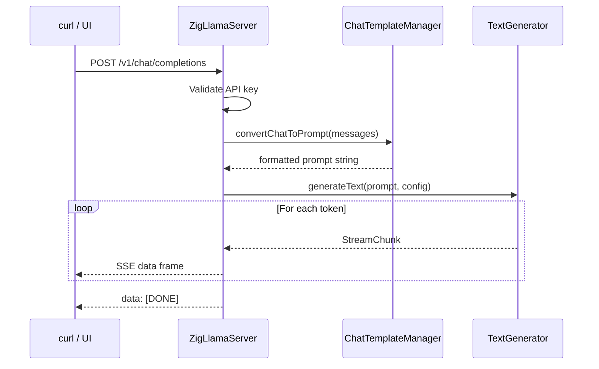

# Tutorial: Building a Chatbot

This tutorial combines ZigLlama's HTTP server, chat-template system, and
streaming generation into a working chatbot endpoint.  You will configure the
server, choose a chat template, send requests with `curl`, and observe
token-by-token streaming output.

**Prerequisites:** Completed [Your First Inference](first-inference.md).  A
GGUF model file is recommended but not required (demo mode works without one).

**Estimated time:** 20 minutes.

---

## Architecture Overview



---

## Step 1: Configure the Server

Create a `ServerConfig` with the settings appropriate for local development:

```zig
const http_server = @import("server/http_server.zig");

var config = http_server.ServerConfig{
    .host = "127.0.0.1",
    .port = 8080,
    .cors_enabled = true,
    .api_key = "sk-dev-chatbot",    // require auth even in dev
    .max_tokens = 1024,
    .enable_streaming = true,
};
```

!!! tip "Binding to all interfaces"
    Change `.host` to `"0.0.0.0"` if you want to test from another machine
    on the same network.  Remember to keep the API key set.

---

## Step 2: Initialise the Server and Load a Model

```zig
const std = @import("std");
const models = @import("models/llama.zig");

pub fn main() !void {
    var gpa = std.heap.GeneralPurposeAllocator(.{}){};
    defer _ = gpa.deinit();
    const allocator = gpa.allocator();

    // 1. Create server
    var server = try http_server.ZigLlamaServer.init(allocator, config);
    defer server.deinit();

    // 2. Load model
    const model_config = models.LLaMAConfig.init(.LLaMA_7B);
    var model = try models.LLaMAModel.init(allocator, model_config);
    defer model.deinit();

    // 3. Load tokenizer (simplified for demo)
    const tokenizer_mod = @import("models/tokenizer.zig");
    var tokenizer = try tokenizer_mod.SimpleTokenizer.init(
        allocator, model_config.vocab_size,
    );
    defer tokenizer.deinit();

    // 4. Register model with server -- auto-detects chat template
    try server.loadModel(&model, @ptrCast(&tokenizer), "llama-7b");

    // 5. Start serving
    try server.start();
}
```

`loadModel` calls `ChatTemplateManager.detectTemplate` on the model name and
selects the best-matching template.  For `"llama-7b"` this resolves to the
LLaMA 2 template.  The server pre-loads LLaMA 2, LLaMA 3, ChatML, and Mistral
templates at startup.

---

## Step 3: Choose a Chat Template

ZigLlama supports multiple chat-template formats.  Each wraps the conversation
history in format-specific delimiters:

| Template | Typical Models | System Prompt Support |
|----------|---------------|----------------------|
| `Llama2` | LLaMA 2 7B/13B/70B | Yes (`<<SYS>>` block) |
| `Llama3` | LLaMA 3 / 3.1 | Yes (`<\|begin_of_text\|>` tags) |
| `ChatML` | Qwen, Yi, many fine-tunes | Yes (`<\|im_start\|>system`) |
| `Mistral` | Mistral 7B, Mixtral | Yes (`[INST]` blocks) |
| `Alpaca` | Alpaca-style fine-tunes | Yes (`### Instruction:`) |
| `Claude` | Claude-format datasets | Yes (`\n\nHuman:` / `\n\nAssistant:`) |

The server auto-detects the template from the model name, but you can override
it:

```zig
server.default_template = .ChatML;
```

!!! example "ChatML format"
    ```
    <|im_start|>system
    You are a helpful assistant.<|im_end|>
    <|im_start|>user
    What is attention?<|im_end|>
    <|im_start|>assistant
    ```

---

## Step 4: Test with curl -- Non-Streaming

Open a terminal and send a chat completion request:

```bash
curl -s http://127.0.0.1:8080/v1/chat/completions \
  -H "Authorization: Bearer sk-dev-chatbot" \
  -H "Content-Type: application/json" \
  -d '{
    "model": "llama-7b",
    "messages": [
      {"role": "system", "content": "You are a helpful Zig programming tutor."},
      {"role": "user", "content": "How does defer work in Zig?"}
    ],
    "max_tokens": 256,
    "temperature": 0.7
  }' | python3 -m json.tool
```

Expected response:

```json
{
    "id": "req_65f1a2b_0",
    "object": "chat.completion",
    "created": 1700000000,
    "model": "llama-7b",
    "choices": [
        {
            "index": 0,
            "message": {
                "role": "assistant",
                "content": "Hello! I'm ZigLlama, an educational AI assistant."
            },
            "finish_reason": "stop"
        }
    ],
    "usage": {
        "prompt_tokens": 10,
        "completion_tokens": 13,
        "total_tokens": 23
    }
}
```

!!! info "Demo responses"
    Without a real model loaded from a GGUF file, the server returns
    placeholder text.  The request/response protocol is fully functional.

---

## Step 5: Test with curl -- Streaming

Add `"stream": true` to receive Server-Sent Events:

```bash
curl -N http://127.0.0.1:8080/v1/chat/completions \
  -H "Authorization: Bearer sk-dev-chatbot" \
  -H "Content-Type: application/json" \
  -d '{
    "model": "llama-7b",
    "messages": [
      {"role": "user", "content": "Tell me about transformers."}
    ],
    "max_tokens": 100,
    "stream": true
  }'
```

Output arrives as SSE frames, one per token:

```
data: {"id":"chatcmpl-123","object":"chat.completion.chunk","created":1677652288,
       "model":"llama-7b","choices":[{"index":0,"delta":{"role":"assistant",
       "content":"Hello"},"finish_reason":null}]}

data: [DONE]
```

The `-N` flag disables buffering in curl so tokens appear in real time.

---

## Step 6: Use Advanced Sampling

ZigLlama extends the OpenAI API with `sampling_strategy`, `mirostat_tau`, and
`grammar`:

### Mirostat -- Adaptive Temperature

Mirostat V2 maintains a target "surprise" level, dynamically adjusting
temperature to produce consistently creative but coherent text:

```bash
curl -s http://127.0.0.1:8080/v1/chat/completions \
  -H "Authorization: Bearer sk-dev-chatbot" \
  -H "Content-Type: application/json" \
  -d '{
    "model": "llama-7b",
    "messages": [{"role": "user", "content": "Write a haiku about Zig."}],
    "sampling_strategy": "mirostat",
    "mirostat_tau": 5.0,
    "max_tokens": 50
  }'
```

### Grammar-Constrained JSON

Force the model to produce valid JSON matching a schema:

```bash
curl -s http://127.0.0.1:8080/v1/chat/completions \
  -H "Authorization: Bearer sk-dev-chatbot" \
  -H "Content-Type: application/json" \
  -d '{
    "model": "llama-7b",
    "messages": [{"role": "user", "content": "Give me three colours."}],
    "grammar": "{\"type\": \"array\", \"items\": {\"type\": \"string\"}}",
    "max_tokens": 100
  }'
```

---

## Step 7: Integration with Python Clients

Because the API is OpenAI-compatible, the official Python client works
out of the box:

```python
from openai import OpenAI

client = OpenAI(
    base_url="http://127.0.0.1:8080/v1",
    api_key="sk-dev-chatbot",
)

response = client.chat.completions.create(
    model="llama-7b",
    messages=[
        {"role": "system", "content": "You are a Zig expert."},
        {"role": "user", "content": "What is comptime?"},
    ],
    max_tokens=200,
    stream=True,
)

for chunk in response:
    if chunk.choices[0].delta.content:
        print(chunk.choices[0].delta.content, end="", flush=True)
```

---

## Deployment Checklist

Before exposing the chatbot beyond localhost:

- [ ] Load a real GGUF model (`--model path/to/model.gguf`).
- [ ] Set a strong, random API key (`--api-key $(openssl rand -hex 32)`).
- [ ] Place behind a TLS-terminating reverse proxy (NGINX, Caddy).
- [ ] Configure `--max-requests` to match your hardware's throughput.
- [ ] Set `--timeout` to cover the worst-case generation latency.
- [ ] Monitor the `/health` endpoint from your uptime checker.

!!! warning "Security"
    The built-in HTTP server does **not** support TLS.  Always terminate TLS
    at a reverse proxy when accepting connections from untrusted networks.

---

## What to Try Next

- Add a multi-turn conversation by extending the `messages` array with
  alternating user/assistant turns.
- Experiment with different `temperature` and `top_p` values to see their
  effect on response style.
- Explore the [Demo Walkthroughs](demo-walkthroughs.md) for more example
  programs, including multi-modal and threading demos.
