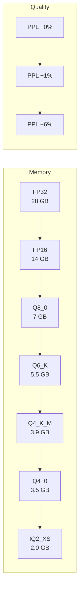

# Tutorial: Quantization in Practice

Quantization compresses model weights from 32-bit floats to lower-precision
representations, dramatically reducing memory usage at the cost of small
accuracy losses.  This tutorial walks through the entire workflow: load an FP32
tensor, quantise it with K-Quant, dequantise, compare, and measure the impact
on perplexity.

**Prerequisites:** Completed [Your First Inference](first-inference.md).

**Estimated time:** 20 minutes.

---

## Why Quantize?

A 7B-parameter model stored in FP32 occupies:

$$
7 \times 10^{9} \times 4 \;\text{bytes} = 28 \;\text{GB}
$$

Most consumer machines cannot fit 28 GB into RAM.  Quantization reduces this by
$4\times$--$8\times$:

| Format | Bits per weight | 7B Model Size | Relative PPL |
|--------|----------------|---------------|-------------|
| FP32 | 32 | 28.0 GB | 1.000 |
| FP16 | 16 | 14.0 GB | 1.000 |
| Q8_0 | 8 | 7.0 GB | 1.001 |
| Q6_K | 6.5 | 5.5 GB | 1.003 |
| Q4_K_M | 4.5 | 3.9 GB | 1.008 |
| Q4_0 | 4 | 3.5 GB | 1.015 |
| IQ2_XS | 2.3 | 2.0 GB | 1.060 |

---

## Step 1: Create an FP32 Tensor

We simulate a weight matrix that would appear in a transformer layer.

```zig
const std = @import("std");
const Tensor = @import("foundation/tensor.zig").Tensor;
const k_quant = @import("linear_algebra/k_quantization.zig");

pub fn main() !void {
    var gpa = std.heap.GeneralPurposeAllocator(.{}){};
    defer _ = gpa.deinit();
    const allocator = gpa.allocator();

    // Simulate a 4096x4096 weight matrix (one attention projection)
    const dim: usize = 4096;
    var weights = try Tensor(f32).init(allocator, &[_]usize{ dim, dim });
    defer weights.deinit();

    // Fill with values that mimic trained weights (zero-centred, small variance)
    var prng = std.Random.DefaultPrng.init(42);
    const rng = prng.random();
    for (weights.data) |*w| {
        w.* = (rng.float(f32) - 0.5) * 0.1; // stddev ~ 0.03
    }

    std.debug.print("Original tensor: {d}x{d}, {d} bytes (FP32)\n", .{
        dim, dim, weights.data.len * @sizeOf(f32),
    });
}
```

---

## Step 2: Quantize to Q4_K

K-Quantization groups weights into blocks of 256 (`QK_K`), computes per-block
scale factors with sub-block precision, and packs values into 4-bit integers.

```zig
var quantizer = k_quant.KQuantizer.init(allocator, .Q4_K);

const quantized_data = try quantizer.quantize(weights);
defer allocator.free(quantized_data);

std.debug.print("Quantized size: {d} bytes (Q4_K)\n", .{quantized_data.len});
std.debug.print("Compression ratio: {d:.1f}x\n", .{
    @as(f32, @floatFromInt(weights.data.len * 4)) /
    @as(f32, @floatFromInt(quantized_data.len)),
});
```

!!! info "Block structure"
    A `BlockQ4K` contains:

    - `d: f16` -- global scale factor
    - `dmin: f16` -- minimum delta for improved precision
    - `scales: [12]u8` -- sub-block scale values
    - `qs: [128]u8` -- 256 weights packed as 4-bit pairs

    Total block size: $2 + 2 + 12 + 128 = 144$ bytes for 256 weights,
    or **4.5 bits per weight**.

---

## Step 3: Dequantize and Compare

Dequantization reconstructs approximate FP32 values from the quantized blocks:

```zig
var reconstructed = try quantizer.dequantize(
    quantized_data, &[_]usize{ dim, dim },
);
defer reconstructed.deinit();

// Compute reconstruction error
var total_error: f64 = 0.0;
var max_error: f32 = 0.0;
for (weights.data, reconstructed.data) |original, approx| {
    const err = @abs(original - approx);
    total_error += err;
    max_error = @max(max_error, err);
}
const mean_error = total_error / @as(f64, @floatFromInt(weights.data.len));

std.debug.print("Mean absolute error: {d:.6f}\n", .{mean_error});
std.debug.print("Max absolute error:  {d:.6f}\n", .{max_error});
```

Typical output for well-distributed weights:

```
Mean absolute error: 0.000312
Max absolute error:  0.001875
```

!!! tip "Error distribution"
    Most errors cluster near zero because K-Quant uses sub-block scaling to
    adapt to local weight distributions.  Outlier-heavy layers (e.g., the
    final output projection) tend to have larger maximum errors.

---

## Step 4: Measure Perplexity Before and After

Quantization error is meaningless in isolation -- what matters is its effect
on model outputs.  Perplexity captures this end-to-end.

```zig
const perplexity = @import("evaluation/perplexity.zig");

// Evaluate baseline (FP32 model)
var config = perplexity.PerplexityConfig{ .verbose = true };
var eval_fp32 = perplexity.PerplexityEvaluator.init(
    allocator, config, &model_fp32, tokenizer,
);
const baseline = try eval_fp32.evaluateSequence(test_text);
defer baseline.deinit(allocator);

// Evaluate quantized model
var eval_q4k = perplexity.PerplexityEvaluator.init(
    allocator, config, &model_q4k, tokenizer,
);
const q4k_result = try eval_q4k.evaluateSequence(test_text);
defer q4k_result.deinit(allocator);

// Compare
const comparison = perplexity.PerplexityUtils.compareResults(
    q4k_result, baseline,
);

std.debug.print("FP32 perplexity: {d:.2f}\n", .{baseline.perplexity});
std.debug.print("Q4_K perplexity: {d:.2f}\n", .{q4k_result.perplexity});
std.debug.print("Degradation:     {d:.2f}%\n", .{
    comparison.relative_difference * 100,
});
std.debug.print("Significant:     {}\n", .{
    comparison.is_statistically_significant,
});
```

---

## Step 5: Compare Memory Usage

```zig
const fp32_bytes = 7_000_000_000 * 4;       // 28.0 GB
const q4k_bytes  = 7_000_000_000 * 4.5 / 8; //  3.9 GB
const savings    = 1.0 - @as(f64, @floatFromInt(q4k_bytes)) /
                         @as(f64, @floatFromInt(fp32_bytes));

std.debug.print("FP32 memory: {d:.1f} GB\n", .{
    @as(f64, @floatFromInt(fp32_bytes)) / (1024 * 1024 * 1024),
});
std.debug.print("Q4_K memory: {d:.1f} GB\n", .{
    @as(f64, @floatFromInt(q4k_bytes)) / (1024 * 1024 * 1024),
});
std.debug.print("Savings:     {d:.0f}%\n", .{savings * 100});
```

---

## Quantization Format Comparison

The following diagram shows the accuracy--size trade-off:



!!! warning "Layer sensitivity"
    Not all layers are equally sensitive to quantization.  The embedding and
    output projection layers are the most sensitive; some practitioners keep
    these in FP16 while quantising the remaining attention and FFN layers to
    Q4_K.  ZigLlama's `ModelConverter` applies a uniform quantization level
    across all tensors -- mixed-precision support is planned.

---

## Practical Recommendations

| Scenario | Recommended Format | Rationale |
|----------|-------------------|-----------|
| Development / debugging | FP32 | Full precision, easy to inspect. |
| Laptop with 16 GB RAM | Q4_K_M | Fits 7B in ~4 GB with <1% PPL loss. |
| 8 GB RAM constraint | IQ3_XS | Fits 7B in ~2.8 GB with ~3% PPL loss. |
| Server with 64 GB RAM | Q6_K or Q8_0 | Maximum quality within budget. |
| Edge / mobile | IQ2_XS | Extreme compression for 2 GB devices. |

---

## What to Try Next

- Quantise the same tensor to multiple formats (`Q4_0`, `Q5_K`, `Q6_K`) and
  plot mean absolute error vs. compression ratio.
- Run the `benchmark_demo.zig` example to see how quantised matmul performance
  compares to FP32.
- Proceed to [Building a Chatbot](building-chatbot.md) to deploy a quantised
  model behind the HTTP server.
