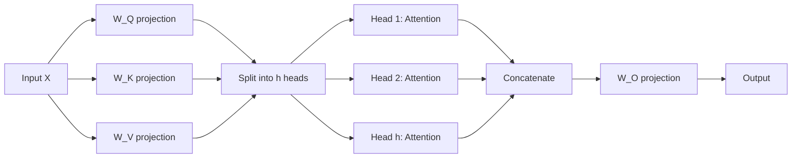

# Tutorial: Understanding Attention

In this tutorial you will construct the **scaled dot-product attention**
mechanism from first principles, using ZigLlama's tensor and linear-algebra
primitives.  Every line of code is paired with the mathematical operation it
implements, so you can trace the data-flow from raw embeddings to attended
representations.

**Prerequisites:** Familiarity with matrix multiplication and softmax.

**Estimated time:** 20 minutes.

---

## The Attention Equation

The core computation is:

$$
\text{Attention}(Q, K, V) = \text{softmax}\!\left(\frac{QK^{\!\top}}{\sqrt{d_k}}\right) V
$$

where:

- $Q \in \mathbb{R}^{n \times d_k}$ -- **queries**: "what am I looking for?"
- $K \in \mathbb{R}^{n \times d_k}$ -- **keys**: "what do I contain?"
- $V \in \mathbb{R}^{n \times d_v}$ -- **values**: "what do I offer?"
- $d_k$ -- key/query dimension (used for scaling)

---

## Step 1: Create Q, K, V Tensors

We start with a small sequence of 4 tokens, each with a 64-dimensional
embedding.  In a real model, Q, K, and V are obtained by multiplying the input
embeddings by learned weight matrices $W^Q$, $W^K$, $W^V$.

```zig
const std = @import("std");
const Tensor = @import("foundation/tensor.zig").Tensor;

pub fn main() !void {
    var gpa = std.heap.GeneralPurposeAllocator(.{}){};
    defer _ = gpa.deinit();
    const allocator = gpa.allocator();

    const seq_len: usize = 4;
    const d_k: usize = 8;  // small for illustration

    // Shape: [batch=1, heads=1, seq_len=4, d_k=8]
    var Q = try Tensor(f32).init(allocator, &[_]usize{ 1, 1, seq_len, d_k });
    defer Q.deinit();
    var K = try Tensor(f32).init(allocator, &[_]usize{ 1, 1, seq_len, d_k });
    defer K.deinit();
    var V = try Tensor(f32).init(allocator, &[_]usize{ 1, 1, seq_len, d_k });
    defer V.deinit();

    // Fill with illustrative values
    Q.fill(0.5);
    K.fill(0.3);
    V.fill(1.0);
}
```

!!! info "Shape convention"
    ZigLlama uses the 4-D shape `[batch, heads, seq_len, d_k]` for attention
    tensors.  The batch and head dimensions are both 1 here to keep things
    simple.

---

## Step 2: Compute Attention Scores $QK^{\top}$

Multiplying queries by transposed keys produces a $n \times n$ **score
matrix** where element $(i, j)$ measures how much token $i$ should attend to
token $j$.

```zig
const attention = @import("transformers/attention.zig");

// scaledDotProductAttention performs all steps internally, but let us
// walk through them manually first.

// Batched matmul with K transposed: [1,1,4,8] x [1,1,4,8]^T -> [1,1,4,4]
var scores = try attention.batchedMatMul(Q, K, allocator, true);
defer scores.deinit();

std.debug.print("Score matrix shape: [{d},{d},{d},{d}]\n", .{
    scores.shape[0], scores.shape[1], scores.shape[2], scores.shape[3],
});
// Output: Score matrix shape: [1,1,4,4]
```

---

## Step 3: Scale by $\sqrt{d_k}$

Without scaling, the dot products grow proportionally to $d_k$, pushing the
softmax into saturation (one element near 1, the rest near 0).  Dividing by
$\sqrt{d_k}$ controls the variance:

$$
\text{score}_{ij} \leftarrow \frac{\text{score}_{ij}}{\sqrt{d_k}}
$$

```zig
const scale: f32 = 1.0 / @sqrt(@as(f32, @floatFromInt(d_k)));
// scale = 1/sqrt(8) ~ 0.354

for (0..scores.size) |i| {
    scores.data[i] *= scale;
}
```

!!! tip "Intuition for the scaling factor"
    If $Q$ and $K$ entries are i.i.d. with mean 0 and variance 1, each dot
    product has variance $d_k$.  Dividing by $\sqrt{d_k}$ restores unit
    variance, keeping softmax in its sensitive region.

---

## Step 4: Apply Causal Mask

For autoregressive (decoder) models, position $i$ must not attend to any
position $j > i$.  This is enforced by setting future positions to $-\infty$
before softmax:

```zig
var mask = try attention.createCausalMask(allocator, seq_len);
defer mask.deinit();

// Mask pattern (0 = allowed, -inf = blocked):
//   0   -inf -inf -inf
//   0    0   -inf -inf
//   0    0    0   -inf
//   0    0    0    0

try attention.applyMask(&scores, mask);
```

After masking, the score matrix for position 0 has only one finite entry
(itself), while position 3 can attend to all four positions.

---

## Step 5: Apply Softmax

Softmax converts raw scores into a probability distribution over keys:

$$
\alpha_{ij} = \frac{\exp(\text{score}_{ij})}{\sum_{k=1}^{n} \exp(\text{score}_{ik})}
$$

ZigLlama's `softmaxLastDim` operates on the last axis of a 4-D tensor:

```zig
var weights = try attention.softmaxLastDim(scores, allocator);
defer weights.deinit();

// For position 0 (can only attend to itself):  [1.0, 0.0, 0.0, 0.0]
// For position 3 (uniform inputs after mask):  [0.25, 0.25, 0.25, 0.25]
```

!!! info "Numerical stability"
    The implementation subtracts the row maximum before exponentiating
    ($\exp(x_i - \max_j x_j)$), preventing overflow for large logits.

---

## Step 6: Multiply by Values

The final step produces the attended output by taking a weighted sum of value
vectors:

$$
\text{output}_i = \sum_{j} \alpha_{ij} \, V_j
$$

```zig
var output = try attention.batchedMatMul(weights, V, allocator, false);
defer output.deinit();
// Shape: [1, 1, 4, 8] -- same as V
```

Each row of the output is a convex combination of the value vectors, with
coefficients given by the attention weights.

---

## Multi-Head Attention: Splitting the Work

A single attention head can only capture one type of relationship.
**Multi-head attention** runs $h$ parallel attention heads, each operating on a
$d_k = d_\text{model} / h$ subspace:

$$
\text{MultiHead}(Q,K,V) = \text{Concat}(\text{head}_1, \ldots, \text{head}_h) \, W^O
$$



In ZigLlama, the `MultiHeadAttention` struct encapsulates this:

```zig
const mha = @import("transformers/attention.zig").MultiHeadAttention;

var attn = try mha.init(allocator, 64, 8); // d_model=64, 8 heads -> d_k=8
defer attn.deinit();

// input shape: [batch=1, seq_len=4, d_model=64]
var input = try Tensor(f32).init(allocator, &[_]usize{ 1, 4, 64 });
defer input.deinit();
input.fill(0.1);

// Forward pass: project -> split -> attend -> concat -> project
var output_mha = try attn.forward(input, input, input, null);
defer output_mha.deinit();
// output shape: [1, 4, 64]
```

### How the Split Works

`reshapeForHeads` rearranges `[batch, seq, d_model]` into
`[batch, heads, seq, d_k]` by interleaving dimensions:

| Dimension | Before | After |
|-----------|--------|-------|
| `[0]` | batch | batch |
| `[1]` | seq_len | num_heads |
| `[2]` | d_model | seq_len |
| `[3]` | -- | d_k |

After attention, `reshapeFromHeads` reverses the operation and concatenates
all head outputs back into a single `d_model`-wide vector.

---

## Rotary Position Embeddings (RoPE)

LLaMA uses RoPE to inject positional information directly into the Q and K
vectors.  For each dimension pair $(2i, 2i+1)$ at position $m$:

$$
\begin{pmatrix} q'_{2i} \\ q'_{2i+1} \end{pmatrix}
=
\begin{pmatrix} \cos m\theta_i & -\sin m\theta_i \\ \sin m\theta_i & \cos m\theta_i \end{pmatrix}
\begin{pmatrix} q_{2i} \\ q_{2i+1} \end{pmatrix}
$$

where $\theta_i = 10000^{-2i/d_k}$.  This is a **2-D rotation** whose angle
depends on position, making the dot product between two positions depend only
on their relative distance.

```zig
var rope_result = try attention.applyRotaryEncoding(Q, K, seq_len, allocator);
defer rope_result.q.deinit();
defer rope_result.k.deinit();
// rope_result.q and rope_result.k are now position-aware
```

!!! tip "Verifying RoPE"
    RoPE preserves the magnitude of each dimension pair.  The test
    `"RoPE rotation properties"` in `attention.zig` checks exactly this by
    comparing $\lVert (x, y) \rVert$ before and after rotation.

---

## Summary

| Step | Math | ZigLlama Function |
|------|------|-------------------|
| Project Q, K, V | $QW^Q$, $KW^K$, $VW^V$ | `Tensor.matmul` |
| Reshape for heads | -- | `reshapeForHeads` |
| Score | $QK^\top$ | `batchedMatMul(..., true)` |
| Scale | $/ \sqrt{d_k}$ | element-wise multiply |
| Mask | set future to $-\infty$ | `applyMask`, `createCausalMask` |
| Softmax | $\text{softmax}(\cdot)$ | `softmaxLastDim` |
| Attend | $\alpha V$ | `batchedMatMul(..., false)` |
| Concat + project | $\text{Concat} \cdot W^O$ | `reshapeFromHeads`, `Tensor.matmul` |

---

## What to Try Next

- Modify `d_k` and observe how the scaling factor changes the attention
  distribution.
- Replace `Q.fill(0.5)` with non-uniform values and print the attention
  weights -- you will see the model "focusing" on specific positions.
- Proceed to [Quantization in Practice](quantization-practice.md) to learn how
  weight compression affects these computations.
