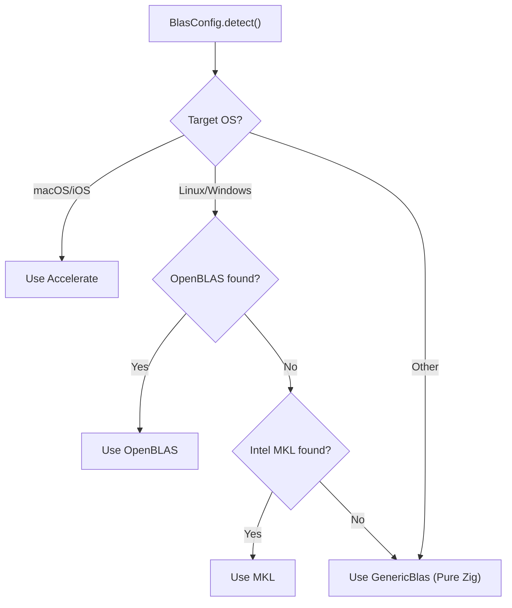

# BLAS Integration

Matrix multiplication dominates transformer inference runtime.  For a
7-billion-parameter LLaMA model generating a single token, the forward pass
executes hundreds of GEMM (General Matrix Multiply) calls on matrices with
thousands of rows and columns.  Hand-written triple loops are orders of
magnitude slower than vendor-optimized BLAS libraries.  ZigLlama provides a
uniform `BlasInterface` that dispatches to the best available library at
initialization time and falls back to a pure-Zig SIMD implementation when no
external library is present.

---

## 1. What is BLAS

**BLAS** (Basic Linear Algebra Subprograms) is a specification -- not a single
library -- that defines a standard set of low-level routines for vector,
matrix-vector, and matrix-matrix operations[^1].  First published in 1979, BLAS
remains the *de facto* interface through which high-performance numerical
software accesses optimized linear algebra kernels.

!!! definition "BLAS"

    A collection of routines organized into three levels, each operating on
    progressively higher-dimensional objects, with the property that every
    conforming implementation produces the same result (within floating-point
    rounding) for the same input.

---

## 2. Level Hierarchy

BLAS operations are classified by the rank of the operands and the resulting
computational complexity:

| Level | Operands | Canonical Operation | Complexity | Example Routine |
|---:|---|---|---|---|
| 1 | vector -- vector | \( \mathbf{y} \leftarrow \alpha \mathbf{x} + \mathbf{y} \) | \( O(n) \) | `saxpy` |
| 2 | matrix -- vector | \( \mathbf{y} \leftarrow \alpha \mathbf{A}\mathbf{x} + \beta \mathbf{y} \) | \( O(n^2) \) | `sgemv` |
| 3 | matrix -- matrix | \( \mathbf{C} \leftarrow \alpha \mathbf{A}\mathbf{B} + \beta \mathbf{C} \) | \( O(n^3) \) | `sgemm` |

!!! complexity "Arithmetic Intensity"

    | Level | Flops | Memory Accesses | Arithmetic Intensity |
    |---:|---:|---:|---|
    | 1 | \( O(n) \) | \( O(n) \) | \( O(1) \) -- memory-bound |
    | 2 | \( O(n^2) \) | \( O(n^2) \) | \( O(1) \) -- memory-bound |
    | 3 | \( O(n^3) \) | \( O(n^2) \) | \( O(n) \) -- compute-bound |

    Level 3 operations are **compute-bound**, meaning the CPU's floating-point
    units are the bottleneck rather than memory bandwidth.  This is why GEMM
    implementations invest heavily in register tiling, cache blocking, and
    SIMD vectorization.

---

## 3. GEMM -- General Matrix Multiply

The most performance-critical routine in transformer inference.  Its full
BLAS signature is:

\[
    \mathbf{C} \leftarrow \alpha\, \text{op}(\mathbf{A})\, \text{op}(\mathbf{B}) + \beta\, \mathbf{C}
\]

where \( \text{op}(\mathbf{X}) \) is either \( \mathbf{X} \),
\( \mathbf{X}^{\!\top} \), or \( \mathbf{X}^H \).

### 3.1 Parameter Reference

| Parameter | Type | Description |
|---|---|---|
| `layout` | enum | `row_major` or `column_major` |
| `transa` | enum | Transpose of \( \mathbf{A} \): `N`, `T`, or `C` |
| `transb` | enum | Transpose of \( \mathbf{B} \): `N`, `T`, or `C` |
| `M` | u32 | Rows of \( \text{op}(\mathbf{A}) \) and \( \mathbf{C} \) |
| `N` | u32 | Columns of \( \text{op}(\mathbf{B}) \) and \( \mathbf{C} \) |
| `K` | u32 | Columns of \( \text{op}(\mathbf{A}) \), rows of \( \text{op}(\mathbf{B}) \) |
| `alpha` | f32 | Scalar multiplier for \( \mathbf{A}\mathbf{B} \) |
| `A` | `[]const f32` | Matrix data |
| `lda` | u32 | Leading dimension of `A` |
| `B` | `[]const f32` | Matrix data |
| `ldb` | u32 | Leading dimension of `B` |
| `beta` | f32 | Scalar multiplier for \( \mathbf{C} \) (0.0 = overwrite) |
| `C` | `[]f32` | Output matrix data |
| `ldc` | u32 | Leading dimension of `C` |

!!! tip "Leading Dimension"

    The leading dimension is the stride between consecutive columns (column-major)
    or consecutive rows (row-major) in memory.  For a row-major
    \( M \times N \) matrix stored without padding, `lda = N`.

### 3.2 Transformer GEMM Usage

| Transformer Operation | M | N | K | Notes |
|---|---|---|---|---|
| Q/K/V projection | \( s \) | \( d_h \) | \( d \) | Per attention head |
| Attention scores | \( s \) | \( s \) | \( d_h \) | \( \mathbf{Q}\mathbf{K}^{\!\top} \) |
| Attention output | \( s \) | \( d_h \) | \( s \) | Weighted sum of values |
| FF up-projection | \( s \) | \( 4d \) | \( d \) | |
| FF down-projection | \( s \) | \( d \) | \( 4d \) | |

---

## 4. Supported Libraries

ZigLlama detects and integrates with the following BLAS implementations:

| Library | Platform | Expected Speedup | Detection |
|---|---|---:|---|
| **GenericBlas** | All | 1.0x (baseline) | Always available |
| **OpenBLAS** | Linux, Windows, macOS | ~4.0x | Dynamic library probe |
| **Intel MKL** | Linux, Windows | ~6.0x | Dynamic library probe |
| **Apple Accelerate** | macOS, iOS | ~5.5x | Compile-time OS check |
| **ATLAS** | Linux | ~3.5x | Dynamic library probe |

```zig
fn detectAvailableLibrary() BlasLibrary {
    const target_os = @import("builtin").target.os.tag;
    return switch (target_os) {
        .macos, .ios => .accelerate,
        .linux, .windows => blk: {
            if (detectOpenBlas()) break :blk .openblas;
            if (detectMkl()) break :blk .mkl;
            break :blk .generic;
        },
        else => .generic,
    };
}
```

---

## 5. BlasInterface Vtable

The `BlasInterface` is a runtime-polymorphic wrapper that allows ZigLlama to
swap BLAS backends without changing any calling code:

```zig
pub const BlasInterface = struct {
    vtable: *const VTable,
    context: *anyopaque,

    pub const VTable = struct {
        // Level 1 BLAS
        dot:  *const fn (*anyopaque, u32, []const f32, []const f32) f32,
        axpy: *const fn (*anyopaque, u32, f32, []const f32, []f32) void,
        scal: *const fn (*anyopaque, u32, f32, []f32) void,
        nrm2: *const fn (*anyopaque, u32, []const f32) f32,

        // Level 2 BLAS
        gemv: *const fn (*anyopaque, MatrixLayout, BlasOperation,
                         u32, u32, f32, []const f32, u32,
                         []const f32, f32, []f32) void,

        // Level 3 BLAS
        gemm: *const fn (*anyopaque, MatrixLayout, BlasOperation, BlasOperation,
                         u32, u32, u32, f32, []const f32, u32,
                         []const f32, u32, f32, []f32, u32) void,

        deinit: *const fn (*anyopaque) void,
    };
};
```

### 5.1 Operation Summary

| Method | BLAS Name | Formula |
|---|---|---|
| `dot(n, x, y)` | `sdot` | \( \sum_{i=1}^{n} x_i y_i \) |
| `axpy(n, alpha, x, y)` | `saxpy` | \( \mathbf{y} \leftarrow \alpha\mathbf{x} + \mathbf{y} \) |
| `scal(n, alpha, x)` | `sscal` | \( \mathbf{x} \leftarrow \alpha\mathbf{x} \) |
| `nrm2(n, x)` | `snrm2` | \( \lVert \mathbf{x} \rVert_2 \) |
| `gemv(...)` | `sgemv` | \( \mathbf{y} \leftarrow \alpha \mathbf{A}\mathbf{x} + \beta\mathbf{y} \) |
| `gemm(...)` | `sgemm` | \( \mathbf{C} \leftarrow \alpha \mathbf{A}\mathbf{B} + \beta\mathbf{C} \) |

---

## 6. GenericBlas -- Pure Zig SIMD Fallback

When no external library is available, `GenericBlas` provides a reasonably
optimized pure-Zig implementation using SIMD intrinsics.

### 6.1 Dot Product with SIMD

```zig
fn genericDot(context: *anyopaque, n: u32, x: []const f32, y: []const f32) f32 {
    _ = context;
    var result: f32 = 0.0;

    const simd_width = 8;  // AVX2: 8 x f32
    const simd_end = (n / simd_width) * simd_width;

    var i: u32 = 0;
    if (comptime std.simd.suggestVectorLength(f32)) |vec_len| {
        if (vec_len >= simd_width) {
            const Vec = @Vector(simd_width, f32);
            var sum_vec: Vec = @splat(0.0);
            while (i < simd_end) {
                const x_vec: Vec = x[i..][0..simd_width].*;
                const y_vec: Vec = y[i..][0..simd_width].*;
                sum_vec += x_vec * y_vec;
                i += simd_width;
            }
            // Horizontal reduction
            for (0..simd_width) |j| result += sum_vec[j];
        }
    }
    // Scalar tail
    while (i < n) : (i += 1) result += x[i] * y[i];
    return result;
}
```

!!! info "Zig SIMD Model"

    Zig's `@Vector(N, T)` type maps directly to the target's SIMD registers.
    On x86-64 with AVX2, `@Vector(8, f32)` compiles to a single `__m256`
    register.  The compiler handles register allocation and spilling.

### 6.2 Generic GEMM

The generic GEMM follows the standard triple loop with support for both
row-major and column-major layouts, transpose combinations, and alpha/beta
scaling:

```zig
fn genericGemm(context: *anyopaque, layout: MatrixLayout,
               transa: BlasOperation, transb: BlasOperation,
               m: u32, n: u32, k: u32,
               alpha: f32, a: []const f32, lda: u32,
               b: []const f32, ldb: u32,
               beta: f32, c: []f32, ldc: u32) void {
    // 1. Scale C by beta
    for (0..m) |i| {
        for (0..n) |j| {
            const idx = if (layout == .column_major) j * ldc + i
                        else i * ldc + j;
            c[idx] *= beta;
        }
    }
    // 2. Accumulate alpha * A * B
    for (0..m) |i| {
        for (0..n) |j| {
            var sum: f32 = 0.0;
            for (0..k) |l| {
                const a_idx = indexFor(layout, transa, i, l, lda);
                const b_idx = indexFor(layout, transb, l, j, ldb);
                sum += a[a_idx] * b[b_idx];
            }
            const c_idx = if (layout == .column_major) j * ldc + i
                          else i * ldc + j;
            c[c_idx] += alpha * sum;
        }
    }
}
```

!!! warning "Performance Note"

    The generic GEMM is \( O(MNK) \) with no cache blocking or register
    tiling.  For production inference on matrices larger than 256 x 256,
    using an external BLAS library is strongly recommended.

---

## 7. Detection and Selection

### 7.1 Compile-Time Platform Detection

```zig
pub fn detect() BlasConfig {
    const detected_library = detectAvailableLibrary();
    const cpu_count = @as(u32, @intCast(std.Thread.getCpuCount() catch 4));

    return BlasConfig{
        .library = detected_library,
        .num_threads = @max(1, cpu_count - 1),
        .use_threading = cpu_count > 1,
        .memory_alignment = 64,
        .prefer_column_major = true,
    };
}
```

### 7.2 BlasManager Initialization

The `BlasManager` wraps library selection, high-level tensor operations, and
performance statistics:

```zig
pub fn init(allocator: std.mem.Allocator, config: BlasConfig) !BlasManager {
    const blas = switch (config.library) {
        .generic => blk: {
            var g = try GenericBlas.init(allocator, config);
            break :blk g.interface();
        },
        .openblas => blk: {
            var o = try OpenBlas.init(allocator, config);
            break :blk o.interface();
        },
        .mkl, .accelerate, .atlas => blk: {
            std.log.warn("{} not yet implemented, falling back to generic",
                         .{config.library});
            var g = try GenericBlas.init(allocator, config);
            break :blk g.interface();
        },
    };
    return BlasManager{ .blas = blas, .config = config,
                         .allocator = allocator, .stats = BlasStats.init() };
}
```

### 7.3 Selection Flowchart



---

## 8. Performance Statistics

`BlasStats` tracks per-operation counts, cumulative time, and FLOP counts to
help identify bottlenecks:

```zig
pub const BlasStats = struct {
    operation_counts: std.EnumMap(BlasOpType, u64),
    total_time_ns:    std.EnumMap(BlasOpType, u64),
    total_flops:      std.EnumMap(BlasOpType, u64),

    pub fn getGflops(self: *const BlasStats, op: BlasOpType) f64 {
        const flops = self.total_flops.get(op) orelse 0;
        const time_ns = self.total_time_ns.get(op) orelse 1;
        return @as(f64, @floatFromInt(flops)) / @as(f64, @floatFromInt(time_ns));
    }
};
```

Typical output:

```
=== BLAS Performance Statistics ===
  GEMM: 960 ops, 12.34 GFLOPS, 245.6 us avg
  GEMV: 64 ops,  8.21 GFLOPS,  18.3 us avg
  DOT:  128 ops, 6.50 GFLOPS,   2.1 us avg
===================================
```

---

## References

[^1]: Lawson, C. et al. "Basic Linear Algebra Subprograms for Fortran Usage." *ACM TOMS*, 5(3), 1979.
[^2]: Goto, K. and van de Geijn, R. "Anatomy of High-Performance Matrix Multiplication." *ACM TOMS*, 34(3), 2008.
[^3]: Wang, Q. et al. "BLIS: A Framework for Rapidly Instantiating BLAS Functionality." *ACM TOMS*, 41(3), 2015.
[^4]: Intel. "oneMKL Developer Reference." Intel Corporation, 2024.
