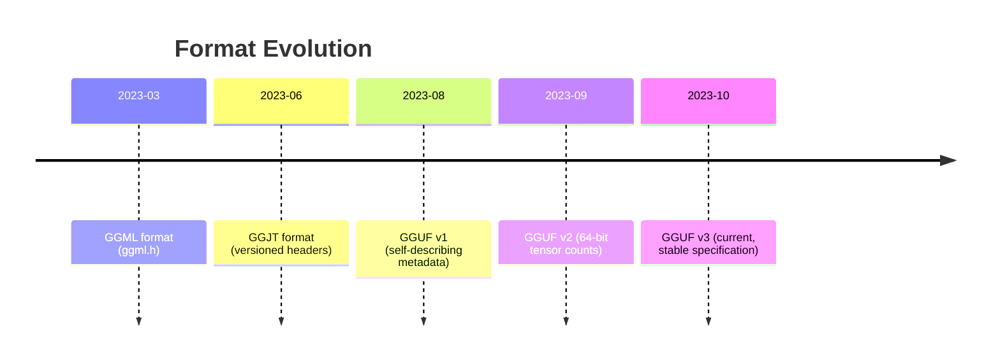
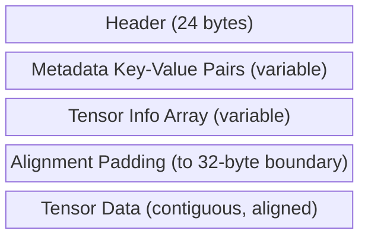

# GGUF Binary Format Specification

GGUF (GGML Unified Format) is the standard binary format for distributing
quantized large language models.  Popularized by the llama.cpp ecosystem, GGUF
encodes model weights, tokenizer vocabularies, and architectural metadata in a
single, self-describing file that can be memory-mapped and parsed with minimal
overhead.

---

## 1. Format History

### 1.1 GGML Era

The original GGML library stored tensors in a minimalist binary layout: a small
header followed by raw tensor data.  Metadata (model architecture, vocabulary,
hyperparameters) lived in separate files or was hardcoded in the loader.

### 1.2 Motivation for GGUF

As the number of supported architectures grew (LLaMA, Falcon, GPT-NeoX, MPT,
...), hardcoded loaders became unmaintainable.  GGUF was designed to be:

| Requirement | Solution in GGUF |
|---|---|
| **Self-describing** | Typed key-value metadata section |
| **Architecture-agnostic** | Architecture name stored as metadata |
| **Extensible** | New keys can be added without breaking readers |
| **Efficient** | Tensor data section is contiguous and aligned for mmap |
| **Single file** | Weights + vocabulary + config in one `.gguf` file |

### 1.3 Timeline



---

## 2. GGUF v3 Specification

### 2.1 File Layout Overview



### 2.2 Header

The header is exactly 24 bytes in little-endian format:

| Offset | Size | Field | Type | Value |
|---:|---:|---|---|---|
| 0 | 4 | `magic` | `u32` | `0x46554747` ("GGUF" in ASCII, little-endian) |
| 4 | 4 | `version` | `u32` | `3` |
| 8 | 8 | `tensor_count` | `u64` | Number of tensors in the file |
| 16 | 8 | `metadata_kv_count` | `u64` | Number of metadata key-value pairs |

```zig
pub const GGUFHeader = struct {
    magic: u32,
    version: u32,
    tensor_count: u64,
    metadata_kv_count: u64,

    pub fn validate(self: GGUFHeader) !void {
        if (self.magic != GGUF_MAGIC) return error.InvalidGGUFMagic;
        if (self.version != GGUF_VERSION) return error.UnsupportedGGUFVersion;
    }
};
```

!!! info "Magic Number Mnemonic"

    `0x46554747` decodes to the ASCII bytes `G`, `G`, `U`, `F` when read in
    little-endian order.  This allows quick identification with `hexdump`:

    ```
    $ hexdump -C model.gguf | head -1
    00000000  47 47 55 46 03 00 00 00  ...
    ```

### 2.3 Metadata Section

Immediately after the header, `metadata_kv_count` key-value pairs are stored
sequentially.  Each pair has the following layout:

```
┌──────────────────────────────────────────────────┐
│  key_length : u64                                │
│  key_data   : u8[key_length]                     │
│  value_type : u32  (GGUFType enum)               │
│  value_data : (type-dependent)                   │
└──────────────────────────────────────────────────┘
```

Common metadata keys for LLaMA-family models:

| Key | Type | Example Value |
|---|---|---|
| `general.architecture` | string | `"llama"` |
| `general.name` | string | `"LLaMA-2-7B"` |
| `llama.context_length` | u32 | `4096` |
| `llama.embedding_length` | u32 | `4096` |
| `llama.block_count` | u32 | `32` |
| `llama.attention.head_count` | u32 | `32` |
| `llama.attention.head_count_kv` | u32 | `32` |
| `llama.rope.dimension_count` | u32 | `128` |
| `tokenizer.ggml.model` | string | `"llama"` |
| `tokenizer.ggml.tokens` | array[string] | 32000 token strings |

### 2.4 Tensor Info Section

After all metadata, `tensor_count` tensor descriptors appear:

```
┌──────────────────────────────────────────────────┐
│  name_length : u64                               │
│  name_data   : u8[name_length]                   │
│  n_dimensions : u32                              │
│  dimensions   : u64[n_dimensions]                │
│  type         : u32  (GGMLType enum)             │
│  offset       : u64  (from start of data section)│
└──────────────────────────────────────────────────┘
```

```zig
pub const GGUFTensorInfo = struct {
    name: []const u8,
    n_dims: u32,
    dimensions: []u64,
    type: GGMLType,
    offset: u64,

    pub fn elementCount(self: GGUFTensorInfo) u64 {
        var count: u64 = 1;
        for (self.dimensions) |dim| count *= dim;
        return count;
    }

    pub fn sizeInBytes(self: GGUFTensorInfo) u64 {
        const elements = self.elementCount();
        const block_size = self.type.blockSize();
        const type_size = self.type.typeSize();
        if (block_size == 1) return elements * type_size;
        return ((elements + block_size - 1) / block_size) * type_size;
    }
};
```

### 2.5 Alignment Padding

After the last tensor info entry, the file is padded to the next **32-byte
boundary**.  This alignment ensures that tensor data can be accessed with SIMD
instructions without unaligned-access penalties.

\[
    \text{data\_offset} = \lceil \text{current\_position} / 32 \rceil \times 32
\]

### 2.6 Tensor Data Section

Starting at `data_offset`, tensor data is stored contiguously.  Each tensor's
data begins at `data_offset + tensor_info.offset`.  The data is stored in the
format specified by the tensor's `GGMLType` -- for quantized types, this is a
sequence of quantization blocks (see Section 4).

---

## 3. Supported Value Types

The `GGUFType` enum defines the types available in metadata key-value pairs:

```zig
pub const GGUFType = enum(u32) {
    uint8   = 0,
    int8    = 1,
    uint16  = 2,
    int16   = 3,
    uint32  = 4,
    int32   = 5,
    float32 = 6,
    bool    = 7,
    string  = 8,
    array   = 9,
    uint64  = 10,
    int64   = 11,
    float64 = 12,
};
```

| Type | Size (bytes) | Notes |
|---|---:|---|
| `uint8` | 1 | |
| `int8` | 1 | |
| `uint16` | 2 | |
| `int16` | 2 | |
| `uint32` | 4 | |
| `int32` | 4 | |
| `float32` | 4 | IEEE 754 single |
| `float64` | 8 | IEEE 754 double |
| `bool` | 1 | 0 = false, non-zero = true |
| `string` | variable | Length-prefixed: `u64` length + `u8[length]` |
| `array` | variable | Type tag (`u32`) + count (`u64`) + elements |

!!! tip "String Encoding"

    GGUF strings are *not* null-terminated.  They are length-prefixed with a
    `u64` byte count, which can safely contain embedded null bytes (important
    for tokenizer vocabularies).

---

## 4. GGMLType -- Tensor Data Types

The `GGMLType` enum specifies how tensor data is encoded.  This ranges from
full-precision floats to aggressive sub-2-bit quantization:

### 4.1 Unquantized Types

| Enum | Value | Bits/Element | Block Size |
|---|---:|---:|---:|
| `f32` | 0 | 32 | 1 |
| `f16` | 1 | 16 | 1 |
| `bf16` | 25 | 16 | 1 |

### 4.2 Basic Quantization (Q-series)

| Enum | Value | Bits/Element | Block Size | Bytes/Block |
|---|---:|---:|---:|---:|
| `q4_0` | 2 | ~4.5 | 32 | 20 |
| `q4_1` | 3 | ~5.0 | 32 | 24 |
| `q5_0` | 6 | ~5.5 | 32 | 24 |
| `q5_1` | 7 | ~6.0 | 32 | 28 |
| `q8_0` | 8 | ~8.5 | 32 | 36 |
| `q8_1` | 9 | ~9.0 | 32 | 40 |

### 4.3 K-Quantization

K-quantization uses larger blocks (256 elements) with more sophisticated
encoding, achieving better quality at the same bit rate[^1]:

| Enum | Value | Block Size | Bytes/Block | Approx. Bits/Weight |
|---|---:|---:|---:|---:|
| `q2_k` | 10 | 256 | 82 | ~2.6 |
| `q3_k` | 11 | 256 | 110 | ~3.4 |
| `q4_k` | 12 | 256 | 144 | ~4.5 |
| `q5_k` | 13 | 256 | 176 | ~5.5 |
| `q6_k` | 14 | 256 | 208 | ~6.5 |
| `q8_k` | 15 | 256 | 256 | ~8.0 |

### 4.4 Importance Quantization (IQ-series)

IQ methods use non-uniform codebooks and importance-weighted quantization for
extreme compression[^2]:

| Enum | Value | Block Size | Bytes/Block | Approx. Bits/Weight |
|---|---:|---:|---:|---:|
| `iq1_s` | 19 | 256 | 50 | ~1.6 |
| `iq1_m` | 24 | 256 | 56 | ~1.75 |
| `iq2_xxs` | 16 | 256 | 66 | ~2.06 |
| `iq2_xs` | 17 | 256 | 74 | ~2.31 |
| `iq2_s` | 22 | 256 | 82 | ~2.56 |
| `iq3_xxs` | 18 | 256 | 98 | ~3.06 |
| `iq3_s` | 21 | 256 | 110 | ~3.44 |
| `iq4_nl` | 20 | 256 | 144 | ~4.5 |
| `iq4_xs` | 23 | 256 | 144 | ~4.5 |
| `iq4_ks` | 26 | 256 | 144 | ~4.5 |

---

## 5. GGUFReader Implementation

### 5.1 Opening and Reading

The `GGUFReader` struct wraps a `std.fs.File` and provides sequential parsing:

```zig
pub const GGUFReader = struct {
    file: std.fs.File,
    allocator: std.mem.Allocator,

    pub fn init(file: std.fs.File, allocator: std.mem.Allocator) GGUFReader {
        return GGUFReader{ .file = file, .allocator = allocator };
    }

    pub fn readFile(self: *GGUFReader) !GGUFFile {
        var gguf = GGUFFile.init(self.allocator);
        errdefer gguf.deinit();

        gguf.file_size = (try self.file.stat()).size;
        try self.file.seekTo(0);

        gguf.header = try self.readHeader();
        try gguf.header.validate();

        try self.readMetadata(&gguf);
        try self.readTensorInfo(&gguf);

        // Align to 32-byte boundary for tensor data
        const current_pos = try self.file.getPos();
        gguf.data_offset = std.mem.alignForward(u64, current_pos, 32);

        return gguf;
    }
};
```

### 5.2 Reading the Header

```zig
fn readHeader(self: *GGUFReader) !GGUFHeader {
    const reader = self.file.reader();
    return GGUFHeader{
        .magic            = try reader.readInt(u32, .little),
        .version          = try reader.readInt(u32, .little),
        .tensor_count     = try reader.readInt(u64, .little),
        .metadata_kv_count = try reader.readInt(u64, .little),
    };
}
```

### 5.3 Reading Metadata

Each key-value pair is read sequentially.  The value type tag determines how
the value bytes are interpreted:

```zig
fn readValue(self: *GGUFReader, value_type: GGUFType) !GGUFValue {
    const reader = self.file.reader();
    return switch (value_type) {
        .uint8   => GGUFValue{ .uint8   = try reader.readInt(u8, .little) },
        .int32   => GGUFValue{ .int32   = try reader.readInt(i32, .little) },
        .float32 => GGUFValue{ .float32 = @bitCast(try reader.readInt(u32, .little)) },
        .string  => GGUFValue{ .string  = try self.readString() },
        .array   => blk: {
            const arr_type = @as(GGUFType, @enumFromInt(try reader.readInt(u32, .little)));
            const arr_len  = try reader.readInt(u64, .little);
            const elem_size = arr_type.size() orelse return error.UnsupportedArrayType;
            const data = try self.allocator.alloc(u8, arr_len * elem_size);
            _ = try reader.readAll(data);
            break :blk GGUFValue{ .array = .{ .type = arr_type, .len = arr_len, .data = data } };
        },
        // ... remaining types ...
    };
}
```

### 5.4 Loading Tensor Data

```zig
pub fn readTensorData(self: *GGUFReader, gguf: *GGUFFile,
                      tensor_info: *GGUFTensorInfo, allocator: std.mem.Allocator) ![]u8 {
    const size = tensor_info.sizeInBytes();
    const data = try allocator.alloc(u8, size);
    try self.file.seekTo(gguf.data_offset + tensor_info.offset);
    _ = try self.file.readAll(data);
    return data;
}
```

---

## 6. Model Loading Pipeline

The complete pipeline from file on disk to usable tensors:

```mermaid
flowchart TD
    A["Open .gguf file"] --> B["Read 24-byte header"]
    B --> C{"Magic == 0x46554747?"}
    C -->|No| ERR["Error: InvalidGGUFMagic"]
    C -->|Yes| D["Read metadata KV pairs"]
    D --> E["Read tensor info descriptors"]
    E --> F["Compute data_offset\n(align to 32 bytes)"]
    F --> G["For each tensor:\nSeek to data_offset + offset\nRead sizeInBytes() bytes"]
    G --> H{"Quantized?"}
    H -->|No (f32/f16)| I["Direct cast to Tensor(f32)"]
    H -->|Yes| J["Dequantize blocks\n(Q4_0, Q8_0, K-quant, ...)"]
    J --> I
    I --> K["Tensor ready for inference"]
```

### 6.1 GGUFModelLoader Convenience API

```zig
pub const GGUFModelLoader = struct {
    gguf: GGUFFile,
    reader: GGUFReader,
    allocator: std.mem.Allocator,

    pub fn init(file_path: []const u8, allocator: std.mem.Allocator) !GGUFModelLoader {
        const file = try std.fs.cwd().openFile(file_path, .{});
        var reader = GGUFReader.init(file, allocator);
        const gguf = try reader.readFile();
        return GGUFModelLoader{ .gguf = gguf, .reader = reader, .allocator = allocator };
    }

    pub fn loadTensor(self: *GGUFModelLoader, name: []const u8) !Tensor {
        const info = self.gguf.getTensor(name) orelse return error.TensorNotFound;
        const raw = try self.reader.readTensorData(&self.gguf, info, self.allocator);
        defer self.allocator.free(raw);
        // ... dequantize based on info.type ...
    }
};
```

---

## References

[^1]: Dettmers, T. et al. "The case for 4-bit precision: k-bit Inference Scaling Laws." *arXiv:2212.09720*, 2022.
[^2]: Egiazarian, V. et al. "Extreme Compression of Large Language Models via Additive Quantization." *arXiv:2401.06118*, 2024.
[^3]: Gerganov, G. "GGUF Specification." GitHub -- ggerganov/ggml, 2023.
[^4]: Frantar, E. et al. "GPTQ: Accurate Post-Training Quantization for Generative Pre-Trained Transformers." *ICLR*, 2023.
