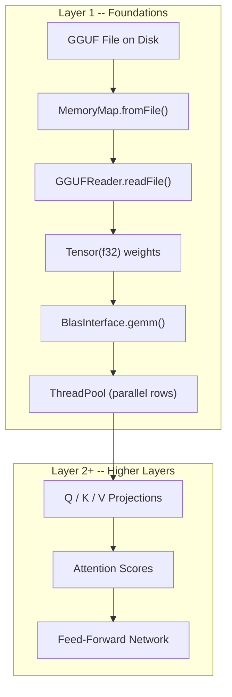
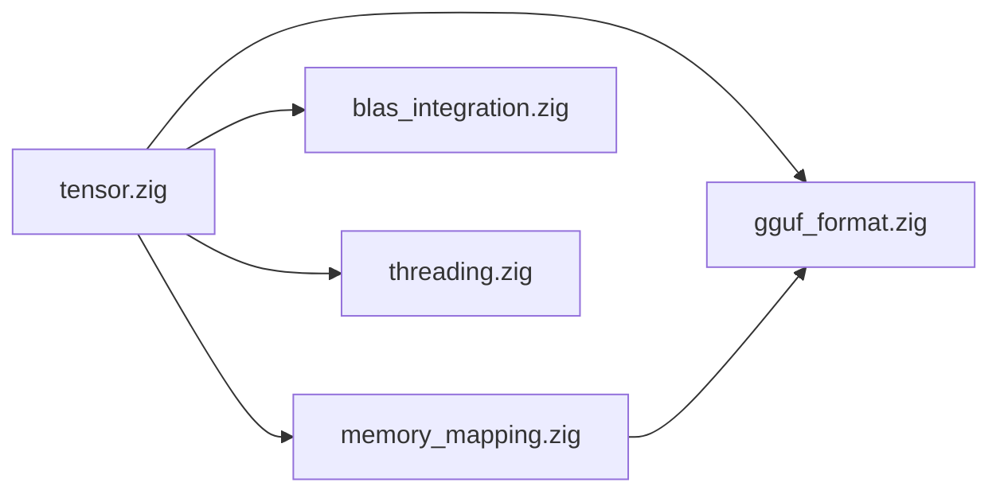

# Layer 1: Foundations

The **Foundations** layer is the bedrock of ZigLlama.  Everything above it --
linear algebra, neural primitives, transformer blocks, model loading, and
inference -- depends on the abstractions defined here.  This layer answers a
single architectural question: *How do we represent, store, and efficiently
manipulate the multi-dimensional numerical data that underlies large language
models?*

---

## Learning Objectives

After working through the six modules in this layer you will be able to:

1. Define **tensors** formally and implement generic multi-dimensional arrays in
   Zig with row-major memory layout.
2. Explain Zig's **allocator pattern** and apply `defer` / `errdefer` to manage
   memory without a garbage collector.
3. Use **memory-mapped I/O** (`mmap`) to load multi-gigabyte model files with
   near-zero copy overhead.
4. Parse the **GGUF v3 binary format** -- headers, typed metadata, tensor
   descriptors, and alignment padding -- to extract model weights.
5. Integrate **BLAS libraries** (OpenBLAS, MKL, Accelerate) behind a
   vtable-based interface and fall back to a pure-Zig SIMD implementation.
6. Build a **work-stealing thread pool** with NUMA awareness for parallel matrix
   and attention operations.

---

## Mathematical Prerequisites

!!! notation "Notation Conventions"

    Throughout this documentation we write:

    - Scalars in lowercase italic: \( \alpha, \beta, x \)
    - Vectors in bold lowercase: \( \mathbf{x} \in \mathbb{R}^n \)
    - Matrices in bold uppercase: \( \mathbf{A} \in \mathbb{R}^{m \times n} \)
    - Higher-order tensors in calligraphic: \( \mathcal{T} \in \mathbb{R}^{n_1 \times n_2 \times \cdots \times n_k} \)

### Linear Algebra

The reader should be comfortable with:

| Concept | Where It Appears |
|---|---|
| Matrix-vector product \( \mathbf{y} = \mathbf{A}\mathbf{x} \) | Embedding lookup, GEMV |
| Matrix-matrix product \( \mathbf{C} = \mathbf{A}\mathbf{B} \) | Q/K/V projections, feed-forward layers |
| Transpose \( \mathbf{A}^{\!\top} \) | Attention score computation |
| Element-wise (Hadamard) product \( \mathbf{A} \odot \mathbf{B} \) | Gating mechanisms (SwiGLU) |
| Norms \( \lVert \mathbf{x} \rVert_2 \) | RMSNorm, LayerNorm |

### Basic Calculus

While this layer is focused on *inference* (no back-propagation), understanding
the chain rule and partial derivatives helps explain *why* certain operations
are fused or reordered for numerical stability (e.g., the log-sum-exp trick
inside softmax).

---

## Components Overview

The table below lists every module in the Foundations layer, its primary
responsibility, and the source file that implements it.

| Module | Page | Source | Key Abstraction |
|---|---|---|---|
| **Tensor Operations** | [tensors.md](tensors.md) | `src/foundation/tensor.zig` | `Tensor(T)` generic struct |
| **Memory Management** | [memory-management.md](memory-management.md) | (language-level patterns) | `std.mem.Allocator`, `defer` |
| **Memory-Mapped I/O** | [memory-mapping.md](memory-mapping.md) | `src/foundation/memory_mapping.zig` | `MemoryMap`, `ModelFileMapper` |
| **GGUF Binary Format** | [gguf-format.md](gguf-format.md) | `src/foundation/gguf_format.zig` | `GGUFReader`, `GGUFFile` |
| **BLAS Integration** | [blas-integration.md](blas-integration.md) | `src/foundation/blas_integration.zig` | `BlasInterface` vtable |
| **CPU Threading & NUMA** | [threading.md](threading.md) | `src/foundation/threading.zig` | `ThreadPool`, `WorkStealingQueue` |

---

## How Foundations Connect to the Transformer

The diagram below shows data flow from a GGUF file on disk all the way to a
single transformer layer.  Every box below the dashed line lives in this layer.

---

## Dependency Graph

Within the Foundations layer the modules depend on each other as follows:

`tensor.zig` is the only module with **no** intra-layer dependencies; it is
imported by every other Foundation module.

---

## Suggested Reading Order

For newcomers, we recommend the following sequence:

1. **[Tensor Operations](tensors.md)** -- understand the data structure
   everything else manipulates.
2. **[Memory Management](memory-management.md)** -- learn Zig's ownership and
   allocation model.
3. **[Memory-Mapped I/O](memory-mapping.md)** -- see how large files get into
   the address space.
4. **[GGUF Binary Format](gguf-format.md)** -- parse actual model files.
5. **[BLAS Integration](blas-integration.md)** -- accelerate the critical
   matrix multiply.
6. **[CPU Threading & NUMA](threading.md)** -- parallelise across cores.

Each page is self-contained but forward-references are noted with links.

---

## Key Design Decisions

!!! info "Why Zig for LLM Inference?"

    Zig provides three properties that are unusually well-suited to this domain:

    1. **Explicit allocators** -- every allocation site declares *which*
       allocator it uses, enabling arena allocation for activations and
       page-locked allocation for weights.
    2. **Comptime generics** -- `Tensor(T)` is monomorphized at compile time,
       eliminating virtual dispatch overhead in the inner loop.
    3. **C ABI compatibility** -- calling into OpenBLAS or MKL requires no
       binding generator; Zig can `@cImport` the CBLAS header directly.

---

## References

[^1]: Vaswani, A. et al. "Attention Is All You Need." *NeurIPS*, 2017.
[^2]: Touvron, H. et al. "LLaMA: Open and Efficient Foundation Language Models." *arXiv:2302.13971*, 2023.
[^3]: Gerganov, G. "GGML -- Tensor Library for Machine Learning." GitHub, 2023.
