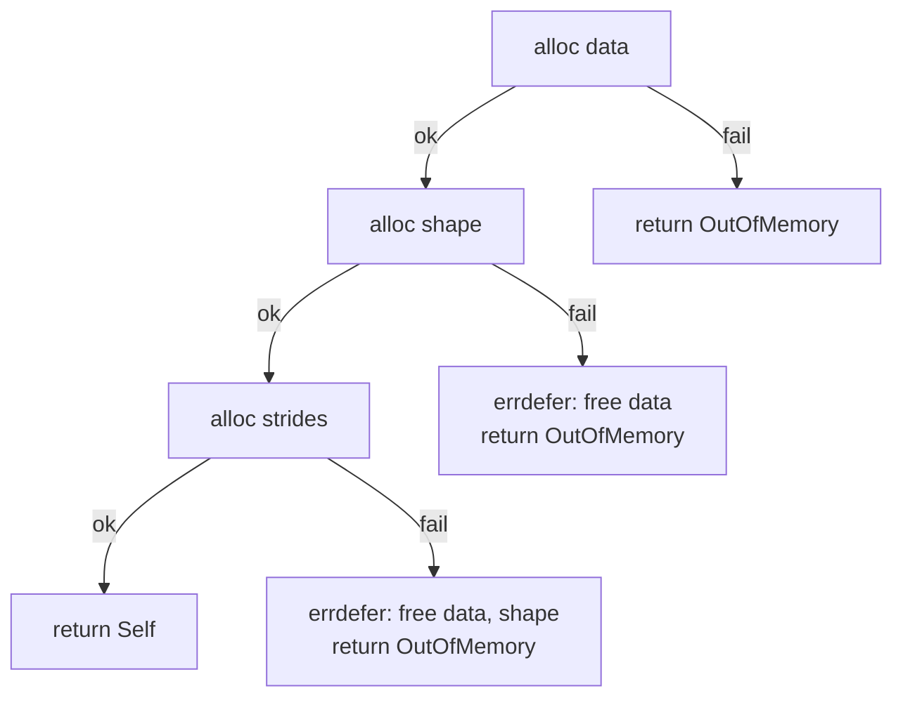

# Memory Management in Zig

Large language models are *memory-dominated* workloads.  A 7-billion-parameter
model in `f16` occupies roughly 14 GB of weight storage alone; add KV caches,
activations, and scratch buffers and you can easily exceed 20 GB for a single
inference context.  Zig's approach to memory management -- explicit allocators,
no hidden allocations, deterministic cleanup -- turns out to be an almost ideal
fit for this domain.

---

## 1. The Allocator Pattern

### 1.1 `std.mem.Allocator` Interface

In Zig, there is no global `malloc`.  Every function that needs heap memory
receives an `Allocator` argument:

```zig
const std = @import("std");
const Allocator = std.mem.Allocator;

fn createBuffer(allocator: Allocator, size: usize) ![]u8 {
    return allocator.alloc(u8, size);
}
```

The `Allocator` is a vtable-style interface with three function pointers:

| Function | Signature (simplified) | Purpose |
|---|---|---|
| `alloc` | `(len, alignment) -> ?[*]u8` | Allocate `len` bytes |
| `resize` | `(buf, new_len) -> bool` | Try to resize in place |
| `free` | `(buf) -> void` | Release memory |

!!! info "Why Explicit Allocators?"

    Implicit global allocators (C's `malloc`, Rust's `#[global_allocator]`)
    make it difficult to:

    - Use **different strategies** for different lifetimes (arena vs.
      page-locked vs. general purpose).
    - **Instrument** allocations per subsystem (how much memory does the KV
      cache use?).
    - **Test** allocation failure paths (inject `OutOfMemory` in unit tests).

    Zig's design solves all three problems by making the allocator a first-class
    parameter.

### 1.2 Common Allocator Implementations

| Allocator | Use Case in ZigLlama |
|---|---|
| `std.heap.GeneralPurposeAllocator` | Development and testing -- detects leaks and double-frees |
| `std.heap.page_allocator` | Large, long-lived allocations (weight buffers) |
| `std.heap.ArenaAllocator` | Per-inference scratch space -- free everything in one shot |
| `std.heap.FixedBufferAllocator` | Stack-backed allocations with zero syscall overhead |

---

## 2. GeneralPurposeAllocator

The GPA is the recommended allocator during development.  It wraps the system
allocator with safety checks:

```zig
var gpa = std.heap.GeneralPurposeAllocator(.{
    .safety = true,             // Enable all safety checks
    .thread_safe = true,        // Guard against data races
    .never_unmap = false,       // Unmap freed pages (helps valgrind)
}){};
defer {
    const status = gpa.deinit();
    if (status == .leak) @panic("Memory leak detected!");
}
const allocator = gpa.allocator();
```

### 2.1 Safety Checks

!!! warning "GPA Safety Features"

    | Check | What It Catches |
    |---|---|
    | **Leak detection** | Any allocation not freed before `gpa.deinit()` |
    | **Double-free detection** | Calling `free` on an already-freed pointer |
    | **Use-after-free canaries** | Writing a known pattern over freed memory; reading it later traps |
    | **Buffer overflow guards** | Red-zone pages before/after allocations (optional) |

    These checks add runtime overhead and should be disabled in release builds
    by switching to `std.heap.page_allocator` or a custom arena.

---

## 3. The Init / Deinit Pattern

Zig does not have constructors, destructors, or RAII in the C++ sense.
Instead, it uses a convention of `init` (factory function) paired with `deinit`
(cleanup method), linked by `defer`:

```zig
var tensor = try Tensor(f32).init(allocator, &[_]usize{ 2, 3 });
defer tensor.deinit();  // runs when scope exits, no matter how

// ... use tensor ...
```

### 3.1 `defer` -- Deterministic Cleanup

`defer` schedules a statement to execute when the enclosing block exits --
whether through normal flow, `return`, or an error propagated by `try`.
Multiple `defer` statements execute in **reverse** order (LIFO):

```zig
{
    const a = try allocator.alloc(u8, 100);
    defer allocator.free(a);        // runs second

    const b = try allocator.alloc(u8, 200);
    defer allocator.free(b);        // runs first

    // ... use a and b ...
}
// Both a and b are freed here.
```

### 3.2 `errdefer` -- Partial Failure Cleanup

`errdefer` only executes when the scope exits via an error.  This is essential
for multi-step initialisation where earlier allocations must be rolled back:

```zig
pub fn init(allocator: Allocator, shape: Shape) TensorError!Self {
    const data = allocator.alloc(T, size) catch return TensorError.OutOfMemory;
    errdefer allocator.free(data);  // only if later steps fail

    const owned_shape = allocator.dupe(usize, shape) catch return TensorError.OutOfMemory;
    errdefer allocator.free(owned_shape);

    const strides = allocator.alloc(usize, shape.len) catch return TensorError.OutOfMemory;
    errdefer allocator.free(strides);

    // All allocations succeeded -- none of the errdefers will fire.
    return Self{ .data = data, .shape = owned_shape, .strides = strides, ... };
}
```



!!! tip "Rule of Thumb"

    Every `alloc` inside an `init` function should have a matching `errdefer`
    that frees it.  The corresponding `free` lives in `deinit`.

---

## 4. Allocation Patterns in Transformers

### 4.1 Lifetime Categories

Transformer inference involves three distinct memory lifetime categories:

```mermaid
gantt
    title Memory Lifetimes During Inference
    dateFormat X
    axisFormat %s

    section Weights
    Model weights (mmap)       :active, w1, 0, 100

    section KV Cache
    KV cache (growing)         :active, kv, 10, 100

    section Activations
    Token 1 activations        :a1, 10, 20
    Token 2 activations        :a2, 20, 30
    Token 3 activations        :a3, 30, 40
    Token N activations        :aN, 90, 100
```



| Category | Lifetime | Allocator Strategy |
|---|---|---|
| **Weights** | Entire process | `mmap` (zero-copy from disk) or `page_allocator` |
| **KV cache** | Per-conversation (grows with sequence length) | Pre-allocated slab, grows by doubling |
| **Activations** | Per-token (freed after each forward pass) | `ArenaAllocator` -- reset after each token |

### 4.2 Arena Allocator for Activations

An arena allocator bumps a pointer for each allocation and frees *everything*
in one operation.  This is perfect for activations that are computed and
discarded every token:

```zig
var arena = std.heap.ArenaAllocator.init(std.heap.page_allocator);

for (0..num_tokens) |_| {
    defer _ = arena.reset(.retain_capacity);  // free all, keep pages

    const act_alloc = arena.allocator();

    var q = try Tensor(f32).init(act_alloc, &[_]usize{ seq_len, d_model });
    // No individual deinit needed -- arena.reset() handles it.
    var k = try Tensor(f32).init(act_alloc, &[_]usize{ seq_len, d_model });
    var v = try Tensor(f32).init(act_alloc, &[_]usize{ seq_len, d_model });

    // ... compute attention ...
}
arena.deinit();  // release pages back to OS
```

!!! info "Performance Impact"

    Arena allocation reduces per-token allocation overhead from
    \( O(\text{num\_allocs} \cdot \log n) \) (GPA with free-list) to
    \( O(\text{num\_allocs}) \) (pointer bump) with an \( O(1) \) bulk free.
    For a 32-layer model this eliminates thousands of `free()` calls per token.

### 4.3 Pre-allocated KV Cache

The KV cache stores key and value tensors for all previously generated tokens.
Its size grows linearly with sequence length:

\[
    \text{KV memory} = 2 \times L \times s \times d_h \times \text{sizeof}(T)
\]

where \( L \) is the number of layers, \( s \) is the current sequence length,
and \( d_h \) is the head dimension.  ZigLlama pre-allocates the cache to the
maximum context length to avoid reallocation during generation.

---

## 5. Memory Safety Without a Garbage Collector

Zig achieves memory safety through a combination of language-level guarantees
and convention:

### 5.1 No Hidden Allocations

Unlike C++ (`std::vector::push_back` may reallocate) or Rust (`.clone()`),
Zig *never* allocates behind the programmer's back.  If a function can allocate,
it takes an `Allocator` parameter -- visible in the type signature.

### 5.2 Ownership Semantics

ZigLlama follows a simple ownership rule:

> **The struct that calls `alloc` is responsible for calling `free`.**

For `Tensor(T)`, `init` allocates three arrays; `deinit` frees all three.  No
reference counting, no shared ownership, no cycles.

### 5.3 Comptime Bounds Checking

Zig's `[]T` slices carry their length at runtime.  Indexing out of bounds is a
detectable illegal behavior that triggers a safety check in Debug and
ReleaseSafe modes:

```zig
var buf: [4]u8 = .{ 1, 2, 3, 4 };
const slice: []u8 = &buf;
_ = slice[4];  // panic: index 4 out of bounds for slice of length 4
```

### 5.4 Sentinel-Free Strings

Zig strings are `[]const u8` slices with explicit length -- no null terminators
that can be forgotten or overflowed.

---

## 6. Common Pitfalls and Solutions

!!! warning "Pitfall 1: Forgetting `errdefer`"

    **Symptom:** Memory leak when a later allocation in `init` fails.

    **Fix:** Add `errdefer allocator.free(ptr)` immediately after every
    `allocator.alloc()` inside an `init` function.

!!! warning "Pitfall 2: Storing Allocator by Value"

    **Symptom:** Struct holds an `Allocator` that becomes invalid after the
    backing allocator (e.g., GPA) is destroyed.

    **Fix:** Ensure the allocator's lifetime exceeds the struct's lifetime.
    Prefer passing the allocator to `deinit` rather than storing it, unless the
    struct truly needs it for internal resizing.

!!! warning "Pitfall 3: Mixing Allocators"

    **Symptom:** Freeing memory with a different allocator than the one that
    allocated it.

    **Fix:** ZigLlama stores the allocator in the `Tensor` struct so `deinit`
    always uses the correct one.

!!! warning "Pitfall 4: Arena Escape"

    **Symptom:** Pointer into arena memory is used after `arena.reset()`.

    **Fix:** Never store arena-allocated pointers in long-lived data
    structures.  Copy the data to a persistent allocator if it must survive
    the arena's lifetime.

!!! warning "Pitfall 5: Leaking on Error Return"

    **Symptom:** Caller forgets to `deinit` a struct returned by a function
    that can also return an error for *other* reasons later.

    **Fix:** Document ownership transfer clearly. In ZigLlama, the convention
    is: if a function returns `!Self`, the caller owns the result and must
    call `deinit`.

---

## References

[^1]: ZigLang. "Memory Management -- Zig Documentation." ziglang.org, 2024.
[^2]: Touvron, H. et al. "LLaMA: Open and Efficient Foundation Language Models." *arXiv:2302.13971*, 2023.
[^3]: Pope, R. et al. "Efficiently Scaling Transformer Inference." *MLSys*, 2023.
