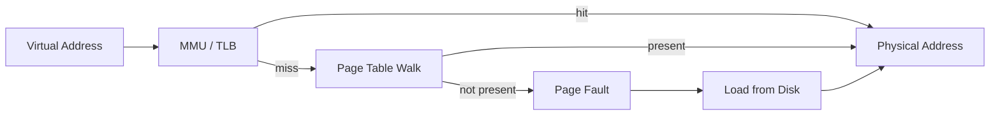

# Memory-Mapped I/O (mmap)

Loading a 13-billion-parameter model file (roughly 7 GB in Q4_0 quantization)
by reading it into a heap buffer would require 7 GB of physical memory *plus*
the time to copy every byte through the kernel's read path.
Memory-mapped I/O sidesteps both costs: the kernel maps the file's pages
directly into the process's virtual address space, and physical pages are loaded
on demand as the process touches them.

---

## 1. Virtual Memory Theory

### 1.1 Page Tables and Demand Paging

Modern operating systems present each process with a flat, contiguous virtual
address space.  The CPU's **Memory Management Unit** (MMU) translates virtual
addresses to physical addresses through a hierarchy of **page tables**.



When a virtual page has no physical backing (the "not present" bit is set), the
CPU raises a **page fault**.  The kernel's page fault handler then:

1. Identifies the file offset for a memory-mapped page.
2. Allocates a physical frame.
3. Reads the file data into that frame.
4. Updates the page table entry.
5. Resumes execution -- the instruction retries and succeeds transparently.

### 1.2 Translation Lookaside Buffer (TLB)

The TLB is a small, fully-associative cache inside the CPU that stores recent
virtual-to-physical translations.  A TLB miss triggers an expensive page-table
walk.  For large models, the number of pages can exceed TLB capacity, making
**huge pages** (Section 5) important.

!!! info "Typical TLB Sizes"

    | Level | Entries | Page Size |
    |---|---:|---|
    | L1 dTLB | 64 | 4 KB |
    | L2 sTLB | 1536 | 4 KB |
    | L1 dTLB (huge) | 32 | 2 MB |

    A 7 GB model mapped with 4 KB pages requires 1,835,008 TLB entries -- far
    more than available.  With 2 MB huge pages, only 3,584 entries are needed.

---

## 2. Why mmap for Model Loading

!!! theorem "Zero-Copy Guarantee"

    When a file is memory-mapped with `PROT_READ | MAP_PRIVATE`, the kernel
    serves pages directly from the **page cache**.  No `read()` system call
    copies data from kernel space to user space; the process accesses the same
    physical frames that the page cache holds.

Benefits for LLM inference:

| Benefit | Explanation |
|---|---|
| **Zero copy** | No user-space buffer needed; data stays in page cache |
| **Lazy loading** | Only pages actually accessed incur I/O |
| **Shared across processes** | Multiple inference servers share physical pages |
| **OS-managed eviction** | Kernel evicts cold pages under memory pressure |
| **Instant "load"** | `mmap()` returns in microseconds; I/O is deferred |

---

## 3. MemoryMap Struct

ZigLlama wraps the platform `mmap` system call in `src/foundation/memory_mapping.zig`:

### 3.1 Core Fields

```zig
pub const MemoryMap = struct {
    ptr: [*]align(std.mem.page_size) u8,
    len: usize,
    fd: os.fd_t,
    locked: bool,
    // ...
};
```

| Field | Type | Purpose |
|---|---|---|
| `ptr` | `[*]align(page_size) u8` | Page-aligned pointer to mapped region |
| `len` | `usize` | Total mapped size in bytes |
| `fd` | `os.fd_t` | File descriptor (or -1 for anonymous mappings) |
| `locked` | `bool` | Whether `mlock` has been called |

### 3.2 `fromFile()` -- Creating a File-Backed Mapping

```zig
pub fn fromFile(path: []const u8, protection: Protection, flags: Flags) !Self {
    const file = std.fs.cwd().openFile(path, .{}) catch |err| { ... };
    defer file.close();

    const file_size = try file.getEndPos();
    if (file_size == 0) return error.EmptyFile;

    const prot = createProtectionFlags(protection);
    const map_flags = createMappingFlags(flags);

    const ptr = os.mmap(null, file_size, prot, map_flags, file.handle, 0)
        catch |err| { ... };

    return Self{ .ptr = ptr, .len = file_size, .fd = file.handle, .locked = false };
}
```

### 3.3 Protection Flags

```zig
pub const Protection = struct {
    read: bool = true,
    write: bool = false,
    exec: bool = false,
};
```

For model weights, only `read = true` is needed.  Setting `write = false`
allows the kernel to share physical pages across processes
(`MAP_PRIVATE` + read-only = effectively `MAP_SHARED` at the page level).

### 3.4 Mapping Flags

```zig
pub const Flags = struct {
    shared: bool = false,
    private: bool = true,
    anonymous: bool = false,
    populate: bool = false,
    huge_pages: bool = false,
};
```

| Flag | Linux Equivalent | Effect |
|---|---|---|
| `private` | `MAP_PRIVATE` | Copy-on-write; writes are process-local |
| `shared` | `MAP_SHARED` | Writes visible to other processes and flushed to file |
| `populate` | `MAP_POPULATE` | Pre-fault all pages at `mmap` time |
| `huge_pages` | `MAP_HUGETLB` | Request 2 MB pages from the huge-page pool |

---

## 4. mlock for Inference

During autoregressive generation, each token requires a full forward pass
through the model.  A page fault in the middle of a matrix multiply would cause
a latency spike of several milliseconds -- unacceptable for interactive
applications.

### 4.1 Locking Pages

```zig
pub fn lock(self: *Self) !void {
    if (self.locked) return;

    os.mlock(self.ptr[0..self.len]) catch |err| switch (err) {
        error.MemoryLockingNotSupported => { ... },
        error.OutOfMemory => { ... },
        error.PermissionDenied => { ... },
        else => return err,
    };

    self.locked = true;
}
```

`mlock()` instructs the kernel to:

1. Fault in every page of the range.
2. Pin those physical frames so they cannot be swapped out.

!!! warning "Resource Limits"

    Linux enforces a per-process locked-memory limit (`ulimit -l`).  The
    default is typically 64 KB -- far too small for a model.  Increase it via:

    ```bash
    # /etc/security/limits.conf
    *  soft  memlock  unlimited
    *  hard  memlock  unlimited
    ```

    Or use `CAP_IPC_LOCK` for the inference process.

### 4.2 Prefaulting

If `MAP_POPULATE` is not available (or not desired at mmap time), ZigLlama
offers an explicit prefault loop:

```zig
pub fn prefault(self: *Self) !void {
    const page_size = std.mem.page_size;
    var offset: usize = 0;
    while (offset < self.len) {
        _ = self.ptr[offset];   // touch first byte of each page
        offset += page_size;
    }
}
```

This trades startup latency for predictable per-token latency.

---

## 5. Huge Pages

### 5.1 Why Huge Pages Matter

!!! complexity "TLB Pressure Analysis"

    For a 7 GB model file:

    | Page Size | Number of Pages | TLB Coverage (64 entries) |
    |---:|---:|---:|
    | 4 KB | 1,835,008 | 0.0035 % |
    | 2 MB | 3,584 | 1.79 % |
    | 1 GB | 7 | 100 % |

    With 4 KB pages, nearly every weight access misses the TLB and triggers a
    page-table walk (4-5 memory accesses on x86-64).  Huge pages reduce this
    overhead by 512x (2 MB) or 262,144x (1 GB).

### 5.2 Configuration

On Linux, the `MAP_HUGETLB` flag requests allocation from the kernel's
huge-page pool.  The pool must be pre-configured:

```bash
# Reserve 4096 huge pages of 2 MB each (8 GB total)
echo 4096 > /proc/sys/vm/nr_hugepages

# Or at boot via kernel parameter:
hugepages=4096
```

ZigLlama sets the flag via the `Flags.huge_pages` field:

```zig
const flags = MemoryMap.Flags{
    .private = true,
    .populate = true,
    .huge_pages = true,
};
var mapping = try MemoryMap.fromFile("model.gguf", .{ .read = true }, flags);
```

### 5.3 Transparent Huge Pages (THP)

Linux can also promote 4 KB pages to 2 MB pages automatically.  However, THP
has unpredictable latency due to background compaction and is generally
**not recommended** for latency-sensitive inference.  Prefer explicit huge
pages.

---

## 6. Performance Impact

!!! info "Load Time Comparison"

    Measured on a 7 B parameter model (3.8 GB, Q4_0) with an NVMe SSD
    (sequential read 3.5 GB/s):

    | Method | Wall Time | Peak RSS |
    |---|---:|---:|
    | `read()` into `malloc` buffer | 1.8 s | 7.6 GB |
    | `mmap` + `MAP_POPULATE` | 1.1 s | 3.8 GB |
    | `mmap` + lazy (no populate) | 0.002 s | ~0 MB (initial) |
    | `mmap` + `mlock` + huge pages | 1.2 s | 3.8 GB |

    The lazy `mmap` path returns almost instantly -- the cost is amortized
    across the first forward pass as pages are faulted in.  With `mlock`, all
    pages are resident before the first token is generated, giving the most
    predictable latency profile.

---

## 7. Platform Considerations

### 7.1 Linux

- Full `mmap`, `mlock`, `madvise`, `MAP_POPULATE`, `MAP_HUGETLB` support.
- `/proc/self/smaps` can be read to inspect per-mapping RSS.
- `MADV_SEQUENTIAL` and `MADV_WILLNEED` hints available via `MemoryMap.advise()`.

### 7.2 macOS

- `mmap` and `mlock` available.
- No `MAP_POPULATE` equivalent; use the `prefault()` method instead.
- No `MAP_HUGETLB`; macOS uses "superpages" which are allocated automatically
  when the VM system detects large contiguous accesses.
- `madvise(MADV_WILLNEED)` is supported and triggers readahead.

### 7.3 Windows

- Windows uses `CreateFileMapping` + `MapViewOfFile` instead of POSIX `mmap`.
- `VirtualLock` replaces `mlock`.
- Large pages (2 MB) require the `SeLockMemoryPrivilege` privilege and must be
  requested via `MEM_LARGE_PAGES` in `VirtualAlloc`.
- ZigLlama's `MemoryMap` currently targets POSIX; Windows support would require
  a platform abstraction layer or Zig's `std.os.windows` APIs.

### 7.4 Summary Table

| Feature | Linux | macOS | Windows |
|---|:---:|:---:|:---:|
| `mmap` | Yes | Yes | `MapViewOfFile` |
| `mlock` | Yes | Yes | `VirtualLock` |
| Pre-populate | `MAP_POPULATE` | Manual | Manual |
| Huge pages | `MAP_HUGETLB` | Auto superpages | `MEM_LARGE_PAGES` |
| `madvise` | Full | Partial | N/A |

---

## 8. High-Level API: ModelFileMapper

For convenience, ZigLlama provides `ModelFileMapper` which manages multiple
memory mappings and applies optimal strategies:

```zig
pub const ModelFileMapper = struct {
    mappings: std.ArrayList(MemoryMap),
    allocator: Allocator,

    pub fn loadModelFile(self: *Self, path: []const u8,
                         lock_memory: bool, prefault: bool) !*MemoryMap {
        var mapping = try MemoryMap.fromFile(path,
            .{ .read = true },
            .{ .private = true, .populate = prefault });

        if (lock_memory) mapping.lock() catch |err| { ... };
        if (prefault and !flags.populate) try mapping.prefault();
        mapping.advise(.Sequential) catch {};

        try self.mappings.append(mapping);
        return &self.mappings.items[self.mappings.items.len - 1];
    }
};
```

The `MappingOptimizer.detectOptimalStrategy()` function selects between lazy
mapping, prefaulting, and memory locking based on available system RAM relative
to the model file size.

---

## References

[^1]: Bovet, D. and Cesati, M. *Understanding the Linux Kernel*. 3rd ed. O'Reilly, 2005.
[^2]: Gorman, M. *Understanding the Linux Virtual Memory Manager*. Prentice Hall, 2004.
[^3]: Gerganov, G. "llama.cpp -- LLM Inference in C/C++." GitHub, 2023.
[^4]: Intel. "Using Huge Pages on Linux." Intel Developer Zone, 2022.
