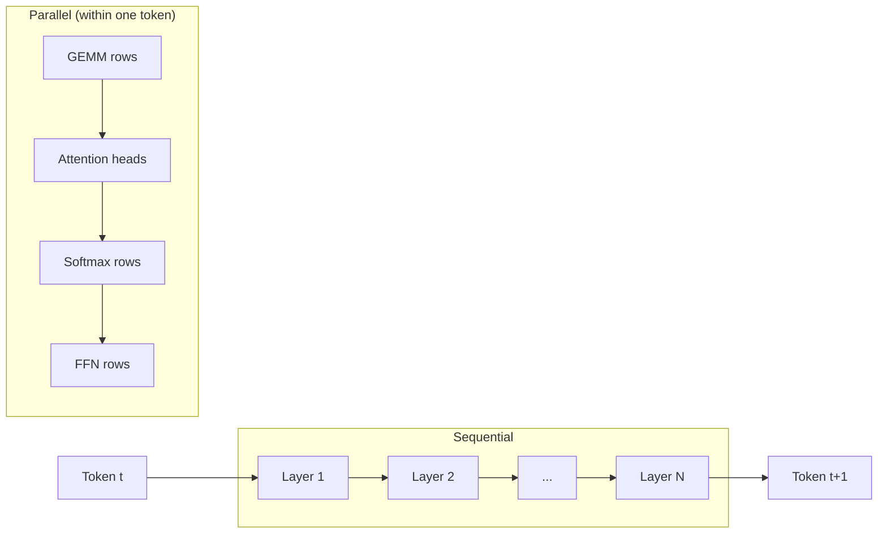
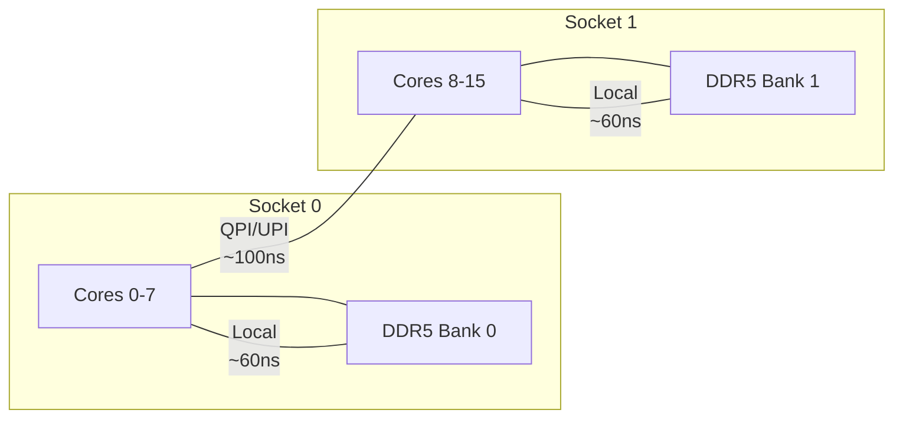
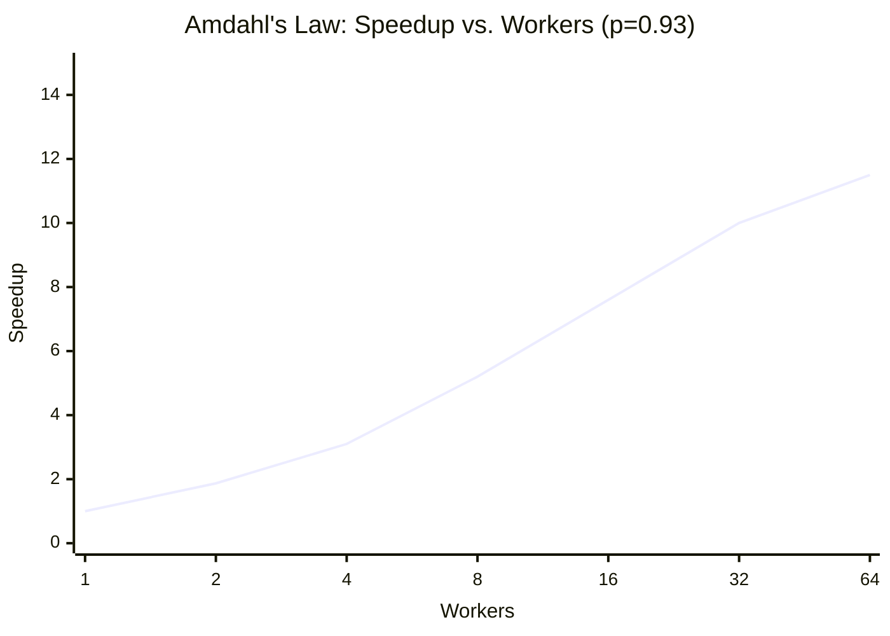

# CPU Threading and NUMA Optimization

Transformer inference is inherently parallelizable: attention heads are
independent, matrix rows can be distributed across workers, and multiple
requests can be batched.  ZigLlama provides a work-stealing thread pool with
NUMA awareness to exploit multi-core and multi-socket hardware, implemented in
`src/foundation/threading.zig`.

---

## 1. Parallelism in Transformer Inference

### 1.1 Which Operations Parallelize

Not all operations in a transformer forward pass benefit equally from
threading.  The key distinction is between **data-parallel** (embarrassingly
parallel) and **sequential** operations:

| Operation | Parallel Strategy | Granularity |
|---|---|---|
| Matrix multiply (GEMM) | Partition output rows across workers | Row blocks |
| Multi-head attention | One head per worker (or group of heads) | Head |
| Softmax | Each row is independent | Row |
| RMSNorm / LayerNorm | Each token position is independent | Token |
| Residual addition | Element-wise, trivially parallel | Block |
| Token embedding lookup | Independent per token | Token |
| Autoregressive decoding | **Sequential** (each token depends on previous) | -- |
| Layer execution | **Sequential** (layer \( l+1 \) depends on \( l \)) | -- |

!!! info "The Sequential Bottleneck"

    During autoregressive generation, each token is produced one at a time.
    The parallelism is *within* each token's forward pass, not across tokens
    (unless batching is used).  This limits the achievable speedup
    per Amdahl's Law (see Section 7).

### 1.2 Parallelism Diagram



---

## 2. ThreadPool Architecture

### 2.1 Configuration

```zig
pub const ThreadPoolConfig = struct {
    num_threads: u32,
    numa_policy: NumaPolicy = .balanced,
    work_stealing: bool = true,
    affinity_enabled: bool = true,
    stack_size: usize = 2 * 1024 * 1024,  // 2 MB per thread

    pub fn detect() ThreadPoolConfig {
        const cpu_count = @as(u32, @intCast(std.Thread.getCpuCount() catch 4));
        return ThreadPoolConfig{
            .num_threads = @max(1, cpu_count - 1),
        };
    }
};
```

!!! tip "Thread Count Heuristic"

    `detect()` reserves one core for the operating system and I/O.  For a
    dedicated inference server, using all cores (`cpu_count`) may be
    preferable.  For systems with hyper-threading, using only the number of
    *physical* cores often yields better throughput due to reduced cache
    contention.

### 2.2 Worker Struct

Each worker owns a private work-stealing queue and runs an event loop:

```zig
pub const Worker = struct {
    id: u32,
    thread: std.Thread,
    queue: WorkStealingQueue,
    pool: *ThreadPool,
    should_stop: std.atomic.Atomic(bool),

    fn workerLoop(self: *Worker) void {
        while (!self.should_stop.load(.Acquire)) {
            // 1. Try own queue
            var work_item = self.queue.pop();

            // 2. If empty, steal from a peer
            if (work_item == null) {
                work_item = self.stealWork();
            }

            // 3. Execute or yield
            if (work_item) |item| {
                item.execute();
            } else {
                std.Thread.yield() catch {};
            }
        }
    }
};
```

### 2.3 ThreadPool Struct

```zig
pub const ThreadPool = struct {
    workers: []Worker,
    config: ThreadPoolConfig,
    topology: CpuTopology,
    allocator: std.mem.Allocator,
    next_worker: std.atomic.Atomic(u32),

    pub fn submit(self: *ThreadPool, work_item: *WorkItem) bool {
        // Round-robin assignment
        const id = self.next_worker.fetchAdd(1, .AcqRel)
                   % @as(u32, @intCast(self.workers.len));
        return self.workers[id].queue.push(work_item);
    }
};
```

---

## 3. Work-Stealing Algorithm

Work stealing balances load when tasks have uneven execution times.  Each
worker has a **deque** (double-ended queue): it pushes and pops from the
*tail* (LIFO for locality), while thieves steal from the *head* (FIFO for
fairness)[^1].

### 3.1 WorkStealingQueue

```zig
pub const WorkStealingQueue = struct {
    items: []?*WorkItem,
    head: std.atomic.Atomic(u32),
    tail: std.atomic.Atomic(u32),
    capacity: u32,

    /// Owner pushes to tail
    pub fn push(self: *WorkStealingQueue, item: *WorkItem) bool {
        const tail = self.tail.load(.Acquire);
        const next = (tail + 1) % self.capacity;
        if (next == self.head.load(.Acquire)) return false;  // full
        self.items[tail] = item;
        self.tail.store(next, .Release);
        return true;
    }

    /// Owner pops from tail (LIFO)
    pub fn pop(self: *WorkStealingQueue) ?*WorkItem {
        const tail = self.tail.load(.Acquire);
        if (tail == self.head.load(.Acquire)) return null;  // empty
        const prev = if (tail == 0) self.capacity - 1 else tail - 1;
        const item = self.items[prev];
        self.items[prev] = null;
        self.tail.store(prev, .Release);
        return item;
    }

    /// Thief steals from head (FIFO) using CAS
    pub fn steal(self: *WorkStealingQueue) ?*WorkItem {
        const head = self.head.load(.Acquire);
        if (head == self.tail.load(.Acquire)) return null;  // empty
        const item = self.items[head] orelse return null;
        const next = (head + 1) % self.capacity;
        if (self.head.compareAndSwap(head, next, .AcqRel, .Monotonic) == null) {
            return item;  // CAS succeeded
        }
        return null;  // contention, try again later
    }
};
```

!!! algorithm "Work-Stealing Protocol"

    1. Worker \( w \) checks its own deque tail. If non-empty, pop and execute.
    2. If empty, select victim \( v = (w + 1 + i) \mod P \) for
       \( i = 0, 1, \ldots, P-1 \) (round-robin).
    3. Attempt `steal()` from \( v \)'s deque head using CAS.
    4. If CAS fails (contention), move to next victim.
    5. If all victims are empty, call `Thread.yield()`.

### 3.2 Lock-Free Correctness

The `compareAndSwap` on `head` ensures that at most one thief can claim a
given work item.  The `Acquire`/`Release` memory orderings guarantee that:

- A thief sees the `items[head]` written by the producer (Release on push,
  Acquire on steal).
- The producer sees the updated `head` after a successful steal (AcqRel on
  CAS).

---

## 4. NUMA Awareness

### 4.1 NUMA Architecture

On multi-socket servers, each CPU socket has its own local memory.  Accessing
remote memory (attached to another socket) incurs 1.5-2x latency:



### 4.2 NumaPolicy Enum

```zig
pub const NumaPolicy = enum {
    local,       // Prefer local NUMA node for all allocations
    interleave,  // Round-robin pages across all NUMA nodes
    balanced,    // Automatic balancing based on topology
    disabled,    // No NUMA awareness (default for single-socket)
};
```

| Policy | Best For |
|---|---|
| `local` | Latency-sensitive single-stream inference |
| `interleave` | Bandwidth-bound workloads (large batch GEMM) |
| `balanced` | General purpose; auto-selects based on topology |
| `disabled` | Single-socket systems or debugging |

### 4.3 CpuTopology Detection

```zig
pub const CpuTopology = struct {
    num_cores: u32,
    num_threads: u32,
    num_numa_nodes: u32,
    cache_line_size: u32,
    l1_cache_size: u64,
    l2_cache_size: u64,
    l3_cache_size: u64,

    pub fn detect() CpuTopology {
        const cpu_count = @as(u32, @intCast(std.Thread.getCpuCount() catch 4));
        return CpuTopology{
            .num_cores = cpu_count,
            .num_threads = cpu_count,
            .num_numa_nodes = @max(1, cpu_count / 8),
            .cache_line_size = 64,
            .l1_cache_size = 32 * 1024,
            .l2_cache_size = 256 * 1024,
            .l3_cache_size = 8 * 1024 * 1024,
        };
    }
};
```

!!! info "Cache Hierarchy Relevance"

    The detected cache sizes inform tiling decisions in the GEMM kernel.
    For example, an L1-resident tile for `f32` should fit within 32 KB:
    \( \sqrt{32768 / 4} \approx 90 \) elements per side, so a
    \( 64 \times 64 \) tile is a common choice.

---

## 5. Parallel Operations

### 5.1 Parallel Matrix Multiplication

`ParallelOps.matmul` partitions the output matrix by rows and distributes
chunks to workers:

```zig
const MatMulContext = struct {
    a: *const Tensor,
    b: *const Tensor,
    c: *Tensor,
    start_row: u32,
    end_row: u32,

    fn execute(work_item: *WorkItem) void {
        const ctx = @as(*MatMulContext, @ptrCast(@alignCast(work_item.data.?)));
        for (ctx.start_row..ctx.end_row) |i| {
            for (0..ctx.c.shape[1]) |j| {
                var sum: f32 = 0.0;
                for (0..ctx.a.shape[1]) |k| {
                    sum += ctx.a.get(.{i, k}) * ctx.b.get(.{k, j});
                }
                ctx.c.set(.{i, j}, sum);
            }
        }
    }
};
```

!!! theorem "Row Partitioning"

    For a \( M \times P \) output matrix and \( W \) workers, worker \( w \)
    computes rows

    \[
        \left[ w \cdot \left\lfloor \frac{M}{W} \right\rfloor, \;
               \min\!\left((w+1) \cdot \left\lfloor \frac{M}{W} \right\rfloor, \; M\right) \right)
    \]

    Each worker accesses its own output rows exclusively -- no synchronization
    is needed on the output matrix.

### 5.2 Parallel Softmax

Softmax is computed independently per row, making it trivially parallelizable:

\[
    \text{softmax}(\mathbf{x})_j = \frac{e^{x_j - \max(\mathbf{x})}}{\sum_i e^{x_i - \max(\mathbf{x})}}
\]

ZigLlama's `ParallelOps.softmax` distributes rows across workers using the
same row-partitioning scheme as matmul.

---

## 6. Cache-Line Alignment

### 6.1 False Sharing

When two threads write to different variables that share a cache line (64
bytes on x86-64), the cache coherency protocol forces both cores to
repeatedly invalidate and reload the line -- a phenomenon called **false
sharing**.

### 6.2 Aligned Allocation

```zig
pub const ThreadingUtils = struct {
    pub fn allocAligned(allocator: std.mem.Allocator,
                        comptime T: type, count: usize) ![]T {
        const cache_line_size = getCacheLineSize();  // 64
        const alignment = @max(@alignOf(T), cache_line_size);
        const total_size = count * @sizeOf(T) + alignment;
        const raw_mem = try allocator.alloc(u8, total_size);
        const addr = @intFromPtr(raw_mem.ptr);
        const aligned_addr = (addr + alignment - 1) & ~(alignment - 1);
        return @as([*]T, @ptrFromInt(aligned_addr))[0..count];
    }
};
```

!!! tip "When to Align"

    Align the *start* of each worker's output slice to a cache-line boundary.
    This prevents false sharing between adjacent workers' output regions
    during parallel matmul.

---

## 7. Amdahl's Law Analysis

### 7.1 The Law

!!! theorem "Amdahl's Law"

    If a fraction \( p \) of a program's execution time is perfectly
    parallelizable and the remaining fraction \( 1 - p \) is serial, the
    maximum speedup with \( W \) workers is

    \[
        S(W) = \frac{1}{(1 - p) + \frac{p}{W}}
    \]

### 7.2 Transformer Workload Decomposition

For a typical LLaMA-7B forward pass during autoregressive generation
(sequence length 1, context length 2048):

| Component | Fraction of Runtime | Parallelizable? |
|---|---:|---|
| GEMM (Q/K/V + FFN) | ~75% | Yes (row partitioning) |
| Attention score + softmax | ~10% | Yes (per-head) |
| RMSNorm | ~5% | Yes (per-token) |
| Residual add | ~3% | Yes (element-wise) |
| Overhead (scheduling, sync) | ~5% | No |
| Sequential (layer transitions) | ~2% | No |

So \( p \approx 0.93 \) and \( 1 - p \approx 0.07 \).

### 7.3 Speedup Predictions

\[
    \begin{aligned}
    S(4)  &= \frac{1}{0.07 + 0.93/4}  \approx 3.1\times \\
    S(8)  &= \frac{1}{0.07 + 0.93/8}  \approx 5.2\times \\
    S(16) &= \frac{1}{0.07 + 0.93/16} \approx 7.6\times \\
    S(64) &= \frac{1}{0.07 + 0.93/64} \approx 11.5\times \\
    S(\infty) &= \frac{1}{0.07} \approx 14.3\times \\
    \end{aligned}
\]



!!! info "Practical Implications"

    With 93% parallelizable work, diminishing returns begin around 16 cores.
    Beyond 32 cores, the serial fraction dominates.  This is why ZigLlama
    defaults to `cpu_count - 1` workers rather than spawning hundreds of
    threads, and why batch inference (which increases \( p \) by
    parallelizing across requests) is critical for throughput-oriented
    deployments.

---

## 8. Performance Monitoring

```zig
pub const ThreadPoolStats = struct {
    total_tasks_executed: std.atomic.Atomic(u64),
    total_work_stolen: std.atomic.Atomic(u64),
    average_queue_depth: f64,
    cpu_utilization: f64,
};
```

Key metrics to watch:

| Metric | Healthy Range | Indicates Problem When |
|---|---|---|
| Work stolen / total tasks | 5--20% | >40% (unbalanced partitioning) |
| Average queue depth | 0--2 | >10 (submission outpaces execution) |
| CPU utilization | >90% | <50% (too many yields, insufficient work) |

---

## References

[^1]: Blumofe, R. and Leiserson, C. "Scheduling Multithreaded Computations by Work Stealing." *JACM*, 46(5), 1999.
[^2]: Amdahl, G. "Validity of the Single Processor Approach to Achieving Large Scale Computing Capabilities." *AFIPS*, 1967.
[^3]: Drepper, U. "What Every Programmer Should Know About Memory." 2007.
[^4]: Pope, R. et al. "Efficiently Scaling Transformer Inference." *MLSys*, 2023.
