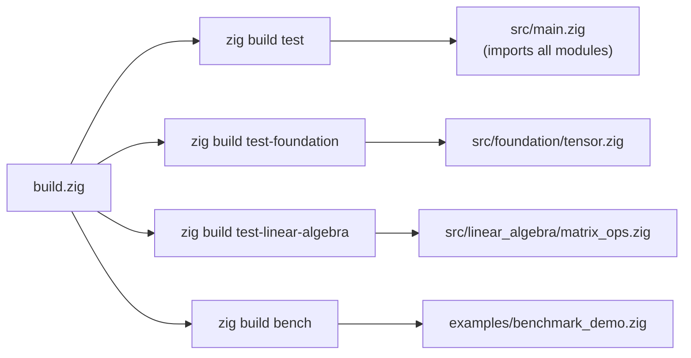
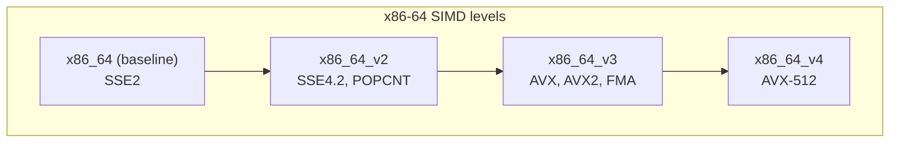

# Building from Source

ZigLlama uses Zig's built-in build system exclusively.  There is no CMake, no
Makefile, and no configure script.  The entire build is described in a single
file, `build.zig`, which the Zig compiler reads directly.

---

## Build System Overview

### The `build.zig` File

Zig's build system is itself written in Zig.  The `build.zig` file at the
repository root defines:

- **Compilation units** -- which source files are compiled and how they depend
  on one another.
- **Build steps** -- named targets (like `test` or `bench`) that a developer
  invokes from the command line.
- **Options** -- target triple, optimisation mode, and any custom flags.



!!! info "No code generation"

    Unlike C/C++ projects that use CMake to generate Makefiles, Zig's build
    system runs in a single pass.  `build.zig` is compiled and executed by the
    Zig compiler itself -- a pattern sometimes called a *build-time program*.

### Key Source Excerpt

The following is a simplified view of the build file.  The actual file in the
repository follows this structure:

```zig
const std = @import("std");

pub fn build(b: *std.Build) void {
    const target = b.standardTargetOptions(.{});
    const optimize = b.standardOptimizeOption(.{});

    // Main test step: compile and run all tests via src/main.zig
    const test_step = b.step("test", "Run all tests");
    const main_tests = b.addTest(.{
        .root_source_file = b.path("src/main.zig"),
        .target = target,
        .optimize = optimize,
    });
    test_step.dependOn(&b.addRunArtifact(main_tests).step);

    // Foundation layer tests
    const test_foundation = b.step("test-foundation", "Test foundation layer");
    const foundation_tests = b.addTest(.{
        .root_source_file = b.path("src/foundation/tensor.zig"),
        .target = target,
        .optimize = optimize,
    });
    test_foundation.dependOn(&b.addRunArtifact(foundation_tests).step);

    // Linear algebra layer tests
    const test_la = b.step("test-linear-algebra", "Test linear algebra layer");
    const la_tests = b.addTest(.{
        .root_source_file = b.path("src/linear_algebra/matrix_ops.zig"),
        .target = target,
        .optimize = optimize,
    });
    test_la.dependOn(&b.addRunArtifact(la_tests).step);

    // Benchmark step
    _ = b.step("bench", "Run performance benchmarks");
}
```

!!! definition "Build step"

    A *build step* is a named node in Zig's build graph.  Steps can depend on
    other steps, forming a DAG that the build runner executes in parallel where
    possible.  Every `zig build <name>` invocation runs the step registered
    under `<name>`.

---

## Build Targets

| Command | Description | Root source |
|---|---|---|
| `zig build test` | Run **all** 285+ tests across every layer | `src/main.zig` |
| `zig build test-foundation` | Run only Foundation layer tests | `src/foundation/tensor.zig` |
| `zig build test-linear-algebra` | Run only Linear Algebra layer tests | `src/linear_algebra/matrix_ops.zig` |
| `zig build bench` | Run performance benchmarks | `examples/benchmark_demo.zig` |

### Running Individual Examples

Examples are standalone Zig source files.  They are run directly with `zig run`
rather than through a build step:

```bash
zig run examples/simple_demo.zig
zig run examples/benchmark_demo.zig
zig run examples/model_architectures_demo.zig
```

!!! tip "Combining build targets"

    You can chain multiple steps in a single invocation:

    ```bash
    zig build test-foundation test-linear-algebra
    ```

    Zig will build and run both test suites, re-using cached compilation
    artefacts where possible.

---

## Build Modes

Zig provides four optimisation modes.  The choice of mode affects both
performance and the quality of error diagnostics.

| Mode | Flag | Speed | Safety checks | Debug info | Binary size |
|---|---|---|---|---|---|
| **Debug** | *(default)* | Slowest | All enabled | Full | Largest |
| **ReleaseSafe** | `-Doptimize=ReleaseSafe` | Fast | All enabled | Minimal | Medium |
| **ReleaseFast** | `-Doptimize=ReleaseFast` | Fastest | Disabled | None | Small |
| **ReleaseSmall** | `-Doptimize=ReleaseSmall` | Fast | Disabled | None | Smallest |

### When to Use Each Mode

!!! algorithm "Mode selection guide"

    ```
    Are you developing or debugging ZigLlama?
    ├─ Yes  ──────────────────────> Debug (default)
    │
    Are you running benchmarks or comparing with llama.cpp?
    ├─ Yes, and correctness matters  ──> ReleaseSafe
    ├─ Yes, and raw speed matters    ──> ReleaseFast
    │
    Are you deploying to an embedded or constrained target?
    └─ Yes  ──────────────────────> ReleaseSmall
    ```

**Debug** (default)

:   Use during development.  All runtime safety checks are enabled: bounds
    checking on slice access, integer overflow detection, and use-after-free
    traps.  Stack traces are fully symbolicated.

    ```bash
    zig build test
    ```

**ReleaseSafe**

:   Recommended for educational exploration of performance-sensitive code paths.
    Optimisations are enabled, but safety checks remain active.  If a
    quantisation kernel reads out of bounds, you still get a clear error
    message instead of a silent wrong answer.

    ```bash
    zig build test -Doptimize=ReleaseSafe
    ```

**ReleaseFast**

:   Maximum throughput.  Safety checks are compiled out.  Use this mode when
    benchmarking SIMD kernels or measuring inference tokens-per-second.

    ```bash
    zig build test -Doptimize=ReleaseFast
    ```

    !!! warning "Not for development"

        In ReleaseFast mode, out-of-bounds access and integer overflow produce
        undefined behaviour rather than a clean error.  Never use this mode
        while modifying code.

**ReleaseSmall**

:   Minimises binary size at the expense of some speed.  Useful when
    cross-compiling for resource-constrained targets or when distributing
    pre-built binaries.

    ```bash
    zig build test -Doptimize=ReleaseSmall
    ```

---

## Cross-Compilation

Zig's cross-compilation is a first-class feature, not an afterthought.  You
can build ZigLlama for any supported target from any host.

### Specifying a Target

```bash
# Build for Linux AArch64 (e.g., Raspberry Pi 4, AWS Graviton)
zig build test -Dtarget=aarch64-linux-gnu

# Build for macOS Apple Silicon from a Linux host
zig build test -Dtarget=aarch64-macos-none

# Build for Windows x86-64 from Linux or macOS
zig build test -Dtarget=x86_64-windows-gnu
```

### Target Triple Format

A Zig target triple has the form:

```
<arch>-<os>-<abi>
```

| Component | Common values |
|---|---|
| `arch` | `x86_64`, `aarch64`, `riscv64`, `wasm32` |
| `os` | `linux`, `macos`, `windows`, `freestanding` |
| `abi` | `gnu`, `musl`, `none`, `msvc` |

!!! tip "Static musl builds"

    For maximum portability on Linux, use `musl` as the ABI.  The resulting
    binary is fully statically linked and runs on any Linux kernel 3.2+:

    ```bash
    zig build test -Dtarget=x86_64-linux-musl
    ```

### SIMD and Cross-Compilation

When cross-compiling, Zig auto-detects the baseline CPU features for the
target.  To enable specific SIMD extensions:

```bash
# Enable AVX2 explicitly for an x86-64 target
zig build test -Dtarget=x86_64-linux-gnu -Dcpu=x86_64_v3
```

The `-Dcpu` flag accepts microarchitecture level names (`x86_64_v2` for SSE4.2,
`x86_64_v3` for AVX2, `x86_64_v4` for AVX-512) or specific CPU model names
(`haswell`, `znver3`, `apple_m1`).



---

## CI/CD Integration

### GitHub Actions

The following workflow runs the full test suite on Linux, macOS, and Windows:

```yaml
name: ZigLlama CI

on: [push, pull_request]

jobs:
  test:
    strategy:
      matrix:
        os: [ubuntu-latest, macos-latest, windows-latest]
    runs-on: ${{ matrix.os }}
    steps:
      - uses: actions/checkout@v4

      - name: Install Zig
        uses: goto-bus-stop/setup-zig@v2
        with:
          version: 0.13.0

      - name: Run tests
        run: zig build test

      - name: Run tests (ReleaseSafe)
        run: zig build test -Doptimize=ReleaseSafe
```

### Key CI Practices

| Practice | Rationale |
|---|---|
| Test in Debug *and* ReleaseSafe | Debug catches UB at runtime; ReleaseSafe catches optimisation-sensitive bugs. |
| Pin the Zig version | Zig's language evolves rapidly; pinning prevents surprise breakage. |
| Cache the `zig-cache` directory | Zig's incremental compilation cache speeds up subsequent runs by 5--10x. |
| Run on all three OS targets | ZigLlama's SIMD and memory-mapping code has platform-specific paths. |

### Caching Build Artefacts

Zig stores compilation artefacts in `zig-cache/` (local) and
`~/.cache/zig/` (global).  In CI, cache the local directory:

```yaml
      - name: Cache Zig build
        uses: actions/cache@v4
        with:
          path: zig-cache
          key: zig-${{ matrix.os }}-${{ hashFiles('build.zig', 'src/**/*.zig') }}
```

---

## Build Troubleshooting

### `error: DependencyLoopDetected`

**Cause**: A circular `@import` chain between source files.

**Fix**: ZigLlama's architecture enforces strictly upward imports (Layer N
imports only from Layers 1..N-1).  If you have added a new file, verify it does
not import from its own layer or a higher layer.

---

### `error: OutOfMemory` during compilation

**Cause**: Very large `comptime` evaluations or deeply nested generic
instantiations can exhaust the compiler's memory.

**Fix**: Increase the compiler's stack size:

```bash
ulimit -s unlimited   # Linux/macOS
zig build test
```

---

### Stale cache after switching branches

**Cause**: Zig's incremental cache can occasionally become inconsistent after
large structural changes.

**Fix**: Clear the cache and rebuild:

```bash
rm -rf zig-cache .zig-cache
zig build test
```

---

## Next Steps

- [Project Structure](project-structure.md) -- understand how the source tree
  maps to the 6-layer architecture.
- [Architecture Overview](../architecture/index.md) -- design principles and
  module dependency graph.
- [Layer 1: Foundations](../foundations/index.md) -- begin the deep dive.
