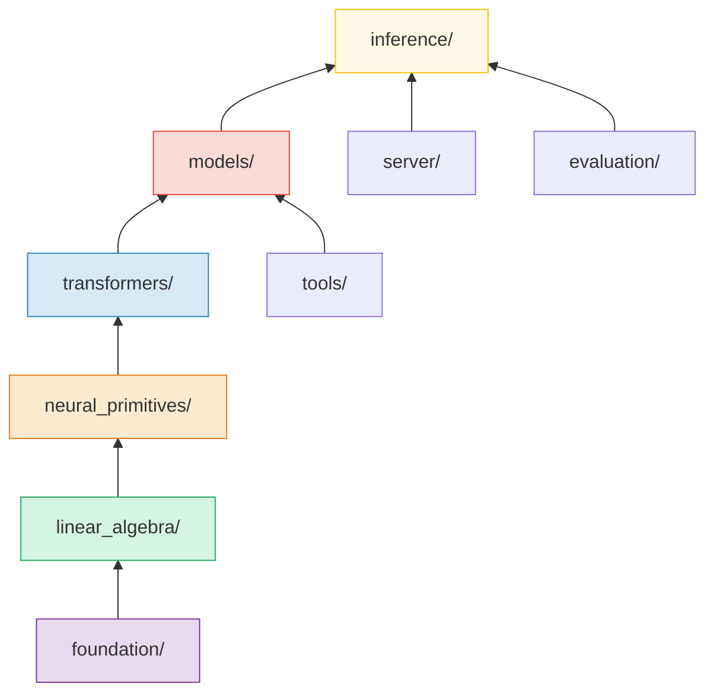
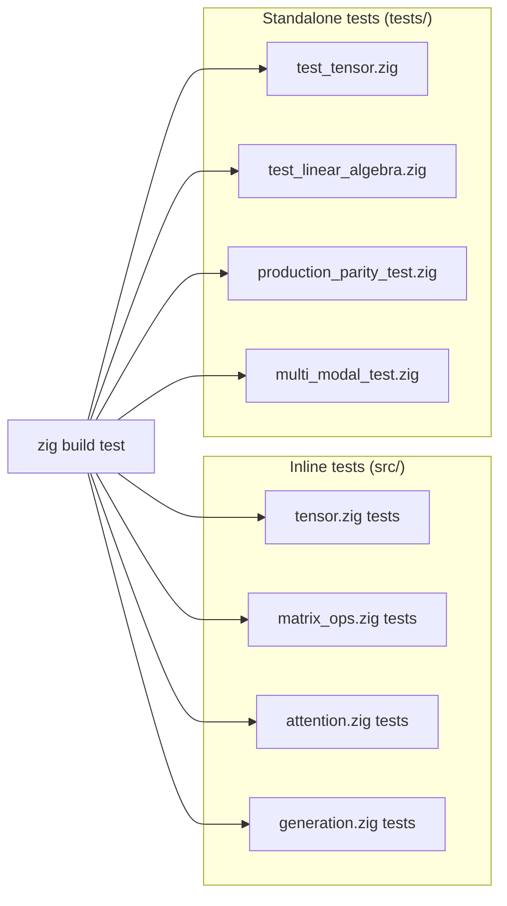

# Project Structure

This page provides a complete map of the ZigLlama repository.  Every directory
and significant file is annotated with its purpose and the architectural layer
it belongs to.  Refer to this page whenever you need to locate a module or
understand where a new file should live.

---

## Full Repository Tree

```
zigllama/
├── build.zig                          # Zig build system entry point
├── README.md                          # Project overview and quick-start
├── PROGRESS.md                        # Development progress report
│
├── src/                               # All production source code
│   ├── main.zig                       # Library root: re-exports all layers
│   │
│   ├── foundation/                    # Layer 1 -- Foundation
│   │   ├── tensor.zig                 #   Multi-dimensional tensor type
│   │   ├── memory_mapping.zig         #   mmap/mlock for model files
│   │   ├── gguf_format.zig            #   GGUF binary format parser
│   │   ├── blas_integration.zig       #   OpenBLAS / MKL / Accelerate bridge
│   │   └── threading.zig             #   Thread pool and NUMA-aware scheduling
│   │
│   ├── linear_algebra/                # Layer 2 -- Linear Algebra
│   │   ├── matrix_ops.zig             #   SIMD matrix multiplication & dot product
│   │   ├── quantization.zig           #   Basic quantisation (Q4_0, Q8_0, INT8)
│   │   ├── k_quantization.zig         #   K-quantisation family (Q2_K .. Q6_K)
│   │   └── iq_quantization.zig        #   Importance quantisation (IQ1_S .. IQ4_XS)
│   │
│   ├── neural_primitives/             # Layer 3 -- Neural Primitives
│   │   ├── activations.zig            #   ReLU, GELU, SiLU, SwiGLU, GeGLU, etc.
│   │   ├── normalization.zig          #   LayerNorm, RMSNorm, BatchNorm, GroupNorm
│   │   └── embeddings.zig             #   Token embeddings, positional encodings, RoPE
│   │
│   ├── transformers/                  # Layer 4 -- Transformers
│   │   ├── attention.zig              #   Multi-head & grouped-query attention
│   │   ├── feed_forward.zig           #   Standard, GELU, and gated FFN variants
│   │   └── transformer_block.zig      #   Full pre-norm / post-norm blocks
│   │
│   ├── models/                        # Layer 5 -- Models
│   │   ├── config.zig                 #   ModelConfig, ModelSize, hyperparameters
│   │   ├── tokenizer.zig              #   SimpleTokenizer, BPE support
│   │   ├── gguf.zig                   #   GGUF model file loader
│   │   ├── chat_templates.zig         #   ChatML, Alpaca, Vicuna, etc.
│   │   ├── llama.zig                  #   LLaMA / LLaMA 2 architecture
│   │   ├── mistral.zig                #   Mistral (sliding-window attention)
│   │   ├── gpt2.zig                   #   GPT-2
│   │   ├── falcon.zig                 #   Falcon (multi-query attention)
│   │   ├── qwen.zig                   #   Qwen (YARN RoPE scaling)
│   │   ├── phi.zig                    #   Phi (partial RoPE)
│   │   ├── gptj.zig                   #   GPT-J (parallel residuals)
│   │   ├── gpt_neox.zig               #   GPT-NeoX (fused QKV)
│   │   ├── bloom.zig                  #   BLOOM (ALiBi attention)
│   │   ├── mamba.zig                  #   Mamba (state-space model)
│   │   ├── bert.zig                   #   BERT (bidirectional encoder)
│   │   ├── gemma.zig                  #   Gemma (soft capping)
│   │   ├── starcoder.zig              #   StarCoder (code generation)
│   │   ├── mixture_of_experts.zig     #   MoE routing and load balancing
│   │   └── multi_modal.zig            #   Vision-language cross-modal projection
│   │
│   ├── inference/                     # Layer 6 -- Inference
│   │   ├── generation.zig             #   Autoregressive text generation loop
│   │   ├── advanced_sampling.zig      #   Mirostat, typical, tail-free, contrastive
│   │   ├── kv_cache.zig               #   KV cache allocation and management
│   │   ├── streaming.zig              #   Real-time token streaming
│   │   ├── batching.zig               #   Batch inference scheduler
│   │   ├── grammar_constraints.zig    #   JSON, RegEx, CFG constraint engines
│   │   └── profiling.zig              #   Inference timing and memory profiling
│   │
│   ├── server/                        # Tools -- HTTP server & CLI
│   │   ├── http_server.zig            #   REST API compatible with llama.cpp
│   │   └── cli.zig                    #   Command-line interface
│   │
│   ├── tools/                         # Tools -- Converters & evaluation
│   │   ├── model_converter.zig        #   Convert between model formats
│   │   └── converter_cli.zig          #   CLI wrapper for the converter
│   │
│   └── evaluation/                    # Tools -- Model quality
│       └── perplexity.zig             #   Perplexity evaluation pipeline
│
├── tests/                             # Test suites (mirror src/ structure)
│   ├── unit/
│   │   ├── test_tensor.zig            #   Foundation layer unit tests
│   │   └── test_linear_algebra.zig    #   Linear algebra unit tests
│   ├── test_neural_primitives.zig     #   Neural primitives tests
│   ├── test_basic_linear_algebra.zig  #   Additional LA tests
│   ├── test_transformer_components.zig#   Transformer layer tests
│   ├── test_models.zig                #   Model architecture tests
│   ├── test_inference.zig             #   Inference pipeline tests
│   ├── models_test.zig                #   Extended model tests
│   ├── threading_test.zig             #   Threading and concurrency tests
│   ├── gguf_test.zig                  #   GGUF format tests
│   ├── chat_templates_test.zig        #   Chat template rendering tests
│   ├── multi_modal_test.zig           #   Multi-modal integration tests
│   ├── multi_modal_basic_test.zig     #   Multi-modal basic tests
│   ├── multi_modal_simple_test.zig    #   Multi-modal simple tests
│   ├── multi_modal_concepts_test.zig  #   Multi-modal concept tests
│   ├── advanced_quantization_test.zig #   K-quant and IQ-quant tests
│   ├── perplexity_test.zig            #   Perplexity evaluation tests
│   ├── server_test.zig                #   HTTP server tests
│   ├── model_converter_test.zig       #   Converter tests
│   └── production_parity_test.zig     #   End-to-end parity with llama.cpp
│
├── examples/                          # Standalone runnable demos
│   ├── simple_demo.zig                #   End-to-end tour
│   ├── main.zig                       #   Library entry-point demo
│   ├── educational_demo.zig           #   Detailed educational walkthrough
│   ├── benchmark_demo.zig             #   Performance benchmarks
│   ├── parity_demo.zig                #   llama.cpp feature comparison
│   ├── gguf_demo.zig                  #   GGUF loading demo
│   ├── model_architectures_demo.zig   #   18-architecture tour
│   ├── chat_templates_demo.zig        #   Chat template demo
│   ├── multi_modal_demo.zig           #   Vision-language demo
│   ├── multi_modal_concepts_demo.zig  #   Multi-modal concepts
│   ├── threading_demo.zig             #   Multi-threaded inference demo
│   └── perplexity_demo.zig            #   Model evaluation demo
│
├── benchmarks/                        # Performance measurement tools
│   └── main.zig                       #   Benchmark entry point
│
├── documentation/                     # MkDocs documentation site
│   ├── mkdocs.yml                     #   Site configuration and nav
│   ├── requirements.txt               #   Python dependencies for MkDocs
│   └── docs/                          #   Markdown content (this site)
│       ├── index.md
│       ├── getting-started/
│       ├── architecture/
│       ├── foundations/
│       ├── linear-algebra/
│       ├── neural-primitives/
│       ├── transformers/
│       ├── models/
│       ├── inference/
│       ├── tools/
│       ├── api/
│       ├── examples/
│       ├── performance/
│       ├── references/
│       ├── javascripts/
│       └── stylesheets/
│
├── docs/                              # Legacy / quick-reference docs
│   └── ...
│
└── llama.cpp/                         # Reference: llama.cpp source (read-only)
```

---

## Source Code Organisation by Layer

The `src/` directory is the heart of ZigLlama.  Each subdirectory maps to
exactly one architectural layer, and imports flow strictly upward (lower layers
never import higher ones).



### Layer 1 -- Foundation (`src/foundation/`)

!!! notation "Dependency rule"

    Foundation modules import only from `std`.  They have zero internal
    dependencies.

| Module | Responsibility | Key types |
|---|---|---|
| `tensor.zig` | Multi-dimensional array with shape, strides, and element access | `Tensor(T)` |
| `memory_mapping.zig` | Memory-mapped file I/O (`mmap` on POSIX, `MapViewOfFile` on Windows) | `MappedFile` |
| `gguf_format.zig` | Parser for the GGUF binary container format | `GGUFHeader`, `GGUFTensorInfo` |
| `blas_integration.zig` | Thin wrapper over external BLAS libraries | `BlasBackend` |
| `threading.zig` | Thread pool with work-stealing and optional NUMA affinity | `ThreadPool`, `Task` |

### Layer 2 -- Linear Algebra (`src/linear_algebra/`)

| Module | Responsibility | Key types |
|---|---|---|
| `matrix_ops.zig` | SIMD-accelerated matrix multiplication, dot product, element-wise ops | `SimdMatMul` |
| `quantization.zig` | Basic quantisation formats: Q4_0, Q8_0, INT8 | `QuantizedTensor`, `QuantFormat` |
| `k_quantization.zig` | K-quantisation family (Q2_K through Q6_K) with block-wise scaling | `KQuantBlock` |
| `iq_quantization.zig` | Importance quantisation (IQ1_S through IQ4_XS) with non-uniform codebooks | `IQCodebook` |

### Layer 3 -- Neural Primitives (`src/neural_primitives/`)

| Module | Responsibility | Key types |
|---|---|---|
| `activations.zig` | Activation functions: ReLU, GELU, SiLU, SwiGLU, GeGLU, GLU, Tanh, Sigmoid | `ActivationFn` |
| `normalization.zig` | Normalisation layers: LayerNorm, RMSNorm, BatchNorm, GroupNorm | `RMSNorm`, `LayerNorm` |
| `embeddings.zig` | Token embeddings, sinusoidal positional encodings, RoPE, segment embeddings | `EmbeddingTable`, `RoPEEncoder` |

### Layer 4 -- Transformers (`src/transformers/`)

| Module | Responsibility | Key types |
|---|---|---|
| `attention.zig` | Scaled dot-product attention, multi-head attention, grouped-query attention, sliding window | `MultiHeadAttention` |
| `feed_forward.zig` | Position-wise FFN variants: standard, GELU-gated, SwiGLU-gated | `FeedForward` |
| `transformer_block.zig` | Complete encoder/decoder blocks with residual connections and normalisation | `TransformerBlock` |

### Layer 5 -- Models (`src/models/`)

This is the largest layer, containing 18 model architectures plus shared
infrastructure.

| Module | Responsibility |
|---|---|
| `config.zig` | Hyperparameter definitions for all model variants |
| `tokenizer.zig` | Tokenisation (simple, BPE, SentencePiece-compatible) |
| `gguf.zig` | High-level GGUF model loader (wraps `foundation/gguf_format.zig`) |
| `chat_templates.zig` | Prompt formatting for ChatML, Alpaca, Vicuna, Zephyr, etc. |
| `llama.zig` | LLaMA / LLaMA 2 forward pass |
| `mistral.zig` | Mistral with sliding-window attention and GQA |
| `gpt2.zig` | GPT-2 with learned positional embeddings |
| `falcon.zig` | Falcon with multi-query attention and parallel blocks |
| `qwen.zig` | Qwen with YARN RoPE scaling |
| `phi.zig` | Phi with partial RoPE and QK-LayerNorm |
| `gptj.zig` | GPT-J with parallel residual connections |
| `gpt_neox.zig` | GPT-NeoX with fused QKV projections |
| `bloom.zig` | BLOOM with ALiBi positional bias |
| `mamba.zig` | Mamba state-space model with selective scan |
| `bert.zig` | BERT bidirectional encoder |
| `gemma.zig` | Gemma with soft-capping and GQA |
| `starcoder.zig` | StarCoder for code generation with fill-in-the-middle |
| `mixture_of_experts.zig` | MoE routing, expert selection, load balancing |
| `multi_modal.zig` | Vision transformer encoder and cross-modal projector |

### Layer 6 -- Inference (`src/inference/`)

| Module | Responsibility | Key types |
|---|---|---|
| `generation.zig` | Autoregressive generation loop and sampling dispatch | `TextGenerator`, `GenerationResult` |
| `advanced_sampling.zig` | Mirostat, typical sampling, tail-free sampling, contrastive search | `SamplingStrategy` |
| `kv_cache.zig` | Key-value cache allocation, eviction, and ring-buffer management | `KVCache` |
| `streaming.zig` | Token-by-token streaming with thread-safe buffer | `StreamingSession` |
| `batching.zig` | Batch scheduler: continuous batching, padding, dynamic grouping | `BatchScheduler` |
| `grammar_constraints.zig` | Constrained decoding: JSON schema, regex, context-free grammar | `GrammarEngine` |
| `profiling.zig` | Per-layer timing, memory watermarks, throughput metrics | `InferenceProfiler` |

---

## Test Organisation

Tests in ZigLlama live in two places:

1. **Inline tests** -- `test` blocks inside source files in `src/`.  These are
   the primary unit tests and are collected automatically by `zig build test`.

2. **Standalone test files** -- files in `tests/` that exercise cross-module
   interactions, integration scenarios, and production parity checks.



!!! tip "Naming conventions"

    - Files prefixed with `test_` (e.g., `test_tensor.zig`) contain unit tests
      for a specific module.
    - Files suffixed with `_test` (e.g., `gguf_test.zig`) contain integration
      or feature-level tests.
    - `production_parity_test.zig` validates end-to-end behaviour against
      llama.cpp reference outputs.

### Test Distribution

| Layer / Category | Test files | Approximate test count |
|---|---|---|
| Foundation | `unit/test_tensor.zig`, inline in `foundation/*.zig` | 8 |
| Linear Algebra | `unit/test_linear_algebra.zig`, `test_basic_linear_algebra.zig`, `advanced_quantization_test.zig` | 25 |
| Neural Primitives | `test_neural_primitives.zig` | 12 |
| Transformers | `test_transformer_components.zig` | 15 |
| Models | `test_models.zig`, `models_test.zig`, `gguf_test.zig`, `chat_templates_test.zig`, `multi_modal_*.zig` | 120 |
| Inference | `test_inference.zig`, `server_test.zig`, `perplexity_test.zig`, `threading_test.zig` | 80 |
| Parity | `production_parity_test.zig` | 25 |
| **Total** | **20 test files** | **285+** |

---

## Examples Organisation

All examples reside in `examples/` as self-contained `.zig` files.  Each can be
run with `zig run examples/<name>.zig` and requires no arguments.

| Category | Examples | Purpose |
|---|---|---|
| Overview | `simple_demo.zig`, `main.zig`, `educational_demo.zig` | Broad tours of the architecture |
| Performance | `benchmark_demo.zig` | Throughput and latency measurement |
| Compatibility | `parity_demo.zig`, `gguf_demo.zig` | llama.cpp feature comparison and format support |
| Model breadth | `model_architectures_demo.zig`, `chat_templates_demo.zig` | All 18 architectures and prompt formats |
| Advanced | `multi_modal_demo.zig`, `multi_modal_concepts_demo.zig` | Vision-language pipelines |
| Systems | `threading_demo.zig` | Concurrent inference and NUMA |
| Evaluation | `perplexity_demo.zig` | Model quality scoring |

---

## Documentation Organisation

The documentation lives under `documentation/` and is built with Material for
MkDocs.

```
documentation/
├── mkdocs.yml           # Navigation, theme, extensions
├── requirements.txt     # Python: mkdocs-material, plugins
└── docs/
    ├── index.md         # Home page (this documentation site)
    ├── getting-started/ # Installation, quick start, building, project structure
    ├── architecture/    # Design principles, 6-layer overview, llama.cpp comparison
    ├── foundations/      # Layer 1 deep dives
    ├── linear-algebra/  # Layer 2 deep dives
    ├── neural-primitives/ # Layer 3 deep dives
    ├── transformers/    # Layer 4 deep dives
    ├── models/          # Layer 5 deep dives (one page per architecture)
    ├── inference/       # Layer 6 deep dives
    ├── tools/           # Server, CLI, converter, perplexity
    ├── api/             # Per-module API reference
    ├── examples/        # Tutorials and demo walkthroughs
    ├── performance/     # Benchmarks, optimisation, parity analysis
    ├── references/      # Papers, glossary, contributing, changelog
    ├── javascripts/     # MathJax configuration
    └── stylesheets/     # Custom CSS overrides
```

### Building the Documentation Locally

```bash
cd documentation
pip install -r requirements.txt
mkdocs serve
# Open http://127.0.0.1:8000 in your browser
```

---

## The `main.zig` Module Map

The library entry point `src/main.zig` re-exports every layer as a nested
namespace.  This means downstream code can import the entire library with a
single `@import`:

```zig
const zigllama = @import("src/main.zig");

// Access any layer:
const Tensor = zigllama.foundation.tensor.Tensor;
const MatMul = zigllama.linear_algebra.matrix_ops;
const Attention = zigllama.transformers.attention;
const LLaMA = zigllama.models.llama;
const Generator = zigllama.inference.generation;
```



```mermaid
flowchart TD
    MAIN["src/main.zig"] --> F["foundation"]
    MAIN --> LA["linear_algebra"]
    MAIN --> NP["neural_primitives"]
    MAIN --> TR["transformers"]
    MAIN --> MO["models"]
    MAIN --> IN["inference"]

    F --> F1["tensor"] & F2["memory_mapping"] & F3["gguf_format"] & F4["blas_integration"] & F5["threading"]
    LA --> LA1["matrix_ops"] & LA2["quantization"] & LA3["k_quantization"] & LA4["iq_quantization"]
    NP --> NP1["activations"] & NP2["normalization"] & NP3["embeddings"]
    TR --> TR1["attention"] & TR2["feed_forward"] & TR3["transformer_block"]
    MO --> MO1["llama"] & MO2["config"] & MO3["tokenizer"] & MO4["gguf"] & MO5["... 14 more"]
    IN --> IN1["generation"] & IN2["kv_cache"] & IN3["streaming"] & IN4["batching"] & IN5["profiling"]
```

!!! info "Not all modules are re-exported"

    `src/main.zig` re-exports the core library modules.  Utility modules
    (`server/`, `tools/`, `evaluation/`) are imported directly by their
    respective entry points rather than through the library namespace.

---

## Conventions

| Convention | Rule |
|---|---|
| File naming | `snake_case.zig` everywhere |
| Module exports | One primary type per file; file name matches the type name |
| Test naming | `test "descriptive name"` blocks; names read as sentences |
| Error sets | Named error sets per module (`TensorError`, `GGUFError`, etc.) |
| Documentation | `///` doc comments on every public declaration |
| Memory | Caller provides `allocator`; callee never stores a global allocator |

---

## Next Steps

- [Architecture Overview](../architecture/index.md) -- understand the design
  principles behind this structure.
- [Layer 1: Foundations](../foundations/index.md) -- begin the technical deep
  dive with tensors and memory management.
- [API Reference](../api/index.md) -- per-function documentation for every
  public symbol.
