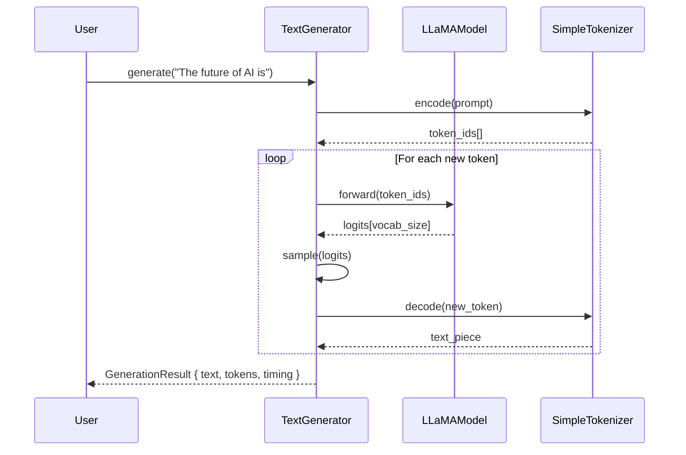

# Quick Start Guide

This page gets you from a verified installation to interactive text generation
in under ten minutes.  It assumes you have already completed the
[Installation](installation.md) steps and that `zig build test` passes.

---

## Running Your First Demo

The fastest way to see ZigLlama in action is the bundled `simple_demo`:

```bash
zig run examples/simple_demo.zig
```

The demo walks through every layer of the architecture, printing educational
commentary as it goes:

1. Tensor creation and matrix multiplication (Layer 1).
2. SIMD-accelerated operations and quantisation (Layer 2).
3. Activation functions and normalisation (Layer 3).
4. Multi-head attention and feed-forward networks (Layer 4).
5. LLaMA model initialisation and tokenisation (Layer 5).
6. Autoregressive text generation with sampling (Layer 6).

!!! tip "No model download required"

    The demo uses randomly initialised weights.  It demonstrates the full
    inference *pipeline* -- allocation, forward pass, sampling, token
    decoding -- without requiring a multi-gigabyte GGUF download.

---

## Basic Usage Example

The following program is a minimal but complete inference pipeline.  It
initialises a LLaMA-7B configuration, creates a model and tokeniser, and
generates text from a prompt.

```zig
const std = @import("std");
const zigllama = @import("src/main.zig");

pub fn main() !void {
    var gpa = std.heap.GeneralPurposeAllocator(.{}){};
    defer _ = gpa.deinit();
    const allocator = gpa.allocator();

    const config = zigllama.models.config.ModelConfig.llama(.LLaMA_7B);
    var model = try zigllama.models.llama.LLaMAModel.init(config, allocator);
    defer model.deinit();

    var tokenizer = try zigllama.models.tokenizer.SimpleTokenizer.init(allocator, config.vocab_size);
    defer tokenizer.deinit();

    var generator = zigllama.inference.generation.TextGenerator.init(&model, &tokenizer, allocator, null);
    const result = try generator.generate("The future of AI is");
    defer result.deinit(allocator);

    std.debug.print("Generated: {s}\n", .{result.text orelse ""});
}
```

!!! definition "Key types in the example"

    - **`ModelConfig`** -- a compile-time-friendly struct that encodes every
      hyperparameter of a model variant: hidden dimension, number of layers,
      number of attention heads, vocabulary size, activation type, and more.

    - **`LLaMAModel`** -- the full LLaMA forward-pass implementation.  On
      `init` it allocates weight buffers sized according to the config.  With
      a real GGUF file, weights are memory-mapped instead of heap-allocated.

    - **`SimpleTokenizer`** -- a lightweight tokeniser sufficient for
      demonstration.  Production use cases should load a SentencePiece or BPE
      vocabulary from the GGUF metadata.

    - **`TextGenerator`** -- the autoregressive loop.  Each call to `generate`
      tokenises the prompt, runs repeated forward passes, samples the next
      token, and decodes the result back to text.

### Step-by-step Walkthrough



!!! algorithm "Autoregressive generation"

    Given a prompt \( x_1, x_2, \ldots, x_n \), the generator produces tokens
    one at a time:

    \[
      x_{t+1} \sim P\!\bigl(x \mid x_1, \ldots, x_t\bigr)
      = \operatorname{softmax}\!\bigl(\mathbf{z}_t / \tau\bigr)
    \]

    where \( \mathbf{z}_t \) is the logit vector output by the model at
    position \( t \) and \( \tau \) is the temperature parameter.  The sampling
    strategy (greedy, top-k, top-p, etc.) determines *how* the categorical
    distribution is truncated before drawing.

---

## Running Tests Layer by Layer

ZigLlama's test suite is organised to match the 6-layer architecture.  You can
validate each layer independently to build confidence before moving on.

```bash
# Layer 1 -- Foundation (tensors, memory management, GGUF)
zig build test-foundation

# Layer 2 -- Linear Algebra (SIMD, quantisation)
zig build test-linear-algebra

# All layers at once
zig build test
```

!!! info "Test counts by layer"

    | Layer | Tests | Focus areas |
    |---|---|---|
    | 1. Foundation | 8 | Tensor ops, memory mapping, GGUF parsing |
    | 2. Linear Algebra | 25 | SIMD mat-mul, K-quant, IQ-quant |
    | 3. Neural Primitives | 12 | Activations, normalisation, embeddings |
    | 4. Transformers | 15 | Attention, sliding window, FFN |
    | 5. Models | 120 | 18 architectures, GGUF loading, tokenisation |
    | 6. Inference | 80 | Generation, sampling, KV cache, streaming |
    | Integration | 25 | Production parity, end-to-end |
    | **Total** | **285+** | |

---

## Example Files

The `examples/` directory contains 12 self-contained programs.  Each can be run
directly with `zig run`.

| File | Description | Layers exercised |
|---|---|---|
| `simple_demo.zig` | End-to-end tour of all six layers | 1--6 |
| `main.zig` | Library entry-point demo | 1 |
| `educational_demo.zig` | Detailed educational walkthrough with commentary | 1--6 |
| `benchmark_demo.zig` | Performance benchmarks (SIMD, quantisation, caching) | 1--2, 6 |
| `parity_demo.zig` | Comparison with llama.cpp feature set | 5--6 |
| `gguf_demo.zig` | GGUF file loading and inspection | 1, 5 |
| `model_architectures_demo.zig` | Tour of all 18 supported architectures | 5 |
| `chat_templates_demo.zig` | Chat-template rendering (ChatML, Alpaca, etc.) | 5 |
| `multi_modal_demo.zig` | Vision-language multi-modal pipeline | 3--5 |
| `multi_modal_concepts_demo.zig` | Multi-modal theory and design patterns | 3--5 |
| `threading_demo.zig` | Multi-threaded inference and NUMA awareness | 1, 6 |
| `perplexity_demo.zig` | Perplexity evaluation and model quality metrics | 5--6 |

Run any example from the repository root:

```bash
zig run examples/benchmark_demo.zig
```

!!! tip "Reading order for newcomers"

    Start with `simple_demo.zig` for the big picture, then work through
    `educational_demo.zig` for deeper explanations.  After that, pick
    examples that match your interests -- `benchmark_demo.zig` for
    performance, `model_architectures_demo.zig` for breadth, or
    `gguf_demo.zig` for format internals.

---

## Understanding the Output

When you run the simple demo, expect output similar to:

```
=== ZigLlama Foundation Layer Demo ===
Demonstrating basic tensor operations...

Matrix A (2x3):
[[1.0, 2.0, 3.0],
 [4.0, 5.0, 6.0]]

Matrix B (3x2):
[[1.0, 0.0],
 [0.0, 1.0],
 [0.5, 0.5]]

Result A x B (2x2):
[[2.5, 3.5],
 [7.0, 8.0]]
```

!!! definition "Matrix multiplication refresher"

    The result element at row \( i \), column \( j \) is the dot product of
    row \( i \) of \( A \) and column \( j \) of \( B \):

    \[
      C_{ij} = \sum_{k=1}^{K} A_{ik} \, B_{kj}
    \]

    For the element \( C_{0,0} \): \( 1 \times 1 + 2 \times 0 + 3 \times 0.5 = 2.5 \).

    This operation is the computational backbone of every transformer layer:
    query-key-value projections, attention score computation, and
    feed-forward network evaluations are all matrix multiplications.

---

## Loading a Real Model (Optional)

If you have a GGUF model file (e.g., downloaded from Hugging Face), you can
load it directly:

```zig
const std = @import("std");
const zigllama = @import("src/main.zig");

pub fn main() !void {
    var gpa = std.heap.GeneralPurposeAllocator(.{}){};
    defer _ = gpa.deinit();
    const allocator = gpa.allocator();

    // Load model from GGUF file
    const gguf_file = try zigllama.models.gguf.GGUFFile.init(
        allocator,
        "models/llama-2-7b-chat.Q4_K_M.gguf",
    );
    defer gguf_file.deinit();

    // Extract configuration from GGUF metadata
    const config = try zigllama.models.config.ModelConfig.fromGGUF(gguf_file);

    std.debug.print("Model: {s}\n", .{config.name});
    std.debug.print("Parameters: {d:.1}B\n", .{config.parameterCount()});
    std.debug.print("Vocab size: {d}\n", .{config.vocab_size});
}
```

!!! warning "Model file sizes"

    GGUF files can be large.  A 7B-parameter model in Q4_K_M quantisation is
    approximately 4 GB.  Ensure you have sufficient disk space and RAM (or
    rely on memory mapping, which ZigLlama enables by default).

---

## Exploring the Inference Pipeline

The generation pipeline offers several configuration knobs.  Here is a
slightly more advanced example that demonstrates temperature scaling and top-p
sampling:

```zig
const sampling_config = zigllama.inference.generation.SamplingConfig{
    .strategy = .top_p,
    .temperature = 0.8,
    .top_p = 0.95,
    .max_tokens = 128,
};

var generator = zigllama.inference.generation.TextGenerator.init(
    &model,
    &tokenizer,
    allocator,
    &sampling_config,
);

const result = try generator.generate("Once upon a time");
defer result.deinit(allocator);

std.debug.print("{s}\n", .{result.text orelse ""});
```

!!! theorem "Top-p (nucleus) sampling"

    Top-p sampling selects the smallest set \( V_p \subseteq V \) such that

    \[
      \sum_{x \in V_p} P(x \mid x_{<t}) \geq p
    \]

    where \( p \) is the nucleus threshold (typically 0.9--0.95).  This
    dynamically adjusts the number of candidate tokens based on the shape of
    the distribution, unlike top-k which always considers a fixed number.

---

## What to Read Next

After completing this quick start, choose the path that fits your goals:

| Goal | Next page |
|---|---|
| Understand the build system in depth | [Building from Source](building.md) |
| Navigate the codebase confidently | [Project Structure](project-structure.md) |
| Learn the design philosophy | [Architecture Overview](../architecture/index.md) |
| Dive into the math, starting from tensors | [Layer 1: Foundations](../foundations/index.md) |
| Jump to attention mechanisms | [Layer 4: Transformers](../transformers/index.md) |
| See all sampling strategies | [Layer 6: Inference -- Sampling](../inference/sampling-strategies.md) |
