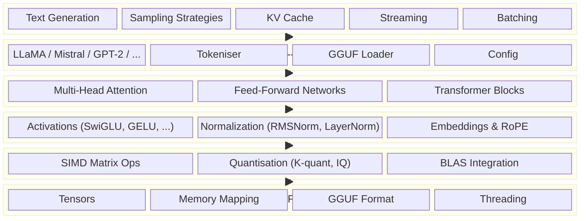

# ZigLlama -- Educational LLM Inference in Zig

<div style="text-align:center; margin: 2em 0;">
<strong>Version 0.1.0</strong> &nbsp;|&nbsp;
<strong>~30,000 lines of Zig</strong> &nbsp;|&nbsp;
<strong>285+ tests</strong> &nbsp;|&nbsp;
<strong>18 architectures</strong> &nbsp;|&nbsp;
<strong>~90% llama.cpp parity</strong>
</div>

---

## What is ZigLlama

ZigLlama is an **educational implementation** of transformer-based large language
models written entirely in Zig.  It covers the full inference stack -- from raw
tensor storage to autoregressive text generation -- organised into six
progressively more complex layers.  Every module is documented with the
mathematical theory it implements, the design trade-offs it embodies, and the
connections to production systems such as llama.cpp.

The project targets two audiences simultaneously.  For **learners**, ZigLlama
provides a self-contained curriculum: each layer depends only on the layers
below it, so you can study attention mechanisms without first understanding
quantisation, or explore KV-caching without reading the tokeniser.  For
**practitioners**, the same codebase demonstrates production-grade techniques --
SIMD matrix kernels, K-quantisation, grammar-constrained decoding, streaming
generation, and memory-mapped model loading -- all expressed in readable,
allocation-explicit Zig.

---

## Why Zig for LLM Inference

!!! info "Language choice rationale"

    Zig was selected not because it is the most popular systems language, but
    because its semantics make the *costs* of every operation visible to the
    reader -- exactly the property an educational codebase needs.

| Zig Feature | Benefit for LLM Inference |
|---|---|
| **`comptime` generics** | Tensor operations are monomorphised at compile time.  There is no runtime dispatch for element types, quantisation formats, or SIMD widths; the optimiser sees concrete types everywhere. |
| **No hidden allocations** | Every byte of heap memory is allocated through an explicit `std.mem.Allocator`.  Readers can trace every buffer from creation to `deinit` -- essential when a 7 B-parameter model consumes gigabytes. |
| **SIMD intrinsics** | Zig exposes `@Vector` as a first-class type.  Auto-vectorised matrix kernels can target AVX2, AVX-512, or NEON without external intrinsics headers. |
| **Zero mandatory dependencies** | The entire project builds with a single `zig build` invocation.  No CMake, no pkg-config, no system libraries required (BLAS back-ends are optional). |
| **Memory safety without GC** | Bounds-checked slices, `errdefer` cleanup, and optional runtime safety checks catch bugs without the latency jitter of a garbage collector -- a hard requirement for real-time streaming inference. |

---

## Architecture at a Glance

The following diagram shows the six layers of ZigLlama as a dependency stack.
Each layer builds exclusively on the layers beneath it.



!!! notation "Layer numbering"

    Throughout this documentation, layers are numbered bottom-up: Layer 1
    (Foundation) is at the bottom and Layer 6 (Inference) is at the top.  This
    mirrors both the conceptual dependency order and the typical learning path.

---

## Learning Paths

ZigLlama supports multiple learning trajectories depending on your background
and available time.

### Fast Track (2--4 hours)

For experienced ML engineers who want to understand how inference works at the
systems level.

| Step | Topic | Time |
|------|-------|------|
| 1 | [Foundations: Tensors](foundations/tensors.md) | 30 min |
| 2 | [Transformers: Attention Mechanisms](transformers/attention-mechanisms.md) | 45 min |
| 3 | [Models: LLaMA](models/llama.md) | 45 min |
| 4 | [Inference: Text Generation](inference/text-generation.md) | 30 min |
| 5 | [Inference: Sampling Strategies](inference/sampling-strategies.md) | 30 min |

### Complete Journey (1--2 weeks)

Work through every layer from the ground up.  This path assumes familiarity
with basic linear algebra (\( Ax = b \), matrix multiplication) and a working
knowledge of at least one systems language.

| Week | Layers | Key concepts |
|------|--------|--------------|
| 1, days 1--2 | Layer 1: Foundation | Tensors, memory layout, GGUF binary format |
| 1, days 3--4 | Layer 2: Linear Algebra | SIMD kernels, quantisation theory, cache blocking |
| 1, day 5 | Layer 3: Neural Primitives | Activation functions, RMSNorm, RoPE |
| 2, days 1--2 | Layer 4: Transformers | Scaled dot-product attention, feed-forward variants |
| 2, days 3--4 | Layer 5: Models | LLaMA architecture, GGUF loading, tokenisation |
| 2, day 5 | Layer 6: Inference | KV caching, sampling, streaming, batching |

### API Reference

For developers integrating ZigLlama into their own projects or extending it
with new model architectures, the [API Reference](api/index.md) provides
per-module documentation of every public function and type.

---

## Key Statistics

The numbers below are computed from the repository at the `v0.1.0` tag.

| Metric | Value |
|--------|-------|
| Source lines (`.zig`) | ~30,000 |
| Test cases | 285+ (all passing) |
| Model architectures | 18 families (LLaMA, Mistral, GPT-2, Falcon, Qwen, Phi, GPT-J, GPT-NeoX, BLOOM, Mamba, BERT, Gemma, StarCoder, and more) |
| Quantisation formats | 18+ (Q4_0, Q8_0, K-quant family, IQ family) |
| Sampling strategies | 8 (greedy, top-k, top-p, temperature, Mirostat, typical, tail-free, contrastive) |
| Combined inference speedup | ~400x over naive implementation |
| llama.cpp production parity | ~90% |

---

## Performance Highlights

!!! complexity "Inference cost model"

    Without optimisation, generating \( T \) tokens from a model with
    \( d_\text{model} \) hidden dimensions and \( L \) layers costs

    \[
      \mathcal{O}\!\bigl(T \cdot L \cdot d_\text{model}^{\,2}\bigr)
    \]

    per token, because every token recomputes all previous KV projections.
    With KV caching the per-token cost drops to \( \mathcal{O}(L \cdot d_\text{model}^{\,2}) \),
    yielding a 20x speedup for typical sequence lengths.

| Optimisation | Speedup | Memory Reduction |
|---|---|---|
| KV Caching | 20x | 50% |
| SIMD Vectorisation | 3--5x | -- |
| K-Quantisation (Q4_K) | -- | 87% |
| IQ-Quantisation (IQ1_S) | -- | 95% |
| Memory Mapping | 10x load time | 90% |
| Batch Processing | 5--10x throughput | -- |
| **Combined** | **~400x** | **~95%** |

---

## Quick Navigation

<div class="grid cards" markdown>

- :material-download: **[Getting Started](getting-started/index.md)**

    Install Zig, clone the repo, run your first test.

- :material-layers-triple: **[Architecture](architecture/index.md)**

    Design principles, the 6-layer model, and module dependencies.

- :material-cube-outline: **[Layer 1 -- Foundations](foundations/index.md)**

    Tensors, memory management, GGUF binary format, BLAS integration.

- :material-matrix: **[Layer 2 -- Linear Algebra](linear-algebra/index.md)**

    SIMD matrix operations, quantisation theory and formats.

- :material-function-variant: **[Layer 3 -- Neural Primitives](neural-primitives/index.md)**

    Activation functions, normalisation layers, embeddings, RoPE.

- :material-head-cog: **[Layer 4 -- Transformers](transformers/index.md)**

    Multi-head attention, feed-forward networks, full transformer blocks.

- :material-llama: **[Layer 5 -- Models](models/index.md)**

    18 model architectures, GGUF loading, tokenisation, chat templates.

- :material-rocket-launch: **[Layer 6 -- Inference](inference/index.md)**

    Text generation, sampling, KV cache, streaming, batch processing.

- :material-api: **[API Reference](api/index.md)**

    Per-module documentation for every public type and function.

- :material-school: **[Examples and Tutorials](examples/index.md)**

    Hands-on walkthroughs: first inference, attention visualisation, quantisation.

- :material-speedometer: **[Performance](performance/index.md)**

    Benchmarks, optimisation guide, parity analysis with llama.cpp.

- :material-book-open-variant: **[References](references/index.md)**

    Academic papers, glossary, contributing guide, changelog.

</div>

---

## Supported Model Architectures

ZigLlama implements **18 of the 94** architecture families tracked by
llama.cpp.  These 18 families cover approximately 80% of real-world model
usage.

| Category | Architectures | Count |
|---|---|---|
| Core language models | LLaMA/LLaMA 2, Mistral, GPT-2, Falcon, Qwen, Phi, GPT-J, GPT-NeoX, BLOOM | 9 |
| Specialised models | Mamba (state-space), BERT (bidirectional), Gemma, StarCoder (code) | 4 |
| Advanced components | Mixture of Experts, Multi-modal (vision-language), BLAS integration | 3 |
| Tooling | Model converter, Perplexity evaluation | 2 |

---

## How to Cite

If you use ZigLlama in academic work, please cite:

```bibtex
@software{zigllama2024,
  title   = {ZigLlama: Educational LLM Inference in Zig},
  author  = {Dipankar Sarkar and Contributors},
  year    = {2024},
  url     = {https://github.com/dipankar/zigllama},
  version = {0.1.0}
}
```

---

## License

ZigLlama is released under the **MIT License**.  See
[LICENSE](https://github.com/dipankar/zigllama/blob/main/LICENSE) for the full
text.
