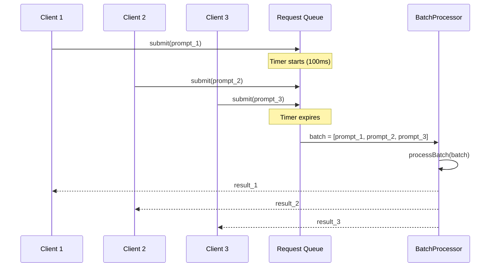
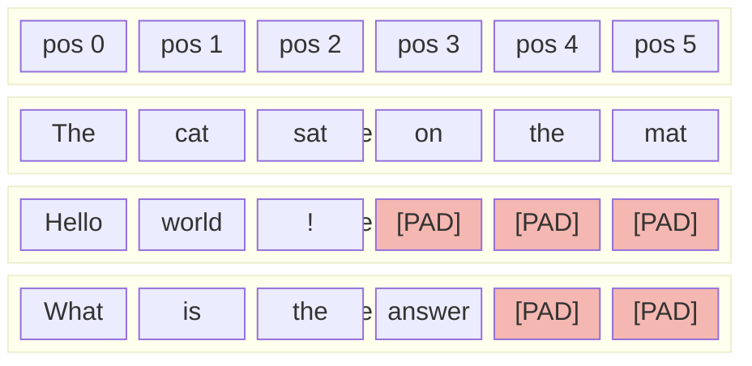
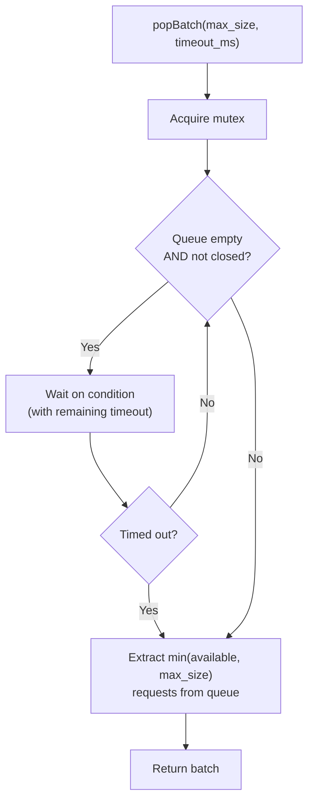

# Batch Processing

Processing a single request at a time leaves most hardware resources idle.
The model weights occupy memory regardless of how many sequences use them;
matrix operations have fixed kernel-launch overhead that amortises over
larger inputs.  Batch processing groups multiple generation requests and
processes them together, dramatically improving throughput.

---

## 1. Why Batching

!!! definition "Throughput vs Latency"

    - **Latency**: time from request submission to completion (single request).
    - **Throughput**: total requests (or tokens) completed per unit time.

    Batching trades slightly increased per-request latency for substantially
    higher throughput.

The key insight is that the transformer forward pass is dominated by
**matrix multiplications** that scale efficiently with batch size:

\[
    \text{GEMM cost for batch } B: \quad O(B \cdot n \cdot d^2)
\]

The overhead of loading model weights from memory is paid **once per batch**
rather than once per request.  On modern hardware, this weight-loading cost
often dominates single-request inference, so batching can yield 5--10x
throughput improvement.

---

## 2. Batching Strategies

ZigLlama supports four batching strategies, selectable via the
`BatchingStrategy` enum:

```zig
pub const BatchingStrategy = enum {
    FixedSize,       // Wait for exactly max_batch_size requests
    DynamicTimeout,  // Collect requests until timeout or batch full
    Adaptive,        // Adjust batch size based on queue depth and latency
    Continuous,      // Process immediately, never wait
};
```

| Strategy | Latency | Throughput | Complexity | Best For |
|---|---|---|---|---|
| `FixedSize` | High (waits for full batch) | Highest | Simple | Offline processing |
| `DynamicTimeout` | Bounded by timeout | High | Moderate | Production servers |
| `Adaptive` | Variable | High | Complex | Variable load patterns |
| `Continuous` | Lowest | Lower | Simple | Interactive applications |

### 2.1 Fixed-Size Batching

Accumulates exactly `max_batch_size` requests before processing.  Simple to
implement but introduces high latency when request arrival rate is low.

### 2.2 Dynamic Timeout Batching

The default strategy.  Collects requests until either the batch is full
**or** a timeout expires, whichever comes first:

!!! algorithm "Dynamic Timeout Batching"

    **Parameters:** `max_batch_size`, `max_wait_time_ms`

    1. Set timer to `max_wait_time_ms`.
    2. **while** batch size \( < \) `max_batch_size` **and** timer not expired:
        - Wait on request queue condition variable.
        - If new request arrives, add to current batch.
    3. Process batch (even if smaller than `max_batch_size`).



### 2.3 Adaptive Batching

Monitors queue depth and recent latency to dynamically adjust the batch
size.  When the queue is deep, it forms larger batches to drain the backlog;
when latency is high, it reduces batch size to improve responsiveness.

### 2.4 Continuous Batching

Processes each request as it arrives, without waiting for additional
requests.  This provides the lowest latency but the lowest throughput, as
it cannot amortise weight-loading costs.

---

## 3. BatchProcessor

The `BatchProcessor` is the top-level struct for batch inference:

```zig
pub const BatchProcessor = struct {
    model: *LLaMAModel,
    tokenizer: *SimpleTokenizer,
    config: BatchConfig,
    queue: RequestQueue,
    stats: BatchStats,
    allocator: Allocator,
    workers: []Thread,
    is_running: bool,
    next_request_id: RequestId,
    result_callback: ?*const fn (result: BatchResult, user_data: ?*anyopaque) void,
    user_data: ?*anyopaque,

    pub fn init(model: *LLaMAModel, tokenizer: *SimpleTokenizer,
                config: BatchConfig, allocator: Allocator) !BatchProcessor { ... }
    pub fn deinit(self: *BatchProcessor) void { ... }
    pub fn start(self: *BatchProcessor) !void { ... }
    pub fn stop(self: *BatchProcessor) void { ... }
    pub fn submit(self: *BatchProcessor, prompt: []const u8,
                  config: GenerationConfig) !RequestId { ... }
    pub fn getStats(self: BatchProcessor) BatchStats { ... }
};
```

### 3.1 BatchConfig

```zig
pub const BatchConfig = struct {
    strategy: BatchingStrategy = .DynamicTimeout,
    max_batch_size: u32 = 8,
    min_batch_size: u32 = 1,
    max_wait_time_ms: u32 = 100,
    max_queue_size: u32 = 1000,
    num_workers: u32 = 1,
    enable_priority: bool = false,
    memory_limit_bytes: ?usize = null,
};
```

!!! tip "Choosing max_batch_size"

    The optimal batch size depends on available memory and compute resources.
    A larger batch uses more memory (each sequence needs its own KV cache)
    but amortises fixed costs better.  Start with 4--8 for CPU inference and
    16--64 for GPU inference, then tune based on profiling data.

---

## 4. Sequence Padding

When sequences in a batch have different lengths, shorter sequences must
be padded so that all sequences can be processed as a single batched matrix
operation:

!!! definition "Attention Masking for Padded Sequences"

    Given a batch of \( B \) sequences with lengths
    \( \ell_1, \ldots, \ell_B \), pad all to length
    \( L = \max_i \ell_i \).  Construct an attention mask
    \( \mathbf{M} \in \{0, -\infty\}^{B \times L} \):

    \[
        M_{b,j} = \begin{cases}
            0 & \text{if } j < \ell_b \\
            -\infty & \text{otherwise (padding)}
        \end{cases}
    \]

    The mask is added to the attention logits before softmax, ensuring
    padding positions receive zero attention weight.



!!! warning "Padding Overhead"

    Padding wastes compute on tokens that produce no useful output.  If
    sequence lengths vary widely (e.g., 10 tokens vs 1000 tokens), the
    shorter sequences waste most of their compute budget.  Mitigation
    strategies include sorting requests by length before batching and
    using continuous batching to avoid padding entirely.

---

## 5. Dynamic Batching

The `RequestQueue` implements thread-safe request queuing with timeout-based
batch extraction:

```zig
const RequestQueue = struct {
    requests: ArrayList(BatchRequest),
    mutex: Mutex,
    condition: Condition,
    allocator: Allocator,
    closed: bool,

    pub fn push(self: *RequestQueue, request: BatchRequest) !void { ... }
    pub fn popBatch(self: *RequestQueue, max_size: u32, timeout_ms: u32) []BatchRequest { ... }
    pub fn close(self: *RequestQueue) void { ... }
};
```

The `popBatch` method blocks until either `max_size` requests are available
or `timeout_ms` elapses:



---

## 6. Throughput Scaling

!!! complexity "Throughput Analysis"

    Let \( C \) be the fixed cost per batch (weight loading, kernel launch)
    and \( c \) be the per-sequence cost within a batch.  Total time for
    a batch of size \( B \):

    \[
        T(B) = C + B \cdot c
    \]

    Throughput (sequences per second):

    \[
        \text{Throughput}(B) = \frac{B}{T(B)} = \frac{B}{C + B \cdot c}
    \]

    As \( B \to \infty \): throughput \( \to 1/c \) (limited by per-sequence cost).
    As \( B \to 1 \): throughput \( \to 1/(C + c) \) (dominated by fixed cost).

### 6.1 Diminishing Returns

The throughput improvement follows a logarithmic curve.  Doubling batch
size from 1 to 2 yields the largest relative improvement; each subsequent
doubling yields less:

| Batch Size | Relative Throughput | Improvement over Previous |
|---|---|---|
| 1 | 1.0x | -- |
| 2 | 1.8x | +80% |
| 4 | 3.0x | +67% |
| 8 | 4.5x | +50% |
| 16 | 5.5x | +22% |
| 32 | 6.2x | +13% |

!!! info "Memory Constraint"

    In practice, batch size is limited by memory rather than compute.
    Each sequence in the batch requires its own KV cache, so the total
    memory scales as \( B \times M_{\text{cache}} \) where
    \( M_{\text{cache}} \) is the per-sequence cache size
    (see [KV Cache](kv-cache.md)).

---

## 7. BatchRequest and BatchResult

### 7.1 BatchRequest

```zig
pub const BatchRequest = struct {
    id: RequestId,
    prompt: []const u8,
    config: GenerationConfig,
    max_tokens: u32,
    generated_tokens: ArrayList(TokenId),
    generated_text: ArrayList(u8),
    cumulative_log_prob: f32,
    created_at: i64,
    started_at: ?i64,
    completed_at: ?i64,
    completed: bool,
    stop_reason: ?StopReason,

    pub fn addToken(self: *BatchRequest, token_id: TokenId,
                    text: []const u8, log_prob: f32) !void { ... }
    pub fn markCompleted(self: *BatchRequest, stop_reason: StopReason) void { ... }
    pub fn getLatency(self: BatchRequest) ?i64 { ... }
    pub fn getQueueTime(self: BatchRequest) ?i64 { ... }
};
```

!!! info "Request Lifecycle"

    A request passes through four phases: **queued** (waiting in the queue),
    **started** (assigned to a batch), **generating** (tokens being
    produced), and **completed** (stop condition met or error).  Timestamps
    at each transition enable precise latency analysis.

### 7.2 BatchResult

```zig
pub const BatchResult = struct {
    request_id: RequestId,
    tokens: []TokenId,
    text: []u8,
    log_probs: []f32,
    total_log_prob: f32,
    num_tokens: u32,
    stop_reason: StopReason,
    latency_ms: i64,      // Processing time
    queue_time_ms: i64,    // Time spent waiting in queue
};
```

---

## 8. Batch Statistics

The `BatchStats` struct tracks aggregate performance metrics:

```zig
pub const BatchStats = struct {
    total_requests: u64,
    total_batches: u64,
    avg_batch_size: f32,
    avg_latency_ms: f32,
    avg_queue_time_ms: f32,
    requests_per_second: f32,
    tokens_per_second: f32,
    current_queue_size: u32,
    peak_queue_size: u32,
    timeout_count: u32,
    error_count: u32,
};
```

### 8.1 Request Priority

When `enable_priority` is set in `BatchConfig`, requests can be assigned
priority levels that affect queue ordering:

```zig
pub const RequestPriority = enum(u8) {
    Low = 0,
    Normal = 1,
    High = 2,
    Critical = 3,
};
```

Higher-priority requests are dequeued before lower-priority ones, even if
they arrived later.  This is useful for serving real-time interactive
requests alongside background batch jobs.

---

## References

[^1]: Yu, G. et al. "Orca: A Distributed Serving System for Transformer-Based Language Generation." *OSDI*, 2022.
[^2]: Kwon, W. et al. "Efficient Memory Management for Large Language Model Serving with PagedAttention." *SOSP*, 2023.
[^3]: Gerganov, G. "llama.cpp -- Inference of LLaMA model in C/C++." GitHub, 2023.
[^4]: Agrawal, A. et al. "Sarathi: Efficient LLM Inference by Piggybacking Decodes with Chunked Prefills." *arXiv:2308.16369*, 2023.
