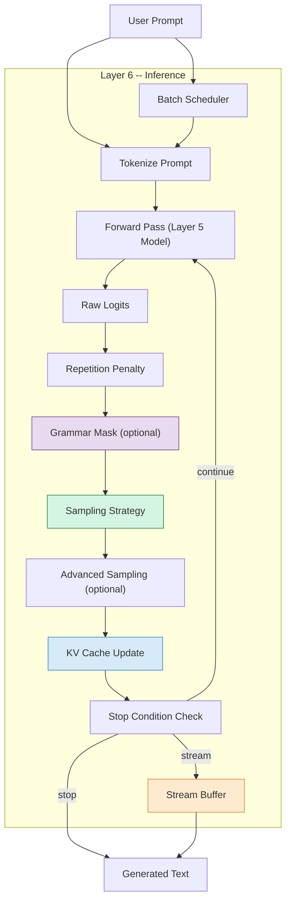
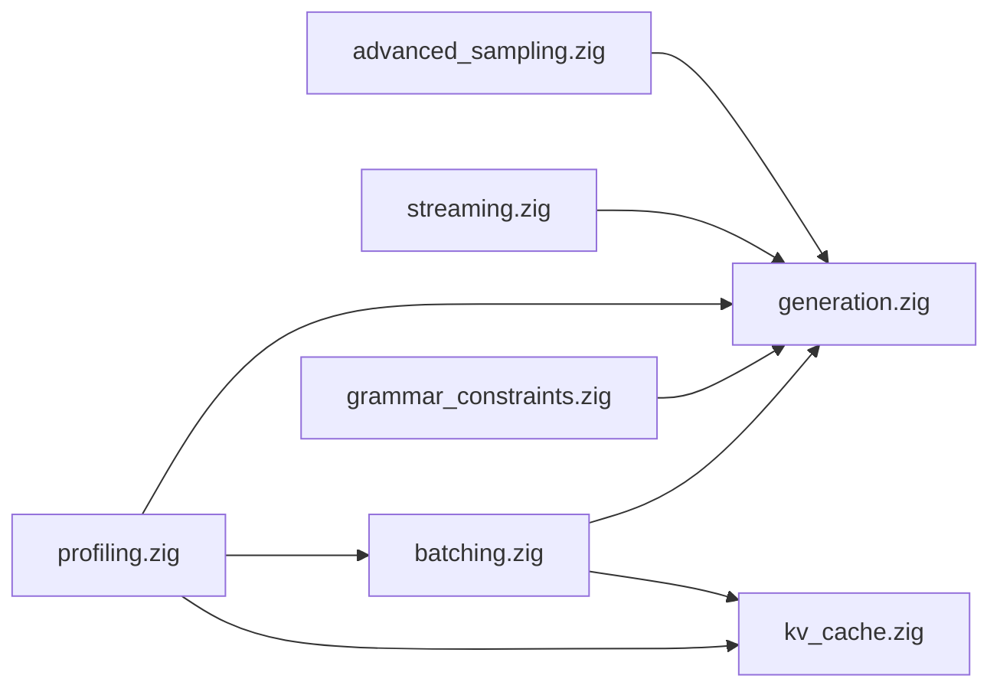

# Layer 6: Inference

The **Inference** layer is the capstone of ZigLlama.  It composes every layer
beneath it -- tensors, linear algebra, neural primitives, transformer blocks,
and model loading -- into a complete text generation pipeline.  This is where
a static collection of weight matrices becomes a system that *produces
language*.

Given a prompt and a set of configuration parameters, the inference layer
autoregressively generates text one token at a time: running a forward pass
through the model, converting raw logits into a probability distribution,
selecting the next token via a sampling strategy, and repeating until a stop
condition is met.  The remaining modules in this layer address the engineering
challenges that arise when you want this loop to be fast, controllable, and
production-ready.

---

## Learning Objectives

After completing the eight modules in this layer you will be able to:

1. **Implement** autoregressive text generation from first principles,
   including the forward pass, logit processing, and token selection loop.
2. **Compare** sampling strategies -- greedy, temperature, top-k, top-p, and
   combined -- and predict their effects on output quality and diversity.
3. **Explain** advanced sampling methods (Mirostat, typical, tail-free,
   contrastive search) and select appropriate strategies for different tasks.
4. **Design** a KV cache that reduces per-token attention cost from
   \( O(n^2 d) \) to \( O(n \cdot d) \), including sliding-window variants.
5. **Build** a streaming generation pipeline with thread-safe token buffers,
   callback-based delivery, and natural break detection.
6. **Architect** a batch processing system with dynamic batching, request
   queuing, and throughput scaling analysis.
7. **Constrain** generation output using grammar specifications (JSON, regex,
   context-free grammars) via token masking.
8. **Profile** inference performance using RAII measurement blocks, percentile
   statistics, and the roofline model for bottleneck identification.

---

## Prerequisites

!!! info "Required Background"

    This layer assumes familiarity with:

    - **Layer 4 -- Transformers**: Multi-head attention, feed-forward blocks,
      and the full transformer forward pass.
    - **Layer 5 -- Models**: LLaMA architecture, tokenisation, and GGUF model
      loading.
    - **Probability**: Softmax, entropy \( H(X) = -\sum p(x) \log p(x) \),
      and sampling from discrete distributions.
    - **Systems Programming**: Threading primitives (mutex, condition variable),
      memory management, and basic concurrency patterns.

---

## Components Overview

| Module | Page | Source | Key Types |
|---|---|---|---|
| **Text Generation** | [text-generation.md](text-generation.md) | `src/inference/generation.zig` | `TextGenerator`, `GenerationConfig`, `GenerationResult` |
| **Sampling Strategies** | [sampling-strategies.md](sampling-strategies.md) | `src/inference/generation.zig` | `SamplingStrategy`, `TokenProb` |
| **Advanced Sampling** | [advanced-sampling.md](advanced-sampling.md) | `src/inference/advanced_sampling.zig` | `AdvancedSampler`, `MirostatConfig`, `TypicalConfig` |
| **KV Cache** | [kv-cache.md](kv-cache.md) | `src/inference/kv_cache.zig` | `KVCacheEntry`, `MultiSequenceKVCache`, `SlidingWindowKVCache` |
| **Streaming** | [streaming.md](streaming.md) | `src/inference/streaming.zig` | `StreamingGenerator`, `TokenBuffer`, `StreamStatus` |
| **Batch Processing** | [batching.md](batching.md) | `src/inference/batching.zig` | `BatchProcessor`, `BatchRequest`, `BatchingStrategy` |
| **Grammar Constraints** | [grammar-constraints.md](grammar-constraints.md) | `src/inference/grammar_constraints.zig` | `GrammarConstrainedSampler`, `JSONConstraint`, `CFGConstraint` |
| **Profiling** | [profiling.md](profiling.md) | `src/inference/profiling.zig` | `Profiler`, `BenchmarkRunner`, `PerformanceStats` |

---

## Inference Pipeline Architecture

The following diagram shows the complete data flow from a user prompt to
generated text.  Every box corresponds to a module in this layer.

---

## Dependency Graph

Within the Inference layer, the modules depend on each other as follows:

`generation.zig` is the central module; every other inference module depends
on it either directly or through the types it exports.

---

## Suggested Reading Order

1. **[Text Generation](text-generation.md)** -- start with the core
   autoregressive loop and generation configuration.
2. **[Sampling Strategies](sampling-strategies.md)** -- understand how tokens
   are selected from the model's probability distribution.
3. **[Advanced Sampling](advanced-sampling.md)** -- explore entropy-targeting
   and information-theoretic sampling methods.
4. **[KV Cache](kv-cache.md)** -- learn the key optimisation that makes
   autoregressive generation practical.
5. **[Streaming](streaming.md)** -- see how tokens are delivered in real time
   to users.
6. **[Batch Processing](batching.md)** -- scale throughput with dynamic
   batching and request scheduling.
7. **[Grammar Constraints](grammar-constraints.md)** -- constrain output to
   valid JSON, regex patterns, or formal grammars.
8. **[Profiling](profiling.md)** -- measure, benchmark, and optimise the
   entire pipeline.

---

## Key Design Decisions

!!! tip "Composition over Inheritance"

    ZigLlama's inference layer is composed of independent modules connected
    through explicit function calls and shared types.  The `TextGenerator`
    owns a model and tokenizer; the `StreamingGenerator` wraps a
    `TextGenerator`; the `BatchProcessor` manages a queue of generation
    requests.  There is no class hierarchy -- Zig's comptime generics and
    explicit allocation make composition both natural and efficient.

!!! tip "Sampling as a Pluggable Strategy"

    The `SamplingStrategy` enum dispatches at runtime to the appropriate
    sampling function.  Because the strategy is known per-generation (not
    per-token), the branch predictor learns it immediately, and the overhead
    versus a direct function call is negligible.

---

## Performance Summary

| Optimisation | Source Module | Typical Impact |
|---|---|---|
| KV Caching | `kv_cache.zig` | ~100x per-token speedup for long sequences |
| Batch Processing | `batching.zig` | 5--10x throughput improvement |
| Streaming | `streaming.zig` | First-token latency visible to user |
| Grammar Masking | `grammar_constraints.zig` | Guaranteed valid output structure |
| Combined Sampling | `generation.zig` | Quality-diversity control |
| RAII Profiling | `profiling.zig` | Zero-overhead when disabled |

---

## References

[^1]: Vaswani, A. et al. "Attention Is All You Need." *NeurIPS*, 2017.
[^2]: Touvron, H. et al. "LLaMA: Open and Efficient Foundation Language Models." *arXiv:2302.13971*, 2023.
[^3]: Holtzman, A. et al. "The Curious Case of Neural Text Degeneration." *ICLR*, 2020.
[^4]: Basu, S. et al. "Mirostat: A Neural Text Decoding Algorithm." *ICLR*, 2021.
[^5]: Gerganov, G. "llama.cpp -- Inference of LLaMA model in C/C++." GitHub, 2023.
