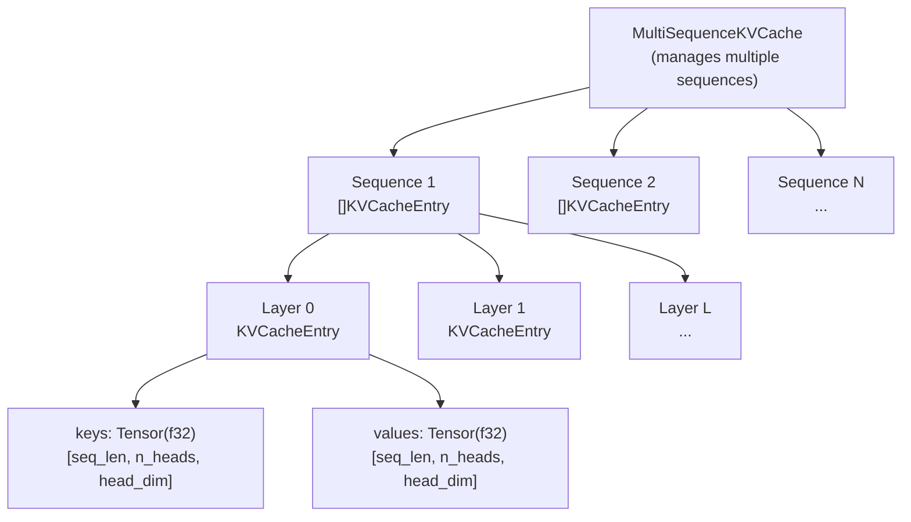
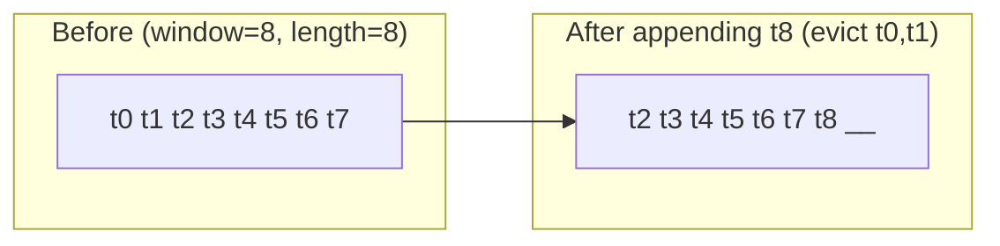
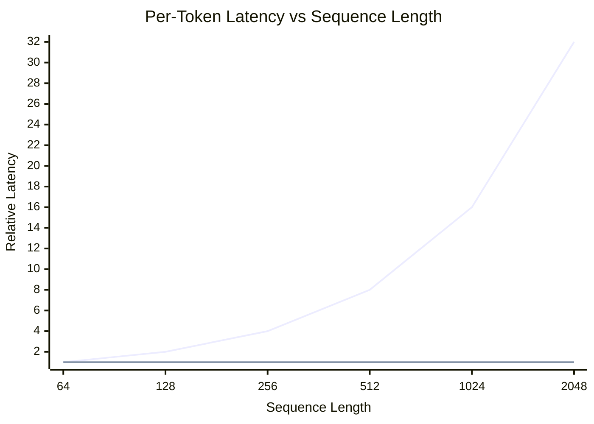
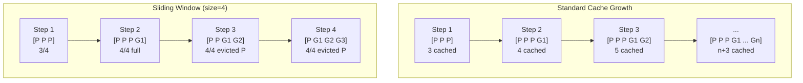

# KV Cache

The KV cache is the single most impactful optimisation in autoregressive
transformer inference.  By storing and reusing the Key and Value projections
from previous tokens, it converts per-token attention from a quadratic
operation to a linear one -- enabling practical generation speeds for
sequences of hundreds or thousands of tokens.

---

## 1. The Problem

!!! definition "Naive Attention Cost"

    In standard multi-head attention, computing the output for a sequence
    of length \( n \) requires:

    \[
        \text{Attention}(\mathbf{Q}, \mathbf{K}, \mathbf{V}) =
        \text{softmax}\!\left(\frac{\mathbf{Q}\mathbf{K}^{\!\top}}{\sqrt{d_h}}\right) \mathbf{V}
    \]

    The matrix product \( \mathbf{Q}\mathbf{K}^{\!\top} \) has shape
    \( (n \times d_h) \cdot (d_h \times n) = (n \times n) \), costing
    \( O(n^2 \cdot d_h) \) per head per layer.

During autoregressive generation, we generate tokens one at a time.  At
step \( t \), the naive approach recomputes the K and V projections for
**all** \( t \) tokens, even though the projections for tokens
\( 1, \ldots, t-1 \) have not changed.  Over \( T \) generation steps,
the total cost is:

\[
    \sum_{t=1}^{T} O(t \cdot d_h) = O(T^2 \cdot d_h) \quad \text{per head per layer}
\]

For a model with \( L \) layers, \( H \) heads, and head dimension \( d_h \):

\[
    \text{Total naive cost} = O(T^2 \cdot L \cdot H \cdot d_h)
\]

---

## 2. Key Insight

!!! info "Why Caching Works"

    In a decoder-only transformer with causal masking, the Key and Value
    vectors for token \( i \) depend only on tokens \( 1, \ldots, i \).
    Once computed, they are invariant to any tokens generated *after*
    position \( i \).  Therefore, we can **cache** them and reuse them
    at every subsequent step.

At generation step \( t \), we only need to:

1. Compute \( \mathbf{q}_t, \mathbf{k}_t, \mathbf{v}_t \) for the new token.
2. Append \( \mathbf{k}_t, \mathbf{v}_t \) to the cache.
3. Compute attention between \( \mathbf{q}_t \) and all cached
   \( \mathbf{K}_{1:t}, \mathbf{V}_{1:t} \).

The per-step cost drops from \( O(t \cdot d_h) \) (recomputing all K, V)
to \( O(d_h) \) for the projection plus \( O(t \cdot d_h) \) for the
attention itself.  Critically, the K/V projection is no longer repeated
for past tokens.

---

## 3. Cache Architecture

ZigLlama organises the KV cache as a four-level hierarchy:



### 3.1 KVCacheEntry

The fundamental unit, storing keys and values for a single layer of a
single sequence:

```zig
pub const KVCacheEntry = struct {
    keys: Tensor(f32),       // [max_length, n_heads, head_dim]
    values: Tensor(f32),     // [max_length, n_heads, head_dim]
    sequence_length: usize,  // Current number of cached positions
    max_length: usize,       // Pre-allocated capacity
    layer_id: usize,         // Which transformer layer this belongs to

    pub fn init(allocator: Allocator, max_length: usize,
                n_heads: usize, head_dim: usize, layer_id: usize) !KVCacheEntry { ... }
    pub fn append(self: *KVCacheEntry, keys: *const Tensor(f32),
                  values: *const Tensor(f32)) !void { ... }
    pub fn get(self: *const KVCacheEntry, start_pos: usize,
               length: usize) !struct { keys: Tensor(f32), values: Tensor(f32) } { ... }
    pub fn clear(self: *KVCacheEntry) void { ... }
    pub fn deinit(self: *KVCacheEntry) void { ... }
};
```

### 3.2 MultiSequenceKVCache (ModelKVCache)

Manages caches for multiple concurrent sequences (e.g., in a batch or
server context), keyed by a `u64` sequence ID:

```zig
pub const MultiSequenceKVCache = struct {
    sequences: std.AutoHashMap(u64, []KVCacheEntry),
    n_layers: usize,
    n_heads: usize,
    head_dim: usize,
    max_seq_length: usize,
    allocator: Allocator,

    pub fn getOrCreateSequence(self: *MultiSequenceKVCache, sequence_id: u64) ![]KVCacheEntry { ... }
    pub fn appendToSequence(self: *MultiSequenceKVCache, sequence_id: u64,
                            layer_id: usize, keys: *const Tensor(f32),
                            values: *const Tensor(f32)) !void { ... }
    pub fn getFromSequence(self: *MultiSequenceKVCache, sequence_id: u64,
                           layer_id: usize, start_pos: usize, length: usize) !?... { ... }
    pub fn getMemoryUsage(self: *MultiSequenceKVCache) u64 { ... }
};
```

---

## 4. Update Algorithm

!!! algorithm "KV Cache Append"

    **Input:** new key tensor \( \mathbf{K}_{\text{new}} \) of shape
    \( (\Delta, H, d_h) \), new value tensor \( \mathbf{V}_{\text{new}} \)
    of same shape.

    **Precondition:** `sequence_length + delta <= max_length`

    1. **for** each new token \( i = 0, \ldots, \Delta - 1 \) **do**
        - **for** each head \( h = 0, \ldots, H-1 \) **do**
            - **for** each dimension \( d = 0, \ldots, d_h - 1 \) **do**
                - `cache.keys[seq_len + i, h, d]` \( \leftarrow \)
                  `new_keys[i, h, d]`
                - `cache.values[seq_len + i, h, d]` \( \leftarrow \)
                  `new_values[i, h, d]`
    2. `sequence_length` \( \leftarrow \) `sequence_length + delta`.

!!! complexity "Append Cost"

    Appending \( \Delta \) new tokens costs
    \( O(\Delta \cdot H \cdot d_h) \).  For single-token generation
    (\( \Delta = 1 \)), this is \( O(H \cdot d_h) \) per layer.

---

## 5. Cache Strategies

ZigLlama supports multiple caching strategies to trade memory against
computation:

| Strategy | Description | When to Use |
|---|---|---|
| **Always** | Cache all K/V for the entire context | Default; best performance |
| **LongSequenceOnly** | Enable cache only when \( n > \) threshold | Short prompts don't benefit enough |
| **Adaptive** | Monitor memory pressure; evict old entries | Memory-constrained environments |
| **Disabled** | No caching; recompute every step | Debugging, baseline benchmarks |

---

## 6. Sliding Window Cache

For very long sequences, the full cache can exceed available memory.
The `SlidingWindowKVCache` implements a fixed-size window that evicts
the oldest tokens when the cache is full:

```zig
pub const SlidingWindowKVCache = struct {
    cache: MultiSequenceKVCache,
    window_size: usize,

    pub fn appendWithSliding(self: *SlidingWindowKVCache, sequence_id: u64,
                             layer_id: usize, keys: *const Tensor(f32),
                             values: *const Tensor(f32)) !void { ... }

    pub fn getWithWindow(self: *SlidingWindowKVCache, sequence_id: u64,
                         layer_id: usize, query_pos: usize) !?... { ... }
};
```

!!! algorithm "Sliding Window Eviction"

    When `current_length + new_tokens > window_size`:

    1. Calculate `tokens_to_evict = current_length + new_tokens - window_size`.
    2. Copy tokens `[evict..current_length]` to positions `[0..keep_length]`.
    3. Update `sequence_length = keep_length`.
    4. Append new tokens at position `keep_length`.



!!! warning "Sliding Window Limitations"

    Tokens evicted from the sliding window are permanently lost.  The model
    can no longer attend to them, which may degrade quality for tasks
    requiring long-range dependencies.  Mistral uses a sliding window of
    4096 tokens by design, which mitigates this through architectural
    training choices.

---

## 7. Memory Budget

!!! definition "KV Cache Memory Formula"

    For a model with \( L \) layers, \( H \) attention heads, head
    dimension \( d_h \), and maximum sequence length \( n \), the total
    KV cache memory is:

    \[
        M = 2 \times L \times H \times n \times d_h \times \text{sizeof(dtype)}
    \]

    The factor of 2 accounts for both keys and values.  For `f32` (4 bytes):

    \[
        M = 2 \times L \times H \times n \times d_h \times 4 \;\text{bytes}
    \]

### 7.1 Concrete Examples

| Model | L | H | \( d_h \) | n | Cache Size |
|---|---|---|---|---|---|
| LLaMA-7B | 32 | 32 | 128 | 2048 | 2.0 GB |
| LLaMA-7B | 32 | 32 | 128 | 4096 | 4.0 GB |
| LLaMA-13B | 40 | 40 | 128 | 2048 | 3.1 GB |
| Mistral-7B (GQA) | 32 | 8 (KV) | 128 | 4096 | 1.0 GB |

!!! tip "Grouped-Query Attention (GQA)"

    Models like Mistral use fewer KV heads than query heads.  With GQA,
    \( H \) in the formula is the number of **KV heads** (not query heads),
    which can reduce cache size by 4x or more.

ZigLlama provides a utility function for cache size estimation:

```zig
pub fn estimateMemoryUsage(
    n_sequences: u64, max_seq_length: u64,
    n_layers: u64, n_heads: u64, head_dim: u64,
) u64 {
    const per_token_memory = n_layers * n_heads * head_dim * 2 * @sizeOf(f32);
    return n_sequences * max_seq_length * per_token_memory;
}
```

---

## 8. Performance Impact

!!! complexity "Cost Comparison"

    | Metric | Without Cache | With Cache | Improvement |
    |---|---|---|---|
    | Per-token K/V projection | \( O(n \cdot d^2) \) | \( O(d^2) \) | \( n \times \) |
    | Per-token attention | \( O(n^2 \cdot d_h) \) | \( O(n \cdot d_h) \) | \( n \times \) |
    | Total for \( T \) tokens | \( O(T^2 \cdot L \cdot d^2) \) | \( O(T \cdot L \cdot d^2) \) | \( T \times \) |

For a sequence of length \( T = 1000 \), the KV cache provides
approximately **1000x** reduction in redundant computation.  In practice
the speedup is ~100x because other operations (FFN, embedding lookup, etc.)
are not affected by caching.



---

## 9. Cache Growth During Generation

The following diagram illustrates how the KV cache grows as tokens are
generated, and how the sliding window variant manages this growth:



**Legend:** `P` = prompt token, `G` = generated token.

---

## 10. Cache Statistics

The `KVCacheStats` struct provides monitoring data for cache utilisation:

```zig
pub const KVCacheStats = struct {
    total_sequences: u32,
    total_memory_bytes: u64,
    average_sequence_length: f32,
    cache_hit_rate: f32,
    cache_efficiency: f32,  // used / allocated ratio
};
```

!!! tip "Monitoring Cache Efficiency"

    A low `cache_efficiency` value indicates that sequences are much shorter
    than `max_length`, wasting pre-allocated memory.  Consider using adaptive
    allocation or reducing `max_length` to match actual usage patterns.

---

## References

[^1]: Vaswani, A. et al. "Attention Is All You Need." *NeurIPS*, 2017.
[^2]: Pope, R. et al. "Efficiently Scaling Transformer Inference." *MLSys*, 2023.
[^3]: Jiang, A. Q. et al. "Mistral 7B." *arXiv:2310.06825*, 2023.
[^4]: Ainslie, J. et al. "GQA: Training Generalized Multi-Query Transformer Models from Multi-Head Checkpoints." *EMNLP*, 2023.
