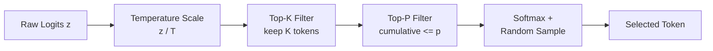

# Sampling Strategies

Sampling is the step where a probability distribution over the vocabulary
becomes a single discrete token.  The choice of sampling strategy has a
profound effect on the character of generated text -- from deterministic and
repetitive to creative and diverse.  This page derives each strategy
mathematically, analyses its properties, and maps it to ZigLlama's
implementation.

---

## 1. Greedy Decoding

!!! definition "Greedy Decoding"

    At each step, select the token with the highest probability:

    \[
        \hat{x}_t = \arg\max_{x \in V} \; p(x \mid x_{<t})
    \]

    Equivalently, since softmax is monotonic, this is the token with the
    largest logit: \( \hat{x}_t = \arg\max_{x} \; z_x \).

Greedy decoding is **deterministic** -- given the same prompt and model
weights, it always produces the same output.

```zig
fn sampleGreedy(self: *TextGenerator, logits: []f32) !TokenProb {
    _ = self;
    var max_logit: f32 = -math.inf(f32);
    var max_token: TokenId = 0;

    for (logits, 0..) |logit, i| {
        if (logit > max_logit) {
            max_logit = logit;
            max_token = @as(TokenId, @intCast(i));
        }
    }

    return TokenProb{
        .token_id = max_token,
        .probability = 1.0,
        .log_prob = max_logit,
    };
}
```

!!! complexity "Greedy Complexity"

    | Operation | Time |
    |---|---|
    | Find maximum logit | \( O(|V|) \) |
    | No sorting required | -- |

!!! warning "Greedy Degeneration"

    Greedy decoding maximises the probability of each *individual* token but
    does not maximise the probability of the *sequence*.  In practice it often
    produces repetitive loops ("The cat sat on the mat. The cat sat on the
    mat. ...") because once a high-probability pattern is entered, the model
    has no mechanism to escape it.

---

## 2. Temperature Scaling

!!! definition "Temperature-Scaled Softmax"

    Given logits \( \mathbf{z} \in \mathbb{R}^{|V|} \) and temperature
    \( T > 0 \), the temperature-scaled probability of token \( x \) is:

    \[
        p'(x) = \frac{\exp(z_x / T)}{\sum_{j \in V} \exp(z_j / T)}
    \]

Temperature controls the *entropy* of the distribution:

| Temperature | Effect | Distribution Shape |
|---|---|---|
| \( T \to 0 \) | Collapses to greedy (argmax) | Dirac delta at the mode |
| \( T = 1 \) | Unchanged model distribution | Original softmax |
| \( T > 1 \) | Flatter, more uniform | Higher entropy, more randomness |

### 2.1 Mathematical Analysis

The entropy of the temperature-scaled distribution is a monotonically
increasing function of \( T \):

\[
    H(T) = -\sum_{x \in V} p'_T(x) \log p'_T(x)
\]

As \( T \to 0 \), \( H \to 0 \) (all mass on one token).
As \( T \to \infty \), \( H \to \log |V| \) (uniform distribution).

```zig
fn sampleTemperature(self: *TextGenerator, logits: []f32, temperature: f32) !TokenProb {
    var token_probs = try self.allocator.alloc(TokenProb, logits.len);
    defer self.allocator.free(token_probs);

    for (logits, 0..) |logit, i| {
        const scaled_logit = if (temperature > 0.0) logit / temperature else logit;
        token_probs[i] = TokenProb.fromLogit(@as(TokenId, @intCast(i)), scaled_logit);
    }

    try self.applySoftmax(token_probs);
    return self.sampleFromDistribution(token_probs);
}
```

!!! tip "Temperature Selection Guide"

    - **\( T = 0.1\text{--}0.3 \)**: Near-deterministic; good for code
      generation, factual answers.
    - **\( T = 0.5\text{--}0.8 \)**: Balanced; suitable for general chat and
      question answering.
    - **\( T = 0.9\text{--}1.2 \)**: Creative; useful for story writing,
      brainstorming, poetry.

---

## 3. Top-K Sampling

!!! definition "Top-K Sampling"

    Sort the vocabulary by probability in descending order.  Keep only the
    \( K \) most probable tokens and renormalize:

    \[
        V_K = \{ x \in V : \text{rank}(p(x)) \le K \}
    \]

    \[
        p_K(x) = \begin{cases}
            \dfrac{p(x)}{\sum_{v \in V_K} p(v)} & \text{if } x \in V_K \\[6pt]
            0 & \text{otherwise}
        \end{cases}
    \]

Top-K was popularised by Fan et al. (2018)[^1] for neural text generation.
It prevents sampling from the long tail of improbable tokens.

```zig
fn sampleTopK(self: *TextGenerator, logits: []f32, k: u32) !TokenProb {
    if (k == 0 or k >= logits.len) {
        return self.sampleTemperature(logits, self.config.temperature);
    }

    var token_probs = try self.allocator.alloc(TokenProb, logits.len);
    defer self.allocator.free(token_probs);

    for (logits, 0..) |logit, i| {
        token_probs[i] = TokenProb.fromLogit(@as(TokenId, @intCast(i)), logit);
    }

    // Sort by logit descending
    std.mem.sort(TokenProb, token_probs, {}, struct {
        fn lessThan(context: void, a: TokenProb, b: TokenProb) bool {
            _ = context;
            return a.log_prob > b.log_prob;
        }
    }.lessThan);

    // Keep only top-k
    const top_k_slice = token_probs[0..k];
    try self.applySoftmax(top_k_slice);
    return self.sampleFromDistribution(top_k_slice);
}
```

!!! complexity "Top-K Complexity"

    | Operation | Time |
    |---|---|
    | Sort vocabulary | \( O(|V| \log |V|) \) |
    | Softmax on K tokens | \( O(K) \) |
    | Sample from distribution | \( O(K) \) |
    | **Total** | \( O(|V| \log |V|) \) |

### 3.1 Limitations

The fixed \( K \) is the main weakness: when the model is highly confident
(peaked distribution), \( K = 40 \) includes many irrelevant tokens;
when the distribution is flat, \( K = 40 \) may exclude viable options.
Top-P sampling addresses this limitation.

---

## 4. Top-P (Nucleus) Sampling

!!! definition "Nucleus Sampling"

    Sort the vocabulary by probability in descending order.  Include tokens
    until the cumulative probability first exceeds threshold \( p \):

    \[
        V_p = \min \left\{ V' \subseteq V : \sum_{x \in V'} p(x) \ge p \right\}
    \]

    where the minimum is taken over the size of \( V' \), and tokens are
    added in descending probability order.  Then renormalize over \( V_p \).

Nucleus sampling was introduced by Holtzman et al. (2020)[^2] and adapts the
candidate set size to the shape of the distribution:

- **Peaked distribution** (model is confident): few tokens suffice to reach
  \( p \), so the candidate set is small.
- **Flat distribution** (model is uncertain): many tokens are needed,
  allowing more diversity.

```zig
fn sampleTopP(self: *TextGenerator, logits: []f32, p: f32) !TokenProb {
    if (p >= 1.0) {
        return self.sampleTemperature(logits, self.config.temperature);
    }

    var token_probs = try self.allocator.alloc(TokenProb, logits.len);
    defer self.allocator.free(token_probs);

    for (logits, 0..) |logit, i| {
        token_probs[i] = TokenProb.fromLogit(@as(TokenId, @intCast(i)), logit);
    }

    // Sort descending and apply softmax
    std.mem.sort(TokenProb, token_probs, {}, /* descending by logit */);
    try self.applySoftmax(token_probs);

    // Find cumulative probability cutoff
    var cumulative_prob: f32 = 0.0;
    var cutoff: usize = 0;
    for (token_probs, 0..) |token_prob, i| {
        cumulative_prob += token_prob.probability;
        if (cumulative_prob >= p) {
            cutoff = i + 1;
            break;
        }
    }
    if (cutoff == 0) cutoff = 1;

    // Renormalize and sample
    const selected = token_probs[0..cutoff];
    // ... renormalize probabilities ...
    return self.sampleFromDistribution(selected);
}
```

!!! info "Why p = 0.9?"

    Holtzman et al. found that \( p = 0.9 \) consistently produces
    high-quality text across diverse domains.  This leaves roughly 10% of
    the probability mass in the tail, which typically corresponds to
    nonsensical or off-topic tokens.

---

## 5. Combined Sampling

ZigLlama's default strategy applies **Top-K, Top-P, and Temperature in
sequence**, following the convention established by llama.cpp and other
production inference engines:

!!! algorithm "Combined Sampling Pipeline"

    **Input:** logits \( \mathbf{z} \), parameters \( (T, K, p) \)

    1. **Temperature**: Scale logits \( z'_v = z_v / T \).
    2. **Top-K**: If \( K > 0 \) and \( K < |V| \), filter to the
       \( K \) largest scaled logits.
    3. **Top-P**: If \( p < 1.0 \), further filter by cumulative probability
       threshold.
    4. **Sample**: Draw from the renormalized distribution.



The order matters: temperature scaling first adjusts the distribution shape,
then top-K removes obviously irrelevant tokens, and finally top-P adapts the
remaining set to the local confidence level.

```zig
fn sampleCombined(self: *TextGenerator, logits: []f32) !TokenProb {
    // Step 1: Temperature scaling
    var scaled_logits = try self.allocator.alloc(f32, logits.len);
    defer self.allocator.free(scaled_logits);
    const temp = self.config.temperature;
    for (logits, 0..) |logit, i| {
        scaled_logits[i] = if (temp > 0.0) logit / temp else logit;
    }

    // Step 2: Top-K (if enabled)
    if (self.config.top_k > 0 and self.config.top_k < logits.len) {
        return self.sampleTopK(scaled_logits, self.config.top_k);
    }

    // Step 3: Top-P (if enabled)
    if (self.config.top_p < 1.0) {
        return self.sampleTopP(scaled_logits, self.config.top_p);
    }

    return self.sampleTemperature(logits, self.config.temperature);
}
```

---

## 6. Quality-Diversity Trade-off

All sampling strategies navigate a fundamental trade-off between
**quality** (coherence, factual accuracy) and **diversity** (creativity,
novelty).  The following table summarises where each strategy sits on this
spectrum:

| Strategy | Quality | Diversity | Adaptivity | Best Use Case |
|---|---|---|---|---|
| Greedy | Highest per-token | None | None | Evaluation, testing |
| Temperature (low) | High | Low | Manual | Factual Q&A |
| Temperature (high) | Lower | High | Manual | Creative writing |
| Top-K | Moderate | Fixed | None | General purpose |
| Top-P | Moderate--High | Adaptive | Distribution-aware | General purpose |
| Combined | Configurable | Configurable | Multi-level | Production systems |

```mermaid
quadrantChart
    title Quality-Diversity Trade-off
    x-axis Low Diversity --> High Diversity
    y-axis Low Quality --> High Quality
    quadrant-1 Ideal Zone
    quadrant-2 Conservative
    quadrant-3 Poor
    quadrant-4 Chaotic
    Greedy: [0.05, 0.7]
    Low Temperature: [0.2, 0.8]
    Top-K (K=40): [0.5, 0.65]
    Top-P (p=0.9): [0.55, 0.75]
    Combined: [0.6, 0.8]
    High Temperature: [0.85, 0.4]
```

---

## 7. SamplingStrategy Enum

In ZigLlama, the sampling strategy is represented as a compile-time-known
enum that dispatches to the appropriate implementation:

```zig
pub const SamplingStrategy = enum {
    Greedy,
    TopK,
    TopP,
    Temperature,
    Combined,

    pub fn name(self: SamplingStrategy) []const u8 {
        return switch (self) {
            .Greedy => "Greedy",
            .TopK => "Top-K",
            .TopP => "Top-P (Nucleus)",
            .Temperature => "Temperature",
            .Combined => "Combined",
        };
    }
};
```

!!! tip "Adding Custom Strategies"

    To add a new sampling strategy (e.g., Mirostat), add a variant to the
    enum, implement the sampling function as a method on `TextGenerator` or
    via `AdvancedSampler`, and add a case to the `sampleToken` switch.
    For advanced strategies that maintain state across tokens, see
    [Advanced Sampling Methods](advanced-sampling.md).

---

## 8. Softmax Implementation

All sampling strategies share a common softmax implementation that uses the
log-sum-exp trick for numerical stability:

!!! algorithm "Numerically Stable Softmax"

    **Input:** token-probability pairs with raw logits

    1. Find \( z_{\max} = \max_i z_i \).
    2. Compute \( e_i = \exp(z_i - z_{\max}) \) for each token.
    3. Sum: \( S = \sum_i e_i \).
    4. Normalize: \( p_i = e_i / S \).
    5. Update log-probabilities: \( \log p_i = \log(p_i) \).

```zig
fn applySoftmax(self: *TextGenerator, token_probs: []TokenProb) !void {
    _ = self;
    var max_logit: f32 = -math.inf(f32);
    for (token_probs) |tp| {
        max_logit = @max(max_logit, tp.log_prob);
    }

    var sum: f32 = 0.0;
    for (token_probs) |*tp| {
        const exp_logit = @exp(tp.log_prob - max_logit);
        tp.probability = exp_logit;
        sum += exp_logit;
    }

    for (token_probs) |*tp| {
        tp.probability /= sum;
        tp.log_prob = @log(tp.probability);
    }
}
```

!!! warning "Numerical Stability"

    Without subtracting \( z_{\max} \), `exp(z)` can overflow to infinity
    for large logits or underflow to zero for very negative logits.  The
    subtraction does not change the result (it cancels in the ratio) but
    keeps all intermediate values in a safe floating-point range.

---

## References

[^1]: Fan, A., Lewis, M. & Dauphin, Y. "Hierarchical Neural Story Generation." *ACL*, 2018.
[^2]: Holtzman, A. et al. "The Curious Case of Neural Text Degeneration." *ICLR*, 2020.
[^3]: Vaswani, A. et al. "Attention Is All You Need." *NeurIPS*, 2017.
[^4]: Keskar, N.S. et al. "CTRL: A Conditional Transformer Language Model for Controllable Generation." *arXiv:1909.05858*, 2019.
