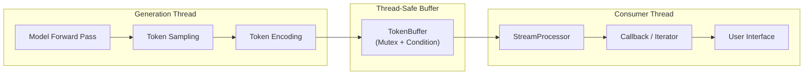
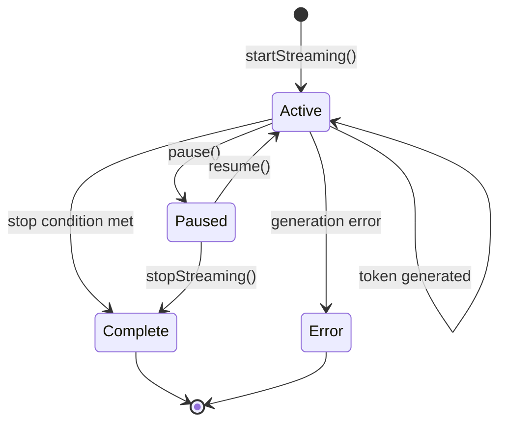

# Streaming Generation

In production applications, users expect to see text appear as it is
generated -- not after the entire response is complete.  Streaming generation
bridges the gap between the token-by-token internal generation loop and the
user-facing interface, delivering tokens in real time through a thread-safe
pipeline.

---

## 1. Architecture

The streaming pipeline has four stages: the model produces logits, the
generator selects tokens, a thread-safe buffer queues them, and a
processor delivers them to the user interface.



The key design constraint is that generation and consumption run on
**separate threads**.  The model forward pass is compute-intensive and
should not be blocked by UI rendering; conversely, the UI should not stall
waiting for the next forward pass.  The `TokenBuffer` decouples these
two rates using a mutex-protected queue with condition-variable signalling.

---

## 2. StreamingGenerator API

The `StreamingGenerator` wraps a `TextGenerator` and adds streaming
capabilities:

```zig
pub const StreamingGenerator = struct {
    generator: *TextGenerator,
    tokenizer: *SimpleTokenizer,
    config: StreamingConfig,
    allocator: Allocator,
    buffer: TokenBuffer,
    generation_thread: ?Thread,
    status: StreamStatus,
    is_streaming: bool,

    pub fn init(generator: *TextGenerator, tokenizer: *SimpleTokenizer,
                allocator: Allocator) !StreamingGenerator { ... }
    pub fn deinit(self: *StreamingGenerator) void { ... }
    pub fn setConfig(self: *StreamingGenerator, config: StreamingConfig) !void { ... }
    pub fn startStreaming(self: *StreamingGenerator, prompt: []const u8) !void { ... }
    pub fn stopStreaming(self: *StreamingGenerator) void { ... }
    pub fn nextChunk(self: *StreamingGenerator) ?TokenChunk { ... }
    pub fn streamWithCallback(self: *StreamingGenerator, prompt: []const u8,
                              callback: StreamCallback, error_callback: ?ErrorCallback,
                              user_data: ?*anyopaque) !void { ... }
    pub fn collectAll(self: *StreamingGenerator, prompt: []const u8) ![]TokenChunk { ... }
    pub fn getStatus(self: StreamingGenerator) StreamStatus { ... }
};
```

### 2.1 Callback-Based Streaming

The `streamWithCallback` method is the primary API for real-time delivery.
The caller provides a function pointer that is invoked for each token:

```zig
pub const StreamCallback = *const fn (
    chunk: TokenChunk,
    status: StreamStatus,
    user_data: ?*anyopaque,
) void;
```

Example usage:

```zig
fn onToken(chunk: TokenChunk, status: StreamStatus, _: ?*anyopaque) void {
    if (chunk.text) |text| {
        std.io.getStdOut().writer().writeAll(text) catch {};
    }
    // Check streaming throughput
    if (status.average_tps > 0) {
        std.debug.print("[{d:.1} t/s]\n", .{status.average_tps});
    }
}

try streaming_gen.streamWithCallback("Explain quantum computing", onToken, null, null);
```

### 2.2 Iterator-Based Streaming

For pull-based consumers, `StreamingIterator` provides a standard iterator
interface:

```zig
pub const StreamingIterator = struct {
    streaming_gen: *StreamingGenerator,
    finished: bool,

    pub fn next(self: *StreamingIterator) ?TokenChunk { ... }
};
```

### 2.3 Batch Collection

`collectAll` buffers all tokens and returns them as a slice -- useful for
testing and batch processing where streaming delivery is not needed:

```zig
const chunks = try streaming_gen.collectAll("Summarise this article");
defer allocator.free(chunks);
for (chunks) |chunk| {
    // Process each token
}
```

---

## 3. StreamStatus

`StreamStatus` tracks the state of an ongoing stream, updated after each
token is produced:

```zig
pub const StreamStatus = struct {
    tokens_generated: u32,
    current_tps: f32,      // Instantaneous tokens per second
    average_tps: f32,      // Average tokens per second
    start_time: i64,       // Stream start timestamp (ms)
    current_time: i64,     // Last update timestamp (ms)
    is_active: bool,       // Whether stream is still producing
    stop_reason: ?StopReason,
};
```

The status transitions through the following states:



!!! info "Throughput Metrics"

    `current_tps` measures the instantaneous rate between the last two
    tokens.  `average_tps` is the total tokens divided by total elapsed
    time.  The instantaneous metric is more useful for detecting
    performance regressions in real time; the average is more stable for
    benchmarking.

---

## 4. Thread Safety

The `TokenBuffer` is the critical synchronisation point between the
generation thread and the consumer thread.

```zig
const TokenBuffer = struct {
    chunks: ArrayList(TokenChunk),
    mutex: Mutex,
    condition: Condition,
    closed: bool,
    allocator: Allocator,

    pub fn push(self: *TokenBuffer, chunk: TokenChunk) !void { ... }
    pub fn pop(self: *TokenBuffer, timeout_ms: u32) ?TokenChunk { ... }
    pub fn close(self: *TokenBuffer) void { ... }
    pub fn isEmpty(self: *TokenBuffer) bool { ... }
    pub fn size(self: *TokenBuffer) usize { ... }
};
```

!!! algorithm "Producer-Consumer Protocol"

    **Producer (generation thread):**

    1. Acquire mutex.
    2. Append `TokenChunk` to the queue.
    3. Signal the condition variable.
    4. Release mutex.

    **Consumer (application thread):**

    1. Acquire mutex.
    2. **while** queue is empty **and** not closed:
        - Wait on condition variable with timeout.
    3. If queue is non-empty, remove and return the front element.
    4. Release mutex.

    **Shutdown:**

    1. Set `closed = true`.
    2. Broadcast condition variable (wakes all waiters).

!!! warning "Timeout Handling"

    The `pop` method accepts a `timeout_ms` parameter.  If no token arrives
    within the timeout, it returns `null` rather than blocking indefinitely.
    This prevents the consumer from hanging if generation stalls or errors
    out.  The default timeout is 5000 ms; adjust via `StreamingConfig`.

---

## 5. Chunk Management

### 5.1 TokenChunk

Each chunk carries a single token plus metadata:

```zig
pub const TokenChunk = struct {
    token_id: TokenId,
    text: ?[]const u8,           // Decoded text (may be null for special tokens)
    log_prob: f32,               // Log probability of this token
    cumulative_log_prob: f32,    // Running total log probability
    position: u32,               // Position in the output sequence
    timestamp: i64,              // When this token was generated (ms)
};
```

### 5.2 StreamingConfig

```zig
pub const StreamingConfig = struct {
    buffer_size: usize = 64,         // Maximum buffered chunks
    timeout_ms: u32 = 5000,          // Consumer timeout
    flush_on_newline: bool = true,    // Flush at line breaks
    flush_on_sentence_end: bool = true,
    min_chunk_size: usize = 1,       // Minimum tokens per delivery
    max_chunk_size: usize = 32,      // Force flush above this
    detailed_stats: bool = false,
};
```

### 5.3 Adaptive Chunk Sizing

When `min_chunk_size > 1`, the stream processor accumulates tokens before
delivering them to the callback.  This reduces per-token callback overhead
at the cost of slightly increased perceived latency.

| Chunk Size | Callback Overhead | Perceived Latency | Use Case |
|---|---|---|---|
| 1 | High | Lowest | Interactive chat |
| 4--8 | Moderate | Low | Web API responses |
| 16--32 | Low | Moderate | Batch post-processing |

---

## 6. Natural Break Detection

The streaming processor can insert brief pauses at natural language
boundaries to improve the reading experience:

```zig
if (self.config.flush_on_sentence_end and chunk.text != null) {
    const text = chunk.text.?;
    if (text.len > 0) {
        const last_char = text[text.len - 1];
        if (last_char == '.' or last_char == '!' or last_char == '?') {
            std.time.sleep(10_000_000); // 10ms pause at sentence end
        }
    }
}
```

Break detection heuristics:

| Pattern | Type | Pause |
|---|---|---|
| `.` `!` `?` | Sentence ending | 10 ms |
| `\n\n` | Paragraph break | 20 ms |
| `\n` (with `flush_on_newline`) | Line break | Immediate flush |
| Code fence boundary | Code block | Immediate flush |

!!! tip "Disabling Pauses"

    For maximum throughput (e.g., when the consumer is another program, not
    a human reader), set `flush_on_sentence_end = false` and
    `flush_on_newline = false`.

---

## 7. First-Token Latency vs Total Throughput

Streaming introduces a fundamental tension between two performance metrics:

!!! definition "Latency Metrics"

    - **First-token latency (TTFT)**: Time from prompt submission to the
      first generated token appearing.  Dominated by the *prompt processing*
      (prefill) phase.
    - **Total throughput**: Tokens generated per second over the entire
      response.  Dominated by the *per-token generation* (decode) phase.

```mermaid
gantt
    title Streaming Generation Timeline
    dateFormat X
    axisFormat %s

    section Prefill
    Process Prompt :0, 500

    section Decode
    Token 1 :500, 550
    Token 2 :550, 600
    Token 3 :600, 650
    Token N :650, 700

    section User Perception
    Waiting (TTFT) :crit, 0, 500
    Reading tokens :active, 500, 700
```



| Metric | Optimisation Strategy |
|---|---|
| **Reduce TTFT** | Prompt caching, speculative decoding, smaller prefill batch |
| **Increase throughput** | KV caching, quantisation, batching, SIMD kernels |
| **Both** | Model parallelism, continuous batching |

!!! info "TTFT in Practice"

    For a 7B model on CPU, typical TTFT ranges from 200 ms (short prompt,
    cached) to several seconds (long prompt, cold start).  Users generally
    perceive responses as "instant" when TTFT is below 500 ms.

---

## 8. Error Handling

The `ErrorCallback` type allows the consumer to react to generation failures
without terminating the stream:

```zig
pub const ErrorCallback = *const fn (err: anyerror, user_data: ?*anyopaque) void;
```

Common error scenarios:

| Error | Cause | Recovery |
|---|---|---|
| `StreamTimeout` | No token within timeout period | Retry or abort |
| `BufferClosed` | Generation completed or stopped | Read remaining tokens |
| `AlreadyStreaming` | Called `startStreaming` twice | Stop first, then restart |
| `OutOfMemory` | Token buffer allocation failed | Reduce buffer size or free memory |

---

## References

[^1]: Gerganov, G. "llama.cpp -- Inference of LLaMA model in C/C++." GitHub, 2023.
[^2]: Kwon, W. et al. "Efficient Memory Management for Large Language Model Serving with PagedAttention." *SOSP*, 2023.
[^3]: Yu, G. et al. "Orca: A Distributed Serving System for Transformer-Based Language Generation." *OSDI*, 2022.
