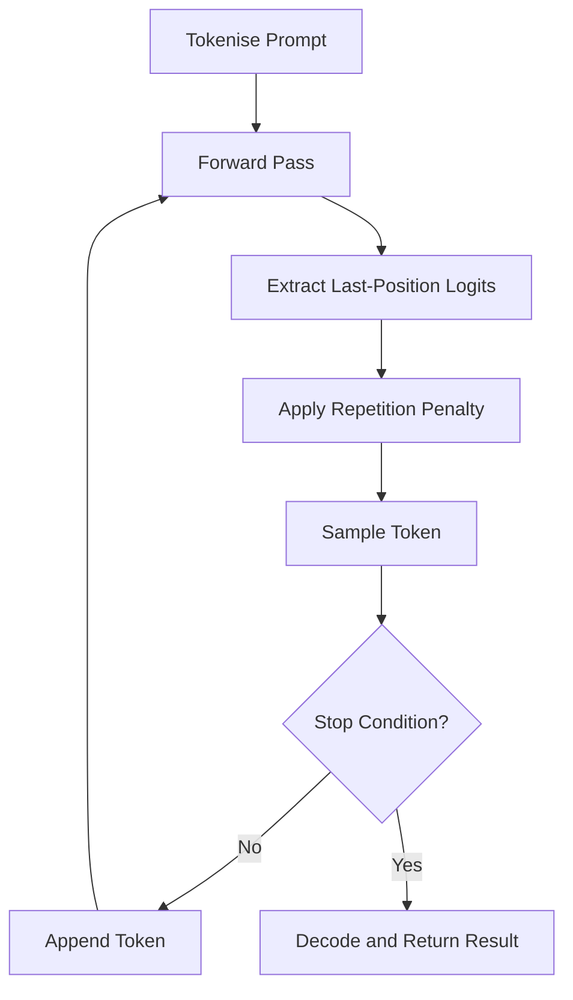

# Text Generation

Text generation is where language models produce output.  This page covers the
mathematical foundation of autoregressive decoding, the `TextGenerator` struct
that orchestrates the generation loop, and the configuration parameters that
control output quality and style.

---

## 1. Autoregressive Decoding

!!! definition "Autoregressive Factorisation"

    A language model defines a joint distribution over a token sequence
    \( (x_1, x_2, \ldots, x_T) \) by factoring it into a product of
    conditional distributions:

    \[
        p(x_1, x_2, \ldots, x_T) = \prod_{t=1}^{T} p(x_t \mid x_{<t})
    \]

    where \( x_{<t} = (x_1, \ldots, x_{t-1}) \) denotes all tokens preceding
    position \( t \).

At each step the model takes the entire sequence generated so far, performs a
forward pass through the transformer stack, and produces a logit vector
\( \mathbf{z} \in \mathbb{R}^{|V|} \) over the vocabulary \( V \).  The
logits are converted to probabilities via softmax:

\[
    p(x_t = v \mid x_{<t}) = \frac{\exp(z_v)}{\sum_{j \in V} \exp(z_j)}
\]

A sampling strategy then selects one token from this distribution, the token
is appended to the sequence, and the process repeats.

---

## 2. TextGenerator Struct

The `TextGenerator` is the top-level entry point for text generation in
ZigLlama.  It holds references to the model and tokenizer, owns a random
number generator, and stores the current generation configuration.

```zig
pub const TextGenerator = struct {
    /// Model for inference
    model: *LLaMAModel,
    /// Tokenizer for text conversion
    tokenizer: *SimpleTokenizer,
    /// Memory allocator
    allocator: Allocator,
    /// Random number generator
    rng: Random,
    /// Current generation configuration
    config: GenerationConfig,

    pub fn init(
        model: *LLaMAModel,
        tokenizer: *SimpleTokenizer,
        allocator: Allocator,
        seed: ?u64,
    ) TextGenerator { ... }

    pub fn setConfig(self: *TextGenerator, config: GenerationConfig) !void { ... }

    pub fn generate(self: *TextGenerator, prompt: []const u8) !GenerationResult { ... }
};
```

!!! tip "Deterministic Reproduction"

    Pass a fixed `seed` to `init` to get reproducible output across runs.
    When `seed` is `null`, the generator uses the system clock, giving
    different results each time.

### 2.1 Initialization

`init` creates a PRNG from the provided seed (or the current timestamp),
sets the default configuration to `GenerationConfig.balanced()`, and stores
the model and tokenizer references.  The generator does **not** own these
resources -- the caller is responsible for their lifetime.

### 2.2 Configuration Update

`setConfig` validates the new configuration (see Section 3) and, if a new
seed is provided, reinitialises the PRNG.  This allows mid-session
reconfiguration without constructing a new generator.

---

## 3. GenerationConfig

`GenerationConfig` bundles every parameter that controls the generation
process.

```zig
pub const GenerationConfig = struct {
    strategy: SamplingStrategy = .Combined,
    temperature: f32 = 0.7,
    top_k: u32 = 40,
    top_p: f32 = 0.9,
    max_tokens: u32 = 512,
    min_tokens: u32 = 1,
    stop_tokens: []const TokenId = &[_]TokenId{SpecialTokens.EOS},
    stop_strings: []const []const u8 = &[_][]const u8{},
    repetition_penalty: f32 = 1.1,
    length_penalty: f32 = 1.0,
    seed: ?u64 = null,
};
```

| Parameter | Type | Default | Description |
|---|---|---|---|
| `strategy` | `SamplingStrategy` | `.Combined` | Which sampling algorithm to use |
| `temperature` | `f32` | 0.7 | Softmax temperature \( T \) |
| `top_k` | `u32` | 40 | Number of highest-probability tokens to keep |
| `top_p` | `f32` | 0.9 | Cumulative probability threshold for nucleus sampling |
| `max_tokens` | `u32` | 512 | Hard upper limit on generated tokens |
| `min_tokens` | `u32` | 1 | Minimum tokens before stop conditions are checked |
| `stop_tokens` | `[]const TokenId` | `{EOS}` | Token IDs that trigger generation stop |
| `stop_strings` | `[]const []const u8` | `{}` | String patterns that trigger stop |
| `repetition_penalty` | `f32` | 1.1 | Multiplicative penalty for repeated tokens |
| `length_penalty` | `f32` | 1.0 | Penalty applied to longer sequences |
| `seed` | `?u64` | `null` | Optional RNG seed for reproducibility |

### 3.1 Validation

`validate()` enforces the following invariants:

- \( T \ge 0 \) (temperature must be non-negative)
- \( 0 \le p \le 1 \) (top-p must be a valid probability)
- `max_tokens > 0`
- `min_tokens <= max_tokens`
- `repetition_penalty >= 0`

Violations return typed errors (`InvalidTemperature`, `InvalidTopP`, etc.)
rather than panicking, enabling graceful error handling in server contexts.

---

## 4. Presets

ZigLlama ships four configuration presets that cover common use cases.

| Preset | Temperature | Top-K | Top-P | Rep. Penalty | Strategy | Use Case |
|---|---|---|---|---|---|---|
| `creative()` | 0.9 | 50 | 0.95 | 1.05 | Combined | Story writing, brainstorming |
| `balanced()` | 0.7 | 40 | 0.9 | 1.1 | Combined | General-purpose chat |
| `focused()` | 0.3 | 20 | 0.8 | 1.15 | Combined | Factual Q&A, summarisation |
| `deterministic()` | 0.0 | 1 | 1.0 | 1.0 | Greedy | Testing, exact reproduction |

!!! warning "Greedy is Not Always Best"

    The `deterministic` preset uses greedy decoding (\( T = 0 \)).  While
    this maximises the probability of each individual token, it often
    produces repetitive or degenerate text for open-ended generation.  Use
    it primarily for evaluation and regression testing.

```zig
// Example: switch to creative mode
try generator.setConfig(GenerationConfig.creative());
const result = try generator.generate("Once upon a time");
```

---

## 5. Generation Loop

!!! algorithm "Autoregressive Generation Loop"

    **Input:** prompt string, `GenerationConfig`

    **Output:** `GenerationResult`

    1. Tokenise the prompt into token IDs \( (x_1, \ldots, x_n) \).
    2. Initialise `generated_tokens` with prompt tokens.
    3. Set `num_generated` \( \leftarrow 0 \).
    4. **while** `num_generated < max_tokens` **do**
        1. Run the model forward pass on `generated_tokens`.
        2. Extract the logit vector \( \mathbf{z} \in \mathbb{R}^{|V|} \)
           for the last position.
        3. Copy logits and apply repetition penalty (Section 6).
        4. Sample next token \( x_{n+1} \) using the configured strategy.
        5. **if** \( x_{n+1} \) triggers a stop condition **then break**.
        6. Append \( x_{n+1} \) to `generated_tokens`.
        7. Record \( \log p(x_{n+1}) \).
        8. Increment `num_generated`.
    5. Decode `generated_tokens` back to text.
    6. Compute `GenerationStats` from elapsed time and token count.
    7. **return** `GenerationResult`.



!!! complexity "Per-Step Complexity"

    Each iteration of the inner loop performs one full model forward pass.
    Without KV caching, the cost is
    \( O(n \cdot L \cdot d_{\text{model}}^{\,2}) \)
    where \( n \) is the current sequence length.  With KV caching
    (see [KV Cache](kv-cache.md)), this drops to
    \( O(L \cdot d_{\text{model}}^{\,2}) \) per token.

---

## 6. Repetition Penalty

Repetition penalty discourages the model from producing the same tokens
repeatedly.  ZigLlama implements the method from Keskar et al. (2019)[^1]:

!!! definition "Repetition Penalty"

    For each token \( v \) that appears in the recent history window
    (last 64 tokens by default), the logit is modified as:

    \[
        z'_v = \begin{cases}
            z_v \;/\; \rho & \text{if } z_v > 0 \\
            z_v \times \rho & \text{if } z_v \le 0
        \end{cases}
    \]

    where \( \rho \ge 1 \) is the repetition penalty factor.

The asymmetric treatment ensures that positive logits are *reduced* (making
the token less likely) while negative logits are pushed *further negative*
(also making the token less likely).  Setting \( \rho = 1.0 \) disables the
penalty entirely.

```zig
fn applyRepetitionPenalty(self: *TextGenerator, logits: []f32, tokens: []const TokenId) !void {
    if (self.config.repetition_penalty == 1.0) return;

    const history_window = @min(tokens.len, 64);
    const recent_tokens = if (tokens.len > history_window)
        tokens[tokens.len - history_window ..]
    else
        tokens;

    for (recent_tokens) |token| {
        if (token < logits.len) {
            if (logits[token] > 0) {
                logits[token] /= self.config.repetition_penalty;
            } else {
                logits[token] *= self.config.repetition_penalty;
            }
        }
    }
}
```

!!! tip "Choosing the Penalty Factor"

    - \( \rho = 1.0 \): No penalty (good for short, factual answers).
    - \( \rho = 1.05\text{--}1.15 \): Light penalty (recommended for most tasks).
    - \( \rho > 1.3 \): Aggressive penalty (may cause incoherent output as
      the model is forced away from natural continuations).

---

## 7. GenerationResult

The `generate` method returns a `GenerationResult` struct that bundles
the output with metadata for logging, evaluation, and downstream processing.

```zig
pub const GenerationResult = struct {
    tokens: []TokenId,        // Generated token IDs
    text: ?[]u8,              // Decoded text (if tokenizer available)
    log_probs: []f32,         // Per-token log probabilities
    total_log_prob: f32,      // Sum of log probabilities
    num_tokens: u32,          // Count of generated tokens
    stop_reason: StopReason,  // Why generation stopped
    stats: GenerationStats,   // Performance statistics
};
```

### 7.1 Stop Reasons

| `StopReason` | Description |
|---|---|
| `MaxTokens` | Reached the `max_tokens` limit |
| `StopToken` | Encountered a token in `stop_tokens` |
| `StopString` | Detected a string in `stop_strings` |
| `EndOfSequence` | Model produced the EOS token |
| `Error` | An error occurred during generation |

### 7.2 Generation Statistics

`GenerationStats` captures timing and throughput data computed at the end
of generation.

```zig
pub const GenerationStats = struct {
    generation_time_ms: f64,     // Wall-clock time
    tokens_per_second: f32,      // Throughput
    time_per_token_ms: f32,      // Average latency per token
    peak_memory_bytes: usize,    // Peak memory during generation
    num_forward_passes: u32,     // Number of model evaluations
};
```

!!! info "Tokens Per Second"

    The `tokens_per_second` metric is the primary throughput indicator.
    Typical values for a 7B parameter model on CPU:

    - Without KV cache: 0.5--2 tokens/s
    - With KV cache: 5--20 tokens/s
    - With KV cache + Q4 quantisation: 15--50 tokens/s

---

## 8. Sampling Dispatch

The `TextGenerator` delegates token selection to the configured sampling
strategy through a switch dispatch:

```zig
fn sampleToken(self: *TextGenerator, logits: []f32) !TokenProb {
    return switch (self.config.strategy) {
        .Greedy => try self.sampleGreedy(logits),
        .TopK => try self.sampleTopK(logits, self.config.top_k),
        .TopP => try self.sampleTopP(logits, self.config.top_p),
        .Temperature => try self.sampleTemperature(logits, self.config.temperature),
        .Combined => try self.sampleCombined(logits),
    };
}
```

Each sampling method is covered in detail in [Sampling Strategies](sampling-strategies.md)
and [Advanced Sampling](advanced-sampling.md).

---

## 9. End-to-End Example

```zig
const std = @import("std");
const generation = @import("inference/generation.zig");

pub fn main() !void {
    var gpa = std.heap.GeneralPurposeAllocator(.{}){};
    defer _ = gpa.deinit();
    const allocator = gpa.allocator();

    // Assume model and tokenizer are loaded (see Layer 5)
    var model = try loadModel(allocator, "model.gguf");
    defer model.deinit();
    var tokenizer = try loadTokenizer(allocator, "tokenizer.model");
    defer tokenizer.deinit();

    // Create generator with reproducible seed
    var gen = generation.TextGenerator.init(&model, &tokenizer, allocator, 42);

    // Use creative preset
    try gen.setConfig(generation.GenerationConfig.creative());

    // Generate text
    const result = try gen.generate("The theory of relativity states that");
    defer result.deinit(allocator);

    // Print output
    if (result.text) |text| {
        std.debug.print("Generated: {s}\n", .{text});
    }
    std.debug.print("Tokens: {d}, Speed: {d:.1} t/s, Stop: {s}\n", .{
        result.num_tokens,
        result.stats.tokens_per_second,
        result.stop_reason.description(),
    });
}
```

---

## References

[^1]: Keskar, N.S. et al. "CTRL: A Conditional Transformer Language Model for Controllable Generation." *arXiv:1909.05858*, 2019.
[^2]: Vaswani, A. et al. "Attention Is All You Need." *NeurIPS*, 2017.
[^3]: Touvron, H. et al. "LLaMA: Open and Efficient Foundation Language Models." *arXiv:2302.13971*, 2023.
[^4]: Gerganov, G. "llama.cpp -- Inference of LLaMA model in C/C++." GitHub, 2023.
