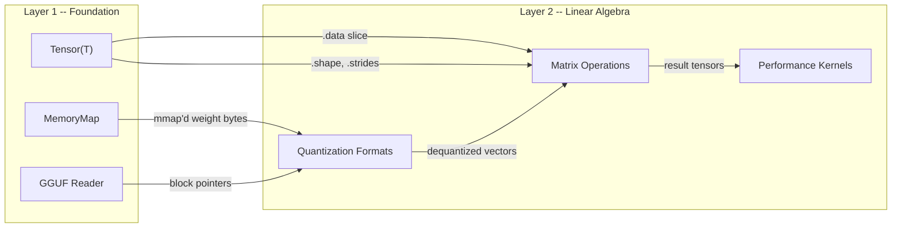
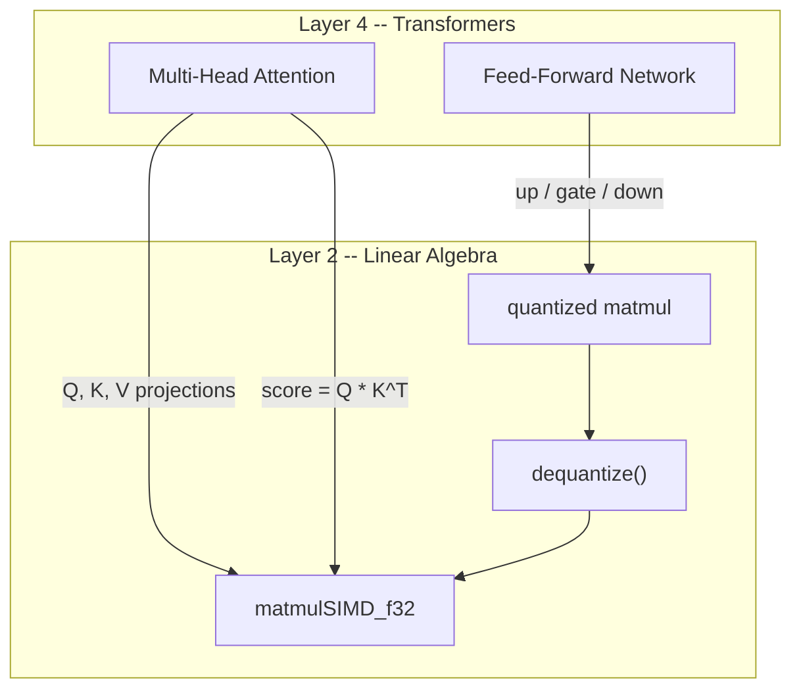
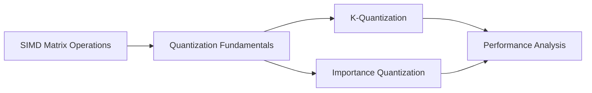

# Layer 2: Linear Algebra

Layer 2 sits directly above the [Foundation layer](../foundations/index.md) and
provides the computational kernels that every neural-network operation ultimately
calls.  Where Layer 1 defines *what* a tensor is (shape, strides, memory
layout), Layer 2 defines *what you can do with tensors efficiently* -- matrix
multiplication, dot products, and the quantized arithmetic that makes
multi-billion-parameter models fit in commodity RAM.

---

## Learning Objectives

After completing this layer you will be able to:

1. **Explain** how SIMD (Single Instruction, Multiple Data) instruction sets
   accelerate matrix arithmetic and **identify** the relevant instruction
   families (SSE, AVX, AVX2, NEON) at compile time in Zig.
2. **Implement** vectorised dot products and matrix multiplications using Zig's
   `@Vector` built-in, including cache-blocked variants for large matrices.
3. **Derive** the mathematics of uniform quantization -- symmetric, asymmetric,
   and block-wise -- and **compute** storage requirements and compression ratios
   for each format.
4. **Describe** the Q8_0, Q4_0, and INT8 quantization formats at the byte level,
   including their dequantization formulas.
5. **Distinguish** K-quantization (two-level scales with sub-block granularity)
   from basic quantization and **explain** the BlockQ4K, BlockQ5K, and BlockQ6K
   structures.
6. **Explain** importance quantization (IQ) -- how saliency-weighted bit
   allocation and non-linear lookup tables push compression below 2 bits per
   weight.
7. **Analyse** performance using roofline models, SIMD speedup curves, and
   memory-bandwidth bottleneck identification.

---

## Components

| Page | Focus | Key Concepts |
|------|-------|--------------|
| [SIMD Matrix Operations](matrix-operations.md) | Vectorised arithmetic kernels | `@Vector`, `@splat`, FMA, cache blocking, tiling |
| [Quantization Fundamentals](quantization-basics.md) | Core quantization theory | Symmetric / asymmetric, Q8_0, Q4_0, INT8, block-wise scales |
| [K-Quantization](k-quantization.md) | Two-level quantization with sub-block scales | BlockQ4K, BlockQ5K, BlockQ6K, QK_K = 256 |
| [Importance Quantization](iq-quantization.md) | Saliency-weighted extreme compression | IQ1_S through IQ4_NL, importance bitmaps, non-linear LUTs |
| [Performance Analysis](performance-analysis.md) | Benchmarks and optimization | Roofline model, SIMD speedups, bandwidth analysis |

---

## Connection to Layer 1: Foundation

Layer 2 consumes `Tensor(T)` values produced by Layer 1.  Every kernel in this
layer operates on raw element slices obtained via `tensor.data` -- the shape and
stride metadata are used only to compute offsets.  The key contracts are:

!!! notation "Dependency rule"

    Layer 2 may `@import` any Layer 1 module but **never** imports from
    Layers 3--6.  This invariant is enforced by the build system and verified by
    the import-graph test.

### What Layer 1 provides

| Layer 1 Module | What Layer 2 Uses |
|---|---|
| `tensor.Tensor(T)` | Element storage, shape metadata, strided access |
| `memory_map.MemoryMap` | Zero-copy access to weight files on disk |
| `gguf.GGUFReader` | Block-level pointers into quantized weight data |
| `threading.ThreadPool` | Parallel dispatch of blocked matrix multiplications |

---

## Connection to Layer 4: Transformers

Transformers are the primary *consumer* of Layer 2 kernels.  Every forward pass
through a transformer block issues dozens of matrix multiplications, each of
which bottlenecks on the routines documented here.

!!! complexity "Dominant matrix multiplications in a transformer forward pass"

    For a model with hidden dimension \( d \), sequence length \( n \), and
    feed-forward expansion factor 4:

    | Operation | Shape | FLOPs per token |
    |-----------|-------|-----------------|
    | QKV projection | \( (n, d) \times (d, 3d) \) | \( \mathcal{O}(n \cdot d^2) \) |
    | Attention scores | \( (n, d_k) \times (d_k, n) \) | \( \mathcal{O}(n^2 \cdot d_k) \) |
    | Attention output projection | \( (n, d) \times (d, d) \) | \( \mathcal{O}(n \cdot d^2) \) |
    | FFN up-projection | \( (n, d) \times (d, 4d) \) | \( \mathcal{O}(n \cdot d^2) \) |
    | FFN down-projection | \( (n, 4d) \times (4d, d) \) | \( \mathcal{O}(n \cdot d^2) \) |

    At inference time the QKV and FFN projections dominate because \( d \gg n \)
    for single-token generation (the KV cache eliminates repeated attention
    computation).  This is why SIMD matrix kernels and quantized matmul are the
    single most impactful optimizations in the entire stack.

---

## Quantization Format Landscape

The following table summarises every quantization format implemented in
Layer 2, ordered by bits per weight.  Detailed coverage is split across three
dedicated pages.

| Format | Bits per Weight | Page | Family |
|--------|:-:|------|--------|
| IQ1_S | 1.5 | [Importance Quantization](iq-quantization.md) | IQ |
| IQ1_M | 1.75 | [Importance Quantization](iq-quantization.md) | IQ |
| IQ2_XXS | 2.06 | [Importance Quantization](iq-quantization.md) | IQ |
| IQ2_XS | 2.31 | [Importance Quantization](iq-quantization.md) | IQ |
| IQ2_S | 2.5 | [Importance Quantization](iq-quantization.md) | IQ |
| IQ2_M | 2.7 | [Importance Quantization](iq-quantization.md) | IQ |
| IQ3_XXS | 3.06 | [Importance Quantization](iq-quantization.md) | IQ |
| IQ3_XS | 3.3 | [Importance Quantization](iq-quantization.md) | IQ |
| IQ3_S | 3.44 | [Importance Quantization](iq-quantization.md) | IQ |
| Q4_0 | 4.5 | [Quantization Fundamentals](quantization-basics.md) | Basic |
| IQ4_XS | 4.25 | [Importance Quantization](iq-quantization.md) | IQ |
| Q4_K | 4.5 | [K-Quantization](k-quantization.md) | K |
| IQ4_NL | 4.5 | [Importance Quantization](iq-quantization.md) | IQ |
| Q5_K | 5.5 | [K-Quantization](k-quantization.md) | K |
| Q6_K | 6.5 | [K-Quantization](k-quantization.md) | K |
| Q8_0 | 9.0 | [Quantization Fundamentals](quantization-basics.md) | Basic |
| F16 | 16.0 | [Quantization Fundamentals](quantization-basics.md) | Unquantized |
| F32 | 32.0 | [Quantization Fundamentals](quantization-basics.md) | Unquantized |

---

## Recommended Reading Order

1. Start with **SIMD Matrix Operations** to understand the baseline compute
   kernels.
2. Move to **Quantization Fundamentals** for the mathematical framework.
3. Branch into **K-Quantization** or **Importance Quantization** based on your
   interest (K-quant is more widely deployed; IQ-quant pushes compression
   further).
4. Finish with **Performance Analysis** to tie everything together with
   empirical data.

---

## Prerequisites

!!! definition "Assumed knowledge"

    - Basic linear algebra: matrix multiplication, dot products, transpose.
    - Binary representations: IEEE 754 floating-point, two's complement integers.
    - Familiarity with Zig syntax (see [Getting Started](../getting-started/index.md)).
    - Completion of [Layer 1: Foundation](../foundations/index.md) is recommended
      but not strictly required.

---

## Key References

The material in this layer draws on the following sources:

1. Dettmers, T. et al. "LLM.int8(): 8-bit Matrix Multiplication for Transformers at Scale." *NeurIPS*, 2022.[^1]
2. Frantar, E. et al. "GPTQ: Accurate Post-Training Quantization for Generative Pre-trained Transformers." *ICLR*, 2023.[^2]
3. Gerganov, G. et al. "llama.cpp -- Inference of LLaMA model in pure C/C++." GitHub, 2023.[^3]
4. Intel Corporation. "Intel 64 and IA-32 Architectures Optimization Reference Manual." 2024.[^4]

[^1]: https://arxiv.org/abs/2208.07339
[^2]: https://arxiv.org/abs/2210.17323
[^3]: https://github.com/ggerganov/llama.cpp
[^4]: https://www.intel.com/content/www/us/en/developer/articles/technical/intel-sdm.html
