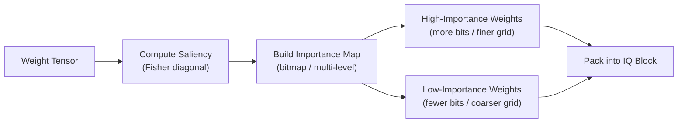
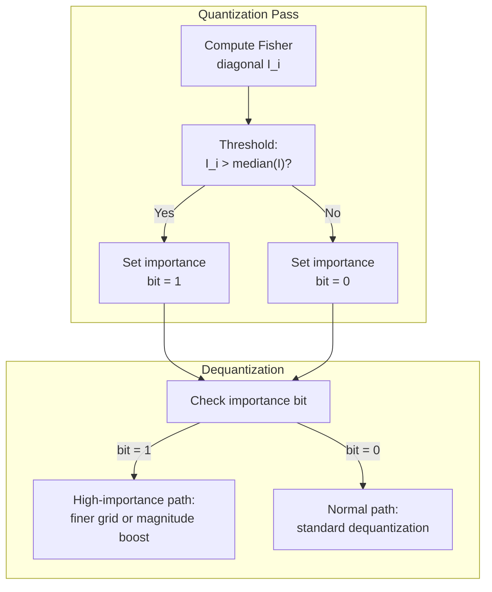
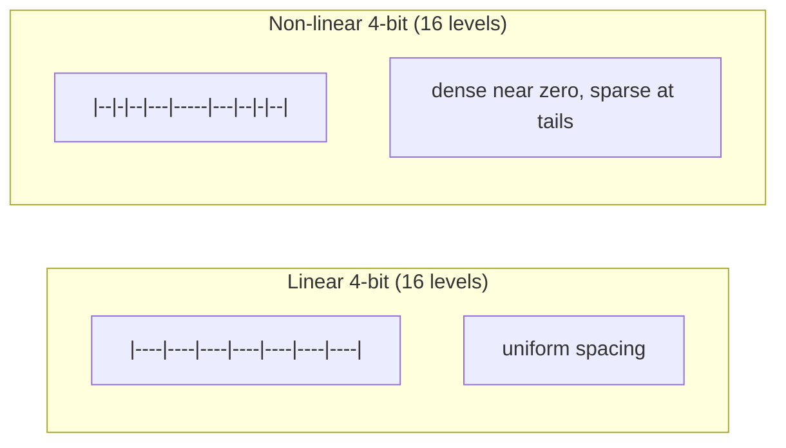
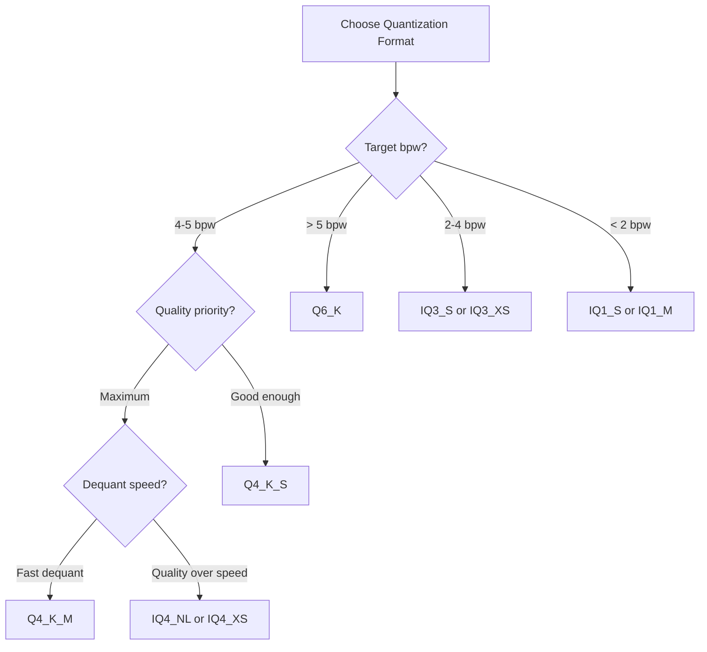

# Importance Quantization

Importance quantization (IQ) is a family of formats that extend the idea of
non-uniform bit allocation: instead of treating every weight equally, IQ formats
use **importance maps** to steer precision toward weights that most affect model
output.  Combined with non-linear quantization levels and codebook-based
encoding, IQ formats achieve viable model quality at compressions that were
previously considered destructive.

---

## 1. Theory: Importance-Weighted Quantization

### Saliency and Bit Allocation

!!! definition "Weight importance (saliency)"

    The **importance** of weight \( w_i \) measures how much the model's loss
    changes when \( w_i \) is perturbed.  A common proxy is the diagonal of
    the Fisher information matrix:

    \[
      I_i = \mathbb{E}\!\left[\left(\frac{\partial \mathcal{L}}{\partial w_i}\right)^{\!2}\right]
    \]

    Weights with high \( I_i \) are "important" -- quantization error in these
    weights causes disproportionate output degradation.

### Optimal Bit Allocation

!!! theorem "Rate-distortion optimal allocation"

    Given a total bit budget \( B \) across \( n \) weights, the
    distortion-minimizing allocation assigns bits proportional to the log of
    importance:

    \[
      b_i^* = \bar{b} + \frac{1}{2} \log_2 \frac{I_i}{\left(\prod_{j=1}^n I_j\right)^{1/n}}
    \]

    where \( \bar{b} = B/n \) is the average bit rate.  High-importance weights
    receive more bits; low-importance weights receive fewer.

In practice, IQ formats approximate this optimal allocation using discrete
importance levels (bitmaps) rather than per-weight bit rates.



---

## 2. IQ Format Family

ZigLlama implements the full IQ format family from llama.cpp, spanning
1.5 to 4.5 bits per weight:

| Format | bpw | Block Size | Key Feature |
|--------|:-:|:-:|---|
| IQ1_S | 1.56 | 256 | Extreme compression with importance bitmaps |
| IQ1_M | 1.75 | 256 | Medium variant with additional scale bits |
| IQ2_XXS | 2.06 | 256 | Ultra-small 2-bit with grid quantization |
| IQ2_XS | 2.31 | 256 | Extra-small 2-bit |
| IQ2_S | 2.50 | 256 | Standard 2-bit with importance |
| IQ2_M | 2.70 | 256 | Medium 2-bit |
| IQ3_XXS | 3.06 | 256 | Ultra-small 3-bit |
| IQ3_XS | 3.30 | 256 | Extra-small 3-bit |
| IQ3_S | 3.44 | 256 | Standard 3-bit |
| IQ4_XS | 4.25 | 256 | Extra-small 4-bit with importance |
| IQ4_NL | 4.50 | 256 | Non-linear quantization with lookup table |

!!! notation "Naming convention"

    The naming follows a pattern: `IQ{bits}_{size}` where `bits` is the
    approximate integer precision and `size` indicates the overhead level:
    `S` (standard), `XS` (extra-small), `XXS` (ultra-small), `M` (medium),
    `NL` (non-linear).

---

## 3. Block Structures

### BlockIQ1S -- Extreme 1-bit Compression

!!! definition "IQ1_S block format"

    IQ1_S represents 256 values using importance bitmaps that classify each
    value as either +1 or -1 (after scaling), with high-importance values
    receiving separate treatment.

| Field | Type | Size (bytes) | Description |
|-------|------|:-:|-------------|
| `d` | `f16` | 2 | Super-block scale |
| `qs` | `[32]u8` | 32 | Packed sign bits (1 bit per value) |
| `qh` | `[8]u16` | 16 | Importance bitmaps (high-importance indicators) |
| **Total** | | **50** | **Per 256 values** |

```zig
pub const BlockIQ1S = extern struct {
    d: f16,
    qs: [32]u8,       // sign bits: 0 = +scale, 1 = -scale
    qh: [8]u16,       // importance bitmaps for 8 sub-blocks

    pub fn dequantize(self: BlockIQ1S, output: *[QK_K]f32) void {
        const scale: f32 = @floatCast(self.d);

        for (0..QK_K) |i| {
            // Extract sign bit
            const sign: u1 = @truncate(self.qs[i / 8] >> @truncate(i % 8));
            const base_val: f32 = if (sign == 0) scale else -scale;

            // Check importance bitmap for this sub-block
            const sub_block = i / 32;
            const sub_idx: u4 = @truncate(i % 32);
            const important: bool = (self.qh[sub_block] >> sub_idx) & 1 == 1;

            // Important values get a scaled magnitude boost
            output[i] = if (important) base_val * 1.5 else base_val;
        }
    }
};
```

!!! complexity "IQ1_S bits per weight"

    \[
      \text{bpw} = \frac{50 \times 8}{256} = 1.5625 \approx 1.56
    \]

    This is approximately **20x compression** versus F32.

### BlockIQ2XS -- 2-bit with Importance

| Field | Type | Size (bytes) | Description |
|-------|------|:-:|-------------|
| `d` | `f16` | 2 | Super-block scale |
| `qs` | `[64]u8` | 64 | Packed 2-bit values (4 per byte) |
| `scales` | `[8]u8` | 8 | Sub-block scales with importance flags |
| **Total** | | **74** | **Per 256 values** |

```zig
pub const BlockIQ2XS = extern struct {
    d: f16,
    qs: [64]u8,        // packed 2-bit quantized values
    scales: [8]u8,      // sub-block scales + importance bits

    pub fn dequantize(self: BlockIQ2XS, output: *[QK_K]f32) void {
        const d_val: f32 = @floatCast(self.d);

        for (0..8) |j| {
            const sc_raw = self.scales[j];
            const sc: f32 = @floatFromInt(sc_raw & 0x0F);
            const importance_shift: u1 = @truncate(sc_raw >> 4);

            for (0..32) |k| {
                const idx = j * 32 + k;
                const byte_idx = idx / 4;
                const shift: u3 = @truncate((idx % 4) * 2);
                const q2: i32 = @as(i32, (self.qs[byte_idx] >> shift) & 0x03) - 1;

                const imp_factor: f32 = if (importance_shift == 1 and
                    q2 != 0) 1.25 else 1.0;
                output[idx] = d_val * sc * @as(f32, @floatFromInt(q2)) * imp_factor;
            }
        }
    }
};
```

### BlockIQ3S -- 3-bit with Importance

| Field | Type | Size (bytes) | Description |
|-------|------|:-:|-------------|
| `d` | `f16` | 2 | Super-block scale |
| `qs` | `[96]u8` | 96 | Packed 3-bit values |
| `qh` | `[16]u8` | 16 | High bits for 3-bit reconstruction |
| `signs` | `[16]u8` | 16 | Sign bits for importance-weighted values |
| `scales` | `[8]u8` | 8 | Sub-block scales |
| **Total** | | **138** | **Per 256 values** |

### BlockIQ4XS -- 4-bit Extra-Small

| Field | Type | Size (bytes) | Description |
|-------|------|:-:|-------------|
| `d` | `f16` | 2 | Super-block scale |
| `scales_h` | `[2]u8` | 2 | High bits of sub-block scales |
| `scales_l` | `[8]u8` | 8 | Low bits of sub-block scales |
| `qs` | `[128]u8` | 128 | Packed 4-bit quantized values |
| **Total** | | **140** | **Per 256 values** |

Bits per weight: \( 140 \times 8 / 256 = 4.375 \approx 4.25 \) (with alignment).

---

## 4. Importance Maps

### How Importance Bitmaps Work

Importance maps are bit arrays where each bit indicates whether the
corresponding weight is "important" (high saliency) or "normal."  The quantizer
computes importance during the quantization pass and embeds the bitmap into the
block structure.



### Multi-Level Importance

Some IQ formats use multiple importance levels rather than a binary bitmap.
For example, IQ2_M uses 4 importance tiers:

| Tier | Fraction of Weights | Effective Precision | Treatment |
|:-:|:-:|:-:|---|
| 0 (low) | ~50% | 1.5 bits | Coarse grid, sign only |
| 1 (medium) | ~25% | 2 bits | Standard 2-bit grid |
| 2 (high) | ~15% | 2.5 bits | Finer grid |
| 3 (critical) | ~10% | 3+ bits | Maximum available precision |

!!! theorem "Information-theoretic justification"

    The importance-weighted total distortion is:

    \[
      D = \sum_{i=1}^{n} I_i \cdot (w_i - \hat{w}_i)^2
    \]

    Minimizing \( D \) subject to a fixed total bit budget yields the
    allocation that assigns more bits to high-\( I_i \) weights -- exactly
    what the multi-level importance map achieves in a discrete approximation.

### Importance Array Storage

```zig
/// Multi-level importance map for a 256-element super-block.
pub const ImportanceMap = struct {
    /// 2-bit importance level per value, packed 4 per byte.
    levels: [64]u8,  // 256 values * 2 bits / 8 = 64 bytes

    pub fn getLevel(self: ImportanceMap, idx: usize) u2 {
        const byte = self.levels[idx / 4];
        const shift: u3 = @truncate((idx % 4) * 2);
        return @truncate(byte >> shift);
    }
};
```

---

## 5. Non-Linear Quantization: IQ4_NL

### Motivation

!!! definition "Non-linear quantization"

    Standard (linear) quantization uses uniformly spaced levels.
    **Non-linear quantization** uses arbitrarily spaced levels chosen to
    minimize reconstruction error for the actual weight distribution.

Neural network weights follow approximately Gaussian distributions, not
uniform.  More weights cluster near zero than at the tails.  Non-linear
quantization places more levels near zero where weights are dense:



### IQ4_NL Lookup Table

IQ4_NL uses 16 cluster centers determined by k-means clustering on
representative weight distributions:

```zig
/// IQ4_NL dequantization lookup table.
/// 16 non-linearly spaced reconstruction values.
pub const IQ4NL_LUT: [16]f32 = .{
    -1.0000, -0.6962, -0.5251, -0.3949,
    -0.2876, -0.1922, -0.1040, -0.0218,
     0.0536,  0.1290,  0.2093,  0.2972,
     0.3979,  0.5220,  0.6944,  1.0000,
};
```

!!! algorithm "IQ4_NL dequantization"

    1. Extract the 4-bit index \( q_i \in [0, 15] \) from the packed data.
    2. Look up the reconstruction value: \( v_i = \text{LUT}[q_i] \).
    3. Scale by the block scale: \( \hat{w}_i = d \cdot v_i \).

    No subtraction, no zero-point -- just a table lookup and a multiply.

### Block Structure

| Field | Type | Size (bytes) | Description |
|-------|------|:-:|-------------|
| `d` | `f16` | 2 | Block scale |
| `qs` | `[128]u8` | 128 | Packed 4-bit indices into LUT (2 per byte) |
| **Total** | | **130** | **Per 256 values** |

!!! notation "Block size note"

    IQ4_NL can use either 32-element or 256-element blocks depending on the
    implementation.  The llama.cpp reference uses a super-block of 256 with
    sub-block scales, yielding the same 4.5 bpw as Q4_K but with
    non-linear levels.

```zig
pub const BlockIQ4NL = extern struct {
    d: f16,
    qs: [128]u8,        // 4-bit LUT indices, packed

    pub fn dequantize(self: BlockIQ4NL, output: *[QK_K]f32) void {
        const scale: f32 = @floatCast(self.d);

        for (0..QK_K / 2) |j| {
            const byte = self.qs[j];
            const idx_lo: u4 = @truncate(byte);
            const idx_hi: u4 = @truncate(byte >> 4);

            output[2 * j] = scale * IQ4NL_LUT[idx_lo];
            output[2 * j + 1] = scale * IQ4NL_LUT[idx_hi];
        }
    }
};
```

### Non-Linear Importance Curves

The cluster centers in the LUT are not uniformly spaced.  The spacing reflects
the Gaussian-like distribution of neural network weights:

| Region | LUT Indices | Spacing | Weight Density |
|--------|:-:|:-:|:-:|
| Near zero | 6--9 | ~0.05 | High (many weights) |
| Mid-range | 3--5, 10--12 | ~0.09 | Medium |
| Tails | 0--2, 13--15 | ~0.17 | Low (few weights) |

This non-uniform spacing ensures that the dense central region has fine-grained
representation, while the sparse tails (which contribute less to total error)
use coarser levels.

---

## 6. Extreme Compression

### IQ1_S: The 1.5 bpw Frontier

!!! complexity "Compression ratios at extreme bit rates"

    | Format | bpw | 7B Model Size | Compression vs F32 |
    |--------|:-:|:-:|:-:|
    | F32 | 32.0 | 26.0 GB | 1x |
    | Q4_K | 4.5 | 4.0 GB | 6.5x |
    | IQ3_S | 3.44 | 3.0 GB | 8.7x |
    | IQ2_XS | 2.31 | 2.0 GB | 13.0x |
    | IQ1_S | 1.56 | 1.4 GB | 18.6x |

At 1.56 bpw, IQ1_S achieves nearly **20x compression** -- a 7B model fits
in under 1.5 GB of RAM.  This makes it possible to run LLMs on devices with
as little as 2 GB total memory.

### Quality at Extreme Compression

The trade-off is significant quality degradation:

| Format | bpw | Perplexity (LLaMA-2 7B) | PPL Increase |
|--------|:-:|:-:|:-:|
| F16 | 16.0 | 5.68 | baseline |
| IQ4_XS | 4.25 | 5.75 | +1.2% |
| IQ3_S | 3.44 | 5.98 | +5.3% |
| IQ2_S | 2.50 | 6.72 | +18.3% |
| IQ2_XS | 2.31 | 7.10 | +25.0% |
| IQ1_M | 1.75 | 8.95 | +57.6% |
| IQ1_S | 1.56 | 10.42 | +83.5% |

!!! theorem "Scaling law for extreme quantization"

    Empirically, perplexity increases approximately as:

    \[
      \text{PPL}(b) \approx \text{PPL}_0 \cdot \exp\!\left(\frac{\alpha}{b^2}\right)
    \]

    where \( b \) is bits per weight, \( \text{PPL}_0 \) is the F16 baseline,
    and \( \alpha \) is a model-dependent constant.  The quadratic exponent
    explains why quality degrades gently from 8 to 4 bpw but steeply below
    2 bpw.

### When Extreme Compression Makes Sense

- **Edge deployment:** Running any model is better than no model when RAM is
  severely constrained (mobile, embedded, browser WASM).
- **Draft models:** Speculative decoding uses a small/fast draft model to
  propose tokens, verified by a larger model.  IQ1_S draft models are fast
  and fit in L3 cache.
- **Rapid prototyping:** Quick experiments where exact quality is less
  important than iteration speed.

---

## 7. K-Quant vs IQ-Quant Comparison

| Criterion | K-Quantization | Importance Quantization |
|-----------|---|---|
| **Core idea** | Two-level hierarchical scales | Saliency-weighted bit allocation |
| **Scale structure** | Super-block + sub-block scales | Super-block + importance bitmaps |
| **Minimum bpw** | ~3.35 (Q2_K) | ~1.56 (IQ1_S) |
| **Best quality at 4.5 bpw** | Q4_K_M (PPL 5.73) | IQ4_NL (PPL 5.72) |
| **Dequantization speed** | Fast (simple arithmetic) | Moderate (LUT lookups, bit extraction) |
| **Quantization speed** | Fast | Slow (requires importance computation) |
| **Format complexity** | Moderate | High |
| **llama.cpp maturity** | Stable, well-tested | Newer, actively evolving |

### Decision Matrix



---

## 8. IQuantizer API

```zig
pub const IQuantizer = struct {
    allocator: std.mem.Allocator,
    /// Pre-computed importance scores (optional; if null, uniform importance).
    importance: ?[]const f32,

    pub fn init(
        allocator: std.mem.Allocator,
        importance: ?[]const f32,
    ) IQuantizer {
        return .{
            .allocator = allocator,
            .importance = importance,
        };
    }

    /// Quantize to IQ4_NL (non-linear 4-bit).
    pub fn quantizeIQ4NL(
        self: IQuantizer,
        data: []const f32,
    ) ![]BlockIQ4NL {
        const n_blocks = (data.len + QK_K - 1) / QK_K;
        const blocks = try self.allocator.alloc(BlockIQ4NL, n_blocks);

        for (0..n_blocks) |bi| {
            const start = bi * QK_K;
            const end = @min(start + QK_K, data.len);
            const imp = if (self.importance) |imp| imp[start..end] else null;
            blocks[bi] = quantizeBlockIQ4NL(data[start..end], imp);
        }

        return blocks;
    }

    /// Quantize to IQ2_XS (2-bit with importance).
    pub fn quantizeIQ2XS(
        self: IQuantizer,
        data: []const f32,
    ) ![]BlockIQ2XS {
        const n_blocks = (data.len + QK_K - 1) / QK_K;
        const blocks = try self.allocator.alloc(BlockIQ2XS, n_blocks);

        for (0..n_blocks) |bi| {
            const start = bi * QK_K;
            const end = @min(start + QK_K, data.len);
            const imp = if (self.importance) |imp| imp[start..end] else null;
            blocks[bi] = quantizeBlockIQ2XS(data[start..end], imp);
        }

        return blocks;
    }

    /// Quantize to IQ1_S (extreme 1-bit compression).
    pub fn quantizeIQ1S(
        self: IQuantizer,
        data: []const f32,
    ) ![]BlockIQ1S {
        const n_blocks = (data.len + QK_K - 1) / QK_K;
        const blocks = try self.allocator.alloc(BlockIQ1S, n_blocks);

        for (0..n_blocks) |bi| {
            const start = bi * QK_K;
            const end = @min(start + QK_K, data.len);
            const imp = if (self.importance) |imp| imp[start..end] else null;
            blocks[bi] = quantizeBlockIQ1S(data[start..end], imp);
        }

        return blocks;
    }

    /// Dequantize IQ4_NL blocks to f32.
    pub fn dequantizeIQ4NL(
        blocks: []const BlockIQ4NL,
        output: []f32,
    ) void {
        for (blocks, 0..) |block, bi| {
            block.dequantize(output[bi * QK_K ..][0..QK_K]);
        }
    }

    /// Compute importance scores from gradient information.
    /// Returns Fisher diagonal approximation.
    pub fn computeImportance(
        self: IQuantizer,
        gradients: []const f32,
        weights: []const f32,
    ) ![]f32 {
        std.debug.assert(gradients.len == weights.len);
        const imp = try self.allocator.alloc(f32, weights.len);

        for (0..weights.len) |i| {
            // Fisher diagonal: (dL/dw)^2
            imp[i] = gradients[i] * gradients[i];
        }

        return imp;
    }

    pub fn deinit(self: *IQuantizer, blocks: anytype) void {
        self.allocator.free(blocks);
    }
};
```

!!! algorithm "IQ quantization workflow"

    1. **Compute importance scores** from gradient data (or use uniform
       importance if gradients are unavailable).
    2. **Sort weights by importance** within each super-block to determine
       which weights receive higher precision.
    3. **Build importance bitmap** by thresholding importance scores.
    4. **Quantize high-importance weights** using finer grids or more bits.
    5. **Quantize low-importance weights** using coarser grids.
    6. **Pack** both groups into the IQ block structure with embedded bitmaps.

    The quantization step is more expensive than K-quantization (requires
    a sorting pass and importance computation), but the resulting model
    achieves better quality at the same bit rate.

---

## References

[^1]: Gerganov, G. "Importance matrix quantization." llama.cpp, 2024. https://github.com/ggerganov/llama.cpp/pull/4773
[^2]: Dettmers, T. and Zettlemoyer, L. "The case for 4-bit precision: k-bit Inference Scaling Laws." *ICML*, 2023. https://arxiv.org/abs/2212.09720
[^3]: Egiazarian, V. et al. "Extreme Compression of Large Language Models via Additive Quantization." 2024. https://arxiv.org/abs/2401.06118
[^4]: Chee, J. et al. "QuIP: 2-Bit Quantization of Large Language Models With Guarantees." *NeurIPS*, 2023. https://arxiv.org/abs/2307.13304
