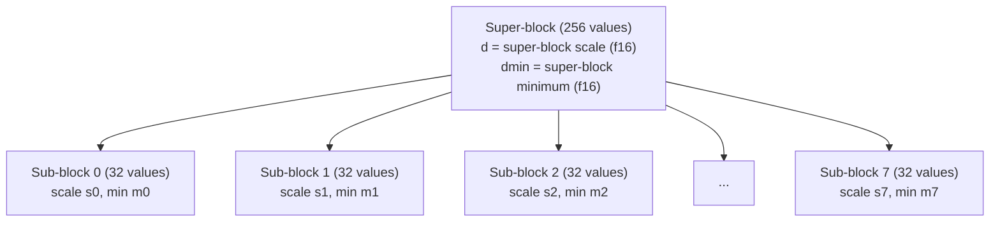
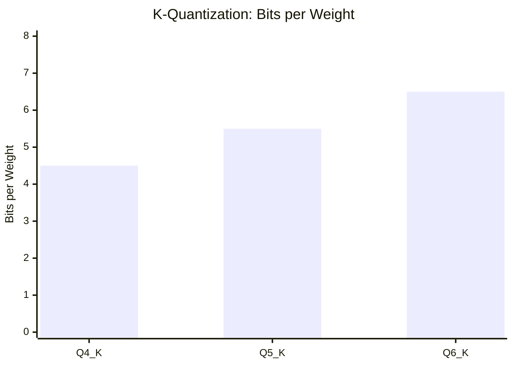

# K-Quantization

K-quantization is a two-level quantization scheme introduced by llama.cpp that
achieves significantly better quality than basic block quantization at the same
bit rate.  The key insight is that a single scale factor per 32-element block is
too coarse -- by grouping blocks into 256-element **super-blocks** with
hierarchical scales, the quantizer can adapt to weight distributions at multiple
granularities simultaneously.

---

## 1. Motivation

### Limitations of Single-Level Quantization

!!! theorem "Scale granularity and reconstruction error"

    For block-wise quantization with block size \( B \) and \( b \) bits per
    weight, the expected MSE is:

    \[
      \text{MSE} \propto \frac{R_B^2}{(2^b - 1)^2}
    \]

    where \( R_B = \max(|w_i|) \) within the block.  If any single value in
    the block is an outlier, \( R_B \) is inflated and every other value in
    the block loses precision.

With a block size of 32 (as in Q4_0), an outlier affects 31 other values.
With a block size of 256 and sub-block granularity, the outlier inflates only
the sub-block scale while the super-block scale remains tight for the majority
of the data.

### Two-Level Scale Hierarchy



The dequantization formula for K-quantization is:

\[
  \hat{w}_i = d \cdot s_j \cdot q_i + d_{\min} \cdot m_j
\]

where:

- \( d \) is the super-block scale (f16),
- \( d_{\min} \) is the super-block minimum offset (f16),
- \( s_j \) is the sub-block scale for sub-block \( j \) (6-bit integer),
- \( m_j \) is the sub-block minimum for sub-block \( j \) (6-bit integer),
- \( q_i \) is the quantized value (4, 5, or 6 bits depending on format).

---

## 2. Block Size: QK_K = 256

!!! definition "QK_K -- the K-quantization super-block size"

    All K-quantization formats use a super-block size of **QK_K = 256**
    values, matching the convention established by llama.cpp.  Each
    super-block is divided into **8 sub-blocks of 32 values** each.

```zig
pub const QK_K: usize = 256;
pub const K_SUB_BLOCKS: usize = 8;
pub const K_SUB_BLOCK_SIZE: usize = QK_K / K_SUB_BLOCKS; // 32
```

### Why 256?

The choice of 256 balances three competing concerns:

| Concern | Favours Smaller Blocks | Favours Larger Blocks |
|---------|:-:|:-:|
| Reconstruction quality | Finer adaptation to local distribution | -- |
| Scale overhead | -- | Amortise scale storage over more values |
| SIMD efficiency | -- | Wider vectors reduce loop overhead |
| Alignment | -- | 256 = \( 2^8 \), power-of-two alignment |

At QK_K = 256 with 8 sub-blocks, the sub-block scale overhead is 12 bytes
(8 scales + 8 minimums packed into 6-bit fields), which is acceptably small
relative to the 128 bytes of quantized data.

---

## 3. BlockQ4K Structure

!!! definition "Q4_K -- 4-bit K-quantization"

    Q4_K stores 256 values using 4-bit quantized weights with two-level
    scaling.  It achieves 4.5 bits per weight with substantially better
    quality than Q4_0 at the same compression ratio.

### Memory Layout

| Field | Type | Size (bytes) | Description |
|-------|------|:-:|-------------|
| `d` | `f16` | 2 | Super-block scale |
| `dmin` | `f16` | 2 | Super-block minimum |
| `scales` | `[12]u8` | 12 | Packed 6-bit sub-block scales and minimums |
| `qs` | `[128]u8` | 128 | Packed 4-bit quantized values (2 per byte) |
| **Total** | | **144** | **Per 256 values** |

### Bits per Weight

\[
  \text{bpw} = \frac{144 \times 8}{256} = 4.5
\]

### Scale Packing

The 12-byte `scales` array packs 8 scales and 8 minimums, each as a 6-bit
unsigned integer.  The packing layout:

```
scales[0..3]:   low 6 bits of scales[0..3]    (4 x 8 bits, lower 6 used)
scales[4..7]:   low 6 bits of minimums[0..3]  (4 x 8 bits, lower 6 used)
scales[8..11]:  high 2 bits of scales + minimums packed
```

!!! algorithm "Scale extraction"

    ```zig
    fn extractScales(scales_raw: [12]u8) struct {
        sub_scales: [8]u8,
        sub_mins: [8]u8,
    } {
        var sub_scales: [8]u8 = undefined;
        var sub_mins: [8]u8 = undefined;

        // Low 6 bits from bytes 0..7
        for (0..4) |i| {
            sub_scales[i] = scales_raw[i] & 0x3F;
            sub_mins[i] = scales_raw[4 + i] & 0x3F;
        }

        // High 2 bits from bytes 8..11
        for (0..4) |i| {
            const hi = scales_raw[8 + i];
            sub_scales[i] |= (hi & 0x03) << 6;
            sub_scales[4 + i] = (scales_raw[i] >> 6) | ((hi & 0x0C) << 4);
            sub_mins[i] |= ((hi >> 4) & 0x03) << 6;
            sub_mins[4 + i] = (scales_raw[4 + i] >> 6) | ((hi & 0xC0) >> 2);
        }

        return .{ .sub_scales = sub_scales, .sub_mins = sub_mins };
    }
    ```

### Zig Structure

```zig
pub const BlockQ4K = extern struct {
    d: f16,              // super-block scale
    dmin: f16,           // super-block minimum
    scales: [12]u8,      // packed sub-block scales and minimums
    qs: [128]u8,         // packed 4-bit quantized values

    pub fn dequantize(self: BlockQ4K, output: *[QK_K]f32) void {
        const d: f32 = @floatCast(self.d);
        const dmin: f32 = @floatCast(self.dmin);
        const sm = extractScales(self.scales);

        for (0..K_SUB_BLOCKS) |j| {
            const sc: f32 = @floatFromInt(sm.sub_scales[j]);
            const mn: f32 = @floatFromInt(sm.sub_mins[j]);
            const base = j * K_SUB_BLOCK_SIZE;

            for (0..K_SUB_BLOCK_SIZE / 2) |k| {
                const byte = self.qs[base / 2 + k];
                const q_lo: f32 = @floatFromInt(@as(u4, @truncate(byte)));
                const q_hi: f32 = @floatFromInt(@as(u4, @truncate(byte >> 4)));

                output[base + 2 * k] = d * sc * q_lo - dmin * mn;
                output[base + 2 * k + 1] = d * sc * q_hi - dmin * mn;
            }
        }
    }
};
```

### Dequantization Formula

For value \( i \) in sub-block \( j = \lfloor i/32 \rfloor \):

\[
  \hat{w}_i = d \cdot s_j \cdot q_i - d_{\min} \cdot m_j
\]

where \( q_i \in [0, 15] \) is the unsigned 4-bit value extracted from `qs`.

!!! notation "Sign convention"

    The minimum offset \( d_{\min} \cdot m_j \) is *subtracted* because
    K-quantization uses unsigned integers shifted by the minimum, not
    signed integers centered at zero.

---

## 4. BlockQ5K Structure

!!! definition "Q5_K -- 5-bit K-quantization"

    Q5_K extends Q4_K by adding a 5th bit per value, stored in a separate
    bit array `qh`.  This extra bit doubles the number of representable
    levels (from 16 to 32), yielding significantly better reconstruction.

### Memory Layout

| Field | Type | Size (bytes) | Description |
|-------|------|:-:|-------------|
| `d` | `f16` | 2 | Super-block scale |
| `dmin` | `f16` | 2 | Super-block minimum |
| `scales` | `[12]u8` | 12 | Packed 6-bit sub-block scales and minimums |
| `qh` | `[32]u8` | 32 | High bits (bit 4) for each of 256 values |
| `qs` | `[128]u8` | 128 | Packed 4-bit low values (2 per byte) |
| **Total** | | **176** | **Per 256 values** |

### Bits per Weight

\[
  \text{bpw} = \frac{176 \times 8}{256} = 5.5
\]

### Dequantization

The 5-bit value is reconstructed by combining the low 4 bits from `qs` with
the high bit from `qh`:

\[
  q_i^{(5)} = q_i^{(4)} + 16 \cdot h_i, \qquad h_i \in \{0, 1\}
\]

\[
  \hat{w}_i = d \cdot s_j \cdot q_i^{(5)} - d_{\min} \cdot m_j
\]

```zig
pub const BlockQ5K = extern struct {
    d: f16,
    dmin: f16,
    scales: [12]u8,
    qh: [32]u8,     // high bit for each of 256 values
    qs: [128]u8,     // low 4 bits, packed

    pub fn dequantize(self: BlockQ5K, output: *[QK_K]f32) void {
        const d_val: f32 = @floatCast(self.d);
        const dmin_val: f32 = @floatCast(self.dmin);
        const sm = extractScales(self.scales);

        for (0..K_SUB_BLOCKS) |j| {
            const sc: f32 = @floatFromInt(sm.sub_scales[j]);
            const mn: f32 = @floatFromInt(sm.sub_mins[j]);
            const base = j * K_SUB_BLOCK_SIZE;

            for (0..K_SUB_BLOCK_SIZE / 2) |k| {
                const idx = base + 2 * k;
                const byte = self.qs[base / 2 + k];
                const lo: u8 = byte & 0x0F;
                const hi: u8 = byte >> 4;

                // Extract high bit from qh
                const h_lo: u8 = (self.qh[idx / 8] >> @truncate(idx % 8)) & 1;
                const h_hi: u8 = (self.qh[(idx + 1) / 8] >> @truncate((idx + 1) % 8)) & 1;

                const q5_lo: f32 = @floatFromInt(@as(u8, lo + 16 * h_lo));
                const q5_hi: f32 = @floatFromInt(@as(u8, hi + 16 * h_hi));

                output[idx] = d_val * sc * q5_lo - dmin_val * mn;
                output[idx + 1] = d_val * sc * q5_hi - dmin_val * mn;
            }
        }
    }
};
```

---

## 5. BlockQ6K Structure

!!! definition "Q6_K -- 6-bit K-quantization"

    Q6_K uses separate arrays for low bits (4-bit in `ql`) and high bits
    (2-bit in `qh`), with `int8_t` sub-block scales for higher precision.
    It provides the best reconstruction quality in the K-quant family.

### Memory Layout

| Field | Type | Size (bytes) | Description |
|-------|------|:-:|-------------|
| `ql` | `[128]u8` | 128 | Low 4 bits, packed (2 per byte) |
| `qh` | `[64]u8` | 64 | High 2 bits, packed (4 per byte) |
| `scales` | `[16]i8` | 16 | Sub-block scales (signed 8-bit) |
| `d` | `f16` | 2 | Super-block scale |
| **Total** | | **210** | **Per 256 values** |

### Bits per Weight

\[
  \text{bpw} = \frac{210 \times 8}{256} = 6.5625 \approx 6.5
\]

### Key Differences from Q4_K and Q5_K

| Feature | Q4_K / Q5_K | Q6_K |
|---------|---|---|
| Sub-block scales | 6-bit unsigned, packed in 12 bytes | 8-bit signed (`int8_t`), 16 bytes |
| Minimum offset | Yes (`dmin` field) | No -- centred quantization |
| High bits | Q5_K: 1 extra bit | 2 extra bits (stored in `qh`) |
| Dequantization | \( d \cdot s_j \cdot q_i - d_{\min} \cdot m_j \) | \( d \cdot s_j \cdot (q_i - 32) \) |

### Dequantization

The 6-bit value is reconstructed:

\[
  q_i^{(6)} = q_i^{(4)} + 16 \cdot h_i, \qquad h_i \in \{0, 1, 2, 3\}
\]

With centred dequantization (no separate minimum):

\[
  \hat{w}_i = d \cdot s_j \cdot (q_i^{(6)} - 32)
\]

```zig
pub const BlockQ6K = extern struct {
    ql: [128]u8,       // low 4 bits (packed, 2 per byte)
    qh: [64]u8,        // high 2 bits (packed, 4 per byte)
    scales: [16]i8,     // sub-block scales (16 sub-blocks of 16 values)
    d: f16,             // super-block scale

    pub fn dequantize(self: BlockQ6K, output: *[QK_K]f32) void {
        const d_val: f32 = @floatCast(self.d);

        for (0..QK_K) |i| {
            // Extract low 4 bits
            const ql_byte = self.ql[i / 2];
            const lo: u8 = if (i % 2 == 0) ql_byte & 0x0F else ql_byte >> 4;

            // Extract high 2 bits
            const qh_byte = self.qh[i / 4];
            const shift: u3 = @truncate((i % 4) * 2);
            const hi: u8 = (qh_byte >> shift) & 0x03;

            // Reconstruct 6-bit value
            const q6: i32 = @as(i32, lo + 16 * hi) - 32;

            // Sub-block scale (16 sub-blocks of 16 values each)
            const sub_idx = i / 16;
            const sc: f32 = @floatFromInt(self.scales[sub_idx]);

            output[i] = d_val * sc * @as(f32, @floatFromInt(q6));
        }
    }
};
```

!!! notation "Sub-block count in Q6_K"

    Q6_K uses **16 sub-blocks of 16 values** (not 8 sub-blocks of 32),
    providing finer granularity than Q4_K and Q5_K.  This is possible
    because the 8-bit scales (16 bytes) are not much more expensive than
    the packed 6-bit scales (12 bytes) used by Q4_K/Q5_K.

---

## 6. Mathematical Formulation

### Unified Dequantization

All K-quantization formats follow the same general pattern:

\[
  \hat{w}_i = d \cdot s_j \cdot q_i + \beta_j
\]

where the bias term \( \beta_j \) depends on the format:

| Format | \( q_i \) range | \( \beta_j \) | Number of sub-blocks |
|--------|:-:|---|:-:|
| Q4_K | \( [0, 15] \) | \( -d_{\min} \cdot m_j \) | 8 |
| Q5_K | \( [0, 31] \) | \( -d_{\min} \cdot m_j \) | 8 |
| Q6_K | \( [-32, 31] \) | 0 (centred) | 16 |

### Error Analysis

!!! theorem "Two-level quantization error bound"

    For K-quantization with super-block scale \( d \), sub-block scale
    \( s_j \), and \( b \)-bit values, the maximum reconstruction error
    for a single element is:

    \[
      |\epsilon_i| \leq \frac{d \cdot s_j}{2 \cdot (2^b - 1)}
    \]

    Because both \( d \) and \( s_j \) adapt to the data, this bound is
    tighter than single-level quantization where \( d \) alone must cover
    the full range.

The effective dynamic range per sub-block is \( d \cdot s_j \cdot (2^b - 1) \),
allowing each sub-block to precisely cover its local weight distribution.

---

## 7. Bits per Weight Summary

| Format | Data | Scales | Overhead | Total (bytes/256) | bpw |
|--------|:-:|:-:|:-:|:-:|:-:|
| Q4_K | 128 | 12 | 4 (d, dmin) | 144 | 4.50 |
| Q5_K | 128 + 32 | 12 | 4 (d, dmin) | 176 | 5.50 |
| Q6_K | 128 + 64 | 16 | 2 (d) | 210 | 6.56 |



---

## 8. Quality-Compression Trade-off

### Perplexity Benchmarks

The following data is from llama.cpp perplexity evaluation on LLaMA-2 7B,
WikiText-2 test set (lower is better).[^1]

| Format | bpw | Model Size (7B) | Perplexity | PPL vs F16 |
|--------|:-:|:-:|:-:|:-:|
| F16 | 16.0 | 13.0 GB | 5.68 | baseline |
| Q6_K | 6.5 | 5.5 GB | 5.69 | +0.2% |
| Q5_K_M | 5.5 | 4.8 GB | 5.70 | +0.4% |
| Q5_K_S | 5.5 | 4.8 GB | 5.71 | +0.5% |
| Q4_K_M | 4.5 | 4.0 GB | 5.73 | +0.9% |
| Q4_K_S | 4.5 | 3.9 GB | 5.76 | +1.4% |
| Q4_0 (basic) | 4.5 | 3.7 GB | 5.96 | +4.9% |

!!! complexity "K-quant advantage"

    At the same 4.5 bpw, Q4_K_M has **4x less perplexity degradation** than
    Q4_0 (0.9% vs 4.9%).  The two-level scale hierarchy recovers most of the
    information lost by single-level block quantization.

### Format Selection Guide

| Use Case | Recommended Format | Rationale |
|----------|---|---|
| Maximum quality, 6+ GB RAM | Q6_K | Near-F16 quality |
| Balanced quality/size, 4--5 GB RAM | Q4_K_M | Best quality at 4.5 bpw |
| Minimum viable quality, 3--4 GB RAM | Q4_K_S | Slightly smaller than Q4_K_M |
| Research / prototyping | Q5_K_M | Safe middle ground |

The `_M` (medium) and `_S` (small) suffixes in llama.cpp indicate different
choices of which layers to quantize more aggressively -- `_M` preserves the
first and last layers at higher precision.

---

## 9. KQuantizer API

```zig
pub const KQuantizer = struct {
    allocator: std.mem.Allocator,

    pub fn init(allocator: std.mem.Allocator) KQuantizer {
        return .{ .allocator = allocator };
    }

    /// Quantize a f32 slice to Q4_K blocks.
    pub fn quantizeQ4K(
        self: KQuantizer,
        data: []const f32,
    ) ![]BlockQ4K {
        const n_blocks = (data.len + QK_K - 1) / QK_K;
        const blocks = try self.allocator.alloc(BlockQ4K, n_blocks);

        for (0..n_blocks) |bi| {
            const start = bi * QK_K;
            const end = @min(start + QK_K, data.len);
            blocks[bi] = quantizeBlockQ4K(data[start..end]);
        }

        return blocks;
    }

    /// Quantize a f32 slice to Q5_K blocks.
    pub fn quantizeQ5K(
        self: KQuantizer,
        data: []const f32,
    ) ![]BlockQ5K {
        const n_blocks = (data.len + QK_K - 1) / QK_K;
        const blocks = try self.allocator.alloc(BlockQ5K, n_blocks);

        for (0..n_blocks) |bi| {
            const start = bi * QK_K;
            const end = @min(start + QK_K, data.len);
            blocks[bi] = quantizeBlockQ5K(data[start..end]);
        }

        return blocks;
    }

    /// Quantize a f32 slice to Q6_K blocks.
    pub fn quantizeQ6K(
        self: KQuantizer,
        data: []const f32,
    ) ![]BlockQ6K {
        const n_blocks = (data.len + QK_K - 1) / QK_K;
        const blocks = try self.allocator.alloc(BlockQ6K, n_blocks);

        for (0..n_blocks) |bi| {
            const start = bi * QK_K;
            const end = @min(start + QK_K, data.len);
            blocks[bi] = quantizeBlockQ6K(data[start..end]);
        }

        return blocks;
    }

    /// Dequantize an entire Q4_K block array to f32.
    pub fn dequantizeQ4K(
        blocks: []const BlockQ4K,
        output: []f32,
    ) void {
        for (blocks, 0..) |block, bi| {
            block.dequantize(output[bi * QK_K ..][0..QK_K]);
        }
    }

    pub fn deinit(self: *KQuantizer, blocks: anytype) void {
        self.allocator.free(blocks);
    }
};
```

!!! algorithm "Quantization procedure for Q4_K"

    For each super-block of 256 values:

    1. Divide into 8 sub-blocks of 32 values.
    2. For each sub-block, compute the local max and min.
    3. Derive the sub-block scale \( s_j \) and minimum \( m_j \).
    4. Compute the super-block scale \( d \) from the max sub-block scale.
    5. Compute \( d_{\min} \) from the max sub-block minimum.
    6. Quantize sub-block scales and minimums to 6-bit integers.
    7. Quantize each value to 4-bit using the two-level formula:
       \( q_i = \text{round}((w_i + d_{\min} \cdot m_j) / (d \cdot s_j)) \).
    8. Pack nibbles into the `qs` byte array.

---

## References

[^1]: Gerganov, G. "K-quant implementation." llama.cpp, 2023. https://github.com/ggerganov/llama.cpp/pull/1684
[^2]: Gerganov, G. "GGML quantization formats." https://github.com/ggerganov/ggml
[^3]: Dettmers, T. et al. "The case for 4-bit precision: k-bit Inference Scaling Laws." *ICML*, 2023. https://arxiv.org/abs/2212.09720
