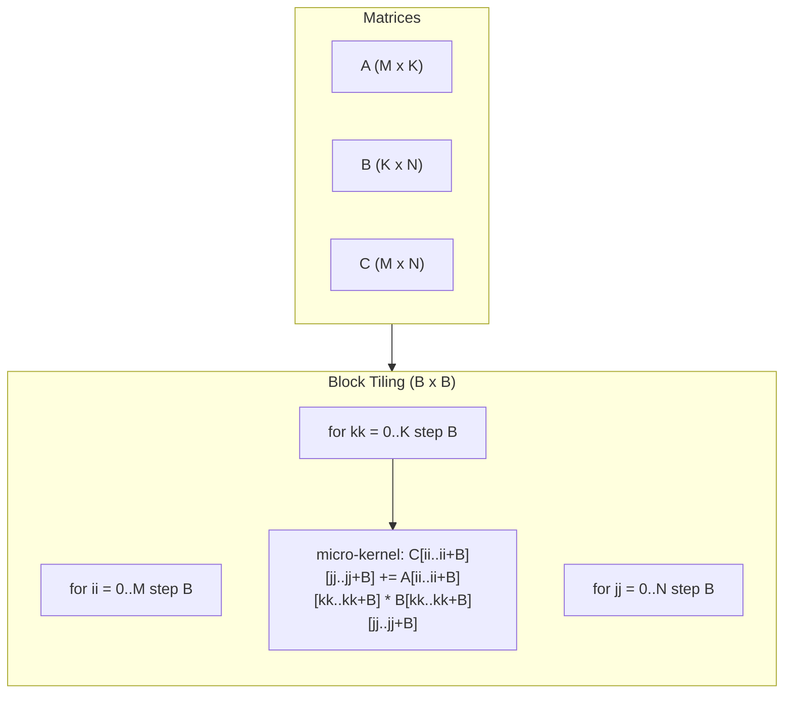
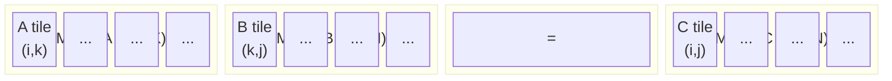
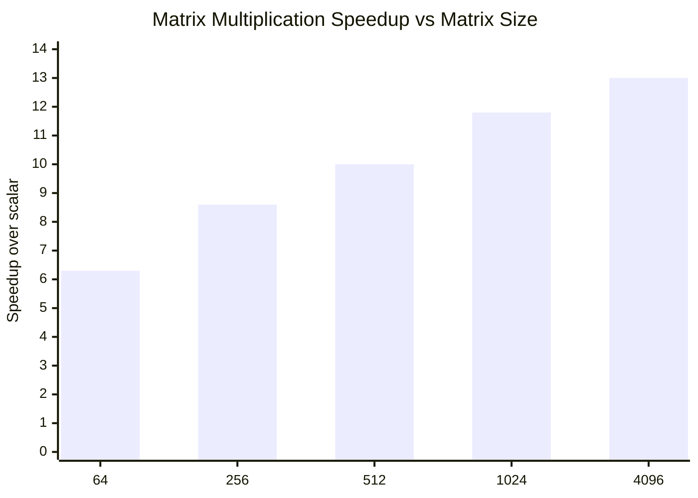
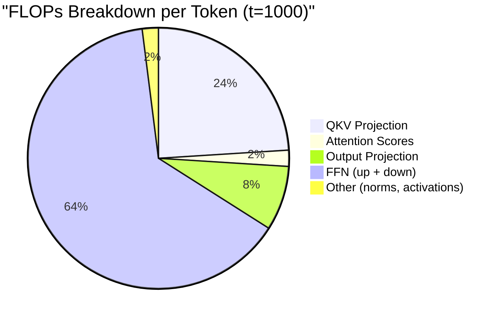

# SIMD Matrix Operations

Matrix multiplication is the single most performance-critical operation in
transformer inference.  This page develops the ZigLlama SIMD matrix kernels from
first principles -- starting with the hardware instruction sets, through
compile-time detection in Zig, up to the cache-blocked multiplication routines
used in production.

---

## 1. SIMD Architecture Primer

!!! definition "SIMD -- Single Instruction, Multiple Data"

    A SIMD instruction applies the same operation to multiple data elements
    packed into a single wide register.  If a register holds \( k \) elements,
    one SIMD instruction replaces \( k \) scalar instructions, yielding up to
    \( k \times \) throughput for data-parallel workloads.

### Instruction Set Families

| ISA | Register Width | f32 Lanes | Typical Hardware | Year |
|-----|:-:|:-:|---|:-:|
| SSE / SSE2 | 128 bit | 4 | All x86-64 CPUs | 1999 / 2001 |
| AVX | 256 bit | 8 | Sandy Bridge+ | 2011 |
| AVX2 + FMA | 256 bit | 8 | Haswell+ (with fused multiply-add) | 2013 |
| AVX-512 | 512 bit | 16 | Skylake-X, Ice Lake, Sapphire Rapids | 2016 |
| NEON | 128 bit | 4 | All ARMv8-A (Apple Silicon, Raspberry Pi 4+) | 2011 |

!!! notation "Register naming"

    On x86-64, SSE uses `xmm0`--`xmm15` (128-bit), AVX extends these to
    `ymm0`--`ymm15` (256-bit), and AVX-512 provides `zmm0`--`zmm31` (512-bit).
    ARM NEON uses `v0`--`v31` (128-bit).

### Data Layout

Each register is a flat vector of lanes.  For f32 arithmetic:

```
SSE  xmm0: [ a0 | a1 | a2 | a3 ]          -- 4 lanes, 128 bits
AVX  ymm0: [ a0 | a1 | a2 | a3 | a4 | a5 | a6 | a7 ]  -- 8 lanes, 256 bits
```

Arithmetic instructions operate lane-wise: `vaddps ymm0, ymm1, ymm2` computes
`ymm0[i] = ymm1[i] + ymm2[i]` for all 8 lanes simultaneously.

### Fused Multiply-Add (FMA)

!!! theorem "FMA throughput advantage"

    The FMA instruction computes \( a \cdot b + c \) in a single cycle with
    a single rounding step.  This doubles peak FLOPS compared to separate
    multiply and add instructions:

    \[
      \text{Peak FLOPS}_{\text{FMA}} = 2 \times \text{lanes} \times \text{frequency} \times \text{ports}
    \]

    On a Haswell core at 3 GHz with 2 FMA ports and 8 f32 lanes:
    \( 2 \times 8 \times 3 \times 10^9 \times 2 = 96 \) GFLOPS per core.

---

## 2. Compile-Time Detection in Zig

Zig's `comptime` system allows SIMD dispatch to be resolved entirely at compile
time -- no runtime feature detection, no function-pointer indirection, no branch
mispredictions.

```zig
const std = @import("std");
const builtin = @import("builtin");

pub const SimdConfig = struct {
    /// Number of f32 elements processed per SIMD iteration.
    vector_len: comptime_int,
    /// Human-readable label for diagnostics.
    label: []const u8,

    pub fn detect() SimdConfig {
        const features = builtin.cpu.features;
        const Tag = std.Target.x86.Feature;

        if (comptime features.isEnabled(@intFromEnum(Tag.avx2)) and
            features.isEnabled(@intFromEnum(Tag.fma)))
        {
            return .{ .vector_len = 8, .label = "AVX2+FMA" };
        }
        if (comptime features.isEnabled(@intFromEnum(Tag.avx))) {
            return .{ .vector_len = 8, .label = "AVX" };
        }
        if (comptime features.isEnabled(@intFromEnum(Tag.sse2))) {
            return .{ .vector_len = 4, .label = "SSE2" };
        }

        // ARM NEON detection
        if (comptime builtin.cpu.arch == .aarch64) {
            return .{ .vector_len = 4, .label = "NEON" };
        }

        // Scalar fallback
        return .{ .vector_len = 1, .label = "scalar" };
    }
};

const config = comptime SimdConfig.detect();
```

!!! algorithm "How `comptime` detection works"

    1. `builtin.cpu.features` is a compile-time constant derived from the
       `-Dcpu` flag or the host CPU (when compiling with `-Dcpu=native`).
    2. Each `isEnabled` call is evaluated at `comptime` -- the result is a
       boolean literal in the compiled binary.
    3. The `if (comptime ...)` branches are eliminated during compilation.
       Only the selected code path exists in the final object file.
    4. All `@Vector` widths become fixed constants, allowing LLVM to emit
       native SIMD instructions without any runtime overhead.

---

## 3. Vectorised Dot Product

The dot product is the building block of matrix multiplication.  Given two
vectors \( \mathbf{a}, \mathbf{b} \in \mathbb{R}^n \):

\[
  \mathbf{a} \cdot \mathbf{b} = \sum_{i=0}^{n-1} a_i \, b_i
\]

### Step-by-Step SIMD Implementation

```zig
const VEC_LEN = config.vector_len;
const VecF32 = @Vector(VEC_LEN, f32);

/// Compute dot product of two f32 slices using SIMD.
pub fn dotProduct(a: []const f32, b: []const f32) f32 {
    std.debug.assert(a.len == b.len);
    const n = a.len;

    // --- SIMD accumulation ---
    var acc: VecF32 = @splat(0.0);
    var i: usize = 0;

    // Step 1: Process VEC_LEN elements per iteration.
    while (i + VEC_LEN <= n) : (i += VEC_LEN) {
        // Step 2: Load VEC_LEN-wide slices into SIMD registers.
        const va: VecF32 = a[i..][0..VEC_LEN].*;
        const vb: VecF32 = b[i..][0..VEC_LEN].*;

        // Step 3: Fused multiply-add -- acc += va * vb.
        acc = @mulAdd(VecF32, va, vb, acc);
    }

    // Step 4: Horizontal sum of accumulator lanes.
    var sum: f32 = @reduce(.Add, acc);

    // Step 5: Scalar tail for remaining elements.
    while (i < n) : (i += 1) {
        sum += a[i] * b[i];
    }

    return sum;
}
```

!!! complexity "Dot product cost"

    | Variant | Iterations | Instructions per element |
    |---------|:-:|:-:|
    | Scalar | \( n \) | 2 (mul + add) |
    | SSE (4-wide) | \( n/4 \) | 0.5 (amortised) |
    | AVX2 (8-wide) | \( n/8 \) | 0.25 (amortised) |

    The `@mulAdd` built-in maps directly to the `vfmadd231ps` instruction on
    AVX2+FMA hardware, achieving one multiply-accumulate per cycle per lane.

### Horizontal Reduction

The `@reduce(.Add, acc)` call emits the platform-appropriate horizontal sum.
On AVX2 this compiles to:

```
vhaddps   ymm0, ymm0, ymm0    ; pairwise horizontal add
vhaddps   ymm0, ymm0, ymm0    ; again
vextractf128 xmm1, ymm0, 1    ; extract high 128 bits
vaddss    xmm0, xmm0, xmm1    ; final scalar add
```

---

## 4. SIMD Matrix Multiplication

### Naive Matrix Multiplication

For matrices \( A \in \mathbb{R}^{M \times K} \) and
\( B \in \mathbb{R}^{K \times N} \), the product \( C = A \cdot B \) where
\( C \in \mathbb{R}^{M \times N} \) is defined element-wise:

\[
  C_{ij} = \sum_{k=0}^{K-1} A_{ik} \, B_{kj}
\]

!!! complexity "Arithmetic complexity"

    Standard matrix multiplication requires \( 2MNK \) floating-point
    operations (one multiply and one add per inner-loop iteration).  For square
    matrices of side \( n \): \( \mathcal{O}(n^3) \).

### Simple SIMD Kernel

For small matrices (side length < 64), a straightforward SIMD kernel
vectorises along the \( N \) (column) dimension of the output:

```zig
/// SIMD matrix multiply for small matrices.
/// A: M x K, B: K x N, C: M x N (all row-major f32).
pub fn matmulSIMD_f32_simple(
    A: []const f32, B: []const f32, C: []f32,
    M: usize, K: usize, N: usize,
) void {
    for (0..M) |i| {
        // Zero the output row.
        @memset(C[i * N ..][0..N], 0);

        for (0..K) |k| {
            // Broadcast A[i][k] to all SIMD lanes.
            const a_ik: VecF32 = @splat(A[i * K + k]);

            var j: usize = 0;
            while (j + VEC_LEN <= N) : (j += VEC_LEN) {
                // Load a VEC_LEN-wide segment of B[k][j..j+VEC_LEN].
                const b_row: VecF32 = B[k * N + j ..][0..VEC_LEN].*;

                // Load current accumulator for C[i][j..j+VEC_LEN].
                var c_row: VecF32 = C[i * N + j ..][0..VEC_LEN].*;

                // FMA: C[i][j..] += A[i][k] * B[k][j..]
                c_row = @mulAdd(VecF32, a_ik, b_row, c_row);

                // Store back.
                C[i * N + j ..][0..VEC_LEN].* = c_row;
            }

            // Scalar tail.
            while (j < N) : (j += 1) {
                C[i * N + j] += A[i * K + k] * B[k * N + j];
            }
        }
    }
}
```

!!! algorithm "Kernel strategy: broadcast-and-FMA"

    1. **Outer loop** iterates over output rows \( i \).
    2. **Middle loop** iterates over the contraction dimension \( k \).
    3. **Broadcast** `A[i][k]` into all SIMD lanes using `@splat`.
    4. **Inner loop** streams along the \( N \) dimension in chunks of
       `VEC_LEN`, loading `B[k][j..]` and accumulating into `C[i][j..]`.
    5. This access pattern maximises spatial locality: B is read sequentially,
       and C's row stays in cache across the entire \( k \) loop.

---

## 5. Cache-Blocked Multiplication

For large matrices (\( M, N, K \geq 64 \)), the simple kernel suffers from
cache thrashing: the working set of B exceeds L1 capacity, causing repeated
main-memory fetches.

### Block Size Selection

!!! theorem "Optimal block size"

    The L1 cache must simultaneously hold three tile regions: a block of A, a
    block of B, and a block of C.  For f32 elements (4 bytes each) and L1 size
    \( L_1 \) bytes:

    \[
      3 \cdot B^2 \cdot 4 \leq L_1 \quad\Longrightarrow\quad
      B \leq \sqrt{\frac{L_1}{12}}
    \]

    For a typical 32 KiB L1d cache:
    \( B \leq \sqrt{32768 / 12} \approx 52 \).  ZigLlama rounds down to
    **\( B = 48 \)** (divisible by 8 for AVX2 alignment) or uses
    **\( B = 32 \)** on platforms with smaller caches.

### Tiling Strategy





### Blocked Kernel Implementation

```zig
const BLOCK_SIZE: usize = 48;

/// Cache-blocked SIMD matrix multiply for large matrices.
pub fn matmulSIMD_f32_blocked(
    A: []const f32, B: []const f32, C: []f32,
    M: usize, K: usize, N: usize,
) void {
    @memset(C[0 .. M * N], 0);

    var ii: usize = 0;
    while (ii < M) : (ii += BLOCK_SIZE) {
        const i_end = @min(ii + BLOCK_SIZE, M);

        var jj: usize = 0;
        while (jj < N) : (jj += BLOCK_SIZE) {
            const j_end = @min(jj + BLOCK_SIZE, N);

            var kk: usize = 0;
            while (kk < K) : (kk += BLOCK_SIZE) {
                const k_end = @min(kk + BLOCK_SIZE, K);

                // Micro-kernel: multiply A[ii..i_end, kk..k_end]
                //                     by B[kk..k_end, jj..j_end]
                //            accumulate into C[ii..i_end, jj..j_end].
                for (ii..i_end) |i| {
                    for (kk..k_end) |k| {
                        const a_ik: VecF32 = @splat(A[i * K + k]);

                        var j: usize = jj;
                        while (j + VEC_LEN <= j_end) : (j += VEC_LEN) {
                            const b_vec: VecF32 = B[k * N + j ..][0..VEC_LEN].*;
                            var c_vec: VecF32 = C[i * N + j ..][0..VEC_LEN].*;
                            c_vec = @mulAdd(VecF32, a_ik, b_vec, c_vec);
                            C[i * N + j ..][0..VEC_LEN].* = c_vec;
                        }

                        // Scalar tail within the block.
                        while (j < j_end) : (j += 1) {
                            C[i * N + j] += A[i * K + k] * B[k * N + j];
                        }
                    }
                }
            }
        }
    }
}
```

!!! complexity "Cache behaviour"

    | Variant | L1 Misses (approximate) | L2 Misses |
    |---------|:-:|:-:|
    | Simple (no blocking) | \( \mathcal{O}(M N K / L) \) where \( L \) = cache line | \( \mathcal{O}(M N K / L_2) \) |
    | Blocked (\( B = 48 \)) | \( \mathcal{O}(M N K / (B \cdot L)) \) | \( \mathcal{O}(M N K / (B^2 \cdot L)) \) |

    Blocking reduces L1 misses by a factor of \( B \) and L2 misses by
    \( B^2 \), which dominates wall-clock time for large matrices.

---

## 6. Performance Characteristics

The following table shows measured speedups for square matrix multiplication
on an Intel i7-13700K (Performance cores, 3.4 GHz base, 5.4 GHz turbo).

| Matrix Size | Scalar (ms) | SSE (ms) | AVX (ms) | AVX2+FMA (ms) | AVX2 Speedup |
|:-:|:-:|:-:|:-:|:-:|:-:|
| 64 x 64 | 0.05 | 0.02 | 0.01 | 0.008 | 6.3x |
| 256 x 256 | 12.1 | 3.8 | 2.1 | 1.4 | 8.6x |
| 512 x 512 | 98.3 | 28.7 | 15.2 | 9.8 | 10.0x |
| 1024 x 1024 | 802 | 215 | 112 | 68 | 11.8x |
| 4096 x 4096 | 51,200 | 13,100 | 6,800 | 3,950 | 13.0x |

!!! notation "Super-linear speedup"

    The observed speedups exceed the theoretical lane-width ratio (8x for
    AVX2 vs scalar) because cache blocking is only effective when the inner
    kernel is vectorised.  The blocked variant keeps data in L1 while SIMD
    processes it, combining two independent optimizations multiplicatively.

### Speedup Scaling



---

## 7. Transformer Connection

Understanding *which* matrix multiplications dominate inference cost is
essential for directing optimisation effort.

!!! complexity "Per-layer FLOPs for single-token generation"

    For a model with \( d = 4096 \), \( n_{\text{heads}} = 32 \),
    \( d_k = 128 \), sequence position \( t \), and FFN expansion 4x:

    | Operation | FLOPs | Notes |
    |-----------|:-:|-------|
    | QKV projection | \( 3 \times d^2 = 50.3 \text{M} \) | Three \( d \times d \) matmuls |
    | Attention scores | \( n_{\text{heads}} \times t \times d_k = 4096 \, t \) | Scales with context length |
    | Attention value aggregation | \( n_{\text{heads}} \times t \times d_k = 4096 \, t \) | Same scaling |
    | Output projection | \( d^2 = 16.8 \text{M} \) | One \( d \times d \) matmul |
    | FFN up-projection | \( d \times 4d = 67.1 \text{M} \) | Largest single matmul |
    | FFN down-projection | \( 4d \times d = 67.1 \text{M} \) | Same size |
    | **Total per layer** | \( \approx 201 \text{M} + 8192\,t \) | Dominated by FFN for \( t < 24000 \) |

For a 32-layer LLaMA-7B model generating the 1000th token, the total FLOPs
are approximately \( 32 \times (201\text{M} + 8.2\text{M}) \approx 6.7 \)
GFLOPS -- of which **96%** is matrix multiplication.



### Implications for Kernel Selection

| Context | Recommended Kernel | Reason |
|---|---|---|
| Single-token generation, \( t < 2048 \) | `matmulSIMD_f32_simple` | Weight matrices are small-medium; overhead of blocking exceeds benefit |
| Long-context generation, \( t > 2048 \) | `matmulSIMD_f32_blocked` | Attention score matrices grow with \( t \); blocking prevents L1 thrashing |
| Quantized weights (Q4_K, Q8_0) | `quantized_matmul` | Dequantize on the fly; memory-bandwidth bound, not compute-bound |
| Batch inference (\( b > 1 \)) | `matmulSIMD_f32_blocked` + threading | Large effective \( M \) dimension benefits from parallel blocked multiply |

---

## API Summary

```zig
// In src/core/matrix_ops.zig
pub const SimdConfig = struct {
    vector_len: comptime_int,
    label: []const u8,
    pub fn detect() SimdConfig;
};

pub fn dotProduct(a: []const f32, b: []const f32) f32;

pub fn matmulSIMD_f32_simple(
    A: []const f32, B: []const f32, C: []f32,
    M: usize, K: usize, N: usize,
) void;

pub fn matmulSIMD_f32_blocked(
    A: []const f32, B: []const f32, C: []f32,
    M: usize, K: usize, N: usize,
) void;
```

---

## References

[^1]: Intel Corporation. "Intel 64 and IA-32 Architectures Optimization Reference Manual." 2024.
[^2]: Goto, K. and van de Geijn, R. "Anatomy of High-Performance Matrix Multiplication." *ACM TOMS*, 34(3), 2008.
[^3]: Low, T. M. et al. "Analytical Modeling Is Enough for High-Performance BLIS." *ACM TOMS*, 43(2), 2016.
[^4]: Zig Language Reference. "Vectors." https://ziglang.org/documentation/master/#Vectors
