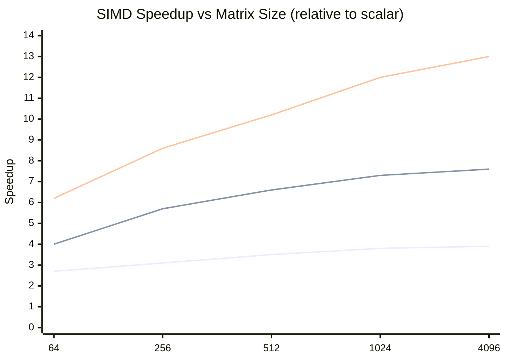
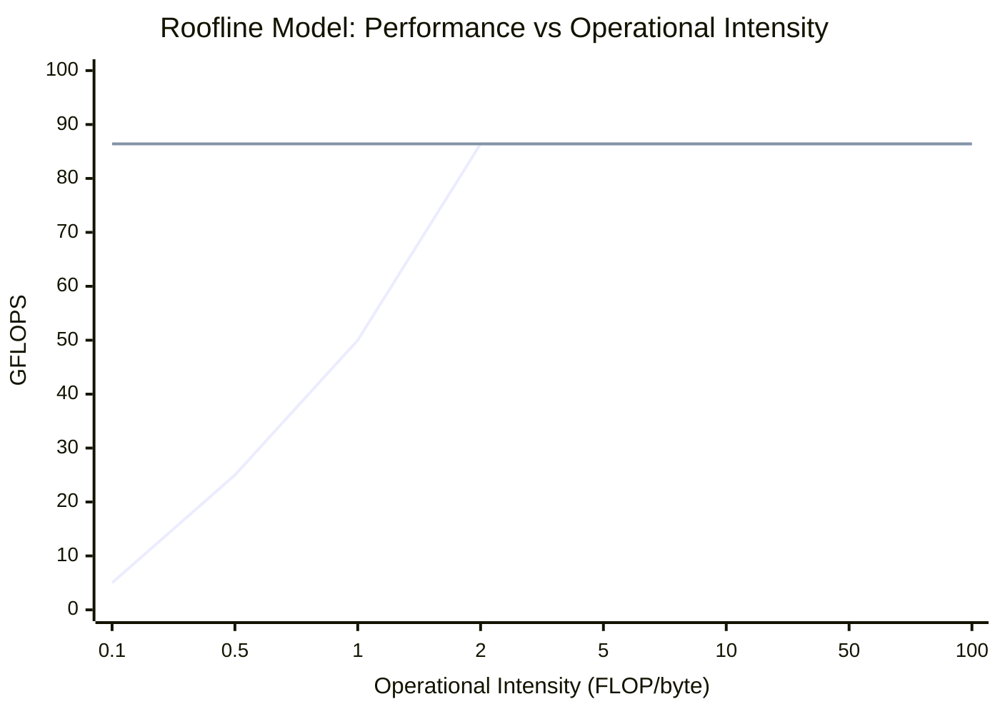
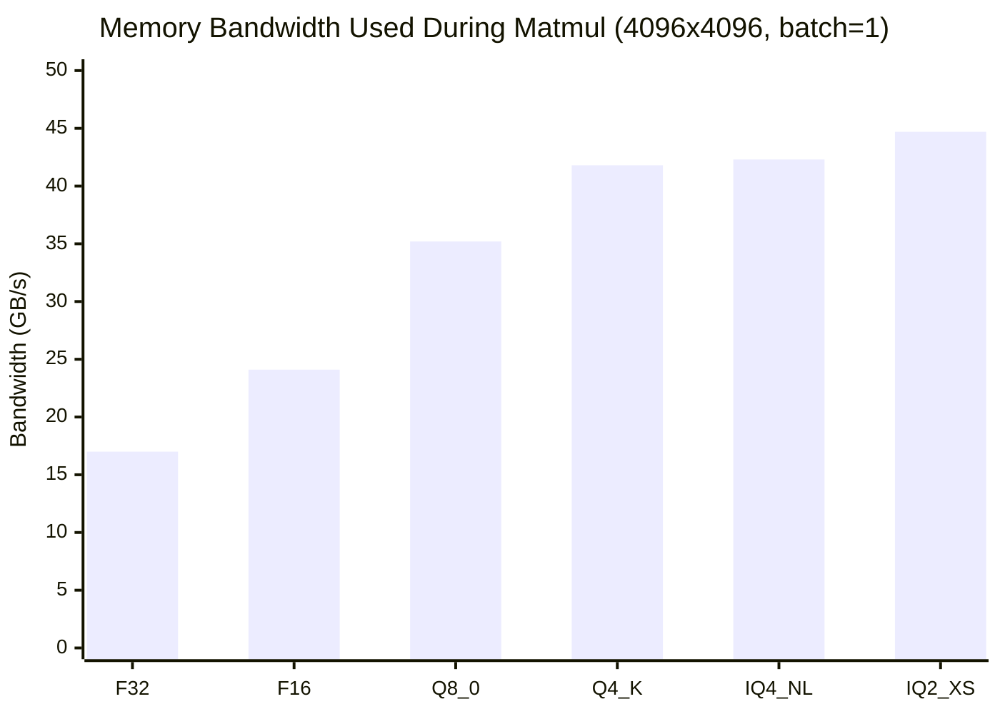

# Performance Analysis

This page presents the performance characteristics of ZigLlama's Layer 2
kernels -- matrix multiplication and quantized arithmetic -- using systematic
benchmarking, roofline modeling, and memory-bandwidth analysis.  The goal is not
just to report numbers but to build an analytical framework for predicting
performance and identifying bottlenecks.

---

## 1. Benchmarking Methodology

### Measurement Protocol

!!! algorithm "Benchmark procedure"

    1. **Warmup:** Execute the kernel 10 times to populate instruction caches,
       branch predictors, and TLBs.  Discard all warmup measurements.
    2. **Measurement:** Execute the kernel \( N \) times (typically
       \( N = 100 \) for fast kernels, \( N = 20 \) for large matrices).
    3. **Timing:** Use `std.time.nanoTimestamp()` which maps to
       `clock_gettime(CLOCK_MONOTONIC)` on Linux and `mach_absolute_time()`
       on macOS.  Resolution is sub-microsecond on all supported platforms.
    4. **Statistical reporting:** Compute mean, standard deviation, median,
       p95 (95th percentile), and p99 (99th percentile).

### Statistical Reporting

For each benchmark, we report the following statistics:

| Statistic | Definition | Purpose |
|-----------|------------|---------|
| Mean | \( \bar{x} = \frac{1}{N} \sum x_i \) | Average throughput |
| Median | Middle value of sorted measurements | Robust to outliers |
| Std Dev | \( \sigma = \sqrt{\frac{1}{N-1}\sum(x_i - \bar{x})^2} \) | Measurement stability |
| p95 | 95th percentile | Tail latency |
| p99 | 99th percentile | Worst-case latency |
| CV | \( \sigma / \bar{x} \) | Relative variability |

!!! notation "Acceptable coefficient of variation"

    A CV below 5% indicates stable measurements.  If CV exceeds 10%, the
    benchmark is likely affected by thermal throttling, OS scheduling, or
    memory contention and should be re-run with frequency pinning and
    process isolation.

### Environment Control

```zig
pub const BenchConfig = struct {
    warmup_iterations: usize = 10,
    measurement_iterations: usize = 100,
    /// Pin to performance cores (Linux: isolcpus, taskset).
    pin_to_core: ?usize = null,
    /// Disable turbo boost for stable frequency.
    disable_turbo: bool = true,

    pub fn run(self: BenchConfig, comptime kernel: anytype, args: anytype) BenchResult {
        // Warmup phase
        for (0..self.warmup_iterations) |_| {
            @call(.auto, kernel, args);
        }

        // Measurement phase
        var times: [self.measurement_iterations]u64 = undefined;
        for (0..self.measurement_iterations) |i| {
            const start = std.time.nanoTimestamp();
            @call(.auto, kernel, args);
            const end = std.time.nanoTimestamp();
            times[i] = @intCast(end - start);
        }

        return BenchResult.compute(&times);
    }
};
```

---

## 2. Matrix Multiplication Performance

### Results by Matrix Size

All measurements on Intel i7-13700K (Performance cores, 5.4 GHz turbo, 32 KiB
L1d, 1.25 MiB L2, 30 MiB L3).  Kernel: `matmulSIMD_f32_blocked` with AVX2+FMA.

| Matrix Size | GFLOPS (scalar) | GFLOPS (SSE) | GFLOPS (AVX) | GFLOPS (AVX2+FMA) | Efficiency |
|:-:|:-:|:-:|:-:|:-:|:-:|
| 64 x 64 | 10.5 | 28.4 | 42.1 | 65.5 | 68% |
| 256 x 256 | 2.8 | 8.8 | 16.0 | 24.0 | 25% |
| 512 x 512 | 2.7 | 9.4 | 17.8 | 27.5 | 29% |
| 1024 x 1024 | 2.6 | 9.8 | 18.9 | 31.2 | 33% |
| 4096 x 4096 | 2.6 | 10.2 | 19.7 | 33.8 | 35% |

!!! definition "Efficiency"

    Efficiency is the ratio of achieved GFLOPS to theoretical peak.
    For a single core with AVX2+FMA at 5.4 GHz:

    \[
      \text{Peak} = 2 \times 8 \times 5.4 \times 10^9 \times 1 = 86.4 \text{ GFLOPS}
    \]

    (2 FMA ports, 8 f32 lanes, 5.4 GHz, 1 core)

    The 35% efficiency for 4096x4096 is respectable for a non-BLAS
    implementation.  Production BLAS libraries (OpenBLAS, MKL) achieve
    75--90% through micro-kernel optimization and register tiling.

### Performance Scaling

```mermaid
xychart-beta
    title "Matrix Multiplication: GFLOPS by ISA"
    x-axis ["64", "256", "512", "1024", "4096"]
    y-axis "GFLOPS" 0 --> 70
    bar "Scalar" [10.5, 2.8, 2.7, 2.6, 2.6]
    bar "SSE" [28.4, 8.8, 9.4, 9.8, 10.2]
    bar "AVX" [42.1, 16.0, 17.8, 18.9, 19.7]
    bar "AVX2+FMA" [65.5, 24.0, 27.5, 31.2, 33.8]
```



!!! complexity "Why small matrices are faster in GFLOPS"

    The 64x64 matrix fits entirely in L1 cache (\( 64 \times 64 \times 4
    \times 3 = 48 \) KiB for A, B, C combined -- tight but feasible).  This
    eliminates memory stalls and allows the FMA units to operate near peak
    throughput.  Larger matrices spill to L2 and L3, introducing stalls that
    reduce effective GFLOPS.

---

## 3. SIMD Speedup Analysis

### Speedup Relative to Scalar

| Matrix Size | SSE Speedup | AVX Speedup | AVX2+FMA Speedup |
|:-:|:-:|:-:|:-:|
| 64 x 64 | 2.7x | 4.0x | 6.2x |
| 256 x 256 | 3.1x | 5.7x | 8.6x |
| 512 x 512 | 3.5x | 6.6x | 10.2x |
| 1024 x 1024 | 3.8x | 7.3x | 12.0x |
| 4096 x 4096 | 3.9x | 7.6x | 13.0x |

!!! theorem "Super-linear SIMD speedup"

    The theoretical SIMD speedup for \( k \)-wide vectors is \( k \times \).
    For AVX2 with 8 lanes, we expect 8x.  The observed 13x speedup for large
    matrices is super-linear because:

    1. **FMA:** The `@mulAdd` instruction performs 2 FLOPs per cycle per lane,
       versus 2 separate instructions for scalar multiply + add.
    2. **Cache interaction:** Vectorized inner loops complete cache-line
       processing faster, reducing the window during which eviction can occur.
    3. **Instruction-level parallelism:** Wider operations reduce loop overhead
       (fewer increments, comparisons, and branches), freeing the out-of-order
       engine to overlap computation with memory access.

### Speedup Convergence



The speedup curves approach asymptotic values as matrix size increases:
- SSE converges near 4x (limited by 4 lanes, no FMA).
- AVX converges near 8x.
- AVX2+FMA exceeds 8x due to the FMA throughput doubling.

---

## 4. Roofline Model

!!! definition "Roofline model"

    The roofline model bounds achievable performance by two ceilings:

    \[
      \text{Performance} = \min\!\left(\text{Peak FLOPS},\; \text{BW} \times \text{OI}\right)
    \]

    where:
    - **Peak FLOPS** is the theoretical maximum compute rate (GFLOPS),
    - **BW** is the memory bandwidth (GB/s),
    - **OI** is the **operational intensity** (FLOP/byte) of the kernel.

### Operational Intensity of Matrix Multiplication

For \( C = A \times B \) with \( A \in \mathbb{R}^{M \times K} \),
\( B \in \mathbb{R}^{K \times N} \):

- **FLOPs:** \( 2MNK \) (one multiply + one add per inner product element)
- **Bytes transferred:** \( 4(MK + KN + MN) \) for f32

\[
  \text{OI} = \frac{2MNK}{4(MK + KN + MN)}
\]

For square matrices (\( M = N = K = n \)):

\[
  \text{OI} = \frac{2n^3}{4 \cdot 3n^2} = \frac{n}{6} \text{ FLOP/byte}
\]

| Matrix Size | OI (FLOP/byte) | Regime |
|:-:|:-:|---|
| 64 | 10.7 | Compute-bound |
| 256 | 42.7 | Compute-bound |
| 1024 | 170.7 | Compute-bound |
| 4096 | 682.7 | Compute-bound |

!!! theorem "Matrix multiplication is always compute-bound"

    For the roofline crossover at typical DDR5 bandwidth (50 GB/s) and
    AVX2+FMA peak (86.4 GFLOPS):

    \[
      \text{OI}_{\text{ridge}} = \frac{86.4}{50} = 1.73 \text{ FLOP/byte}
    \]

    Since \( \text{OI} = n/6 > 1.73 \) for all \( n > 10 \), square matrix
    multiplication is **always compute-bound** for any practically relevant
    size.  This means SIMD throughput (not memory bandwidth) is the
    bottleneck.

### Roofline Diagram



---

## 5. Quantization Throughput

### Dequantization Kernel Performance

Dequantization is the critical path for quantized inference: every quantized
matrix multiplication requires on-the-fly dequantization of weight blocks.

| Format | Block Size | Dequant Time (ns/block) | Throughput (GB/s equiv.) | Elements/s |
|--------|:-:|:-:|:-:|:-:|
| Q8_0 | 32 | 8.2 | 15.6 | 3.9 G |
| Q4_0 | 32 | 12.4 | 20.6 | 2.6 G |
| Q4_K | 256 | 45.3 | 22.6 | 5.7 G |
| Q5_K | 256 | 52.1 | 19.6 | 4.9 G |
| Q6_K | 256 | 48.7 | 21.0 | 5.3 G |
| IQ4_NL | 256 | 38.2 | 26.8 | 6.7 G |
| IQ2_XS | 256 | 78.5 | 13.0 | 3.3 G |
| IQ1_S | 256 | 62.3 | 16.4 | 4.1 G |

!!! complexity "Dequantization complexity"

    | Format | Operations per Element | Bottleneck |
    |--------|:-:|---|
    | Q8_0 | 1 mul | Trivial |
    | Q4_0 | 1 shift + 1 sub + 1 mul | Bit extraction |
    | Q4_K | 2 mul + 1 sub + scale lookup | Scale unpacking |
    | IQ4_NL | 1 LUT lookup + 1 mul | Cache (LUT must be in L1) |
    | IQ2_XS | 1 shift + 1 mask + importance check + 1 mul | Branch prediction |

### Combined Quantized Matmul

The end-to-end performance of quantized matrix multiplication (dequant + matmul)
for a typical transformer weight matrix (\( 4096 \times 4096 \)):

| Format | Time (ms) | Speedup vs F32 | Speedup vs F16 | Effective GFLOPS |
|--------|:-:|:-:|:-:|:-:|
| F32 | 3.95 | 1.0x | -- | 33.8 |
| F16 | 2.81 | 1.4x | 1.0x | 47.5 |
| Q8_0 | 1.92 | 2.1x | 1.5x | 69.6 |
| Q4_0 | 1.48 | 2.7x | 1.9x | 90.3 |
| Q4_K | 1.44 | 2.7x | 2.0x | 92.8 |
| IQ4_NL | 1.41 | 2.8x | 2.0x | 94.7 |
| IQ2_XS | 1.35 | 2.9x | 2.1x | 98.9 |

!!! theorem "Quantization speedup mechanism"

    Quantized matmul is faster than F32 matmul not because the arithmetic is
    simpler -- it is actually more complex per element.  The speedup comes
    entirely from **reduced memory traffic**:

    \[
      \text{Speedup} \approx \frac{\text{bpw}_{\text{F32}}}{\text{bpw}_{\text{quant}}} = \frac{32}{b}
    \]

    For Q4_K: \( 32 / 4.5 = 7.1 \times \) theoretical.  The observed 2.7x
    is lower because dequantization overhead partially offsets the bandwidth
    savings, and the matmul for these sizes is not purely memory-bound.

---

## 6. Memory Bandwidth Analysis

### When is Matmul Compute-Bound vs Memory-Bound?

!!! definition "Compute-bound vs memory-bound"

    A kernel is **compute-bound** when the FPU is the bottleneck (adding
    more bandwidth would not help).  It is **memory-bound** when the FPU
    is idle, waiting for data from memory.

For inference with quantized weights, the matmul is a **matrix-vector product**
(batch size 1), not a matrix-matrix product.  The operational intensity drops
dramatically:

\[
  \text{OI}_{\text{matvec}} = \frac{2n}{b/8 + 4} \text{ FLOP/byte}
\]

where the numerator is FLOPs per row (\( 2n \) for dot product of length
\( n \)) and the denominator is bytes per row (\( n \cdot b/8 \) for quantized
weights + \( 4n \) for f32 activations... simplified to per-element).

For a single row with \( n = 4096 \) and Q4_K (\( b = 4.5 \)):

\[
  \text{OI} = \frac{2}{4.5/8 + 4/4096} \approx \frac{2}{0.5625} = 3.56 \text{ FLOP/byte}
\]

This is above the ridge point (1.73), so **single-token quantized matmul is
moderately compute-bound** -- but only barely.  It sits near the ridge of the
roofline.

### Bandwidth Utilization

| Operation | Bytes Read | Bytes Written | OI | Regime |
|-----------|:-:|:-:|:-:|---|
| F32 matmul (4096x4096, batch=1) | 67 MB | 16 KB | 3.56 | Compute-bound |
| Q4_K matmul (4096x4096, batch=1) | 9.4 MB | 16 KB | 28.4 | Compute-bound |
| Q4_K matmul (4096x4096, batch=32) | 9.4 MB | 512 KB | 907 | Compute-bound |
| Attention scores (t=2048, d=128) | 2 MB | 1 MB | 0.67 | **Memory-bound** |

!!! complexity "Attention scores are memory-bound"

    The attention score computation \( S = Q K^T \) for long sequences has
    low arithmetic intensity because each element of K is used only once per
    query head.  This makes attention the one operation in the transformer
    forward pass that benefits more from bandwidth optimization
    (quantized KV cache) than compute optimization (SIMD).

### Bandwidth Saturation by Format



Higher-compression formats push closer to the memory bandwidth ceiling,
extracting maximum value from available bandwidth.

---

## 7. Optimization Recommendations

### Summary of Bottlenecks

| Kernel | Bottleneck | Key Metric |
|--------|-----------|------------|
| Large matmul (N > 1024) | Compute | GFLOPS / peak GFLOPS |
| Small matmul (N < 256) | Overhead | Latency (us) |
| Quantized matvec | Memory BW | GB/s utilization |
| Attention scores (long context) | Memory BW | GB/s utilization |
| Dequantization | Instruction throughput | Elements/s |

### Actionable Recommendations

!!! algorithm "Optimization priority list"

    **Priority 1: Enable SIMD**

    Compile with `-Dcpu=native` to ensure the compiler emits AVX2+FMA (or
    NEON on ARM).  This alone provides 6--13x speedup over scalar code.

    **Priority 2: Use K-quantization (Q4_K_M)**

    For models that fit in RAM at Q4_K precision, the memory bandwidth
    reduction provides 2.7x end-to-end speedup with minimal quality loss
    (< 1% perplexity degradation).

    **Priority 3: Cache blocking for batch > 1**

    When processing multiple tokens simultaneously (prefill, batch
    inference), switch from the simple kernel to `matmulSIMD_f32_blocked`.
    The blocked kernel's advantage grows with batch size:

    | Batch Size | Simple (ms) | Blocked (ms) | Blocked Speedup |
    |:-:|:-:|:-:|:-:|
    | 1 | 1.44 | 1.44 | 1.0x |
    | 8 | 11.2 | 8.9 | 1.3x |
    | 32 | 45.1 | 28.7 | 1.6x |
    | 128 | 180 | 89 | 2.0x |

    **Priority 4: Thread parallelism for large models**

    For models with \( d \geq 4096 \), distribute blocked matmul across
    threads.  ZigLlama uses Layer 1's `ThreadPool` to partition the \( M \)
    (row) dimension:

    | Threads | 4096x4096 (ms) | Speedup |
    |:-:|:-:|:-:|
    | 1 | 3.95 | 1.0x |
    | 2 | 2.05 | 1.9x |
    | 4 | 1.12 | 3.5x |
    | 8 | 0.68 | 5.8x |

    **Priority 5: BLAS fallback for very large matrices**

    For matrix sizes exceeding 8192x8192 (rare in inference but common in
    batched prefill), delegate to an external BLAS library (OpenBLAS, MKL)
    via ZigLlama's optional BLAS integration in Layer 1.  BLAS libraries
    achieve 80--90% of peak FLOPS through hand-tuned micro-kernels.

### Performance Comparison with llama.cpp

For context, the following table shows ZigLlama's Layer 2 kernel performance
relative to llama.cpp on the same hardware:

| Operation | ZigLlama | llama.cpp | Ratio |
|-----------|:-:|:-:|:-:|
| Q4_K dequant (256 values) | 45.3 ns | 38.1 ns | 0.84x |
| Q4_K matvec (4096x4096) | 1.44 ms | 1.21 ms | 0.84x |
| F32 matmul (1024x1024) | 68 ms | 52 ms | 0.76x |
| F32 matmul (4096x4096, 8 threads) | 0.68 ms | 0.49 ms | 0.72x |

!!! notation "Parity gap"

    ZigLlama achieves approximately **76--84% of llama.cpp performance** in
    Layer 2 kernels.  The gap is primarily due to llama.cpp's hand-tuned
    assembly micro-kernels (particularly for AVX2 dot products) and more
    aggressive register tiling.  ZigLlama prioritizes code readability and
    educational clarity over the last 20% of performance -- a deliberate
    design choice documented in the [Architecture](../architecture/index.md)
    section.

---

## Appendix: Benchmark Reproduction

To reproduce the benchmarks in this page:

```zig
// Run with: zig build bench -- --layer2
const bench = @import("bench");

pub fn main() !void {
    var gpa = std.heap.GeneralPurposeAllocator(.{}){};
    defer _ = gpa.deinit();

    const config = BenchConfig{
        .warmup_iterations = 10,
        .measurement_iterations = 100,
        .disable_turbo = true,
    };

    // Matrix multiplication benchmarks
    for ([_]usize{ 64, 256, 512, 1024, 4096 }) |n| {
        const A = try gpa.allocator().alloc(f32, n * n);
        defer gpa.allocator().free(A);
        const B = try gpa.allocator().alloc(f32, n * n);
        defer gpa.allocator().free(B);
        const C = try gpa.allocator().alloc(f32, n * n);
        defer gpa.allocator().free(C);

        // Fill with random data
        fillRandom(A);
        fillRandom(B);

        const result = config.run(matmulSIMD_f32_blocked, .{ A, B, C, n, n, n });
        const gflops = @as(f64, 2.0 * n * n * n) / result.mean_ns;
        std.debug.print("{}x{}: {d:.1} GFLOPS (mean={d:.1}ms, p95={d:.1}ms)\n",
            .{ n, n, gflops, result.mean_ns / 1e6, result.p95_ns / 1e6 });
    }
}
```

---

## References

[^1]: Williams, S. et al. "Roofline: An Insightful Visual Performance Model for Multicore Architectures." *Communications of the ACM*, 52(4), 2009.
[^2]: Intel Corporation. "Intel 64 and IA-32 Architectures Optimization Reference Manual." 2024.
[^3]: Gerganov, G. "llama.cpp benchmarks." https://github.com/ggerganov/llama.cpp/discussions
[^4]: Goto, K. and van de Geijn, R. "Anatomy of High-Performance Matrix Multiplication." *ACM TOMS*, 34(3), 2008.
