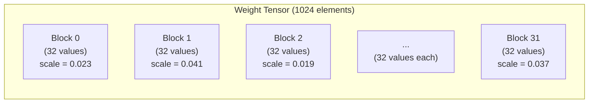

# Quantization Fundamentals

Quantization maps high-precision floating-point weights to low-precision integer
representations, dramatically reducing model size and memory bandwidth
requirements.  This page develops the mathematical theory from first principles,
then specifies the concrete formats used by ZigLlama.

---

## 1. What is Quantization

!!! definition "Quantization"

    A **quantization function** \( Q : \mathbb{R} \to \mathbb{Z} \) maps
    continuous real-valued weights to a finite set of discrete integer levels.
    A corresponding **dequantization function** \( D : \mathbb{Z} \to
    \mathbb{R} \) reconstructs an approximation of the original value.

For uniform quantization with scale factor \( s > 0 \):

\[
  Q(w) = \text{round}\!\left(\frac{w}{s}\right), \qquad
  D(q) = s \cdot q
\]

The reconstructed (dequantized) weight is:

\[
  \hat{w} = D(Q(w)) = s \cdot \text{round}\!\left(\frac{w}{s}\right)
\]

The **quantization error** for a single weight is:

\[
  \epsilon = w - \hat{w} = w - s \cdot \text{round}\!\left(\frac{w}{s}\right)
\]

This error is bounded by \( |\epsilon| \leq s/2 \), with equality when
\( w/s \) falls exactly halfway between two integers.

---

## 2. Quantization Error Analysis

### Mean Squared Error

For a weight vector \( \mathbf{w} \in \mathbb{R}^n \), the MSE of quantization
is:

\[
  \text{MSE} = \frac{1}{n} \sum_{i=1}^{n} (w_i - \hat{w}_i)^2
\]

!!! theorem "MSE for uniform quantization"

    If weights are uniformly distributed within each quantization bin, the
    expected MSE for a scale factor \( s \) is:

    \[
      \mathbb{E}[\text{MSE}] = \frac{s^2}{12}
    \]

    This follows from the variance of a uniform distribution on
    \( [-s/2, \, s/2] \).

### Signal-to-Quantization-Noise Ratio (SQNR)

The quality of quantization is often measured in decibels:

\[
  \text{SQNR} = 10 \log_{10} \frac{\text{Var}(\mathbf{w})}{\text{MSE}}
  \approx 10 \log_{10} \frac{12 \,\text{Var}(\mathbf{w})}{s^2} \text{ dB}
\]

!!! notation "Rule of thumb"

    Each additional bit of precision adds approximately 6 dB of SQNR.
    Going from 8-bit to 4-bit quantization loses roughly 24 dB -- a 250x
    increase in relative noise power.  This explains why naive 4-bit
    quantization degrades model quality significantly, motivating the
    block-wise and K-quantization schemes described in later sections.

---

## 3. Symmetric vs Asymmetric Quantization

### Symmetric Quantization

The zero point is fixed at zero.  The scale maps the weight range
\( [-\alpha, \alpha] \) to the integer range \( [-2^{b-1}, 2^{b-1}-1] \):

\[
  s = \frac{\alpha}{2^{b-1} - 1}, \qquad \alpha = \max_i |w_i|
\]

\[
  Q(w) = \text{clamp}\!\left(\text{round}\!\left(\frac{w}{s}\right),\; -2^{b-1},\; 2^{b-1}-1\right)
\]

Dequantization: \( \hat{w} = s \cdot q \).

**Advantage:** No zero-point storage; simpler dequantization arithmetic.

**Disadvantage:** If the weight distribution is asymmetric (e.g., all positive),
half the integer range is wasted.

### Asymmetric Quantization

A zero-point offset \( z \) shifts the mapping to accommodate non-symmetric
distributions:

\[
  s = \frac{w_{\max} - w_{\min}}{2^b - 1}, \qquad
  z = \text{round}\!\left(-\frac{w_{\min}}{s}\right)
\]

\[
  Q(w) = \text{clamp}\!\left(\text{round}\!\left(\frac{w}{s}\right) + z,\; 0,\; 2^b - 1\right)
\]

Dequantization: \( \hat{w} = s \cdot (q - z) \).

!!! definition "Zero-point"

    The **zero-point** \( z \) is an integer that represents the real value
    zero in the quantized domain.  It ensures that floating-point 0.0
    is exactly representable, which is important for preserving sparsity
    patterns and padding behaviour in neural networks.

---

## 4. Block-wise Quantization

### Why Per-Tensor Scale is Insufficient

!!! theorem "Outlier sensitivity"

    If a weight tensor has even a single outlier \( w_{\max} \gg
    \text{median}(|w_i|) \), the per-tensor scale \( s = w_{\max} / (2^{b-1}
    - 1) \) will be dominated by the outlier.  The majority of weights --
    clustered near zero -- will be quantized to very few integer levels,
    severely degrading reconstruction quality.

    Dettmers et al.[^1] showed that transformer weights exhibit
    "emergent outliers" -- a small fraction of values (< 0.1%) that are
    orders of magnitude larger than the rest.

### Block-wise Solution

Instead of one scale for the entire tensor, divide it into contiguous blocks
of \( B \) elements, each with its own scale:

\[
  s_j = \frac{\max_{i \in \text{block}_j} |w_i|}{2^{b-1} - 1}
\]

Each block adapts independently to its local weight distribution, reducing
the impact of outliers to a single block.



The standard block size in GGML-format quantization is **32 elements**,
balancing granularity against the overhead of storing one scale per block.

---

## 5. Q8_0 Format

!!! definition "Q8_0 -- 8-bit block quantization"

    Each block encodes **32 values** using 1 f16 scale factor and 32 int8
    quantized values.

### Block Layout

| Field | Type | Size (bytes) | Description |
|-------|------|:-:|-------------|
| `d` | `f16` | 2 | Block scale factor |
| `qs[0..31]` | `[32]i8` | 32 | Quantized values |
| **Total** | | **34** | **Per 32 elements** |

### Quantization

\[
  d = \frac{\max_{i} |w_i|}{127}, \qquad
  q_i = \text{round}\!\left(\frac{w_i}{d}\right) \in [-128, 127]
\]

### Dequantization

\[
  \hat{w}_i = q_i \cdot d
\]

```zig
pub const BlockQ8_0 = extern struct {
    d: f16,             // scale
    qs: [32]i8,         // quantized values

    pub fn dequantize(self: BlockQ8_0, output: *[32]f32) void {
        const scale: f32 = @floatCast(self.d);
        for (0..32) |i| {
            output[i] = @as(f32, @floatFromInt(self.qs[i])) * scale;
        }
    }
};
```

### Bits per Weight

\[
  \text{bpw} = \frac{34 \text{ bytes} \times 8 \text{ bits}}{32 \text{ values}} = 8.5 \text{ bpw}
\]

!!! notation "bpw vs raw bit width"

    The "8-bit" in Q8_0 refers to the integer precision.  The effective bpw
    is 8.5 because of the scale overhead.  Some sources round this to 9 bpw
    when including alignment padding.

---

## 6. Q4_0 Format

!!! definition "Q4_0 -- 4-bit block quantization"

    Each block encodes **32 values** using 1 f16 scale factor and 16 bytes of
    packed 4-bit values (two nibbles per byte).

### Block Layout

| Field | Type | Size (bytes) | Description |
|-------|------|:-:|-------------|
| `d` | `f16` | 2 | Block scale factor |
| `qs[0..15]` | `[16]u8` | 16 | Packed 4-bit values (2 per byte) |
| **Total** | | **18** | **Per 32 elements** |

### Nibble Packing

Each byte stores two quantized values in unsigned 4-bit format (range 0--15):

```
byte[j]:  [ high nibble (value 2j+1) | low nibble (value 2j) ]
```

Extraction:

```zig
const low: u4 = @truncate(byte);       // value at even index
const high: u4 = @truncate(byte >> 4); // value at odd index
```

### Quantization

\[
  d = \frac{\max_i |w_i|}{7}, \qquad
  q_i = \text{round}\!\left(\frac{w_i}{d}\right) + 8 \in [0, 15]
\]

The offset of 8 maps the symmetric range \( [-8, 7] \) to unsigned \( [0, 15] \).

### Dequantization

\[
  \hat{w}_i = (q_i - 8) \cdot d
\]

```zig
pub const BlockQ4_0 = extern struct {
    d: f16,             // scale
    qs: [16]u8,         // packed 4-bit values (2 per byte)

    pub fn dequantize(self: BlockQ4_0, output: *[32]f32) void {
        const scale: f32 = @floatCast(self.d);
        for (0..16) |j| {
            const byte = self.qs[j];
            const low: i32 = @as(i32, @as(u4, @truncate(byte))) - 8;
            const high: i32 = @as(i32, @as(u4, @truncate(byte >> 4))) - 8;
            output[2 * j] = @as(f32, @floatFromInt(low)) * scale;
            output[2 * j + 1] = @as(f32, @floatFromInt(high)) * scale;
        }
    }
};
```

### Bits per Weight

\[
  \text{bpw} = \frac{18 \times 8}{32} = 4.5 \text{ bpw}
\]

---

## 7. INT8 Format

!!! definition "INT8 -- per-tensor 8-bit quantization with zero-point"

    Unlike Q8_0 (which is block-wise with no zero-point), the INT8 format
    uses a **global** scale and zero-point for the entire tensor.  This
    matches the quantization scheme described in the LLM.int8() paper.[^1]

### Parameters

| Parameter | Type | Description |
|-----------|------|-------------|
| `scale` | `f32` | Global scale factor |
| `zero_point` | `i32` | Global zero-point offset |
| `data` | `[]u8` | Quantized values (unsigned 8-bit) |

### Quantization

\[
  s = \frac{w_{\max} - w_{\min}}{255}, \qquad
  z = \text{round}\!\left(-\frac{w_{\min}}{s}\right)
\]

\[
  q_i = \text{clamp}\!\left(\text{round}\!\left(\frac{w_i}{s}\right) + z,\; 0,\; 255\right)
\]

### Dequantization

\[
  \hat{w}_i = s \cdot (q_i - z)
\]

```zig
pub const QuantizedINT8 = struct {
    scale: f32,
    zero_point: i32,
    data: []const u8,

    pub fn dequantize(self: QuantizedINT8, output: []f32) void {
        for (self.data, 0..) |q, i| {
            output[i] = self.scale *
                @as(f32, @floatFromInt(@as(i32, q) - self.zero_point));
        }
    }
};
```

!!! complexity "Per-tensor vs block-wise trade-off"

    | Scheme | Scale overhead | Outlier robustness | Arithmetic cost |
    |--------|:-:|:-:|:-:|
    | Per-tensor (INT8) | Negligible | Poor | 1 mul + 1 sub per element |
    | Block-wise (Q8_0) | 2 bytes / 32 elements | Good | 1 mul per element |
    | Block-wise (Q4_0) | 2 bytes / 32 elements | Good | 1 mul + 1 sub + bit extract |

---

## 8. Storage Efficiency

The following table compares storage requirements for a 7B-parameter model
(approximately 7 billion weights).

| Format | Bits per Weight | Bytes per 32 Values | Model Size (7B) | Compression vs F32 |
|--------|:-:|:-:|:-:|:-:|
| F32 | 32.0 | 128 | 26.0 GB | 1.0x |
| F16 | 16.0 | 64 | 13.0 GB | 2.0x |
| Q8_0 | 8.5 | 34 | 6.9 GB | 3.8x |
| Q4_0 | 4.5 | 18 | 3.7 GB | 7.1x |
| INT8 (per-tensor) | 8.0 | 32 + global overhead | 6.5 GB | 4.0x |

!!! algorithm "Calculating model size"

    For a model with \( P \) parameters at \( b \) bits per weight:

    \[
      \text{Size} = \frac{P \times b}{8} \text{ bytes}
    \]

    For Q8_0 with block overhead:
    \[
      \text{Size} = P \times \frac{34}{32} = P \times 1.0625 \text{ bytes}
    \]

### Memory Bandwidth Implications

!!! complexity "Inference is memory-bandwidth bound"

    During single-token generation, the model weights are read once per token
    but participate in relatively few FLOPs (one multiply-add per weight per
    output element).  The operational intensity is:

    \[
      \text{OI} = \frac{2 \text{ FLOPs}}{b/8 \text{ bytes}} = \frac{16}{b} \text{ FLOP/byte}
    \]

    For Q4_0 (\( b = 4.5 \)): OI = 3.6 FLOP/byte, well below the compute
    ceiling of modern CPUs (~10 FLOP/byte).  This means **quantization
    directly translates to proportional speedup** via reduced memory traffic.

---

## 9. Impact on Model Quality

Quantization introduces approximation error that propagates through every layer
of the model.  The standard metric is **perplexity** -- lower is better.

!!! theorem "Perplexity degradation"

    The perplexity increase from quantization is approximately exponential in
    the noise power:

    \[
      \text{PPL}_{\text{quant}} \approx \text{PPL}_{\text{fp}} \cdot
      \exp\!\left(\frac{\lambda \cdot \text{MSE}_{\text{quant}}}{\text{Var}(\mathbf{w})}\right)
    \]

    where \( \lambda \) is a model-dependent sensitivity constant.

### LLaMA-7B Perplexity Benchmarks

Measured on WikiText-2 (lower is better):

| Format | bpw | Perplexity | Degradation vs F16 |
|--------|:-:|:-:|:-:|
| F16 | 16.0 | 5.68 | -- |
| Q8_0 | 8.5 | 5.69 | +0.02% |
| Q4_0 | 4.5 | 5.96 | +4.9% |
| Q4_K_M | 4.5 | 5.73 | +0.9% |
| IQ4_XS | 4.25 | 5.75 | +1.2% |
| Q2_K | 3.35 | 6.81 | +19.9% |

!!! notation "Quality cliff"

    There is a soft quality cliff around 3 bpw for most models.  Below this
    threshold, perplexity rises rapidly.  K-quantization and importance
    quantization (covered in subsequent pages) push this cliff lower by
    allocating bits more intelligently.

---

## 10. QuantizedTensor API

ZigLlama provides a generic `QuantizedTensor` type parameterised by the
quantization format:

```zig
pub fn QuantizedTensor(comptime quant_type: QuantType) type {
    const BlockType = quant_type.BlockType();

    return struct {
        const Self = @This();

        blocks: []const BlockType,
        n_elements: usize,

        /// Dequantize the entire tensor into a pre-allocated f32 buffer.
        pub fn dequantize(self: Self, output: []f32) void {
            std.debug.assert(output.len >= self.n_elements);
            const block_size = quant_type.blockSize();
            for (self.blocks, 0..) |block, bi| {
                const start = bi * block_size;
                const end = @min(start + block_size, self.n_elements);
                block.dequantize(output[start..end]);
            }
        }

        /// Dequantize a single block at the given index.
        pub fn dequantizeBlock(self: Self, block_idx: usize, output: []f32) void {
            self.blocks[block_idx].dequantize(output);
        }

        /// Return the quantized dot product with a f32 vector.
        /// Dequantizes on the fly to avoid materialising the full tensor.
        pub fn dot(self: Self, vec: []const f32) f32 {
            var sum: f32 = 0.0;
            const block_size = quant_type.blockSize();
            var buf: [block_size]f32 = undefined;

            for (self.blocks, 0..) |block, bi| {
                const start = bi * block_size;
                block.dequantize(&buf);
                const len = @min(block_size, self.n_elements - start);
                for (0..len) |i| {
                    sum += buf[i] * vec[start + i];
                }
            }
            return sum;
        }

        /// Number of quantized blocks.
        pub fn numBlocks(self: Self) usize {
            return self.blocks.len;
        }

        /// Storage size in bytes.
        pub fn sizeBytes(self: Self) usize {
            return self.blocks.len * @sizeOf(BlockType);
        }
    };
}
```

### Supported Quantization Types

```zig
pub const QuantType = enum {
    q8_0,
    q4_0,
    int8,
    q4_k,
    q5_k,
    q6_k,
    iq1_s,
    iq2_xs,
    iq3_s,
    iq4_xs,
    iq4_nl,
    // ... additional formats

    pub fn BlockType(comptime self: QuantType) type {
        return switch (self) {
            .q8_0 => BlockQ8_0,
            .q4_0 => BlockQ4_0,
            .q4_k => BlockQ4K,
            // ... etc.
        };
    }

    pub fn blockSize(comptime self: QuantType) usize {
        return switch (self) {
            .q8_0, .q4_0 => 32,
            .q4_k, .q5_k, .q6_k => 256,
            // ... etc.
        };
    }

    pub fn bitsPerWeight(self: QuantType) f32 {
        return switch (self) {
            .q8_0 => 8.5,
            .q4_0 => 4.5,
            .int8 => 8.0,
            .q4_k => 4.5,
            .q5_k => 5.5,
            .q6_k => 6.5,
            // ... etc.
        };
    }
};
```

!!! algorithm "Quantize API"

    The `quantize` function converts a raw f32 slice into a `QuantizedTensor`:

    ```zig
    pub fn quantize(
        comptime quant_type: QuantType,
        data: []const f32,
        allocator: std.mem.Allocator,
    ) !QuantizedTensor(quant_type) {
        const block_size = quant_type.blockSize();
        const n_blocks = (data.len + block_size - 1) / block_size;
        const blocks = try allocator.alloc(quant_type.BlockType(), n_blocks);

        for (0..n_blocks) |bi| {
            const start = bi * block_size;
            const end = @min(start + block_size, data.len);
            blocks[bi] = quant_type.BlockType().fromFloat(data[start..end]);
        }

        return .{ .blocks = blocks, .n_elements = data.len };
    }
    ```

---

## References

[^1]: Dettmers, T. et al. "LLM.int8(): 8-bit Matrix Multiplication for Transformers at Scale." *NeurIPS*, 2022. https://arxiv.org/abs/2208.07339
[^2]: Jacob, B. et al. "Quantization and Training of Neural Networks for Efficient Integer-Arithmetic-Only Inference." *CVPR*, 2018. https://arxiv.org/abs/1712.05877
[^3]: Gerganov, G. "GGML Quantization Formats." https://github.com/ggerganov/ggml
[^4]: Frantar, E. et al. "GPTQ: Accurate Post-Training Quantization for Generative Pre-trained Transformers." *ICLR*, 2023. https://arxiv.org/abs/2210.17323
