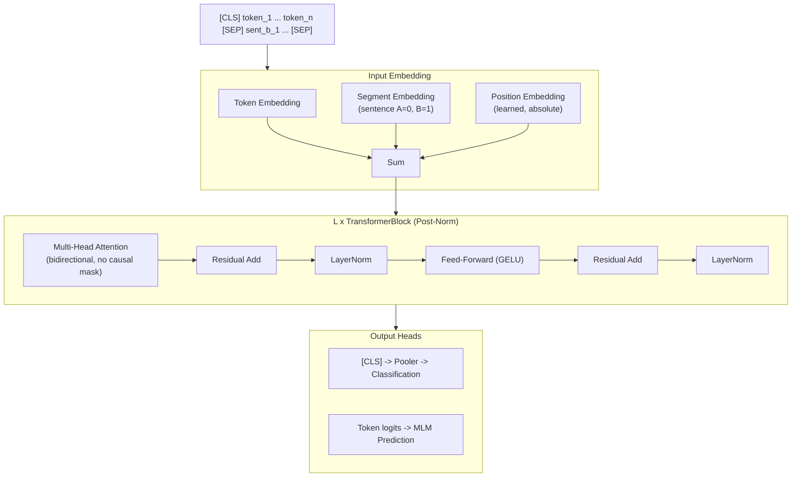

# BERT -- Bidirectional Encoder

**BERT** (Bidirectional Encoder Representations from Transformers) fundamentally
changed NLP when it was introduced by Devlin et al. in 2018[^1].  Unlike the
decoder-only, left-to-right models that dominate text generation, BERT is an
**encoder-only** model that attends bidirectionally -- every token can attend
to every other token in the sequence, including future positions.  This design
makes BERT unsuitable for autoregressive generation but exceptionally powerful
for understanding tasks: classification, named entity recognition, question
answering, and sentence embeddings.

---

## 1. Architecture Overview

!!! info "Historical Impact"

    BERT established the "pre-train then fine-tune" paradigm that became the
    default approach for NLP.  Pre-trained on Masked Language Modeling (MLM) and
    Next Sentence Prediction (NSP), BERT could be fine-tuned with a single
    additional output layer on any downstream task, achieving state-of-the-art
    results on 11 NLP benchmarks simultaneously[^1].

BERT uses the encoder half of the original Transformer architecture (Vaswani
et al., 2017)[^2] with **post-norm** residual connections (LayerNorm applied
after the residual addition, unlike the pre-norm design in LLaMA).

---

## 2. Key Innovations

### 2.1 Bidirectional Attention

In causal (autoregressive) models, the attention mask prevents token \( i \)
from attending to any token \( j > i \).  BERT removes this constraint:

!!! definition "Bidirectional vs. Causal Attention"

    **Causal (GPT-style):**

    \[
        \alpha_{ij} = \begin{cases}
            \text{softmax}(q_i^T k_j / \sqrt{d}) & \text{if } j \leq i \\
            0 & \text{if } j > i
        \end{cases}
    \]

    **Bidirectional (BERT-style):**

    \[
        \alpha_{ij} = \frac{\exp(q_i^T k_j / \sqrt{d})}{\sum_{t=1}^{n} \exp(q_i^T k_t / \sqrt{d})}
    \]

    Every token attends to every other token.  No causal mask is applied.

### 2.2 Masked Language Modeling (MLM)

Instead of predicting the next token (autoregressive), BERT is trained to
predict **masked** tokens:

!!! algorithm "MLM Pre-training"

    1. Randomly select 15% of input tokens for prediction
    2. Of those selected tokens:
        - 80% are replaced with `[MASK]`
        - 10% are replaced with a random token
        - 10% are kept unchanged
    3. The model predicts the original token at each masked position:

    \[
        \mathcal{L}_{\text{MLM}} = -\sum_{i \in \mathcal{M}} \log P(x_i \mid x_{\setminus \mathcal{M}})
    \]

    where \( \mathcal{M} \) is the set of masked positions and
    \( x_{\setminus \mathcal{M}} \) denotes the input with masked tokens.

### 2.3 Next Sentence Prediction (NSP)

BERT also learns to predict whether two segments are consecutive in the
original text:

\[
    P(\text{IsNext} \mid \text{[CLS]}) = \sigma(h_{\text{[CLS]}} \, w_{\text{NSP}} + b)
\]

!!! info "NSP Controversy"

    Later work (RoBERTa[^3]) showed that NSP provides minimal benefit and can
    even hurt performance.  Most BERT successors dropped it in favor of
    MLM-only training or other pre-training objectives.

### 2.4 Three-Part Input Embedding

BERT's input is the sum of three embedding types:

\[
    e_i = E_{\text{token}}[x_i] + E_{\text{segment}}[s_i] + E_{\text{position}}[i]
\]

where:

- \( E_{\text{token}} \) maps tokens to dense vectors
- \( E_{\text{segment}} \) distinguishes sentence A from sentence B
- \( E_{\text{position}} \) provides learned absolute position embeddings

---

## 3. Architecture Diagram



---

## 4. Configuration Parameters

| Parameter | BERT-Base | BERT-Large |
|-----------|:---------:|:----------:|
| `n_layers` (L) | 12 | 24 |
| `d_model` (d) | 768 | 1024 |
| `n_heads` (H) | 12 | 16 |
| `d_ff` | 3072 | 4096 |
| `vocab_size` | 30522 | 30522 |
| `max_seq_len` | 512 | 512 |
| `activation` | GELU | GELU |
| `norm_type` | Post-LayerNorm | Post-LayerNorm |
| `positional_encoding` | Learned absolute | Learned absolute |
| `type_vocab_size` | 2 | 2 |
| **Total parameters** | **110M** | **340M** |

---

## 5. Mathematical Formulation

### 5.1 Post-Norm Transformer Block

BERT uses post-norm (original Transformer style), which differs from the
pre-norm design used in LLaMA and most modern decoders:

\[
    h' = \text{LayerNorm}(x + \text{MHA}(x))
\]
\[
    h'' = \text{LayerNorm}(h' + \text{FFN}(h'))
\]

!!! info "Pre-Norm vs. Post-Norm"

    In pre-norm (LLaMA-style): \( h' = x + \text{MHA}(\text{LN}(x)) \).
    Pre-norm is more stable during training (gradients flow through the
    residual path unmodified), but post-norm can achieve slightly better
    final performance with careful learning rate warmup.

### 5.2 Feed-Forward Network

\[
    \text{FFN}(x) = \text{GELU}(xW_1 + b_1)W_2 + b_2
\]

BERT was the first major model to use GELU activation instead of ReLU in the
feed-forward layers.

### 5.3 Pooler

For classification tasks, BERT uses the hidden state of the `[CLS]` token,
passed through a pooler layer:

\[
    p = \tanh(h_{\text{[CLS]}} W_p + b_p)
\]

---

## 6. Zig Implementation

### 6.1 BERTConfig

```zig
pub const BERTConfig = struct {
    n_layers: u32,
    d_model: u32,
    n_heads: u32,
    d_ff: u32,
    vocab_size: u32 = 30522,
    max_seq_len: u32 = 512,
    type_vocab_size: u32 = 2,     // segment types (sentence A, B)
    norm_eps: f32 = 1e-12,
    activation: ActivationType = .gelu,
    use_post_norm: bool = true,   // BERT uses post-norm

    pub fn headDim(self: BERTConfig) u32 {
        return self.d_model / self.n_heads;
    }
};
```

### 6.2 BERT Embedding

```zig
pub const BERTEmbedding = struct {
    token_embedding: Tensor(f32),      // [vocab_size, d_model]
    segment_embedding: Tensor(f32),    // [type_vocab_size, d_model]
    position_embedding: Tensor(f32),   // [max_seq_len, d_model]
    layernorm: LayerNorm,

    pub fn forward(
        self: *BERTEmbedding,
        token_ids: []const u32,
        segment_ids: []const u32,
        position_ids: []const u32,
    ) !Tensor(f32) {
        var output = try self.token_embedding.lookup(token_ids);

        // Sum all three embeddings
        for (0..token_ids.len) |i| {
            const seg = self.segment_embedding.row(segment_ids[i]);
            const pos = self.position_embedding.row(position_ids[i]);
            for (0..self.d_model) |j| {
                output.data[i * self.d_model + j] += seg[j] + pos[j];
            }
        }

        return self.layernorm.forward(output);
    }
};
```

### 6.3 Bidirectional Attention

```zig
pub const BidirectionalAttention = struct {
    wq: Linear,
    wk: Linear,
    wv: Linear,
    wo: Linear,
    n_heads: u32,

    pub fn forward(self: *BidirectionalAttention, x: Tensor(f32)) !Tensor(f32) {
        const q = self.wq.forward(x);
        const k = self.wk.forward(x);
        const v = self.wv.forward(x);

        // Reshape to [seq, n_heads, d_head] and transpose
        // Compute attention scores WITHOUT causal mask
        const scores = matmul(q, transpose(k));
        const scale = 1.0 / @sqrt(@as(f32, @floatFromInt(self.headDim())));
        const scaled = elementScale(scores, scale);

        // No causal mask -- all positions attend to all positions
        const attn_weights = softmax(scaled, .last_dim);
        const context = matmul(attn_weights, v);

        return self.wo.forward(context);
    }
};
```

### 6.4 Post-Norm Block

```zig
pub const BERTBlock = struct {
    attention: BidirectionalAttention,
    ffn: FeedForward,
    ln1: LayerNorm,
    ln2: LayerNorm,

    pub fn forward(self: *BERTBlock, x: Tensor(f32)) !Tensor(f32) {
        // Post-norm: LayerNorm(x + sublayer(x))
        const attn_out = try self.attention.forward(x);
        const normed1 = self.ln1.forward(residualAdd(x, attn_out));

        const ffn_out = try self.ffn.forward(normed1);
        return self.ln2.forward(residualAdd(normed1, ffn_out));
    }
};
```

---

## 7. Variants

| Variant | Year | Key Change | Reference |
|---------|------|-----------|-----------|
| **DistilBERT** | 2019 | Knowledge distillation, 6 layers, 40% smaller, 60% faster | Sanh et al.[^4] |
| **RoBERTa** | 2019 | Drops NSP, dynamic masking, more data, longer training | Liu et al.[^3] |
| **ALBERT** | 2020 | Factorized embeddings, cross-layer parameter sharing | Lan et al.[^5] |
| **DeBERTa** | 2021 | Disentangled attention (separate content and position) | He et al. |
| **BERT-Large-WWM** | 2019 | Whole-word masking instead of subword masking | Google |

---

## 8. Educational Value

!!! tip "What BERT Teaches"

    1. **Encoder vs. decoder**: BERT is the essential counterpart to
       decoder-only models (GPT, LLaMA).  Understanding both halves of the
       Transformer -- bidirectional encoding and causal decoding -- provides
       a complete picture of the architecture.

    2. **Pre-training objectives**: Comparing MLM (predict masked tokens from
       context) with autoregressive LM (predict next token) illuminates how
       training objectives shape what a model learns.  MLM forces the model to
       build bidirectional representations.

    3. **Post-norm vs. pre-norm**: BERT uses the original post-norm design,
       making it a natural reference point when studying why modern models
       switched to pre-norm for improved training stability.

    4. **Segment and position embeddings**: BERT's three-way embedding sum
       (token + segment + position) is the most explicit form of input
       representation in transformer models, making it pedagogically clear
       how different information sources combine.

    5. **Fine-tuning paradigm**: BERT established that a single pre-trained
       model can serve dozens of downstream tasks, a concept that evolved
       into few-shot and zero-shot learning in GPT-3 and beyond.

---

## 9. References

[^1]: Devlin, J. et al. "BERT: Pre-training of Deep Bidirectional Transformers for Language Understanding." *NAACL*, 2019.
[^2]: Vaswani, A. et al. "Attention Is All You Need." *NeurIPS*, 2017.
[^3]: Liu, Y. et al. "RoBERTa: A Robustly Optimized BERT Pretraining Approach." *arXiv:1907.11692*, 2019.
[^4]: Sanh, V. et al. "DistilBERT, a distilled version of BERT: smaller, faster, cheaper and lighter." *arXiv:1910.01108*, 2019.
[^5]: Lan, Z. et al. "ALBERT: A Lite BERT for Self-supervised Learning of Language Representations." *ICLR*, 2020.
