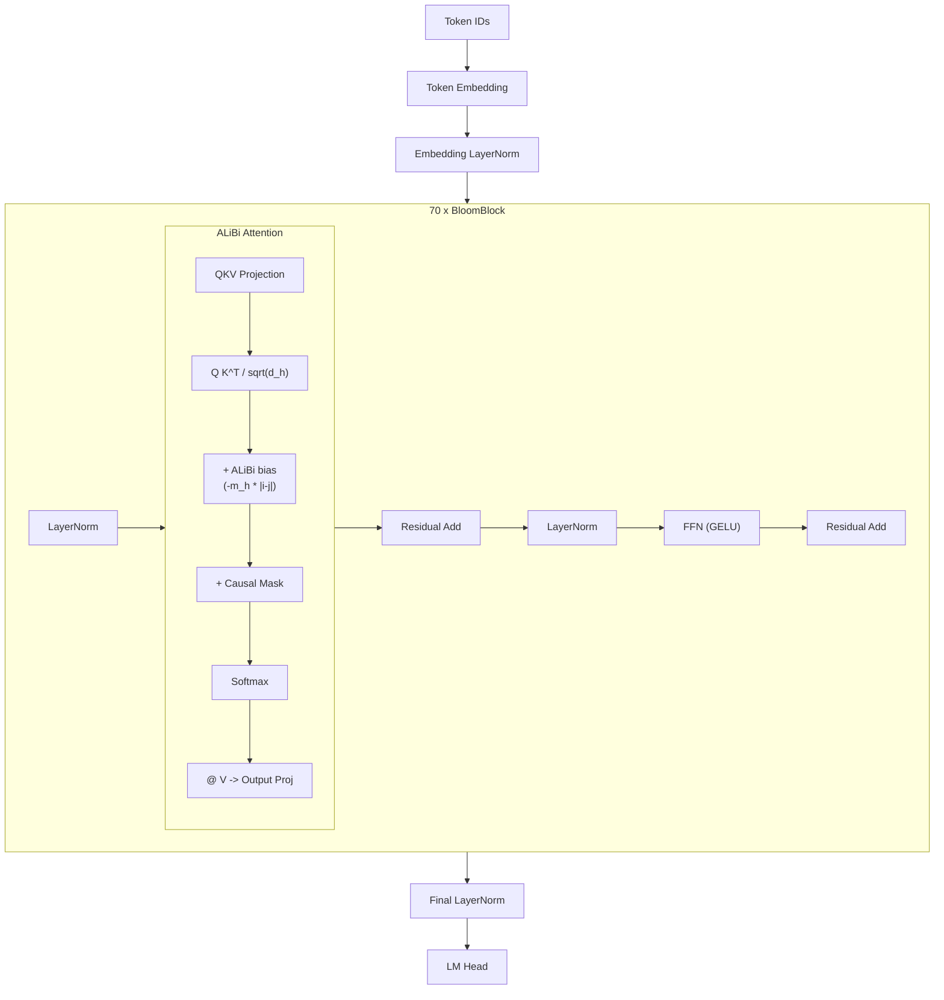

# BLOOM

**BLOOM** (BigScience Large Open-science Open-access Multilingual Language
Model) is a 176-billion-parameter autoregressive model trained by over 1,000
researchers across 60 countries as part of the BigScience initiative.  Released
in 2022, BLOOM was the first open-access model to match the scale of GPT-3
175B.  Its architecture makes two distinctive choices: **ALiBi** (Attention
with Linear Biases) for positional encoding and **embedding LayerNorm** for
stabilizing the initial representations[^1].

---

## 1. Architecture Overview

!!! info "The BigScience Collaboration"

    BLOOM was trained on the ROOTS corpus -- 1.6TB of text in 46 natural
    languages and 13 programming languages.  Training ran for 3.5 months on
    384 A100-80GB GPUs at the Jean Zay supercomputer in France.  The model
    and training details are documented in Scao et al. (2022)[^1].

BLOOM is a decoder-only transformer that forgoes learned or rotary position
embeddings entirely.  Instead, it injects positional information through
**linear biases** added directly to attention scores.

---

## 2. Key Innovations

### 2.1 ALiBi (Attention with Linear Biases)

ALiBi replaces explicit positional embeddings with a simple linear penalty
on attention scores proportional to the distance between query and key
positions[^2].

!!! definition "ALiBi Attention Bias"

    For query position \( i \) and key position \( j \), the attention score
    in head \( h \) is:

    \[
        \text{score}_{ij}^{(h)} = q_i^T k_j - m_h \cdot |i - j|
    \]

    where \( m_h \) is a **head-specific slope** that is fixed (not learned).
    The slopes are set as a geometric sequence:

    \[
        m_h = \frac{1}{2^{h \cdot 8/H}}, \quad h = 1, 2, \ldots, H
    \]

    where \( H \) is the total number of attention heads.

!!! algorithm "ALiBi Bias Matrix Construction"

    **Input:** sequence length \( s \), number of heads \( H \)

    **Output:** bias tensor \( B \in \mathbb{R}^{H \times s \times s} \)

    1. Compute slopes: \( m_h = 2^{-8h/H} \) for \( h = 1, \ldots, H \)
    2. For each head \( h \):
        - For each \( i, j \in \{0, \ldots, s-1\} \):
            - \( B_{h,i,j} = -m_h \cdot |i - j| \)
    3. Combine with causal mask: set \( B_{h,i,j} = -\infty \) where \( j > i \)

The key property of ALiBi is that nearby tokens attend to each other more
strongly than distant tokens, with the decay rate varying across heads.
Low-slope heads can attend broadly; high-slope heads focus locally.

### 2.2 Embedding LayerNorm

BLOOM applies LayerNorm immediately after the token embedding lookup and
before the first transformer block:

\[
    h^{(0)} = \text{LayerNorm}(\text{Embed}(x))
\]

This stabilizes the scale of the initial hidden states, which is particularly
important at BLOOM's 176B scale where embedding vectors can have large
variance.

### 2.3 Multilingual Design

BLOOM was explicitly designed for multilingual generation.  The tokenizer uses
byte-level BPE with a vocabulary of 250,680 tokens, large enough to provide
reasonable coverage for all 46 languages in the training corpus without
excessive fragmentation.

---

## 3. Architecture Diagram



---

## 4. Configuration Parameters

| Parameter | BLOOM-560M | BLOOM-7.1B | BLOOM-176B |
|-----------|:---:|:---:|:---:|
| `n_layers` | 24 | 30 | 70 |
| `d_model` | 1024 | 4096 | 14336 |
| `n_heads` | 16 | 32 | 112 |
| `d_ff` | 4096 | 16384 | 57344 |
| `vocab_size` | 250680 | 250680 | 250680 |
| `max_seq_len` | 2048 | 2048 | 2048 |
| `positional_encoding` | ALiBi | ALiBi | ALiBi |
| `embedding_layernorm` | true | true | true |
| `activation` | GELU | GELU | GELU |
| `use_bias` | true | true | true |
| `norm_eps` | 1e-5 | 1e-5 | 1e-5 |

---

## 5. Mathematical Formulation

### 5.1 ALiBi Slope Computation

For \( H \) attention heads, the slopes form a geometric sequence:

\[
    m_h = 2^{-\frac{8h}{H}}, \quad h = 1, 2, \ldots, H
\]

For BLOOM-176B with \( H = 112 \), the slopes range from
\( 2^{-8/112} \approx 0.952 \) (broadest attention) to
\( 2^{-8} = 0.00391 \) (sharpest local attention).

### 5.2 Full Attention Score

\[
    A_{ij}^{(h)} = \frac{q_i^T k_j}{\sqrt{d_h}} - m_h \cdot |i - j| + M_{ij}^{\text{causal}}
\]

\[
    \alpha_{ij}^{(h)} = \frac{\exp(A_{ij}^{(h)})}{\sum_{t=0}^{i} \exp(A_{it}^{(h)})}
\]

### 5.3 Embedding with Normalization

\[
    e = E[x_{\text{token}}], \quad h^{(0)} = \frac{e - \mu_e}{\sqrt{\sigma_e^2 + \epsilon}} \cdot \gamma + \beta
\]

where \( E \in \mathbb{R}^{V \times d} \) is the embedding matrix and
\( \gamma, \beta \in \mathbb{R}^d \) are learnable LayerNorm parameters.

### 5.4 Sequential Residual Block

Unlike GPT-J/NeoX, BLOOM uses the **sequential** (standard) residual pattern:

\[
    x' = x + \text{Attn}(\text{LN}(x))
\]
\[
    x'' = x' + \text{FFN}(\text{LN}(x'))
\]

---

## 6. Zig Implementation

### 6.1 BloomConfig

```zig
pub const BloomConfig = struct {
    n_layers: u32,
    d_model: u32,
    n_heads: u32,
    d_ff: u32,
    vocab_size: u32 = 250680,
    max_seq_len: u32 = 2048,
    embedding_layernorm: bool = true,
    norm_eps: f32 = 1e-5,
    activation: ActivationType = .gelu,

    pub fn headDim(self: BloomConfig) u32 {
        return self.d_model / self.n_heads;
    }
};
```

### 6.2 ALiBi Attention

```zig
pub const ALiBiAttention = struct {
    slopes: []f32,    // precomputed per-head slopes
    n_heads: u32,

    pub fn init(allocator: Allocator, n_heads: u32) !ALiBiAttention {
        const slopes = try allocator.alloc(f32, n_heads);
        for (0..n_heads) |h| {
            const ratio = @as(f32, @floatFromInt(h + 1)) * 8.0
                / @as(f32, @floatFromInt(n_heads));
            slopes[h] = std.math.pow(f32, 2.0, -ratio);
        }
        return .{ .slopes = slopes, .n_heads = n_heads };
    }

    pub fn addBias(
        self: *ALiBiAttention,
        scores: []f32,       // [n_heads, seq_len, seq_len]
        seq_len: u32,
    ) void {
        for (0..self.n_heads) |h| {
            for (0..seq_len) |i| {
                for (0..seq_len) |j| {
                    const dist = if (i >= j) i - j else j - i;
                    const bias = -self.slopes[h]
                        * @as(f32, @floatFromInt(dist));
                    scores[h * seq_len * seq_len + i * seq_len + j] += bias;
                }
            }
        }
    }
};
```

### 6.3 Embedding with LayerNorm

```zig
pub const BloomEmbedding = struct {
    token_embedding: Tensor(f32),    // [vocab_size, d_model]
    layernorm: LayerNorm,

    pub fn forward(self: *BloomEmbedding, token_ids: []const u32) !Tensor(f32) {
        var embeds = try self.token_embedding.lookup(token_ids);
        // Apply LayerNorm immediately after embedding lookup
        return self.layernorm.forward(embeds);
    }
};
```

---

## 7. Variants

| Variant | Parameters | Languages | Notes |
|---------|-----------|-----------|-------|
| **BLOOM-560M** | 560M | 46 | Smallest, suitable for experimentation |
| **BLOOM-1.1B** | 1.1B | 46 | |
| **BLOOM-1.7B** | 1.7B | 46 | |
| **BLOOM-3B** | 3B | 46 | |
| **BLOOM-7.1B** | 7.1B | 46 | Popular research checkpoint |
| **BLOOM-176B** | 176B | 46 | Full model, requires multi-node inference |
| **BLOOMZ** | 176B | 46 | Instruction-tuned variant |

---

## 8. Educational Value

!!! tip "What BLOOM Teaches"

    1. **ALiBi as an alternative to RoPE**: While most modern models converge
       on RoPE, ALiBi demonstrates a fundamentally different approach --
       injecting positional information as an additive bias rather than a
       multiplicative rotation.  Comparing ALiBi and RoPE deepens
       understanding of what positional encoding actually does.

    2. **No learned position parameters**: ALiBi uses fixed, deterministic
       slopes.  This eliminates position embeddings from the parameter count
       entirely and provides natural length extrapolation -- the model can
       attend to positions it never saw during training.

    3. **Embedding normalization**: The embedding LayerNorm addresses a subtle
       problem: raw embedding vectors can have inconsistent magnitudes across
       the vocabulary.  Normalizing before the first block ensures a stable
       starting point for deep networks.

    4. **Multilingual tokenization**: BLOOM's 250K-token vocabulary is a case
       study in balancing tokenizer efficiency across diverse languages,
       illustrating the tension between vocabulary size, sequence length, and
       per-language coverage.

---

## 9. References

[^1]: Scao, T. L. et al. "BLOOM: A 176B-Parameter Open-Access Multilingual Language Model." *arXiv:2211.05100*, 2022.
[^2]: Press, O., Smith, N. A. & Lewis, M. "Train Short, Test Long: Attention with Linear Biases Enables Input Length Extrapolation." *ICLR*, 2022.
[^3]: Laurençon, H. et al. "The BigScience ROOTS Corpus: A 1.6TB Composite Multilingual Dataset." *NeurIPS Datasets and Benchmarks*, 2022.
