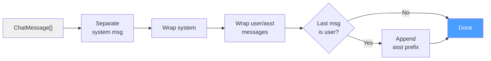

# Chat Templates

## Overview

Chat templates define how multi-turn conversations are formatted into the flat token
sequences that language models consume. Different model families use different
formatting conventions -- special delimiter tokens, role prefixes, system message
placement -- and using the wrong template for a given model produces degraded or
nonsensical output.

ZigLLM implements 10 chat template formats in `src/models/chat_templates.zig`,
covering the major model families deployed in practice.

---

## ChatMessage Struct

Every message in a conversation is represented as a `ChatMessage`:

```zig
pub const ChatMessage = struct {
    role: []const u8,       // "system", "user", "assistant", or "function"
    content: []const u8,    // The message text
    name: ?[]const u8 = null, // Optional sender name
};
```

!!! definition "Valid Roles"
    - **system**: Instructions that set the assistant's behavior for the entire conversation.
    - **user**: Messages from the human interacting with the model.
    - **assistant**: Messages from the model (previous turns in multi-turn conversations).
    - **function**: Tool/function call results (used in agentic workflows).

---

## Supported Templates

The `TemplateType` enum lists all supported formats:

```zig
pub const TemplateType = enum {
    Llama2,      // Meta LLaMA 2 chat format
    CodeLlama,   // Code-specific LLaMA format
    Llama3,      // Meta LLaMA 3 Instruct format
    Mistral,     // Mistral Instruct format
    ChatML,      // OpenAI ChatML format (used by Qwen, Yi, etc.)
    Alpaca,      // Stanford Alpaca instruction format
    Vicuna,      // LMSYS Vicuna format
    Orca,        // Microsoft Orca format
    GPT4,        // OpenAI GPT-4 style
    Claude,      // Anthropic Claude style
    Custom,      // User-defined template
};
```

### Template Structure

Each `ChatTemplate` instance defines the delimiters for every component:

```zig
pub const ChatTemplate = struct {
    template_type: TemplateType,
    system_prefix: []const u8,
    system_suffix: []const u8,
    user_prefix: []const u8,
    user_suffix: []const u8,
    assistant_prefix: []const u8,
    assistant_suffix: []const u8,
    bos_token: []const u8,
    eos_token: []const u8,
    separator: []const u8,
    stop_sequences: [][]const u8,
    add_generation_prompt: bool,
};
```

---

## Template Reference Table

The following table summarizes the key delimiters for each template.

| Template | System Prefix | User Prefix | User Suffix | Asst Prefix | BOS | EOS |
|:---------|:-------------|:------------|:------------|:------------|:----|:----|
| Llama2 | `[INST] <<SYS>>\n` | `[INST] ` | ` [/INST]` | ` ` | `<s>` | `</s>` |
| CodeLlama | `[INST] <<SYS>>\n` | `[INST] ` | ` [/INST]` | ` ` | `<s>` | `</s>` |
| Llama3 | `<\|start_header_id\|>system...` | `<\|start_header_id\|>user...` | `<\|eot_id\|>` | `<\|start_header_id\|>asst...` | `<\|begin_of_text\|>` | `<\|end_of_text\|>` |
| Mistral | *(none)* | `[INST] ` | ` [/INST]` | *(empty)* | `<s>` | `</s>` |
| ChatML | `<\|im_start\|>system\n` | `<\|im_start\|>user\n` | `<\|im_end\|>` | `<\|im_start\|>assistant\n` | *(empty)* | `<\|endoftext\|>` |
| Alpaca | `### System:\n` | `### Human:\n` | `\n\n` | `### Assistant:\n` | *(empty)* | *(empty)* |
| Vicuna | *(none)* | `USER: ` | `\n` | `ASSISTANT: ` | *(empty)* | `</s>` |
| Orca | `System:\n` | `User:\n` | `\n` | `Assistant:\n` | *(empty)* | `<\|im_end\|>` |
| GPT4 | *(none)* | *(empty)* | *(empty)* | *(empty)* | *(empty)* | `<\|endoftext\|>` |
| Claude | *(none)* | `\n\nHuman: ` | *(empty)* | `\n\nAssistant: ` | *(empty)* | *(empty)* |

---

## Template Examples

### Llama 2 Format

Given messages: system="Be helpful", user="Hello", assistant="Hi!", user="How are you?"

Formatted output:

    <s>[INST] <<SYS>>
    Be helpful
    <</SYS>>

    Hello [/INST] Hi! </s><s>[INST] How are you? [/INST]

### Llama 3 Format

    <|begin_of_text|><|start_header_id|>system<|end_header_id|>

    Be helpful<|eot_id|><|start_header_id|>user<|end_header_id|>

    Hello<|eot_id|><|start_header_id|>assistant<|end_header_id|>

    Hi!<|eot_id|><|start_header_id|>user<|end_header_id|>

    How are you?<|eot_id|><|start_header_id|>assistant<|end_header_id|>

### ChatML Format

    <|im_start|>system
    Be helpful<|im_end|>
    <|im_start|>user
    Hello<|im_end|>
    <|im_start|>assistant
    Hi!<|im_end|>
    <|im_start|>user
    How are you?<|im_end|>
    <|im_start|>assistant

### Claude Format

    \n\nHuman: Hello\n\nAssistant: Hi!\n\nHuman: How are you?\n\nAssistant:

---

## The formatMessages API

### Creating a Template

Templates are created via the `ChatTemplate.create()` factory method:

```zig
const template = try ChatTemplate.create(.Llama2, allocator);
defer template.deinit(allocator);
```

### Applying a Template

The `apply()` method formats a slice of `ChatMessage` into a single string:

```zig
const messages = [_]ChatMessage{
    .{ .role = "system", .content = "You are a helpful assistant." },
    .{ .role = "user", .content = "What is 2+2?" },
};

const formatted = try template.apply(&messages, allocator);
defer allocator.free(formatted);
// formatted now contains the properly delimited conversation string
```

!!! algorithm "Apply Algorithm"
    1. Append the BOS token.
    2. Separate system messages from conversation messages.
    3. If a system message exists, wrap it with `system_prefix` and `system_suffix`.
    4. For each conversation message, wrap with the appropriate role prefix/suffix.
    5. Insert `separator` between messages.
    6. If `add_generation_prompt` is true and the last message is from the user,
       append `separator` + `assistant_prefix` to prompt the model.



---

## ChatTemplateManager

The `ChatTemplateManager` provides a higher-level API for managing multiple templates
and auto-detecting the correct template from a model name.

```zig
var manager = ChatTemplateManager.init(allocator);
defer manager.deinit();

// Apply template directly (loads on demand)
const formatted = try manager.applyTemplate(.ChatML, &messages);

// Auto-detect template from model name
const detected = ChatTemplateManager.detectTemplate("meta-llama/Llama-2-7b-chat-hf");
// Returns .Llama2
```

### Auto-Detection Rules

| Model Name Contains | Detected Template |
|:--------------------|:-----------------|
| `llama-3`, `llama3` | Llama3 |
| `code-llama`, `codellama` | CodeLlama |
| `llama-2`, `llama2`, `llama` | Llama2 |
| `mistral`, `mixtral` | Mistral |
| `gpt-4`, `gpt4` | GPT4 |
| `alpaca` | Alpaca |
| `vicuna` | Vicuna |
| `orca` | Orca |
| `claude` | Claude |
| *(default)* | ChatML |

!!! tip "Default to ChatML"
    When the model name does not match any known pattern, the manager defaults to
    ChatML. This is a reasonable default because ChatML is widely adopted by
    community fine-tuned models and has clear, unambiguous delimiters.

---

## Conversation Validation

The `ChatTemplateUtils` module provides utilities for validating and manipulating
conversations before template application.

```zig
// Validate a single message
const is_valid = ChatTemplateUtils.validateMessage(message);

// Validate entire conversation (checks alternating user/assistant pattern)
const conv_valid = ChatTemplateUtils.validateConversation(&messages);

// Estimate token count (rough: 1 token per 4 characters)
const est_tokens = ChatTemplateUtils.estimateTokenCount(formatted_text);

// Truncate conversation to fit context window
const truncated = try ChatTemplateUtils.truncateConversation(
    &messages, max_tokens, allocator, template,
);
```

!!! info "Conversation Structure"
    A valid conversation should follow the pattern:
    `[system]? (user assistant)* user`
    That is, an optional system message, followed by alternating user/assistant
    pairs, ending with a user message that the model will respond to.

---

## Custom Templates

To define a custom template, use the `Custom` template type and modify its fields:

```zig
var custom = try ChatTemplate.create(.Custom, allocator);

// All fields start empty -- customize as needed
custom.system_prefix = "[SYS]";
custom.system_suffix = "[/SYS]";
custom.user_prefix = "[USER]";
custom.user_suffix = "[/USER]";
custom.assistant_prefix = "[BOT]";
custom.assistant_suffix = "[/BOT]";
custom.add_generation_prompt = true;

const formatted = try custom.apply(&messages, allocator);
```

---

## Stop Sequences

Each template defines stop sequences that signal the end of generation. These are
critical for chat applications -- without proper stop sequences, the model may
generate text beyond its intended turn.

| Template | Stop Sequences |
|:---------|:--------------|
| Llama2 | `</s>`, `[/INST]` |
| CodeLlama | `</s>`, `[/INST]`, `` ``` `` |
| Llama3 | `<\|end_of_text\|>`, `<\|eot_id\|>`, `<\|start_header_id\|>` |
| Mistral | `</s>`, `[/INST]` |
| ChatML | `<\|im_end\|>`, `<\|im_start\|>`, `<\|endoftext\|>` |
| Claude | `\n\nHuman:`, `\n\nAssistant:` |

---

## References

[^1]: Touvron, H. et al. "Llama 2: Open Foundation and Fine-Tuned Chat Models." arXiv:2307.09288, 2023.
[^2]: Zheng, L. et al. "Judging LLM-as-a-Judge with MT-Bench and Chatbot Arena." NeurIPS, 2023.
