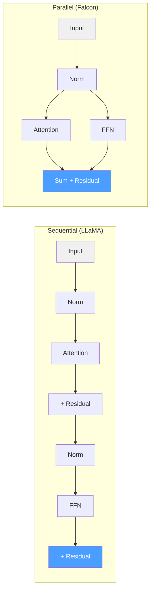

# Falcon

## Overview

Falcon is a family of causal decoder-only language models developed by the
Technology Innovation Institute (TII) of Abu Dhabi, first released in mid-2023[^1].
The Falcon architecture introduced two key efficiency innovations:
**Multi-Query Attention (MQA)** with a single key-value head shared across all
query heads, and **parallel attention+FFN blocks** that compute attention and the
feed-forward network simultaneously rather than sequentially.

ZigLLM implements the Falcon architecture in `src/models/falcon.zig`, covering
all four model sizes (1B, 7B, 40B, 180B) and both the original MQA design and the
later GQA variants.

---

## Key Innovations

### Multi-Query Attention (MQA)

Falcon-7B pioneered the extreme form of key-value head sharing: a single key head
and a single value head serve all 71 query heads.

\[
Q = xW_Q \in \mathbb{R}^{n \times (H \cdot d_h)}, \quad
K = xW_K \in \mathbb{R}^{n \times d_h}, \quad
V = xW_V \in \mathbb{R}^{n \times d_h}
\]

where \( H = 71 \) query heads share a single K and V projection of dimension
\( d_h = 64 \).

!!! complexity "KV Cache Savings"
    | Attention Type | KV Params per Layer | Memory (S=2048) |
    |:---------------|:-------------------:|:----------------|
    | MHA (H=71) | \( 2 \times 71 \times 64 \times S \) | 18.2 MB |
    | **MQA (H=1)** | \( 2 \times 1 \times 64 \times S \) | **0.26 MB** |
    | GQA (H=8) | \( 2 \times 8 \times 64 \times S \) | 2.0 MB |
    
    MQA achieves a **71x reduction** in KV cache memory compared to standard MHA,
    which is critical for high-throughput serving with many concurrent sequences.

### Parallel Attention and FFN

In the standard (sequential) transformer block, attention output feeds into the FFN:

\[
x_\text{seq} = x + \text{FFN}(\text{Norm}(x + \text{Attn}(\text{Norm}(x))))
\]

Falcon's parallel block computes both sub-layers from the same normalized input
and sums their outputs:

\[
x_\text{par} = x + \text{Attn}(\text{Norm}(x)) + \text{FFN}(\text{Norm}(x))
\]



!!! info "Why Parallel?"
    The parallel block uses only one normalization layer per block instead of two,
    and the attention and FFN computations can be overlapped on hardware that
    supports concurrent execution (e.g., GPUs with multiple stream processors).
    The quality impact is minimal -- within noise on benchmarks.

---

## Configuration

### FalconConfig Struct

```zig
pub const FalconConfig = struct {
    variant: FalconVariant,
    vocab_size: u32,
    hidden_size: u32,
    num_attention_heads: u32,
    num_kv_heads: u32,           // 1 for MQA, 8 for GQA
    num_hidden_layers: u32,
    intermediate_size: u32,
    max_sequence_length: u32,
    layer_norm_eps: f32,
    rope_theta: f32,
    parallel_attn: bool,         // Parallel attention + FFN
    use_bias: bool,              // Linear layer bias
    attention_dropout: f32,
    multi_query: bool,           // True for MQA (1 KV head)
    alibi: bool,                 // ALiBi position encoding
    new_decoder_architecture: bool,
};
```

### Variant Configurations

| Parameter | Falcon-1B | Falcon-7B | Falcon-40B | Falcon-180B |
|:----------|----------:|----------:|-----------:|------------:|
| `hidden_size` | 2048 | 4544 | 8192 | 14848 |
| `num_attention_heads` | 32 | 71 | 128 | 232 |
| `num_kv_heads` | 1 | 1 | 8 | 8 |
| `num_hidden_layers` | 24 | 32 | 60 | 80 |
| `intermediate_size` | 8192 | 18176 | 32768 | 59392 |
| `parallel_attn` | false | true | true | true |
| `multi_query` | true | true | false | false |
| `alibi` | true | false | false | false |
| Attention type | MQA + ALiBi | MQA + RoPE | GQA + RoPE | GQA + RoPE |

!!! tip "Architecture Evolution"
    Notice how the Falcon family evolved across sizes:
    
    - **1B**: ALiBi positions + MQA + sequential blocks (most conservative)
    - **7B**: RoPE + MQA + parallel blocks (MQA at scale)
    - **40B/180B**: RoPE + GQA + parallel blocks (GQA for better quality at scale)

---

## Architecture Components

### Falcon Attention

The attention module handles both MQA and GQA configurations through a unified
projection scheme:

```zig
pub const FalconAttention = struct {
    config: FalconConfig,
    query_key_value: LinearLayer,  // Combined QKV projection
    dense: LinearLayer,            // Output projection
    head_dim: u32,

    pub fn init(config: FalconConfig, allocator: Allocator) !Self {
        const head_dim = config.hidden_size / config.num_attention_heads;
        const kv_head_dim = config.hidden_size / config.num_kv_heads;

        // QKV projection size depends on attention type
        const qkv_size = if (config.multi_query)
            config.hidden_size + 2 * kv_head_dim   // Q + single K,V
        else
            3 * config.hidden_size;                 // Standard Q,K,V

        const query_key_value = try LinearLayer.init(
            config.hidden_size, qkv_size, config.use_bias, allocator);
        // ...
    }
};
```

### Falcon MLP

Falcon uses a standard 2-matrix FFN with GELU activation (not gated SwiGLU):

```zig
pub const FalconMLP = struct {
    dense_h_to_4h: LinearLayer,    // Up projection [d, 4d]
    dense_4h_to_h: LinearLayer,    // Down projection [4d, d]

    pub fn forward(self: *Self, hidden_states: Tensor(f32)) !Tensor(f32) {
        const intermediate = try self.dense_h_to_4h.forward(hidden_states);
        const activated = try neural_primitives.gelu(intermediate, self.allocator);
        return try self.dense_4h_to_h.forward(activated);
    }
};
```

### Falcon Layer (Parallel vs Sequential)

```zig
pub fn forward(self: *Self, hidden_states: Tensor(f32),
               attention_mask: ?Tensor(f32),
               position_ids: ?Tensor(u32)) !Tensor(f32) {
    var residual = hidden_states;

    if (self.config.parallel_attn) {
        // === Parallel Block ===
        const normed = try self.input_layernorm.forward(hidden_states);

        // Compute attention and MLP from the same normed input
        const attn_output = try self.self_attn.forward(
            normed, attention_mask, position_ids);
        const mlp_output = try self.mlp.forward(normed);

        // Sum both outputs + residual
        const combined = try self.addTensors(attn_output, mlp_output);
        return try self.addTensors(combined, residual);
    } else {
        // === Sequential Block ===
        const normed1 = try self.input_layernorm.forward(hidden_states);
        const attn_output = try self.self_attn.forward(
            normed1, attention_mask, position_ids);
        hidden_states = try self.addTensors(residual, attn_output);
        residual = hidden_states;

        const normed2 = try self.post_attention_layernorm.?.forward(hidden_states);
        const mlp_output = try self.mlp.forward(normed2);
        return try self.addTensors(residual, mlp_output);
    }
}
```

!!! algorithm "Parallel Block Saves One Norm"
    In the parallel variant, `post_attention_layernorm` is null. Only one
    LayerNorm is applied per block, saving both parameters and compute.
    The `input_layernorm` output feeds both the attention and MLP paths.

---

## Full Model

```zig
pub const FalconModel = struct {
    config: FalconConfig,
    embeddings: FalconEmbeddings,   // Token embeddings (no position embeddings)
    layers: []FalconLayer,          // Transformer layers
    ln_f: LayerNorm,                // Final normalization
    lm_head: LinearLayer,           // Output projection

    pub fn forward(self: *Self, input_ids: Tensor(u32),
                   attention_mask: ?Tensor(f32),
                   position_ids: ?Tensor(u32)) !Tensor(f32) {
        var hidden_states = try self.embeddings.forward(input_ids);

        for (self.layers) |*layer| {
            hidden_states = try layer.forward(
                hidden_states, attention_mask, position_ids);
        }

        hidden_states = try self.ln_f.forward(hidden_states);
        return try self.lm_head.forward(hidden_states);
    }
};
```

---

## ALiBi (Falcon-1B)

Falcon-1B uses Attention with Linear Biases (ALiBi)[^2] instead of RoPE. ALiBi
adds a position-dependent linear bias to attention scores:

\[
\text{Attention}(Q, K, V) = \text{softmax}\left(\frac{QK^T}{\sqrt{d_k}} + m \cdot D\right) V
\]

where \( D[i,j] = -(i - j) \) is the distance matrix and \( m \) is a head-specific
slope. Slopes are geometrically spaced: \( m_h = 2^{-8h/H} \) for head \( h \).

!!! definition "ALiBi vs RoPE"
    - **ALiBi**: Adds bias to attention scores. No extra parameters. Linear
      position decay. Excellent length extrapolation.
    - **RoPE**: Rotates Q/K vectors. No extra parameters. Relative position via
      angle difference. Good extrapolation with scaling.
    
    Falcon-7B+ switched from ALiBi to RoPE, following the broader industry trend.

---

## Falcon vs Other Architectures

| Aspect | GPT-2 | LLaMA | Falcon-7B | Mistral |
|:-------|:------|:------|:----------|:--------|
| Attention | MHA | MHA | **MQA** (1 KV head) | GQA (8 KV heads) |
| Block style | Sequential | Sequential | **Parallel** | Sequential |
| FFN | GELU 2-matrix | SwiGLU 3-matrix | **GELU 2-matrix** | SwiGLU 3-matrix |
| Norm | LayerNorm | RMSNorm | **LayerNorm** | RMSNorm |
| KV cache | Full | Full | **Minimal** | Reduced |

---

## Educational Value

Falcon demonstrates two important design principles:

1. **Extreme KV sharing (MQA)**: How far can you reduce KV heads without quality
   loss? Falcon-7B shows that a single KV head works surprisingly well.
2. **Parallel computation**: The parallel block design shows that the strict
   sequential dependency between attention and FFN can be relaxed with minimal
   quality impact, enabling hardware optimization.

---

## References

[^1]: Penedo, G. et al. "The RefinedWeb Dataset for Falcon LLM: Outperforming Curated Corpora with Web Data, and Web Data Only." arXiv:2306.01116, 2023.
[^2]: Press, O. et al. "Train Short, Test Long: Attention with Linear Biases Enables Input Length Extrapolation." ICLR, 2022.
[^3]: Shazeer, N. "Fast Transformer Decoding: One Write-Head is All You Need." arXiv:1911.02150, 2019.
