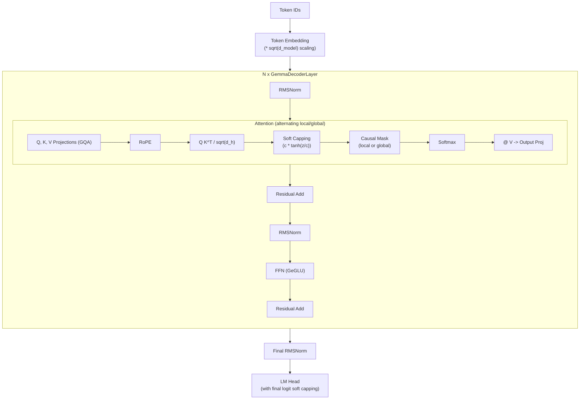

# Gemma

**Gemma** is Google DeepMind's family of open-weight language models, released
beginning in 2024.  Built on the same research and technology that powers the
Gemini models, Gemma brings Google's approach to efficient transformer design
to the open-source community.  The family spans three generations -- Gemma,
Gemma 2, and Gemma 3 -- each refining the architecture with innovations like
**soft capping**, **alternating attention patterns**, and **GeGLU
activations**[^1].

---

## 1. Architecture Overview

!!! info "The Gemma Family"

    | Model | Year | Sizes | Key Improvements |
    |-------|------|-------|-----------------|
    | Gemma 1 | 2024-02 | 2B, 7B | GeGLU, RMSNorm, RoPE |
    | Gemma 2 | 2024-06 | 2B, 9B, 27B | Soft capping, alternating local/global attention |
    | Gemma 3 | 2024-12 | 1B, 4B, 12B, 27B | Sliding window + global attention, improved training |

Gemma is a decoder-only autoregressive transformer.  While it shares many
design elements with LLaMA (RMSNorm, RoPE, GQA), it introduces distinctive
features -- most notably **soft capping** of logits and **alternating
attention window patterns** -- that represent Google's particular engineering
philosophy.

---

## 2. Key Innovations

### 2.1 GeGLU Activation

Gemma uses the **GeGLU** (GELU-Gated Linear Unit) activation in its
feed-forward layers.  GeGLU is a gated variant of GELU, similar to SwiGLU but
using GELU as the gating function:

!!! definition "GeGLU"

    \[
        \text{GeGLU}(x) = \text{GELU}(xW_{\text{gate}}) \odot (xW_{\text{up}})
    \]

    \[
        \text{FFN}(x) = \text{GeGLU}(x) W_{\text{down}}
    \]

    where \( \text{GELU}(x) = x \cdot \Phi(x) \) and \( \Phi \) is the
    standard normal CDF.

### 2.2 Soft Capping

Gemma 2 introduced **logit soft capping**, a technique to prevent attention
scores and final logits from growing unboundedly large:

!!! definition "Soft Capping"

    For a scalar value \( z \) and a cap value \( c \):

    \[
        \text{softcap}(z, c) = c \cdot \tanh\!\left(\frac{z}{c}\right)
    \]

    Properties:

    - For \( |z| \ll c \): \( \text{softcap}(z, c) \approx z \) (identity)
    - For \( |z| \gg c \): \( \text{softcap}(z, c) \to \pm c \) (saturates)
    - Smooth and differentiable everywhere

Soft capping is applied at two points:

1. **Attention logit capping**: Before softmax, with a cap around 50
2. **Final logit capping**: Before the output softmax, with a cap around 30

### 2.3 Grouped-Query Attention (GQA)

Gemma uses GQA with varying numbers of KV heads:

\[
    \text{KV heads} = \frac{\text{n\_heads}}{\text{group\_size}}
\]

This reduces the KV cache size and memory bandwidth requirements during
inference while maintaining model quality.

### 2.4 Alternating Attention Patterns (Gemma 2+)

Gemma 2 alternates between **local sliding window attention** and **global
full attention** across layers:

!!! algorithm "Alternating Attention"

    For layer \( l \):

    - If \( l \mod 2 = 0 \): **Local attention** with sliding window size \( w \)
        - Token \( i \) attends to positions \( [\max(0, i-w), i] \)
    - If \( l \mod 2 = 1 \): **Global attention** over the full sequence
        - Token \( i \) attends to positions \( [0, i] \)

    This provides a balance: local layers capture short-range patterns
    efficiently, while global layers maintain long-range coherence.

---

## 3. Architecture Diagram



---

## 4. Configuration Parameters

| Parameter | Gemma 2B | Gemma 7B | Gemma2 9B | Gemma2 27B |
|-----------|:---:|:---:|:---:|:---:|
| `n_layers` | 18 | 28 | 42 | 46 |
| `d_model` | 2048 | 3072 | 3584 | 4608 |
| `n_heads` | 8 | 16 | 16 | 32 |
| `n_kv_heads` | 1 | 16 | 8 | 16 |
| `d_ff` | 16384 | 24576 | 14336 | 36864 |
| `vocab_size` | 256000 | 256000 | 256000 | 256000 |
| `max_seq_len` | 8192 | 8192 | 8192 | 8192 |
| `activation` | GeGLU | GeGLU | GeGLU | GeGLU |
| `attn_logit_cap` | - | - | 50.0 | 50.0 |
| `final_logit_cap` | - | - | 30.0 | 30.0 |
| `sliding_window` | - | - | 4096 | 4096 |
| `norm_eps` | 1e-6 | 1e-6 | 1e-6 | 1e-6 |

!!! info "Large Vocabulary"

    Gemma uses a 256K SentencePiece vocabulary, much larger than LLaMA's 32K.
    This reduces sequence lengths for many inputs (fewer tokens needed) at the
    cost of a larger embedding matrix.

---

## 5. Mathematical Formulation

### 5.1 Embedding with Scaling

Unlike most models, Gemma scales the embedding output by \( \sqrt{d} \):

\[
    h^{(0)} = E[x] \cdot \sqrt{d_{\text{model}}}
\]

### 5.2 Soft-Capped Attention

\[
    S = \frac{QK^T}{\sqrt{d_h}}
\]

\[
    \hat{S} = c_{\text{attn}} \cdot \tanh\!\left(\frac{S}{c_{\text{attn}}}\right) + M_{\text{causal}}
\]

\[
    \text{Attention}(Q, K, V) = \text{softmax}(\hat{S}) \, V
\]

### 5.3 GeGLU Feed-Forward

\[
    \text{FFN}(x) = \left[\text{GELU}(xW_{\text{gate}}) \odot xW_{\text{up}}\right] W_{\text{down}}
\]

where \( W_{\text{gate}}, W_{\text{up}} \in \mathbb{R}^{d \times d_{\text{ff}}} \) and
\( W_{\text{down}} \in \mathbb{R}^{d_{\text{ff}} \times d} \).

### 5.4 Final Logit Capping

\[
    \text{logits} = c_{\text{final}} \cdot \tanh\!\left(\frac{h W_{\text{lm\_head}}}{c_{\text{final}}}\right)
\]

---

## 6. Zig Implementation

### 6.1 GemmaConfig

```zig
pub const GemmaConfig = struct {
    n_layers: u32,
    d_model: u32,
    n_heads: u32,
    n_kv_heads: u32,
    d_ff: u32,
    vocab_size: u32 = 256000,
    max_seq_len: u32 = 8192,
    rope_theta: f32 = 10000.0,
    norm_eps: f32 = 1e-6,
    activation: ActivationType = .geglu,

    // Soft capping (Gemma 2+)
    attn_logit_cap: ?f32 = null,    // null for Gemma 1
    final_logit_cap: ?f32 = null,

    // Alternating attention (Gemma 2+)
    sliding_window: ?u32 = null,

    pub fn headDim(self: GemmaConfig) u32 {
        return self.d_model / self.n_heads;
    }

    pub fn isLocalLayer(self: GemmaConfig, layer_idx: u32) bool {
        return self.sliding_window != null and (layer_idx % 2 == 0);
    }
};
```

### 6.2 Soft Capping Function

```zig
pub fn softCap(value: f32, cap: f32) f32 {
    return cap * std.math.tanh(value / cap);
}

pub fn applySoftCapping(
    logits: []f32,
    cap: ?f32,
) void {
    const c = cap orelse return;  // no-op if capping disabled
    for (logits) |*val| {
        val.* = softCap(val.*, c);
    }
}
```

### 6.3 Gemma Attention with Soft Capping

```zig
pub const GemmaAttention = struct {
    wq: Linear,
    wk: Linear,
    wv: Linear,
    wo: Linear,
    config: GemmaConfig,
    layer_idx: u32,

    pub fn forward(self: *GemmaAttention, x: Tensor(f32), pos: u32) !Tensor(f32) {
        var q = self.wq.forward(x);
        var k = self.wk.forward(x);
        const v = self.wv.forward(x);

        // Apply RoPE
        applyRoPE(&q, &k, pos, self.config.headDim(), self.config.rope_theta);

        // Compute attention scores
        var scores = scaledDotProduct(q, k, self.config.headDim());

        // Apply soft capping before masking (Gemma 2+)
        if (self.config.attn_logit_cap) |cap| {
            applySoftCapping(scores.data, cap);
        }

        // Apply mask (local or global depending on layer)
        if (self.config.isLocalLayer(self.layer_idx)) {
            applySlidingWindowMask(scores, pos, self.config.sliding_window.?);
        } else {
            applyCausalMask(scores, pos);
        }

        const attn_weights = softmax(scores);
        const context = matmul(attn_weights, v);
        return self.wo.forward(context);
    }
};
```

---

## 7. Variants

| Model | Parameters | Attention | Capping | Notes |
|-------|-----------|-----------|---------|-------|
| **Gemma 2B** | 2B | Full GQA (1 KV head) | No | Smallest Gemma 1 |
| **Gemma 7B** | 7B | Full MHA | No | Standard Gemma 1 |
| **Gemma2 2B** | 2B | Alternating | Yes | Knowledge distilled |
| **Gemma2 9B** | 9B | Alternating local/global | Yes | Best value for size |
| **Gemma2 27B** | 27B | Alternating local/global | Yes | Largest open Gemma 2 |
| **Gemma3 1B** | 1B | Sliding window + full | Yes | Ultra-efficient |
| **Gemma3 27B** | 27B | Sliding window + full | Yes | Best Gemma 3 |

---

## 8. Educational Value

!!! tip "What Gemma Teaches"

    1. **Soft capping as gradient control**: The \( c \cdot \tanh(z/c) \)
       mechanism is a smooth, differentiable way to bound logit magnitudes.
       This teaches students about the practical problems of unbounded
       activations (numerical instability, training divergence) and elegant
       solutions that preserve gradient flow.

    2. **Alternating attention patterns**: The local/global alternation
       demonstrates that not every layer needs to compute full-sequence
       attention.  Local layers handle nearby dependencies cheaply; global
       layers integrate information across the full context.  This is a
       concrete lesson in computational budget allocation.

    3. **GeGLU vs. SwiGLU**: Comparing GeGLU (GELU gating) with SwiGLU (SiLU
       gating) illustrates that the choice of gating function is an active
       design decision, with different smooth approximations to ReLU-based
       gating.

    4. **Embedding scaling**: The \( \sqrt{d} \) scaling factor on embeddings
       is often overlooked but has meaningful effects on the magnitude of
       hidden states entering the first transformer block.

    5. **Multi-generational evolution**: Tracing Gemma through three
       generations shows how a model family evolves, adding techniques
       (soft capping, alternating windows) incrementally while maintaining
       backwards compatibility in the overall architecture.

---

## 9. References

[^1]: Gemma Team. "Gemma: Open Models Based on Gemini Research and Technology." *arXiv:2403.08295*, 2024.
[^2]: Gemma Team. "Gemma 2: Improving Open Language Models at a Practical Size." *arXiv:2408.00118*, 2024.
[^3]: Shazeer, N. "GLU Variants Improve Transformer." *arXiv:2002.05202*, 2020.
[^4]: Su, J. et al. "RoFormer: Enhanced Transformer with Rotary Position Embedding." *arXiv:2104.09864*, 2021.
