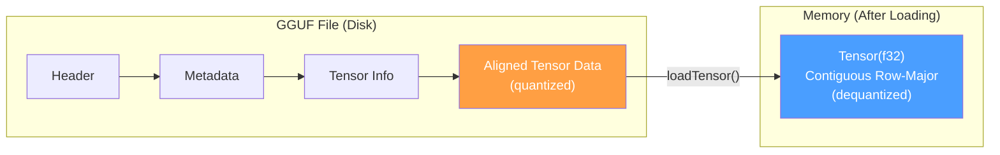

# GGUF Model Loading

## Overview

GGUF (GPT-Generated Unified Format) is the standard binary format for distributing
quantized language models, used by llama.cpp, Ollama, LM Studio, and numerous other
inference engines. ZigLLM implements a complete GGUF reader in `src/models/gguf.zig`
that parses the file header, extracts metadata and vocabulary, resolves tensor
layouts, and loads weights -- including automatic dequantization of quantized
formats.

---

## Loading Pipeline

The GGUF loading process follows a five-stage pipeline.


1. **Open File**: Open the binary file and create a `GGUFReader` instance.
2. **Parse Header**: Read the magic number, version, tensor count, and metadata count.
3. **Read Metadata**: Extract key-value pairs (architecture, hyperparameters, tokenizer).
4. **Read Tensor Info**: Parse tensor names, dimensions, types, and offsets.
5. **Load Weights**: Seek to tensor data and dequantize into `Tensor(f32)`.

---

## File Format Structure

A GGUF file has three sections laid out sequentially.

```
+---------------------------+
|  Header (24 bytes)        |
|  magic: u32 = 0x46554747  |  "GGUF" in little-endian
|  version: u32 = 3         |
|  tensor_count: u64        |
|  metadata_kv_count: u64   |
+---------------------------+
|  Metadata KV Pairs        |
|  (variable length)        |
+---------------------------+
|  Tensor Info Array         |
|  (variable length)        |
+---------------------------+
|  [alignment padding]      |
+---------------------------+
|  Tensor Data               |
|  (bulk of the file)       |
+---------------------------+
```

!!! definition "Magic Number"
    The GGUF magic number is `0x46554747`, which corresponds to the ASCII string
    `"GGUF"` read in little-endian byte order. This is checked during header
    validation to confirm the file is a valid GGUF file.

---

## GGUFReader API

### Opening a File

```zig
var reader = try GGUFReader.open("model.gguf", allocator);
defer reader.close();
```

The `open()` method performs the complete parsing pipeline: it reads the header,
all metadata key-value pairs, and all tensor information entries. After `open()`
returns, the reader is ready for metadata queries and tensor loading.

### Header Validation

```zig
pub const GGUFHeader = struct {
    magic: u32,
    version: u32,
    tensor_count: u64,
    metadata_kv_count: u64,

    pub fn validate(self: GGUFHeader) !void {
        if (self.magic != GGUF_MAGIC) return error.InvalidGGUFMagic;
        if (self.version != GGUF_VERSION) return error.UnsupportedGGUFVersion;
    }
};
```

!!! info "Version Compatibility"
    ZigLLM currently supports GGUF version 3, which is the format used by
    llama.cpp since August 2023. Earlier formats (GGML, GGMF, GGJTv1-v3) are
    not supported; use `llama.cpp`'s `convert` tool to upgrade legacy files.

---

## Metadata System

### Value Types

GGUF metadata supports 13 value types.

```zig
pub const GGUFType = enum(u32) {
    UINT8 = 0,   INT8 = 1,    UINT16 = 2,  INT16 = 3,
    UINT32 = 4,  INT32 = 5,   FLOAT32 = 6, BOOL = 7,
    STRING = 8,  ARRAY = 9,   UINT64 = 10, INT64 = 11,
    FLOAT64 = 12,
};
```

### Metadata Extraction

After parsing, metadata is stored in a `HashMap([]const u8, GGUFValue)`. Query
it by key:

```zig
// Get model architecture name
if (reader.getMetadata("general.architecture")) |arch| {
    switch (arch) {
        .STRING => |name| {
            // name is e.g. "llama", "mistral", "gpt2"
        },
        else => {},
    }
}

// Get hyperparameters
if (reader.getMetadata("llama.embedding_length")) |val| {
    switch (val) {
        .UINT32 => |d_model| { ... },
        else => {},
    }
}
```

### Common Metadata Keys

| Key | Type | Description |
|:----|:-----|:------------|
| `general.architecture` | STRING | Model architecture identifier |
| `general.name` | STRING | Human-readable model name |
| `general.file_type` | UINT32 | Quantization level of the file |
| `general.quantization_version` | UINT32 | Quantization format version |
| `{arch}.embedding_length` | UINT32 | Hidden dimension (\(d_\text{model}\)) |
| `{arch}.block_count` | UINT32 | Number of transformer layers |
| `{arch}.attention.head_count` | UINT32 | Number of attention heads |
| `{arch}.attention.head_count_kv` | UINT32 | Number of KV heads (GQA) |
| `{arch}.feed_forward_length` | UINT32 | FFN intermediate dimension |
| `{arch}.context_length` | UINT32 | Maximum sequence length |
| `{arch}.rope.freq_base` | FLOAT32 | RoPE theta value |
| `tokenizer.ggml.model` | STRING | Tokenizer type (e.g., "llama") |
| `tokenizer.ggml.tokens` | ARRAY[STRING] | Vocabulary tokens |
| `tokenizer.ggml.scores` | ARRAY[FLOAT32] | Token scores |
| `tokenizer.ggml.token_type` | ARRAY[INT32] | Token type flags |

Here `{arch}` is replaced by the value of `general.architecture` (e.g., `llama`,
`mistral`, `gpt2`).

---

## Tensor Information

Each tensor entry stores its name, shape, data type, and offset within the data section.

```zig
pub const GGUFTensorInfo = struct {
    name: []const u8,       // e.g., "blk.0.attn_q.weight"
    dimensions: []u64,      // Shape, e.g., [4096, 4096]
    ggml_type: GGMLType,    // Data type (F32, F16, Q4_0, Q8_0, etc.)
    offset: u64,            // Byte offset from start of data section
};
```

### Tensor Naming Convention

GGUF uses a standardized naming scheme for tensor weights.

| Pattern | Description |
|:--------|:------------|
| `token_embd.weight` | Token embedding matrix |
| `blk.{i}.attn_q.weight` | Query projection for layer `i` |
| `blk.{i}.attn_k.weight` | Key projection for layer `i` |
| `blk.{i}.attn_v.weight` | Value projection for layer `i` |
| `blk.{i}.attn_output.weight` | Attention output projection |
| `blk.{i}.ffn_gate.weight` | FFN gate projection (SwiGLU) |
| `blk.{i}.ffn_up.weight` | FFN up projection |
| `blk.{i}.ffn_down.weight` | FFN down projection |
| `blk.{i}.attn_norm.weight` | Pre-attention normalization |
| `blk.{i}.ffn_norm.weight` | Pre-FFN normalization |
| `output_norm.weight` | Final layer normalization |
| `output.weight` | Output projection (LM head) |

---

## Quantization Formats

GGUF supports multiple quantization formats, from full precision to aggressive
4-bit compression. The `GGMLType` enum identifies each format.

```zig
pub const GGMLType = enum(u32) {
    F32 = 0,   F16 = 1,
    Q4_0 = 2,  Q4_1 = 3,   Q5_0 = 6,  Q5_1 = 7,
    Q8_0 = 8,  Q8_1 = 9,
    Q2_K = 10, Q3_K = 11,  Q4_K = 12, Q5_K = 13,
    Q6_K = 14, Q8_K = 15,
    I8 = 16,   I16 = 17,   I32 = 18,
};
```

### Quantization Properties

| Format | Bits/Weight | Block Size | Bytes/Block | Quality | Speed |
|:-------|:------------|:-----------|:------------|:--------|:------|
| F32 | 32 | 1 | 4 | Lossless | Baseline |
| F16 | 16 | 1 | 2 | Near-lossless | 2x |
| Q8_0 | 8 | 32 | 34 | Very good | 3--4x |
| Q6_K | 6 | 256 | 210 | Good | 4--5x |
| Q5_K | 5 | 256 | 176 | Good | 5--6x |
| Q4_K | 4 | 256 | 144 | Acceptable | 6--7x |
| Q4_0 | 4 | 16 | 18 | Fair | 6--7x |
| Q3_K | 3 | 256 | 110 | Degraded | 7--8x |
| Q2_K | 2 | 256 | 84 | Poor | 8--10x |

!!! complexity "Memory Savings"
    A LLaMA-7B model requires approximately:
    
    - **F32**: 26.8 GB
    - **F16**: 13.4 GB
    - **Q8_0**: 7.1 GB
    - **Q4_0**: 3.8 GB
    - **Q4_K**: 4.1 GB (better quality than Q4_0 at similar size)

### Auto-Detection

The quantization format is determined per-tensor from the `ggml_type` field in
each tensor info entry. A single GGUF file can contain tensors in different
formats -- for example, attention weights in Q4_K and embedding weights in Q6_K.

```zig
pub fn isQuantized(self: GGMLType) bool {
    return switch (self) {
        .F32, .F16, .I8, .I16, .I32 => false,
        else => true,
    };
}
```

---

## Loading Tensors

The `loadTensor()` method reads raw bytes from disk and dequantizes them into
`Tensor(f32)`.

```zig
pub fn loadTensor(self: *GGUFReader, tensor_info: GGUFTensorInfo,
                  comptime T: type) !Tensor(T) {
    // 1. Seek to absolute offset
    const absolute_offset = self.data_offset + tensor_info.offset;
    try self.file.seekTo(absolute_offset);

    // 2. Create output tensor with correct shape
    var tensor = try Tensor(T).init(self.allocator, shape);

    // 3. Read raw bytes
    const raw_data = try self.allocator.alloc(u8, tensor_info.sizeBytes());
    _ = try self.file.reader().readAll(raw_data);

    // 4. Dequantize based on format
    switch (tensor_info.ggml_type) {
        .F32 => @memcpy(tensor.data, raw_data),
        .F16 => { /* convert f16 -> f32 */ },
        .Q4_0 => { /* dequantize Q4_0 blocks */ },
        .Q8_0 => { /* dequantize Q8_0 blocks */ },
        // ...
    }

    return tensor;
}
```

!!! algorithm "Q4_0 Dequantization"
    Each Q4_0 block contains 32 values packed into 18 bytes:
    
    1. Read 2-byte f16 scale factor \( s \).
    2. Read 16 bytes containing 32 packed 4-bit values (nibbles).
    3. For each nibble \( n \): \( x = (n - 8) \times s \).
    
    The subtraction by 8 re-centers the unsigned nibble range [0, 15] to the
    signed range [-8, 7].

---

## Memory Layout

After loading, tensor data is stored contiguously in memory in row-major order,
matching the layout expected by ZigLLM's tensor operations.



### Alignment

Tensor data in the file is aligned to a configurable boundary (default 32 bytes).
The alignment value can be overridden via the `general.alignment` metadata key.
The data section starts at the next aligned offset after all tensor info entries.

\[
\text{data\_offset} = \lceil \text{current\_pos} / \text{alignment} \rceil \times \text{alignment}
\]

---

## mmap vs Standard I/O

ZigLLM supports two strategies for reading tensor data from disk.

### Standard I/O (Current Default)

Uses `file.seekTo()` + `reader.readAll()` for each tensor. Simple and portable but
requires allocating memory for both the raw data and the dequantized output.

### Memory-Mapped I/O

Uses `mmap` to map the file directly into virtual address space. The operating system
handles page-level loading on demand, which can be significantly faster for large
models.

| Property | Standard I/O | mmap |
|:---------|:------------|:-----|
| Initial load time | Proportional to file size | Near-instant |
| Peak memory | 2x (raw + dequantized) | 1x (shared pages) |
| Random access | Requires seek | Free (pointer arithmetic) |
| Portability | Universal | POSIX + Windows |
| Quantized tensors | Must dequantize to buffer | Can dequantize on-the-fly |

!!! tip "When to Use mmap"
    Use memory-mapped I/O for production inference with large models (> 4 GB).
    The reduced peak memory and instant "loading" (deferred to page faults) can
    dramatically improve startup time. Standard I/O is preferred for small models,
    testing, and platforms without mmap support.

The `src/foundation/memory_mapping.zig` module provides the mmap integration used
by the GGUF loader when memory-mapped mode is enabled.

---

## Finding Tensors

The `findTensor()` method looks up a tensor by name:

```zig
if (reader.findTensor("blk.0.attn_q.weight")) |info| {
    const tensor = try reader.loadTensor(info, f32);
    defer tensor.deinit();
    // Use tensor...
}
```

---

## Complete Loading Example

```zig
const std = @import("std");
const gguf = @import("models/gguf.zig");

pub fn loadModel(path: []const u8, allocator: std.mem.Allocator) !void {
    // 1. Open and parse
    var reader = try gguf.GGUFReader.open(path, allocator);
    defer reader.close();

    // 2. Extract configuration from metadata
    const d_model = blk: {
        const val = reader.getMetadata("llama.embedding_length") orelse
            return error.MissingConfig;
        break :blk switch (val) { .UINT32 => |v| v, else => return error.BadType };
    };

    // 3. Load a specific tensor
    const q_weight_info = reader.findTensor("blk.0.attn_q.weight") orelse
        return error.TensorNotFound;

    var q_weight = try reader.loadTensor(q_weight_info, f32);
    defer q_weight.deinit();

    // q_weight is now a Tensor(f32) ready for computation
}
```

---

## References

[^1]: GGUF specification: https://github.com/ggerganov/ggml/blob/master/docs/gguf.md
[^2]: Dettmers, T. et al. "LLM.int8(): 8-bit Matrix Multiplication for Transformers at Scale." NeurIPS, 2022.
[^3]: Frantar, E. et al. "GPTQ: Accurate Post-Training Quantization for Generative Pre-trained Transformers." ICLR, 2023.
