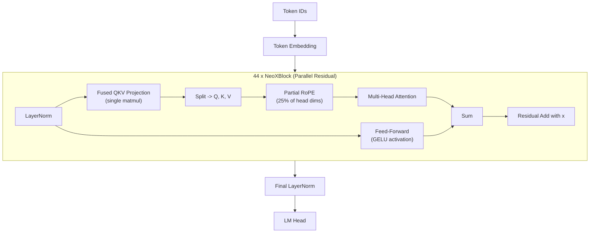

# GPT-NeoX

**GPT-NeoX** is EleutherAI's 20-billion-parameter autoregressive language
model, released in 2022.  It extended the architectural patterns established by
GPT-J -- parallel residual connections and Rotary Position Embeddings -- to a
significantly larger scale while introducing fused QKV projections and
providing the community with one of the first fully open 20B-class models
complete with training code and data documentation[^1].

---

## 1. Architecture Overview

!!! info "Origins"

    GPT-NeoX-20B was trained on The Pile using 96 A100-40GB GPUs with the
    GPT-NeoX library (a fork of Megatron-DeepSpeed).  The paper by Black et
    al. (2022) documented not only the architecture but also the training
    infrastructure, making it a reference for large-scale distributed
    training[^1].

GPT-NeoX is a decoder-only transformer that shares GPT-J's parallel residual
design but adds fused query-key-value projections and applies RoPE to 25% of
the head dimension by default.

---

## 2. Key Innovations

### 2.1 Fused QKV Projection

Instead of three separate linear projections for Q, K, and V, GPT-NeoX fuses
them into a single matrix multiplication:

!!! definition "Fused QKV"

    \[
        [Q \,|\, K \,|\, V] = x W_{QKV} + b_{QKV}
    \]

    where \( W_{QKV} \in \mathbb{R}^{d \times 3d} \).  The output is then
    split along the last dimension into three equal parts.  This reduces kernel
    launch overhead on GPUs and improves memory access patterns.

### 2.2 Parallel Attention and FFN

Like GPT-J, GPT-NeoX computes attention and the feed-forward network from the
same LayerNorm output:

\[
    x' = x + \text{Attn}(\text{LN}(x)) + \text{FFN}(\text{LN}(x))
\]

This single-norm, dual-path design yields a single residual addition per
block.

### 2.3 Advanced RoPE Scaling

GPT-NeoX introduced configurable RoPE parameters that later became standard:

| Parameter | Description |
|-----------|-------------|
| `rotary_pct` | Fraction of head dimensions receiving RoPE (default 0.25) |
| `rotary_emb_base` | Base frequency \(\theta\) for RoPE (default 10000) |

The ability to adjust `rotary_pct` allows trading off positional sensitivity
against pure content-based attention within each head.

---

## 3. Architecture Diagram



---

## 4. Configuration Parameters

| Parameter | GPT-NeoX-20B |
|-----------|:------------:|
| `n_layers` | 44 |
| `d_model` | 6144 |
| `n_heads` | 64 |
| `d_head` | 96 |
| `d_ff` | 24576 |
| `vocab_size` | 50432 |
| `max_seq_len` | 2048 |
| `rotary_pct` | 0.25 |
| `rotary_emb_base` | 10000 |
| `activation` | GELU |
| `parallel_residual` | true |
| `use_bias` | true |
| `norm_eps` | 1e-5 |

---

## 5. Mathematical Formulation

### 5.1 Fused QKV Computation

For input \( x \in \mathbb{R}^{s \times d} \):

\[
    H = x W_{QKV} + b_{QKV}, \quad W_{QKV} \in \mathbb{R}^{d \times 3d}
\]

\[
    Q = H_{:, \, 0:d}, \quad K = H_{:, \, d:2d}, \quad V = H_{:, \, 2d:3d}
\]

### 5.2 Partial RoPE

With `rotary_pct = 0.25` and head dimension \( d_h = 96 \), the rotary
dimension is \( d_{\text{rot}} = 24 \).  For position \( m \):

\[
    \hat{q}_{[:24]} = R_{\Theta, m} \cdot q_{[:24]}, \quad
    \hat{q}_{[24:]} = q_{[24:]}
\]

### 5.3 Full Block Computation

\[
    h = \text{LayerNorm}(x^{(l)})
\]

\[
    x^{(l+1)} = x^{(l)} + \text{Attn}(h) + \text{FFN}(h)
\]

where:

\[
    \text{FFN}(h) = \text{GELU}(hW_1 + b_1)W_2 + b_2
\]

!!! complexity "FLOPs per Block"

    The fused QKV projection saves one kernel launch versus separate
    projections but performs identical arithmetic.  For sequence length \( s \)
    and model dimension \( d \):

    - QKV projection: \( 6sd^2 \) FLOPs (same as separate, just one matmul)
    - Attention: \( 2s^2 d + 2s^2 d \) FLOPs
    - FFN: \( 16sd^2 \) FLOPs (with \( d_{\text{ff}} = 4d \))
    - Total per block: \( \approx 22sd^2 + 4s^2 d \)

---

## 6. Zig Implementation

### 6.1 GPTNeoXConfig

```zig
pub const GPTNeoXConfig = struct {
    n_layers: u32 = 44,
    d_model: u32 = 6144,
    n_heads: u32 = 64,
    d_ff: u32 = 24576,
    vocab_size: u32 = 50432,
    max_seq_len: u32 = 2048,
    rotary_pct: f32 = 0.25,
    rotary_emb_base: f32 = 10000.0,
    parallel_residual: bool = true,
    norm_eps: f32 = 1e-5,
    activation: ActivationType = .gelu,

    pub fn headDim(self: GPTNeoXConfig) u32 {
        return self.d_model / self.n_heads;
    }

    pub fn rotaryDim(self: GPTNeoXConfig) u32 {
        return @intFromFloat(@as(f32, @floatFromInt(self.headDim()))
            * self.rotary_pct);
    }
};
```

### 6.2 Fused QKV Projection

```zig
pub const FusedQKVProjection = struct {
    w_qkv: Tensor(f32),    // [d_model, 3 * d_model]
    b_qkv: Tensor(f32),    // [3 * d_model]

    pub fn forward(self: *FusedQKVProjection, x: Tensor(f32)) !struct {
        q: Tensor(f32), k: Tensor(f32), v: Tensor(f32)
    } {
        // Single matmul: [seq, d] @ [d, 3d] -> [seq, 3d]
        const fused = try x.matmul(self.w_qkv, allocator);
        defer fused.deinit();

        const d = self.w_qkv.shape[0];
        return .{
            .q = try fused.slice(1, 0, d),
            .k = try fused.slice(1, d, 2 * d),
            .v = try fused.slice(1, 2 * d, 3 * d),
        };
    }
};
```

### 6.3 NeoX Block (Parallel Residual)

```zig
pub const NeoXBlock = struct {
    ln: LayerNorm,
    qkv: FusedQKVProjection,
    attention: MultiHeadAttention,
    ffn: FeedForward,
    out_proj: Linear,

    pub fn forward(self: *NeoXBlock, x: []f32, pos: u32) ![]f32 {
        const h = self.ln.forward(x);

        // Parallel path 1: Attention
        const qkv = try self.qkv.forward(h);
        applyPartialRoPE(&qkv.q, &qkv.k, pos, self.config.rotaryDim());
        const attn_out = try self.attention.forward(qkv.q, qkv.k, qkv.v);

        // Parallel path 2: FFN (from same normalized input)
        const ffn_out = try self.ffn.forward(h);

        // Single residual addition
        var output = try allocator.alloc(f32, x.len);
        for (0..x.len) |i| {
            output[i] = x[i] + attn_out[i] + ffn_out[i];
        }
        return output;
    }
};
```

---

## 7. Variants

| Variant | Parameters | Notes |
|---------|-----------|-------|
| **GPT-NeoX-20B** | 20B | Original release, trained on The Pile |
| **Pythia suite** | 70M--12B | Successor family using NeoX architecture with controlled training |
| **Dolly** | 12B | Databricks fine-tune of Pythia-12B for instruction following |

!!! info "Pythia Connection"

    The Pythia model suite (Biderman et al., 2023)[^3] reuses the GPT-NeoX
    architecture across eight model sizes trained on deduplicated Pile data.
    Pythia checkpoints are released at regular training intervals, making
    them invaluable for studying training dynamics.

---

## 8. Educational Value

!!! tip "What GPT-NeoX Teaches"

    1. **Fused projections**: The fused QKV pattern demonstrates how
       mathematically equivalent operations can be restructured for
       hardware efficiency.  Students can verify that splitting a single
       \( d \times 3d \) matmul yields identical results to three separate
       \( d \times d \) matmuls.

    2. **Scaling parallel residuals**: GPT-NeoX validated that the parallel
       residual design (pioneered in GPT-J at 6B) remains effective at 20B
       scale, suggesting it is a robust architectural choice.

    3. **RoPE configuration space**: The `rotary_pct` and `rotary_emb_base`
       parameters expose the design space around positional encoding, allowing
       students to experiment with how much positional information each head
       receives.

    4. **Large-scale training infrastructure**: The GPT-NeoX paper is one of
       the most transparent accounts of distributed training, covering
       pipeline parallelism, data parallelism, and mixed-precision training.

---

## 9. References

[^1]: Black, S. et al. "GPT-NeoX-20B: An Open-Source Autoregressive Language Model." *arXiv:2204.06745*, 2022.
[^2]: Su, J. et al. "RoFormer: Enhanced Transformer with Rotary Position Embedding." *arXiv:2104.09864*, 2021.
[^3]: Biderman, S. et al. "Pythia: A Suite for Analyzing Large Language Models Across Training and Scaling." *ICML*, 2023.
