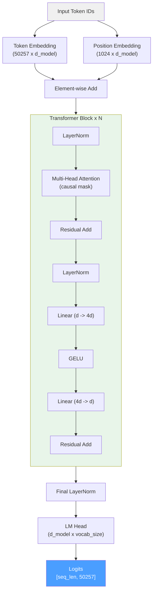

# GPT-2

## Overview

GPT-2 (Generative Pre-trained Transformer 2), released by OpenAI in February
2019[^1], is the classic decoder-only transformer language model. While superseded
in capability by later architectures, GPT-2 remains an essential reference point
for understanding transformer design. Its straightforward architecture -- learned
position embeddings, GELU activation, pre-LayerNorm -- makes it the ideal starting
point for learning how transformer language models work.

ZigLLM implements GPT-2 in `src/models/gpt2.zig` as both a functional model and
a pedagogical reference.

!!! info "Historical Significance"
    GPT-2 was famously released in stages due to concerns about misuse, with
    OpenAI initially publishing only the 124M parameter version. It demonstrated
    that scaling language models produces emergent capabilities across diverse
    tasks without task-specific training, a finding that motivated the scaling
    laws research that led to GPT-3, PaLM, and LLaMA.

---

## Key Features

| Feature | GPT-2 Choice | Modern Alternative |
|:--------|:------------|:-------------------|
| Position encoding | **Learned embeddings** | RoPE (LLaMA) |
| Activation | **GELU** | SwiGLU (LLaMA) |
| Normalization | **Pre-LayerNorm** | Pre-RMSNorm (LLaMA) |
| Attention | **Standard MHA** | GQA (Mistral) |
| Bias terms | **Yes** (all linear layers) | No (LLaMA) |
| FFN structure | **Standard 2-matrix** | Gated 3-matrix (LLaMA) |

### Learned Position Embeddings

GPT-2 uses a trainable embedding table for position information, with one
embedding vector per position up to `max_seq_len`:

\[
h_0 = W_e[x_1, \ldots, x_n] + W_p[1, \ldots, n]
\]

where \( W_e \in \mathbb{R}^{V \times d} \) is the token embedding matrix and
\( W_p \in \mathbb{R}^{S \times d} \) is the position embedding matrix.

!!! definition "Learned vs Rotary Positions"
    Learned position embeddings store a separate vector for each absolute position,
    consuming \( S \times d \) parameters. They cannot generalize beyond the trained
    sequence length. RoPE, used by LLaMA, encodes relative positions through rotation
    and requires no additional parameters beyond the frequency schedule.

### GELU Activation

The Gaussian Error Linear Unit provides a smooth approximation to ReLU:

\[
\text{GELU}(x) = x \cdot \Phi(x) \approx 0.5x \left(1 + \tanh\left[\sqrt{\frac{2}{\pi}}\left(x + 0.044715x^3\right)\right]\right)
\]

### Causal Attention

GPT-2 uses standard multi-head self-attention with a causal mask to prevent
attending to future positions:

\[
M_\text{causal}[i,j] = \begin{cases} 0 & \text{if } j \le i \\ -\infty & \text{if } j > i \end{cases}
\]

---

## Configuration

### GPT2Config Struct

```zig
pub const GPT2Config = struct {
    d_model: usize,      // Model dimension
    n_heads: usize,      // Number of attention heads
    n_layers: usize,     // Number of transformer layers
    vocab_size: usize,   // Vocabulary size (50257 for GPT-2)
    max_seq_len: usize,  // Maximum sequence length (1024)
    dropout: f32,        // Dropout rate (training only)
};
```

### Variant Configurations

| Variant | d_model | n_heads | n_layers | d_ff | Parameters |
|:--------|--------:|--------:|---------:|-----:|-----------:|
| GPT-2 Small | 768 | 12 | 12 | 3072 | 124M |
| GPT-2 Medium | 1024 | 16 | 24 | 4096 | 355M |
| GPT-2 Large | 1280 | 20 | 36 | 5120 | 774M |
| GPT-2 XL | 1600 | 25 | 48 | 6400 | 1.5B |

!!! tip "Scaling Pattern"
    GPT-2 uses a fixed FFN expansion ratio of \( d_\text{ff} = 4 \times d_\text{model} \)
    with a standard 2-matrix FFN (no gating). The head dimension varies:
    768/12 = 64, 1024/16 = 64, 1280/20 = 64, 1600/25 = 64. All variants
    use \( d_\text{head} = 64 \).

---

## Architecture Diagram



---

## Forward Pass

### Token and Position Embedding

GPT-2's embedding combines token and position information through addition:

```zig
pub fn forward(self: *Self, input_ids: []const u32) !Tensor(f32) {
    const seq_len = input_ids.len;

    // Token embeddings: look up each token ID
    var token_embeds = try self.getTokenEmbeddings(input_ids);

    // Position embeddings: look up positions [0, 1, ..., seq_len-1]
    var pos_embeds = try self.getPositionEmbeddings(seq_len);

    // Combined embedding = token + position
    var hidden_states = try self.addEmbeddings(token_embeds, pos_embeds);

    // Pass through transformer blocks
    for (self.blocks) |*block| {
        const new_hidden = try block.forward(hidden_states);
        hidden_states = new_hidden;
    }

    // Final LayerNorm + LM head
    const normed = try self.ln_f.forward(hidden_states);
    return try normed.matmul(self.lm_head, self.allocator);
}
```

### Transformer Block

Each `GPT2Block` implements the pre-norm residual pattern with GELU MLP:

```zig
pub fn forward(self: *Self, input: Tensor(f32)) !Tensor(f32) {
    // Pre-attention LayerNorm
    const normed1 = try self.ln_1.forward(input);

    // Causal self-attention
    const causal_mask = try self.createCausalMask(input.shape[0]);
    const attn_output = try self.attn.forward(
        normed1, normed1, normed1, causal_mask);

    // First residual
    const after_attn = try self.addResidual(input, attn_output);

    // Pre-MLP LayerNorm
    const normed2 = try self.ln_2.forward(after_attn);

    // MLP: Linear -> GELU -> Linear
    const mlp_output = try self.mlpForward(normed2);

    // Second residual
    return try self.addResidual(after_attn, mlp_output);
}
```

### MLP with GELU

```zig
fn mlpForward(self: *Self, input: Tensor(f32)) !Tensor(f32) {
    // Project up: d_model -> 4 * d_model
    const intermediate = try input.matmul(self.mlp_c_fc, self.allocator);

    // GELU activation
    const activated = try neural_primitives.gelu(f32, intermediate, self.allocator);

    // Project down: 4 * d_model -> d_model
    return try activated.matmul(self.mlp_c_proj, self.allocator);
}
```

---

## Model Struct

```zig
pub const GPT2Model = struct {
    config: GPT2Config,
    token_embeddings: Tensor(f32),     // [vocab_size, d_model]
    position_embeddings: Tensor(f32),  // [max_seq_len, d_model]
    blocks: []GPT2Block,               // N transformer blocks
    ln_f: LayerNorm,                   // Final layer normalization
    lm_head: Tensor(f32),             // [d_model, vocab_size]
    allocator: Allocator,
};
```

### Weight Tying

GPT-2 ties the token embedding matrix with the output projection (LM head):

```zig
// LM head initialized with same values as token embeddings
const lm_head_data = try allocator.alloc(f32, config.d_model * config.vocab_size);
@memcpy(lm_head_data, token_emb_data);  // Weight tying
```

This reduces parameter count by \( V \times d \) (approximately 38.6M for GPT-2 Small)
and improves training stability.

---

## Parameter Count

```zig
pub fn parameterCount(self: *Self) usize {
    var total: usize = 0;
    total += self.token_embeddings.data.len;      // V * d
    total += self.position_embeddings.data.len;   // S * d
    total += block_params * self.config.n_layers; // Per-layer
    total += 2 * self.config.d_model;             // Final LN
    total += self.lm_head.data.len;               // d * V
    return total;
}
```

Per-block parameters:

\[
P_\text{block} = \underbrace{4d^2}_{\text{attn}} + \underbrace{d \cdot 4d + 4d \cdot d}_{\text{MLP}} + \underbrace{4d}_{\text{LN}} = 12d^2 + 4d
\]

Total for GPT-2 Small (\( d=768, L=12, V=50257, S=1024 \)):

\[
P = 50257 \times 768 + 1024 \times 768 + 12 \times (12 \times 768^2 + 4 \times 768) + 768 \times 50257 \approx 124\text{M}
\]

---

## GPT-2 vs Modern Architectures

| Design Choice | GPT-2 | LLaMA | Impact |
|:-------------|:------|:------|:-------|
| Position | Learned (S params) | RoPE (0 params) | LLaMA generalizes to longer sequences |
| Activation | GELU (2 matrices) | SwiGLU (3 matrices) | SwiGLU is ~1% better at same param count |
| Norm | LayerNorm | RMSNorm | RMSNorm is ~15% faster |
| Bias | Yes | No | Marginal effect; no bias is simpler |
| Context | 1024 | 2048+ | RoPE enables arbitrary extension |
| Vocab | 50257 (BPE) | 32000 (SP) | Smaller vocab = less embedding memory |

!!! info "Why Study GPT-2?"
    GPT-2 is the simplest complete decoder-only transformer in ZigLLM. Every
    subsequent architecture (LLaMA, Mistral, Falcon, Qwen) can be understood as
    a set of targeted improvements to the GPT-2 baseline. Master GPT-2 first,
    then understand each innovation incrementally.

---

## References

[^1]: Radford, A. et al. "Language Models are Unsupervised Multitask Learners." OpenAI, 2019.
[^2]: Hendrycks, D. and Gimpel, K. "Gaussian Error Linear Units (GELUs)." arXiv:1606.08415, 2016.
[^3]: Kaplan, J. et al. "Scaling Laws for Neural Language Models." arXiv:2001.08361, 2020.
