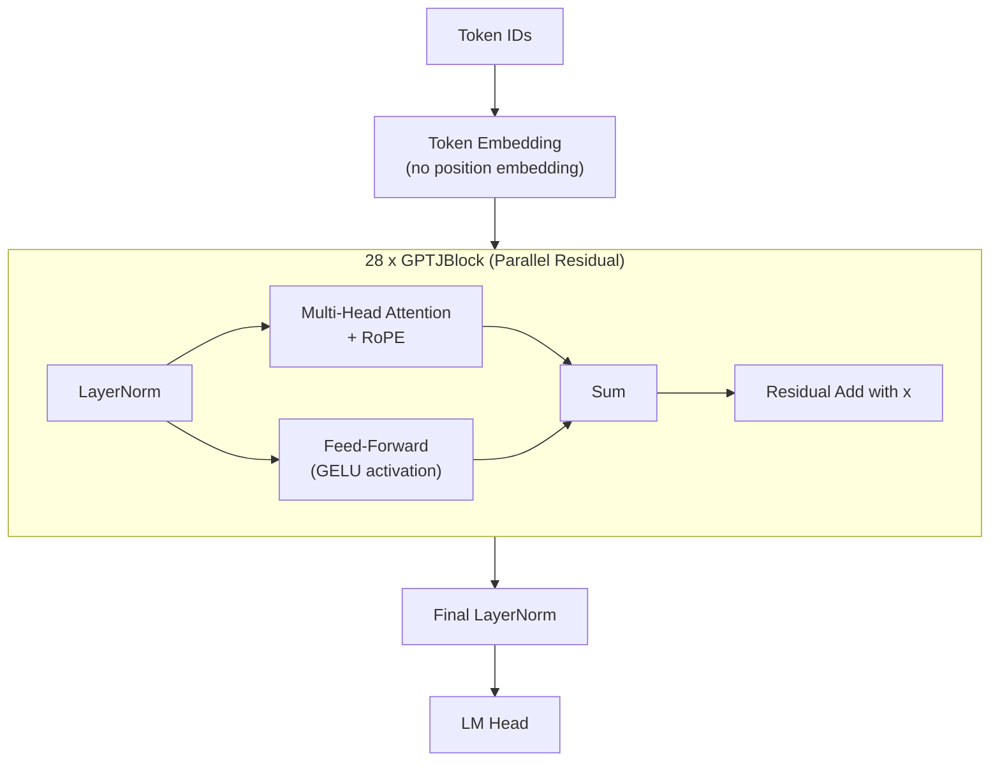

# GPT-J

**GPT-J** was released by EleutherAI in June 2021 as one of the first
high-quality, fully open-source large language models.  At 6 billion
parameters, GPT-J-6B demonstrated that the open research community could
produce models rivaling OpenAI's GPT-3 (6.7B) on many benchmarks.  Its
architecture introduced two ideas that became widely adopted: parallel
residual connections and early integration of Rotary Position Embeddings.

---

## 1. Architecture Overview

!!! info "Origins"

    GPT-J was trained on The Pile, an 800GB curated dataset assembled by
    EleutherAI.  The model name references Ben Wang and Aran Komatsuzaki, who
    led the training effort using the Mesh Transformer JAX framework on
    TPU-v3 pods[^1].

GPT-J is a decoder-only autoregressive transformer.  Its most distinctive
feature is the **parallel residual** layout: within each block, the attention
and feed-forward sub-layers are computed in parallel rather than sequentially,
and their outputs are summed into a single residual stream.

---

## 2. Key Innovations

### 2.1 Parallel Residual Connections

In a standard transformer block (GPT-2 style), the feed-forward network
receives the output of the attention sub-layer:

\[
    x' = x + \text{Attn}(\text{LN}(x)), \quad
    x'' = x' + \text{FFN}(\text{LN}(x'))
\]

GPT-J computes both sub-layers from the *same* normalized input and sums
their outputs together:

!!! definition "Parallel Residual"

    \[
        x' = x + \text{Attn}(\text{LN}(x)) + \text{FFN}(\text{LN}(x))
    \]

    This requires only **one** LayerNorm per block (instead of two) and allows
    the attention and FFN computations to proceed independently, improving
    hardware utilization on accelerators with sufficient parallelism.

### 2.2 Rotary Position Embeddings (Early Adopter)

GPT-J was one of the first major language models to replace learned absolute
position embeddings with RoPE.  At the time of release, RoPE had been proposed
by Su et al. (2021)[^2] but was not yet widely adopted.

\[
    \text{RoPE}(q, m) = R_{\Theta,m} \, q
\]

where \( R_{\Theta,m} \) is a block-diagonal rotation matrix parameterized by
position \( m \) and frequency vector \( \Theta \).

### 2.3 Dense Attention

GPT-J uses standard multi-head attention (MHA) -- every head has its own
query, key, and value projections.  There is no grouped-query or multi-query
optimization, keeping the architecture simple.

---

## 3. Architecture Diagram



---

## 4. Configuration Parameters

| Parameter | GPT-J-6B |
|-----------|:--------:|
| `n_layers` | 28 |
| `d_model` | 4096 |
| `n_heads` | 16 |
| `d_head` | 256 |
| `d_ff` | 16384 |
| `vocab_size` | 50400 |
| `max_seq_len` | 2048 |
| `activation` | GELU |
| `norm_type` | LayerNorm |
| `rope_dims` | 64 |
| `parallel_residual` | true |
| `use_bias` | true |

!!! info "Large Head Dimension"

    GPT-J uses a head dimension of 256, significantly larger than the typical
    64 or 128 found in most models.  This means RoPE is applied to a subset
    of 64 dimensions within each 256-dimensional head, leaving 192 dimensions
    without positional encoding -- an approach later formalized by Phi as
    "partial rotary embeddings."

---

## 5. Mathematical Formulation

### 5.1 Parallel Block Forward Pass

For input \( x \) to block \( l \):

\[
    h = \text{LayerNorm}(x)
\]

\[
    x^{(l+1)} = x^{(l)} + \underbrace{\text{Attn}(h)}_{\text{parallel}} + \underbrace{\text{FFN}(h)}_{\text{parallel}}
\]

### 5.2 Attention Computation

\[
    Q = hW_Q, \quad K = hW_K, \quad V = hW_V
\]

RoPE is applied to the first 64 dimensions of each 256-dimensional head:

\[
    \hat{Q}_{[:64]} = \text{RoPE}(Q_{[:64]}, m), \quad
    \hat{Q}_{[64:]} = Q_{[64:]}
\]

\[
    A = \text{softmax}\!\left(\frac{\hat{Q}\hat{K}^T}{\sqrt{d_h}} + M_{\text{causal}}\right) V
\]

### 5.3 Feed-Forward Network

\[
    \text{FFN}(h) = \text{GELU}(hW_1 + b_1)W_2 + b_2
\]

where \( W_1 \in \mathbb{R}^{4096 \times 16384} \) and
\( W_2 \in \mathbb{R}^{16384 \times 4096} \).

---

## 6. Zig Implementation

### 6.1 GPTJConfig

```zig
pub const GPTJConfig = struct {
    n_layers: u32 = 28,
    d_model: u32 = 4096,
    n_heads: u32 = 16,
    d_ff: u32 = 16384,
    vocab_size: u32 = 50400,
    max_seq_len: u32 = 2048,
    rope_dims: u32 = 64,          // RoPE applied to first 64 of 256 head dims
    parallel_residual: bool = true,
    norm_eps: f32 = 1e-5,
    activation: ActivationType = .gelu,

    pub fn headDim(self: GPTJConfig) u32 {
        return self.d_model / self.n_heads;
    }
};
```

### 6.2 Parallel Residual Block

```zig
pub const GPTJBlock = struct {
    ln: LayerNorm,
    attention: MultiHeadAttention,
    ffn: FeedForward,

    pub fn forward(self: *GPTJBlock, x: []f32, pos: u32) ![]f32 {
        const normed = self.ln.forward(x);

        // Attention and FFN computed from the SAME normalized input
        const attn_out = try self.attention.forward(normed, pos);
        const ffn_out = try self.ffn.forward(normed);

        // Single residual: x + attn + ffn
        var output = try allocator.alloc(f32, x.len);
        for (0..x.len) |i| {
            output[i] = x[i] + attn_out[i] + ffn_out[i];
        }
        return output;
    }
};
```

### 6.3 Partial RoPE Application

```zig
fn applyPartialRoPE(
    q: []f32,
    k: []f32,
    pos: u32,
    head_dim: u32,
    rope_dims: u32,
) void {
    // Only rotate the first rope_dims dimensions of each head
    var i: u32 = 0;
    while (i < rope_dims / 2) : (i += 1) {
        const theta = 1.0 / std.math.pow(f32, 10000.0,
            @as(f32, @floatFromInt(2 * i)) / @as(f32, @floatFromInt(rope_dims)));
        const angle = @as(f32, @floatFromInt(pos)) * theta;
        const cos_val = @cos(angle);
        const sin_val = @sin(angle);

        // Apply rotation to q[2i], q[2i+1]
        const q0 = q[2 * i];
        const q1 = q[2 * i + 1];
        q[2 * i]     = q0 * cos_val - q1 * sin_val;
        q[2 * i + 1] = q0 * sin_val + q1 * cos_val;

        // Same for k
        const k0 = k[2 * i];
        const k1 = k[2 * i + 1];
        k[2 * i]     = k0 * cos_val - k1 * sin_val;
        k[2 * i + 1] = k0 * sin_val + k1 * cos_val;
    }
    // Dimensions rope_dims..head_dim are left untouched
}
```

---

## 7. Variants

| Variant | Description |
|---------|-------------|
| **GPT-J-6B** | The original and only official variant (6B parameters) |
| **GPT-J-6B-8bit** | Community quantized versions for reduced memory |

GPT-J has a single canonical size.  EleutherAI's subsequent models
(GPT-NeoX-20B, Pythia) extended the architecture to larger scales with
additional refinements.

---

## 8. Educational Value

!!! tip "What GPT-J Teaches"

    1. **Parallel residuals**: Understanding why computing attention and FFN
       from the same input works is a valuable lesson in residual stream
       theory.  The key insight is that at initialization the two sub-layers
       contribute near-independently to the residual stream.

    2. **Early RoPE adoption**: Studying GPT-J alongside GPT-2 (which uses
       learned absolute embeddings) highlights the practical benefits of
       rotary encodings -- better length generalization and no learned
       position parameters.

    3. **Open-source milestones**: GPT-J was a watershed moment for open
       LLMs.  Examining its design choices reveals the constraints of
       training on TPU pods and the engineering trade-offs made for an
       open release.

    4. **Partial positional encoding**: The large head dimension (256) with
       RoPE on only 64 dimensions naturally introduces the concept that not
       every feature dimension needs positional information.

---

## 9. References

[^1]: Wang, B. & Komatsuzaki, A. "GPT-J-6B: A 6 Billion Parameter Autoregressive Language Model." *EleutherAI*, 2021.
[^2]: Su, J. et al. "RoFormer: Enhanced Transformer with Rotary Position Embedding." *arXiv:2104.09864*, 2021.
[^3]: Gao, L. et al. "The Pile: An 800GB Dataset of Diverse Text for Language Modeling." *arXiv:2101.00027*, 2020.
