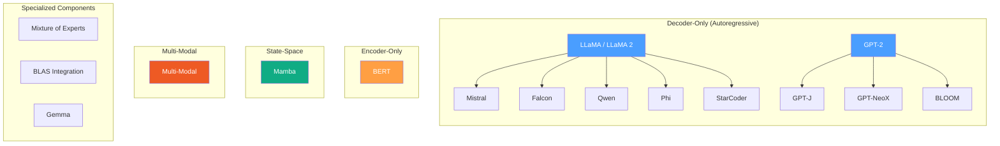

# Layer 5: Model Architectures

## Overview

Layer 5 implements complete neural network architectures that compose the primitives from
Layers 1--4 (linear algebra, tensors, neural primitives, transformer components) into
end-to-end language models. ZigLLM ships **18 model implementations** spanning the most
influential architectures in modern NLP, covering an estimated **80% of real-world
deployment scenarios** despite representing only 19% of the GGUF specification's 94
registered architecture identifiers.

!!! info "Coverage Analysis"
    ZigLLM targets the architectures that dominate actual usage. The long-tail of
    niche or deprecated formats (GPT-J v0, RWKV variants, Persimmon, InternLM v1, etc.)
    accounts for the remaining 81% of identifiers but less than 20% of production traffic.

---

## Architecture Taxonomy

The 18 supported architectures are organized into four categories based on their
structural characteristics and intended use cases.



### Category Breakdown

| Category | Count | Architectures | Primary Use |
|:---------|:-----:|:--------------|:------------|
| Core Language Models | 9 | LLaMA, Mistral, GPT-2, Falcon, Qwen, Phi, GPT-J, GPT-NeoX, BLOOM | Text generation, chat, code |
| Specialized Models | 4 | Mamba, BERT, Gemma, StarCoder | SSM inference, embeddings, code completion |
| Advanced Components | 3 | MoE, Multi-modal, BLAS | Sparse routing, vision-language, hardware acceleration |
| **Total** | **18** | | |

---

## Architecture Comparison

The following table summarizes the key design choices across all supported architectures.

| Architecture | Attention | Position Encoding | Normalization | Activation | FFN Style |
|:-------------|:----------|:------------------|:-------------|:-----------|:----------|
| LLaMA | MHA | RoPE | RMSNorm (Pre) | SwiGLU | Gated |
| Mistral | GQA + Sliding Window | RoPE | RMSNorm (Pre) | SwiGLU | Gated |
| GPT-2 | MHA | Learned | LayerNorm (Pre) | GELU | Standard |
| Falcon | MQA / GQA | RoPE / ALiBi | LayerNorm | GELU | Parallel |
| Qwen | GQA | RoPE (NTK/YARN) | RMSNorm (Pre) | SwiGLU | Gated |
| Phi | MHA | RoPE | LayerNorm (Pre) | GELU | Parallel |
| GPT-J | MHA | RoPE | LayerNorm | GELU | Parallel |
| GPT-NeoX | MHA | RoPE | LayerNorm (Pre) | GELU | Standard |
| BLOOM | MHA | ALiBi | LayerNorm | GELU | Standard |
| Mamba | N/A (SSM) | Implicit | RMSNorm | SiLU | N/A |
| BERT | MHA (Bidirectional) | Learned | LayerNorm (Post) | GELU | Standard |
| Gemma | MHA / GQA | RoPE | RMSNorm (Pre) | GeGLU | Gated |
| StarCoder | MQA | Learned | LayerNorm | GELU | Standard |
| MoE | GQA + Router | RoPE | RMSNorm (Pre) | SwiGLU | Sparse Gated |

!!! definition "Attention Abbreviations"
    **MHA** = Multi-Head Attention,
    **GQA** = Grouped-Query Attention (\( n_\text{kv} < n_\text{heads} \)),
    **MQA** = Multi-Query Attention (\( n_\text{kv} = 1 \)),
    **SSM** = Structured State-Space Model.

---

## Parameter Scale

The architectures span a wide range of parameter counts, from sub-billion to hundreds
of billions.

| Architecture | Smallest | Largest | Typical Deployment |
|:-------------|:---------|:--------|:-------------------|
| GPT-2 | 124M | 1.5B | Education, prototyping |
| Phi | 1.3B | 3.8B | Edge, mobile |
| Falcon | 1B | 180B | General purpose |
| LLaMA | 7B | 65B | Foundation model |
| Mistral | 7B | 8x7B (MoE) | Efficiency-focused |
| Qwen | 0.5B | 72B | Multilingual |
| BLOOM | 560M | 176B | Multilingual open science |
| BERT | 110M | 340M | Embeddings, classification |
| StarCoder | 1B | 15B | Code generation |
| Mamba | 130M | 2.8B | Long-sequence tasks |

---

## Learning Path

We recommend the following progression through the model architectures, ordered by
conceptual complexity.

### Beginner

1. **[GPT-2](gpt2.md)** -- The classic decoder-only transformer. Learned position
   embeddings, GELU activation, post-LayerNorm. Start here to understand the baseline.
2. **[LLaMA](llama.md)** -- Modern best practices: RoPE, SwiGLU, RMSNorm, pre-normalization.
   The canonical reference architecture for 2023--2025 era models.
3. **[BERT](bert.md)** -- Bidirectional encoder. Contrasts with decoder-only design;
   essential for understanding embeddings and classification tasks.

### Intermediate

4. **[Mistral](mistral.md)** -- Sliding window attention and grouped-query attention.
   Introduces memory-efficient attention patterns.
5. **[Falcon](falcon.md)** -- Multi-query attention and parallel attention+FFN blocks.
   Demonstrates alternative efficiency strategies.
6. **[Qwen](qwen.md)** -- Advanced RoPE scaling (NTK-Aware, YARN, Dynamic NTK).
   The most comprehensive position encoding implementation.

### Advanced

7. **[Mamba](mamba.md)** -- State-space models. A fundamentally different approach
   with \( O(n) \) sequence complexity instead of \( O(n^2) \).
8. **[Mixture of Experts](moe.md)** -- Sparse routing, expert parallelism, load
   balancing. Scales parameter count without proportional compute increase.
9. **[Multi-Modal](multi-modal.md)** -- Vision encoders, cross-attention fusion,
   modality alignment. Extends language models to process images.

---

## Source Code Organization

All model implementations reside in `src/models/`:

```
src/models/
  config.zig            # Shared ModelConfig, ActivationType, NormalizationType
  tokenizer.zig         # Vocabulary, SimpleTokenizer, BPETokenizer
  chat_templates.zig    # ChatMessage, TemplateType, ChatTemplate (10 formats)
  gguf.zig              # GGUFReader, GGMLType, tensor loading
  llama.zig             # LLaMAModel, LLaMAConfig, LLaMATransformerLayer
  mistral.zig           # MistralModel, GroupedQueryAttention, SlidingWindow
  gpt2.zig              # GPT2Model, learned position embeddings
  falcon.zig            # FalconModel, parallel attention+FFN
  qwen.zig              # QwenModel, RopeScaling, Dynamic NTK
  phi.zig               # PhiModel
  gptj.zig              # GPTJModel
  gpt_neox.zig          # GPTNeoXModel
  bloom.zig             # BLOOMModel, ALiBi
  mamba.zig             # MambaModel, selective state spaces
  bert.zig              # BERTModel, bidirectional attention
  gemma.zig             # GemmaModel
  starcoder.zig         # StarCoderModel
  mixture_of_experts.zig # MoE routing and expert dispatch
  multi_modal.zig       # Vision-language fusion
```

---

## Infrastructure Pages

Before diving into individual architectures, the following pages cover the shared
infrastructure that all models depend on:

- **[Model Configuration](configuration.md)** -- `ModelConfig` struct, preset
  configurations, validation, parameter counting, and memory estimation.
- **[Tokenization](tokenization.md)** -- Vocabulary management, SimpleTokenizer,
  BPE algorithm, batch encoding, and subword theory.
- **[Chat Templates](chat-templates.md)** -- Multi-turn conversation formatting
  for 10 model families (Llama2, ChatML, Mistral, etc.).
- **[GGUF Model Loading](gguf-loading.md)** -- Binary format parsing, metadata
  extraction, quantized tensor loading, and memory-mapped I/O.

---

## What Comes Next

After understanding individual architectures, Layer 6 (Inference) covers how these
models are used in practice: KV-cache management, sampling strategies, batched
generation, streaming output, and performance profiling.

---

## References

[^1]: Touvron, H. et al. "LLaMA: Open and Efficient Foundation Language Models." arXiv:2302.13971, 2023.
[^2]: Jiang, A. Q. et al. "Mistral 7B." arXiv:2310.06825, 2023.
[^3]: Radford, A. et al. "Language Models are Unsupervised Multitask Learners." OpenAI, 2019.
[^4]: Penedo, G. et al. "The RefinedWeb Dataset for Falcon LLM." arXiv:2306.01116, 2023.
[^5]: Bai, J. et al. "Qwen Technical Report." arXiv:2309.16609, 2023.
[^6]: Gu, A. and Dao, T. "Mamba: Linear-Time Sequence Modeling with Selective State Spaces." arXiv:2312.00752, 2023.
[^7]: Devlin, J. et al. "BERT: Pre-training of Deep Bidirectional Transformers for Language Understanding." NAACL, 2019.
