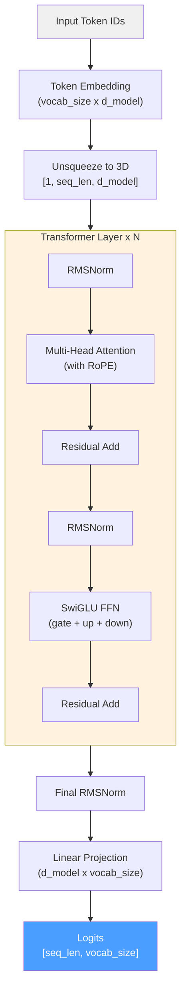

# LLaMA / LLaMA 2

## Overview

LLaMA (Large Language Model Meta AI) is Meta's family of foundation language models,
first released in February 2023[^1] and updated with LLaMA 2 in July 2023[^2].
LLaMA established the modern template for open-weight decoder-only transformers and
remains the canonical reference architecture for understanding contemporary language
models.

ZigLLM's LLaMA implementation in `src/models/llama.zig` serves as both a
production-grade inference engine and an educational reference for the key
innovations that define post-2023 transformer design.

!!! info "Educational Value"
    LLaMA is the recommended starting point for studying modern transformer
    architectures. It introduced the combination of **RoPE + SwiGLU + RMSNorm
    (Pre-Norm)** that has been adopted by nearly every subsequent open-weight
    model (Mistral, Qwen, Phi, Gemma, etc.).

---

## Key Innovations

LLaMA incorporates three architectural improvements over the original Transformer
and GPT-2:

| Component | Original Transformer / GPT-2 | LLaMA |
|:----------|:----------------------------|:------|
| Position Encoding | Sinusoidal / Learned | **Rotary Position Embeddings (RoPE)** |
| Activation | ReLU / GELU | **SwiGLU** (gated activation) |
| Normalization | Post-LayerNorm | **Pre-RMSNorm** |
| Bias Terms | Yes | **No** (removed from all linear layers) |

### RoPE (Rotary Position Embeddings)

RoPE encodes position information by rotating query and key vectors in the
complex plane. For a position \( m \) and dimension index \( i \):

\[
\text{RoPE}(x, m) = \begin{pmatrix} x_0 \\ x_1 \\ x_2 \\ x_3 \\ \vdots \end{pmatrix} \odot \begin{pmatrix} \cos m\theta_0 \\ \cos m\theta_0 \\ \cos m\theta_1 \\ \cos m\theta_1 \\ \vdots \end{pmatrix} + \begin{pmatrix} -x_1 \\ x_0 \\ -x_3 \\ x_2 \\ \vdots \end{pmatrix} \odot \begin{pmatrix} \sin m\theta_0 \\ \sin m\theta_0 \\ \sin m\theta_1 \\ \sin m\theta_1 \\ \vdots \end{pmatrix}
\]

where \( \theta_i = \text{rope\_theta}^{-2i/d} \) and rope_theta = 10000.0 by default.

!!! definition "Why RoPE?"
    RoPE makes attention scores depend only on the **relative** distance between
    positions, not their absolute values. This enables better length generalization
    and is more parameter-efficient than learned position embeddings.

### SwiGLU Activation

The feed-forward network uses a gated activation with three weight matrices:

\[
\text{FFN}(x) = (\text{Swish}(xW_\text{gate}) \odot xW_\text{up}) \cdot W_\text{down}
\]

where \( \text{Swish}(x) = x \cdot \sigma(x) \) and \( \odot \) denotes element-wise
multiplication. The intermediate dimension is \( d_\text{ff} \approx \frac{8}{3} d_\text{model} \)
to keep the parameter count comparable to a standard 2-matrix FFN with \( d_\text{ff} = 4d_\text{model} \).

### Pre-Normalization with RMSNorm

LLaMA applies normalization **before** each sub-layer (attention and FFN) rather
than after. This improves gradient flow in deep networks. RMSNorm is used instead
of LayerNorm for efficiency.

---

## Architecture Diagram



---

## Configuration

### LLaMAConfig Struct

```zig
pub const LLaMAConfig = struct {
    d_model: usize,       // Hidden dimension
    num_layers: usize,    // Number of transformer layers
    num_heads: usize,     // Number of attention heads
    d_ff: usize,          // Feed-forward intermediate dimension
    vocab_size: usize,    // Vocabulary size
    max_seq_len: usize,   // Maximum sequence length
    norm_eps: f32,        // RMSNorm epsilon (1e-6)
    use_rope: bool,       // Always true for LLaMA
    rope_theta: f32,      // RoPE base frequency (10000.0)
};
```

### Preset Configurations

| Parameter | 7B | 13B | 30B | 65B |
|:----------|---:|----:|----:|----:|
| `d_model` | 4096 | 5120 | 6656 | 8192 |
| `num_layers` | 32 | 40 | 60 | 80 |
| `num_heads` | 32 | 40 | 52 | 64 |
| `d_ff` | 11008 | 13824 | 17920 | 22016 |
| `d_head` | 128 | 128 | 128 | 128 |
| `vocab_size` | 32000 | 32000 | 32000 | 32000 |
| `max_seq_len` | 2048 | 2048 | 2048 | 2048 |
| Parameters | ~6.7B | ~13.0B | ~30.0B | ~65.2B |

!!! tip "Scaling Pattern"
    The head dimension \( d_\text{head} = d_\text{model} / n_\text{heads} = 128 \)
    is constant across all sizes. The FFN ratio \( d_\text{ff} / d_\text{model} \approx 2.68 \)
    is also consistent, reflecting the \( \frac{8}{3} \) multiplier for SwiGLU.

### Parameter Count Formula

```zig
pub fn getParameterCount(self: LLaMAConfig) usize {
    const embedding_params = self.vocab_size * self.d_model;
    const attention_params_per_layer = 4 * self.d_model * self.d_model;
    const ffn_params_per_layer = 3 * self.d_model * self.d_ff;
    const layer_params = attention_params_per_layer + ffn_params_per_layer;
    const output_params = self.d_model * self.vocab_size;
    const final_norm_params = self.d_model;
    return embedding_params + self.num_layers * layer_params
         + output_params + final_norm_params;
}
```

\[
P = V \cdot d + L \cdot (4d^2 + 3d \cdot d_\text{ff}) + d \cdot V + d
\]

---

## Forward Pass

The forward pass transforms a sequence of token IDs into next-token logits.

### Step-by-Step Walkthrough

```zig
pub fn forward(self: *const LLaMAModel, token_ids: []const u32) !Tensor(f32) {
    // 1. Token embeddings: [seq_len] -> [seq_len, d_model]
    var embeddings_2d = try self.token_embeddings.forward(token_ids);
    defer embeddings_2d.deinit();

    // 2. Unsqueeze to 3D: [seq_len, d_model] -> [1, seq_len, d_model]
    const embeddings = try Tensor(f32).init(self.allocator,
        &[_]usize{ 1, seq_len, d_model });
    @memcpy(embeddings.data, embeddings_2d.data);

    // 3. Pass through all transformer layers
    var current_hidden = embeddings;
    for (0..self.config.num_layers) |layer_idx| {
        const layer_output = try self.transformer_layers[layer_idx]
            .forward(current_hidden);
        current_hidden.deinit();
        current_hidden = layer_output;
    }

    // 4. Final RMSNorm
    var normalized = try normalization.rmsNorm(f32,
        current_hidden, self.final_norm, self.allocator);
    current_hidden.deinit();

    // 5. Output projection: [1, seq_len, d_model] @ [d_model, vocab_size]
    var logits_3d = try normalized.matmul(self.output_projection, self.allocator);

    // 6. Squeeze to [seq_len, vocab_size]
    const logits = try Tensor(f32).init(self.allocator,
        &[_]usize{ seq_len, self.config.vocab_size });
    @memcpy(logits.data, logits_3d.data);
    return logits;
}
```

### Single Layer Forward

Each `LLaMATransformerLayer` implements the pre-norm residual pattern:

```zig
pub fn forward(self: *const LLaMATransformerLayer, input: Tensor(f32)) !Tensor(f32) {
    // Pre-norm attention
    var attention_normed = try normalization.rmsNorm(f32,
        input, self.attention_norm, self.allocator);
    var attention_output = try self.attention.forward(
        attention_normed, attention_normed, attention_normed, null);
    var after_attention = try input.add(attention_output, self.allocator);

    // Pre-norm FFN
    var ffn_normed = try normalization.rmsNorm(f32,
        after_attention, self.ffn_norm, self.allocator);
    var ffn_output = try self.ffn.forward(ffn_normed);
    return try after_attention.add(ffn_output, self.allocator);
}
```

!!! algorithm "Pre-Norm Residual Block"
    For sub-layer function \( f \) and normalization \( \text{Norm} \):
    
    \[
    x_\text{out} = x + f(\text{Norm}(x))
    \]
    
    This differs from post-norm (\( x_\text{out} = \text{Norm}(x + f(x)) \)) and
    provides more stable gradients in deep networks (60--80 layers).

---

## LLaMA 2 Improvements

LLaMA 2 builds on the original architecture with three key enhancements.

### Grouped-Query Attention (GQA)

LLaMA 2 reduces the number of key-value heads while keeping the full number of
query heads. For the 70B model: 64 query heads share 8 KV head groups (8:1 ratio).

\[
\text{Memory}_\text{KV} \propto n_\text{kv\_heads} \times d_\text{head} \times \text{seq\_len}
\]

With GQA at 8:1 ratio, KV cache memory is reduced by 8x compared to standard MHA.

### Extended Context Length

LLaMA 2 doubles the context window from 2048 to 4096 tokens, enabled by RoPE's
natural extrapolation properties.

### RLHF Training

LLaMA 2 Chat models are fine-tuned with Reinforcement Learning from Human Feedback
(RLHF), which is an inference-time concern only through the use of appropriate
chat templates (see [Chat Templates](chat-templates.md)).

---

## Model Struct

```zig
pub const LLaMAModel = struct {
    config: LLaMAConfig,
    token_embeddings: TokenEmbedding,         // [vocab_size, d_model]
    transformer_layers: []LLaMATransformerLayer,  // N layers
    final_norm: Tensor(f32),                  // [d_model] RMSNorm weights
    output_projection: Tensor(f32),           // [d_model, vocab_size]
    allocator: Allocator,
};
```

### Generation

The `generate()` method implements greedy autoregressive generation:

```zig
pub fn generate(self: *const LLaMAModel, prompt_tokens: []const u32,
                max_new_tokens: usize, allocator: Allocator) ![]u32 {
    var generated = try allocator.alloc(u32, prompt_tokens.len + max_new_tokens);
    @memcpy(generated[0..prompt_tokens.len], prompt_tokens);
    var current_length = prompt_tokens.len;

    for (0..max_new_tokens) |_| {
        var logits = try self.forward(generated[0..current_length]);
        defer logits.deinit();

        // Greedy: select highest logit at last position
        var best_token: u32 = 0;
        var max_logit: f32 = -std.math.inf(f32);
        for (0..self.config.vocab_size) |tid| {
            const l = try logits.get(&[_]usize{current_length - 1, tid});
            if (l > max_logit) { max_logit = l; best_token = @intCast(tid); }
        }

        generated[current_length] = best_token;
        current_length += 1;
        if (best_token == 2) break; // EOS
    }

    return generated[prompt_tokens.len..current_length];
}
```

!!! tip "Production Generation"
    The greedy generation shown here is for educational clarity. Production
    inference uses temperature sampling, top-k/top-p filtering, and KV-cache
    (see the [Inference](../inference/index.md) documentation).

---

## Historical Significance

LLaMA's release in February 2023 was a watershed moment for open-source AI:

- **Efficiency**: Demonstrated that smaller, well-trained models could match or
  exceed larger predecessors (LLaMA-13B matched GPT-3 175B on many benchmarks).
- **Scaling laws**: Trained on 1.0--1.4T tokens, significantly more data than
  previous practice for models of this size.
- **Open weights**: Made high-quality foundation models accessible to the research
  community, spawning an ecosystem of fine-tuned variants (Alpaca, Vicuna, etc.).

---

## References

[^1]: Touvron, H. et al. "LLaMA: Open and Efficient Foundation Language Models." arXiv:2302.13971, 2023.
[^2]: Touvron, H. et al. "Llama 2: Open Foundation and Fine-Tuned Chat Models." arXiv:2307.09288, 2023.
[^3]: Su, J. et al. "RoFormer: Enhanced Transformer with Rotary Position Embedding." arXiv:2104.09864, 2021.
[^4]: Shazeer, N. "GLU Variants Improve Transformer." arXiv:2002.05202, 2020.
[^5]: Zhang, B. and Sennrich, R. "Root Mean Square Layer Normalization." NeurIPS, 2019.
