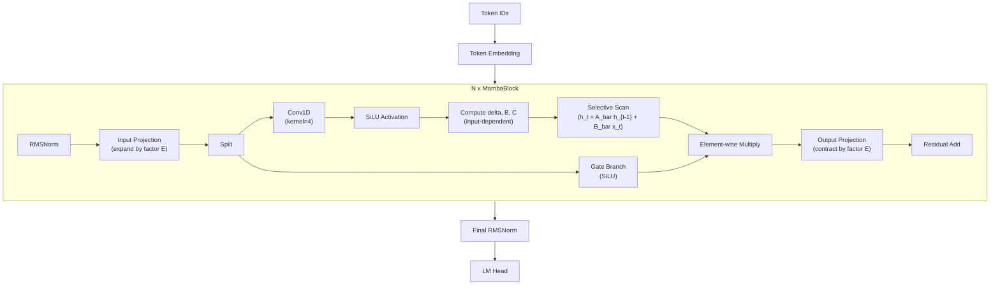

# Mamba -- State-Space Models

**Mamba** represents a fundamental departure from the transformer paradigm.
Introduced by Gu and Dao (2023)[^1], Mamba is a **Selective State Space Model**
(SSM) that achieves linear-time sequence processing with constant memory per
step.  Where transformers compute pairwise interactions between all tokens
(quadratic in sequence length), Mamba maintains a compressed hidden state that
evolves as each token is processed -- analogous to a recurrent neural network
but with carefully structured dynamics that enable efficient parallel training.

---

## 1. Architecture Overview

!!! info "From S4 to Mamba"

    Mamba builds on the Structured State Spaces (S4) framework introduced by
    Gu et al. (2021)[^2].  S4 showed that continuous-time state-space models,
    when discretized and parameterized with structured matrices, could match
    transformers on long-range benchmarks.  Mamba's key insight was to make the
    SSM parameters **input-dependent** (selective), breaking the linear
    time-invariance of S4 while retaining efficient computation through a
    custom selective scan algorithm.

| Property | Transformer (Attention) | Mamba (SSM) |
|----------|:-:|:-:|
| Time complexity (inference) | \( O(n^2 d) \) | \( O(n d) \) |
| Memory per step | \( O(n) \) KV cache | \( O(d_{\text{state}}) \) constant |
| Parallelizable training | Yes (matrix multiply) | Yes (parallel scan) |
| Captures long-range deps | Explicit (all-pairs) | Through state evolution |

---

## 2. Key Innovations

### 2.1 Continuous-Time State-Space Model

The foundation of Mamba is a linear dynamical system in continuous time:

!!! definition "Continuous SSM"

    \[
        h'(t) = A\,h(t) + B\,x(t)
    \]
    \[
        y(t) = C\,h(t) + D\,x(t)
    \]

    where \( h(t) \in \mathbb{R}^N \) is the hidden state,
    \( x(t) \in \mathbb{R} \) is the input, \( y(t) \in \mathbb{R} \) is the
    output, \( A \in \mathbb{R}^{N \times N} \) governs state dynamics,
    \( B \in \mathbb{R}^{N \times 1} \) maps input to state, and
    \( C \in \mathbb{R}^{1 \times N} \) maps state to output.

### 2.2 Discretization

To process discrete token sequences, the continuous system is discretized using
a step size \( \Delta \):

!!! definition "Zero-Order Hold Discretization"

    \[
        \bar{A} = \exp(\Delta A)
    \]
    \[
        \bar{B} = (\Delta A)^{-1}(\exp(\Delta A) - I) \cdot \Delta B
    \]

    The discrete recurrence becomes:

    \[
        h_t = \bar{A}\,h_{t-1} + \bar{B}\,x_t
    \]
    \[
        y_t = C\,h_t + D\,x_t
    \]

### 2.3 Selective Scan (The Mamba Innovation)

In S4, the parameters \( \Delta, B, C \) are fixed across the sequence.  Mamba
makes them **input-dependent**:

!!! algorithm "Selective State Space"

    For each token \( x_t \in \mathbb{R}^d \):

    1. Compute input-dependent parameters:
        - \( \Delta_t = \text{softplus}(\text{Linear}(x_t)) \in \mathbb{R}^d \)
        - \( B_t = \text{Linear}(x_t) \in \mathbb{R}^{d \times N} \)
        - \( C_t = \text{Linear}(x_t) \in \mathbb{R}^{d \times N} \)
    2. Discretize: \( \bar{A}_t = \exp(\Delta_t A) \), \( \bar{B}_t = f(\Delta_t, A, B_t) \)
    3. Recurrence: \( h_t = \bar{A}_t \odot h_{t-1} + \bar{B}_t \odot x_t \)
    4. Output: \( y_t = C_t^T h_t \)

    The "selective" nature means the model can learn to **ignore irrelevant
    tokens** (small \( \Delta \) causes \( \bar{A} \approx I \), passing state
    through unchanged) or **incorporate them** (large \( \Delta \) resets the
    state toward the new input).

### 2.4 Efficient Parallel Scan

During training, the sequential recurrence is computed efficiently using a
**parallel prefix scan** (also called parallel associative scan):

!!! complexity "Scan Complexity"

    The parallel scan computes all \( h_1, h_2, \ldots, h_n \) in
    \( O(n \log n) \) work with \( O(\log n) \) sequential depth on parallel
    hardware.  At inference time, the recurrence runs in \( O(1) \) per step
    (just one state update), achieving true linear-time generation.

---

## 3. Architecture Diagram



---

## 4. Configuration Parameters

| Parameter | Mamba-130M | Mamba-1.4B | Mamba-2.8B |
|-----------|:---:|:---:|:---:|
| `n_layers` | 24 | 48 | 64 |
| `d_model` | 768 | 2048 | 2560 |
| `d_state` (N) | 16 | 16 | 16 |
| `d_conv` | 4 | 4 | 4 |
| `expand_factor` (E) | 2 | 2 | 2 |
| `d_inner` | 1536 | 4096 | 5120 |
| `vocab_size` | 50280 | 50280 | 50280 |
| `dt_rank` | "auto" | "auto" | "auto" |
| `dt_min` | 0.001 | 0.001 | 0.001 |
| `dt_max` | 0.1 | 0.1 | 0.1 |
| `norm_type` | RMSNorm | RMSNorm | RMSNorm |

!!! info "dt_rank = 'auto'"

    When set to "auto", \( \text{dt\_rank} = \lceil d_{\text{model}} / 16 \rceil \).
    This controls the bottleneck dimension used when projecting from the input
    to the step size \( \Delta \).

---

## 5. Mathematical Formulation

### 5.1 Full MambaBlock Forward Pass

For input \( x \in \mathbb{R}^{s \times d} \):

**Step 1: Input projection and gating**

\[
    z = x W_{\text{in}}, \quad z \in \mathbb{R}^{s \times 2d_{\text{inner}}}
\]
\[
    u = z_{:, \, :d_{\text{inner}}}, \quad g = z_{:, \, d_{\text{inner}}:}
\]

**Step 2: Causal convolution**

\[
    u' = \text{Conv1D}(u, \text{kernel\_size}=4)
\]
\[
    u'' = \text{SiLU}(u')
\]

**Step 3: SSM parameter computation**

\[
    \Delta = \text{softplus}(u'' W_{\Delta} + b_{\Delta})
\]
\[
    B = u'' W_B, \quad C = u'' W_C
\]

**Step 4: Discretization and selective scan**

\[
    \bar{A}_t = \exp(\Delta_t \odot A), \quad
    \bar{B}_t = \Delta_t \odot B_t
\]
\[
    h_t = \bar{A}_t \odot h_{t-1} + \bar{B}_t \odot u''_t
\]
\[
    y_t = (C_t \cdot h_t) + D \cdot u''_t
\]

**Step 5: Gated output**

\[
    o = (y \odot \text{SiLU}(g)) W_{\text{out}}
\]

### 5.2 Comparison: Attention vs. SSM

!!! definition "Attention as All-Pairs Interaction"

    \[
        y_i = \sum_{j=1}^{n} \alpha_{ij} \, v_j, \quad
        \alpha_{ij} = \frac{\exp(q_i^T k_j / \sqrt{d})}{\sum_{t} \exp(q_i^T k_t / \sqrt{d})}
    \]

    Every output token directly considers every input token. Memory: \( O(n) \)
    KV cache entries per layer.

!!! definition "SSM as Compressed State Evolution"

    \[
        y_t = C_t^T (\bar{A}_t h_{t-1} + \bar{B}_t x_t)
    \]

    Each output depends on a fixed-size state \( h \in \mathbb{R}^{d \times N} \).
    Memory: \( O(d \cdot N) \) per layer, **independent of sequence length**.

---

## 6. Zig Implementation

### 6.1 MambaConfig

```zig
pub const MambaConfig = struct {
    n_layers: u32,
    d_model: u32,
    d_state: u32 = 16,         // SSM state dimension N
    d_conv: u32 = 4,           // causal convolution kernel size
    expand_factor: u32 = 2,    // inner dimension = d_model * expand_factor
    vocab_size: u32 = 50280,
    dt_rank: ?u32 = null,      // null means auto = ceil(d_model / 16)
    dt_min: f32 = 0.001,
    dt_max: f32 = 0.1,
    norm_eps: f32 = 1e-5,

    pub fn dInner(self: MambaConfig) u32 {
        return self.d_model * self.expand_factor;
    }

    pub fn dtRank(self: MambaConfig) u32 {
        return self.dt_rank orelse
            @intFromFloat(@ceil(@as(f32, @floatFromInt(self.d_model)) / 16.0));
    }
};
```

### 6.2 MambaBlock

```zig
pub const MambaBlock = struct {
    norm: RMSNorm,
    in_proj: Linear,       // d_model -> 2 * d_inner
    conv1d: Conv1D,        // causal conv, kernel_size = d_conv
    dt_proj: Linear,       // d_inner -> dt_rank -> d_inner
    A_log: Tensor(f32),    // log of diagonal A matrix [d_inner, d_state]
    D: Tensor(f32),        // skip connection parameter [d_inner]
    x_proj: Linear,        // d_inner -> dt_rank + 2 * d_state
    out_proj: Linear,      // d_inner -> d_model

    ssm_state: Tensor(f32),  // [d_inner, d_state] -- persistent state

    pub fn forward(self: *MambaBlock, x: []f32) ![]f32 {
        const normed = self.norm.forward(x);

        // Project and split into main path + gate
        const projected = self.in_proj.forward(normed);
        const u = projected[0..self.config.dInner()];
        const gate = projected[self.config.dInner()..];

        // Causal convolution + activation
        const conv_out = self.conv1d.forward(u);
        const activated = silu(conv_out);

        // Compute input-dependent SSM parameters
        const x_db = self.x_proj.forward(activated);
        const dt = softplus(self.dt_proj.forward(x_db[0..dt_rank]));
        const B = x_db[dt_rank .. dt_rank + d_state];
        const C = x_db[dt_rank + d_state ..];

        // Selective scan
        const A = negate(exp(self.A_log.data));
        const y = self.selectiveScan(activated, dt, A, B, C);

        // Gated output
        const gated = elementMul(y, silu(gate));
        return self.out_proj.forward(gated);
    }

    fn selectiveScan(
        self: *MambaBlock,
        u: []f32,     // input
        dt: []f32,    // step sizes
        A: []f32,     // state matrix (diagonal)
        B: []f32,     // input matrix
        C: []f32,     // output matrix
    ) []f32 {
        // For each element in d_inner:
        //   A_bar = exp(dt * A)
        //   B_bar = dt * B
        //   h = A_bar * h + B_bar * u
        //   y = C^T * h + D * u
        // ... (see source for full implementation)
    }
};
```

---

## 7. Variants

### 7.1 Mamba-2 (Structured State Space Duality)

Mamba-2 (Dao and Gu, 2024)[^3] reformulates the selective SSM as a
structured matrix operation, revealing a deep connection between SSMs and
attention:

!!! definition "State Space Duality (SSD)"

    The selective scan can be expressed as a matrix multiplication with a
    specific causal structure:

    \[
        Y = M \cdot (X \odot B), \quad M_{ij} = \begin{cases}
            C_i^T \left(\prod_{k=j+1}^{i} \bar{A}_k\right) & i \geq j \\
            0 & i < j
        \end{cases}
    \]

    This dual view enables using matrix multiply hardware (tensor cores) for
    training while retaining the recurrent form for inference.

### 7.2 Model Variants

| Model | Parameters | Layers | d_model | d_state |
|-------|-----------|--------|---------|---------|
| Mamba-130M | 130M | 24 | 768 | 16 |
| Mamba-370M | 370M | 48 | 1024 | 16 |
| Mamba-790M | 790M | 48 | 1536 | 16 |
| Mamba-1.4B | 1.4B | 48 | 2048 | 16 |
| Mamba-2.8B | 2.8B | 64 | 2560 | 16 |
| Mamba-2 | Various | -- | -- | 64-128 |

---

## 8. Educational Value

!!! tip "What Mamba Teaches"

    1. **Alternative to attention**: Mamba is the most important counterexample
       to the assumption that transformers are the only viable architecture for
       language modeling.  Understanding SSMs broadens one's view of sequence
       modeling fundamentally.

    2. **Continuous-time dynamics**: The derivation from continuous ODEs through
       discretization teaches the connection between differential equations and
       discrete sequence processing -- a bridge between signal processing and
       deep learning.

    3. **Selectivity as content-based filtering**: The input-dependent \(\Delta\)
       mechanism is an elegant implementation of "pay attention to what matters."
       Large \(\Delta\) incorporates new information; small \(\Delta\) preserves
       existing state.  This is an intuitive analogy to attention's query-key
       mechanism.

    4. **Complexity trade-offs**: The \( O(n) \) vs \( O(n^2) \) comparison is
       not just theoretical -- it has direct implications for long-context
       applications.  Mamba can process sequences of 100K+ tokens where
       attention would exhaust memory.

    5. **Parallel scan algorithm**: The parallel prefix scan is a classic
       algorithm from parallel computing.  Implementing it for SSMs is a
       practical application of this fundamental technique.

---

## 9. References

[^1]: Gu, A. & Dao, T. "Mamba: Linear-Time Sequence Modeling with Selective State Spaces." *arXiv:2312.00752*, 2023.
[^2]: Gu, A. et al. "Efficiently Modeling Long Sequences with Structured State Spaces." *ICLR*, 2022.
[^3]: Dao, T. & Gu, A. "Transformers are SSMs: Generalized Models and Efficient Algorithms Through Structured State Space Duality." *ICML*, 2024.
[^4]: Smith, J. T. H. et al. "Simplified State Space Layers for Sequence Modeling." *ICLR*, 2023.
