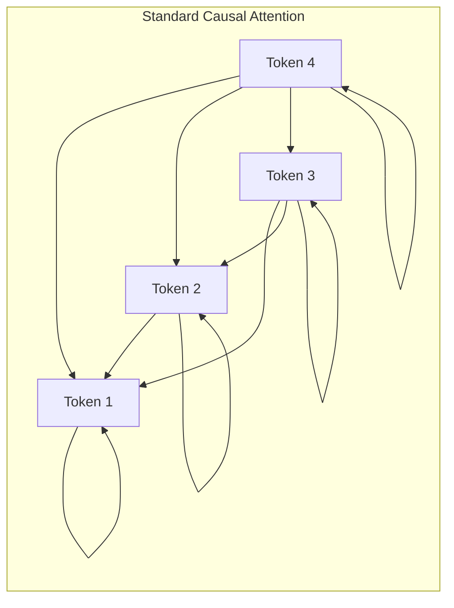
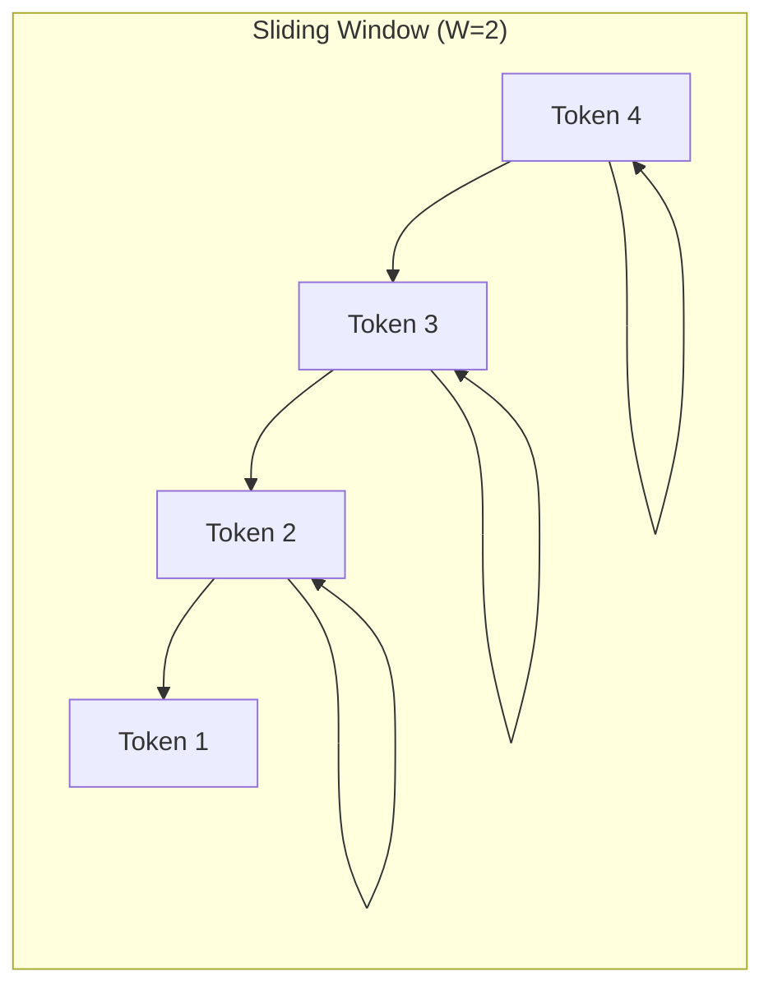

# Mistral

## Overview

Mistral 7B, released by Mistral AI in September 2023[^1], introduced two key
efficiency innovations to the LLaMA-style architecture: **Sliding Window
Attention (SWA)** and **Grouped-Query Attention (GQA)**. Despite having only
7.3 billion parameters, Mistral 7B matched or exceeded LLaMA 2 13B across most
benchmarks, demonstrating that architectural efficiency can substitute for raw
parameter count.

ZigLLM implements the Mistral architecture in `src/models/mistral.zig`, including
the sliding window mask, GQA head repetition, and the Mixtral 8x7B MoE variant
configuration.

---

## Key Innovations

### Sliding Window Attention

Standard causal attention allows each token to attend to all preceding tokens,
resulting in \( O(n^2) \) complexity for sequence length \( n \). Sliding Window
Attention restricts each token to attend only within a local window of size \( W \).

\[
\text{Attention}(Q, K, V) = \text{softmax}\left(\frac{QK^T}{\sqrt{d_k}} + M_\text{SWA}\right) V
\]

where the mask \( M_\text{SWA}[i,j] \) is:

\[
M_\text{SWA}[i,j] = \begin{cases} 0 & \text{if } j \le i \text{ and } (i-j) \le W \\ -\infty & \text{otherwise} \end{cases}
\]





!!! complexity "Complexity Reduction"
    - **Standard causal**: \( O(n^2 \cdot d) \) time, \( O(n^2) \) memory for attention scores
    - **Sliding window**: \( O(n \cdot W \cdot d) \) time, \( O(n \cdot W) \) memory
    
    For Mistral 7B with \( W = 4096 \) and typical inference sequences of
    \( n = 8192 \)--\( 32768 \), this provides a 2--8x reduction in attention
    memory.

!!! info "Information Flow Beyond the Window"
    Although each layer only attends within window \( W \), information can
    propagate across the full sequence through multiple layers. After \( L \)
    layers, a token can theoretically access information from \( L \times W \)
    positions back. For Mistral 7B: \( 32 \times 4096 = 131{,}072 \) positions.

### Grouped-Query Attention (GQA)

Mistral 7B uses 32 query heads but only 8 key-value heads, giving a 4:1 sharing
ratio. Each group of 4 query heads shares a single set of K and V projections.

\[
n_\text{groups} = \frac{n_\text{heads}}{n_\text{kv\_heads}} = \frac{32}{8} = 4
\]

| Attention Type | Query Heads | KV Heads | KV Memory | Used By |
|:---------------|:-----------:|:--------:|:---------:|:--------|
| MHA | 32 | 32 | 1.0x | LLaMA, GPT-2 |
| **GQA** | **32** | **8** | **0.25x** | **Mistral**, LLaMA 2 70B |
| MQA | 32 | 1 | 0.03x | Falcon-7B |

The KV cache memory saving is proportional to the ratio \( n_\text{kv\_heads} / n_\text{heads} \).

---

## Configuration

### MistralConfig Struct

```zig
pub const MistralConfig = struct {
    d_model: usize,           // 4096
    n_heads: usize,           // 32 (query heads)
    n_kv_heads: usize,        // 8 (key-value heads for GQA)
    n_layers: usize,          // 32
    vocab_size: usize,        // 32000
    max_seq_len: usize,       // 32768
    intermediate_size: usize, // 14336 (SwiGLU FFN)
    rope_theta: f32,          // 10000.0
    sliding_window: ?usize,   // 4096 (null = full attention)
    num_experts: ?usize,      // null for base, 8 for Mixtral
    num_experts_per_tok: ?usize, // null for base, 2 for Mixtral
};
```

### Variant Configurations

| Parameter | Mistral 7B | Mixtral 8x7B |
|:----------|:-----------|:-------------|
| `d_model` | 4096 | 4096 |
| `n_heads` | 32 | 32 |
| `n_kv_heads` | 8 | 8 |
| `n_layers` | 32 | 32 |
| `vocab_size` | 32000 | 32000 |
| `max_seq_len` | 32768 | 32768 |
| `intermediate_size` | 14336 | 14336 |
| `rope_theta` | 10000.0 | 1000000.0 |
| `sliding_window` | 4096 | null (full) |
| `num_experts` | null | 8 |
| `num_experts_per_tok` | null | 2 |
| Total params | 7.3B | 46.7B (12.9B active) |

!!! info "Mixtral Active Parameters"
    Mixtral 8x7B has 46.7B total parameters but only activates 2 of 8 experts
    per token, resulting in ~12.9B active parameters per forward pass --
    comparable compute to a 13B dense model with the capacity of a 47B model.

---

## Architecture Components

### GroupedQueryAttention

The core attention module handles the asymmetric Q/KV head counts.

```zig
pub const GroupedQueryAttention = struct {
    d_model: usize,
    n_heads: usize,       // 32 query heads
    n_kv_heads: usize,    // 8 KV heads
    head_dim: usize,      // d_model / n_heads = 128

    q_proj: Tensor(f32),  // [d_model, d_model]
    k_proj: Tensor(f32),  // [d_model, n_kv_heads * head_dim]
    v_proj: Tensor(f32),  // [d_model, n_kv_heads * head_dim]
    o_proj: Tensor(f32),  // [d_model, d_model]
};
```

The key implementation detail is the **KV head repetition** step, where each KV
head is broadcast to serve multiple query heads:

```zig
fn repeatKVHeads(self: *Self, kv_tensor: Tensor(f32)) !Tensor(f32) {
    const repeat_factor = self.n_heads / self.n_kv_heads; // 4
    // For each sequence position:
    //   For each KV head:
    //     Copy to repeat_factor query head positions
    for (0..seq_len) |s| {
        for (0..self.n_kv_heads) |kv_head| {
            for (0..repeat_factor) |rep| {
                const q_head = kv_head * repeat_factor + rep;
                // Copy kv_head data to q_head position
                @memcpy(result[q_head_offset..], kv_data[kv_head_offset..]);
            }
        }
    }
}
```

### Sliding Window Mask

```zig
fn createSlidingWindowMask(self: *Self, seq_len: usize,
                            window_size: usize) !Tensor(f32) {
    for (0..seq_len) |i| {
        for (0..seq_len) |j| {
            if (j <= i and (i - j) <= window_size) {
                mask[i][j] = 0.0;       // Attend
            } else {
                mask[i][j] = -inf;       // Mask out
            }
        }
    }
}
```

### SwiGLU MLP

Mistral uses the same SwiGLU FFN as LLaMA:

```zig
pub const SwiGLUMLP = struct {
    gate_proj: Tensor(f32),   // [d_model, intermediate_size]
    up_proj: Tensor(f32),     // [d_model, intermediate_size]
    down_proj: Tensor(f32),   // [intermediate_size, d_model]

    pub fn forward(self: *Self, input: Tensor(f32)) !Tensor(f32) {
        const gate = try input.matmul(self.gate_proj, self.allocator);
        const gate_activated = try silu(gate);  // SiLU = Swish
        const up = try input.matmul(self.up_proj, self.allocator);
        const combined = try elementwiseMul(gate_activated, up);
        return try combined.matmul(self.down_proj, self.allocator);
    }
};
```

---

## Forward Pass

The `MistralBlock` implements the standard pre-norm residual pattern with an
optional sliding window:

```zig
pub fn forward(self: *Self, input: Tensor(f32),
               rope_cache: ?Tensor(f32)) !Tensor(f32) {
    // 1. Pre-attention RMSNorm
    const normed_input = try self.input_layernorm.forward(input);

    // 2. GQA with sliding window
    const attn_output = try self.attention.forward(
        normed_input, rope_cache, self.config.sliding_window);

    // 3. Residual connection
    const after_attn = try self.addResidual(input, attn_output);

    // 4. Pre-MLP RMSNorm
    const normed_attn = try self.post_attention_layernorm.forward(after_attn);

    // 5. SwiGLU MLP
    const mlp_output = try self.mlp.forward(normed_attn);

    // 6. Residual connection
    return try self.addResidual(after_attn, mlp_output);
}
```

The full model stacks \( N \) blocks:

```zig
pub fn forward(self: *Self, input_ids: []const u32) !Tensor(f32) {
    var hidden_states = try self.getEmbeddings(input_ids);
    const rope_cache = try self.createRoPECache(input_ids.len);

    for (self.blocks) |*block| {
        const new_states = try block.forward(hidden_states, rope_cache);
        hidden_states.deinit(self.allocator);
        hidden_states = new_states;
    }

    const normed = try self.norm.forward(hidden_states);
    return try normed.matmul(self.lm_head, self.allocator);
}
```

---

## Mistral vs LLaMA Comparison

| Aspect | LLaMA 7B | Mistral 7B |
|:-------|:---------|:-----------|
| Parameters | 6.7B | 7.3B |
| Context length | 2048 (LLaMA 1) / 4096 (LLaMA 2) | 32768 |
| Attention | MHA (32/32) | GQA (32 Q / 8 KV) |
| Window | Full causal | Sliding (W=4096) |
| KV cache per layer | \( 2 \times 32 \times 128 \times S \) | \( 2 \times 8 \times 128 \times S \) |
| KV cache ratio | 1.0x | 0.25x |
| FFN intermediate | 11008 | 14336 |
| Activation | SwiGLU | SwiGLU |
| Normalization | RMSNorm | RMSNorm |

!!! tip "When to Choose Mistral"
    Choose Mistral over LLaMA when you need long-context inference (> 4096 tokens)
    or when KV cache memory is a bottleneck (e.g., high-throughput serving with
    many concurrent sequences). The GQA head reduction provides significant
    memory savings during generation.

---

## Mixtral (MoE Variant)

Mixtral 8x7B replaces each dense FFN with a Mixture-of-Experts layer containing
8 expert FFNs, of which 2 are activated per token via a learned router. This is
covered in detail in [Mixture of Experts](moe.md). The key differences from base
Mistral are:

- `rope_theta` increased to 1,000,000 for better long-range position encoding
- Sliding window disabled (full causal attention)
- 8 expert FFNs per layer, 2 active per token
- Total parameters: 46.7B, active parameters: ~12.9B

---

## References

[^1]: Jiang, A. Q. et al. "Mistral 7B." arXiv:2310.06825, 2023.
[^2]: Jiang, A. Q. et al. "Mixtral of Experts." arXiv:2401.04088, 2024.
[^3]: Ainslie, J. et al. "GQA: Training Generalized Multi-Query Transformer Models from Multi-Head Checkpoints." EMNLP, 2023.
[^4]: Beltagy, I. et al. "Longformer: The Long-Document Transformer." arXiv:2004.05150, 2020.
