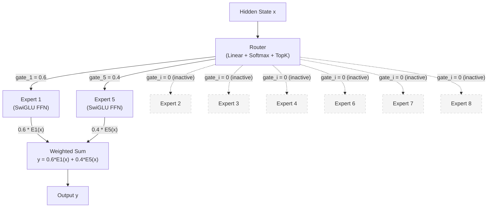
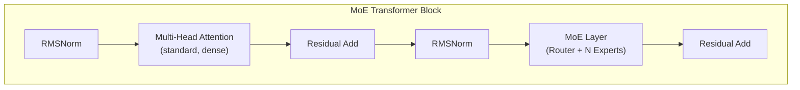

# Mixture of Experts (MoE)

The **Mixture of Experts** paradigm is one of the most important ideas in
scaling language models efficiently.  Rather than activating all parameters for
every token, MoE models activate only a small subset of **expert** sub-networks
per token, selected by a learned **router**.  This allows the total parameter
count to grow dramatically -- improving model capacity -- while keeping the
computational cost per token nearly constant.  A 47B-parameter MoE model may
activate only 13B parameters per token, achieving the quality of a dense 47B
model at the cost of a 13B one[^1].

---

## 1. Architecture Overview

!!! info "Historical Context"

    The Mixture of Experts concept dates back to Jacobs et al. (1991)[^2] and
    was revived for transformers by Shazeer et al. (2017)[^3].  The modern
    resurgence began with the Switch Transformer (Fedus et al., 2021)[^4],
    which simplified routing to \( k=1 \) (one expert per token).  Mixtral
    (Jiang et al., 2024)[^1] demonstrated that MoE could produce a
    state-of-the-art open model at a fraction of the inference cost.

In a standard transformer, every token passes through the same feed-forward
network (FFN).  In an MoE transformer, the FFN layer is replaced by a set of
\( N \) parallel expert FFNs, and a **router** (also called a gate) selects
the top-\( k \) experts for each token.

---

## 2. Key Innovations

### 2.1 Sparse Activation

!!! definition "Sparse Expert Activation"

    For \( N \) experts and top-\( k \) routing, only \( k \) experts are
    active per token.  The ratio of active to total parameters is:

    \[
        \text{sparsity ratio} = 1 - \frac{k}{N}
    \]

    For Mixtral 8x7B with \( k=2 \), \( N=8 \): sparsity = 75%.

### 2.2 Router / Gate

The router is a small linear layer that maps each token's hidden state to a
score over all experts:

!!! definition "Expert Router"

    \[
        G(x) = \text{TopK}\!\left(\text{softmax}(x W_g), k\right)
    \]

    where \( W_g \in \mathbb{R}^{d \times N} \) is the gate weight matrix,
    and TopK selects the \( k \) experts with the highest scores.  The gate
    values for non-selected experts are set to zero.

### 2.3 Expert Computation

Each expert is a standard FFN (typically SwiGLU in modern models) with
independent weights:

\[
    E_i(x) = \text{FFN}_i(x) = \left[\text{SiLU}(xW_{i,\text{gate}}) \odot xW_{i,\text{up}}\right] W_{i,\text{down}}
\]

### 2.4 Weighted Expert Output

The final output is a weighted sum of the selected expert outputs:

!!! definition "MoE Layer Output"

    \[
        y = \sum_{i \in \text{TopK}} G(x)_i \cdot E_i(x)
    \]

    Only the top-\( k \) experts contribute. The gate values \( G(x)_i \)
    are re-normalized to sum to 1 over the selected experts:

    \[
        G(x)_i = \frac{\exp(s_i)}{\sum_{j \in \text{TopK}} \exp(s_j)}
    \]

    where \( s_i = (xW_g)_i \) is the raw gate score for expert \( i \).

### 2.5 Load Balancing Loss

Without regularization, the router tends to collapse to always selecting the
same few experts (the "rich get richer" problem).  An auxiliary loss encourages
uniform expert utilization:

!!! definition "Auxiliary Load Balancing Loss"

    \[
        \mathcal{L}_{\text{aux}} = \alpha \cdot N \sum_{i=1}^{N} f_i \cdot P_i
    \]

    where:

    - \( f_i = \frac{1}{T} \sum_{t=1}^{T} \mathbb{1}[i \in \text{TopK}(x_t)] \) is the fraction of tokens routed to expert \( i \)
    - \( P_i = \frac{1}{T} \sum_{t=1}^{T} G(x_t)_i \) is the average gate probability for expert \( i \)
    - \( \alpha \) is a small coefficient (typically 0.01)
    - \( N \) is the number of experts

    When all experts receive equal traffic, \( f_i = k/N \) and
    \( P_i = 1/N \), so the loss is minimized.

---

## 3. Architecture Diagram





---

## 4. Configuration Parameters

| Parameter | Mixtral 8x7B | Mixtral 8x22B | Qwen2-MoE-57B |
|-----------|:---:|:---:|:---:|
| `n_layers` | 32 | 56 | 28 |
| `d_model` | 4096 | 6144 | 3584 |
| `n_heads` | 32 | 48 | 28 |
| `n_kv_heads` | 8 | 8 | 4 |
| `n_experts` | 8 | 8 | 64 |
| `n_experts_active` (k) | 2 | 2 | 8 |
| `d_expert_ff` | 14336 | 16384 | 2560 |
| `vocab_size` | 32000 | 32768 | 151936 |
| `total_params` | 46.7B | 141B | 57.4B |
| `active_params` | 12.9B | 39B | 14.3B |
| `activation` | SwiGLU | SwiGLU | SwiGLU |
| `sliding_window` | 4096 | - | - |

!!! complexity "Parameter Accounting"

    For \( N \) experts, each with FFN parameters \( P_{\text{ffn}} \):

    \[
        P_{\text{total}} = P_{\text{non-expert}} + N \cdot P_{\text{ffn}}
    \]
    \[
        P_{\text{active}} = P_{\text{non-expert}} + k \cdot P_{\text{ffn}}
    \]

    Attention layers, embeddings, and norms are **shared** (dense) and always
    active.  Only the expert FFNs are sparse.

---

## 5. Mathematical Formulation

### 5.1 Complete MoE Layer

For input \( x \in \mathbb{R}^d \) and \( N \) experts:

**Step 1: Router scores**

\[
    s = xW_g \in \mathbb{R}^N
\]

**Step 2: TopK selection**

\[
    \mathcal{S} = \text{argtopk}(s, k)
\]

**Step 3: Gate normalization (over selected experts only)**

\[
    g_i = \frac{\exp(s_i)}{\sum_{j \in \mathcal{S}} \exp(s_j)}, \quad i \in \mathcal{S}
\]

**Step 4: Expert computation and aggregation**

\[
    y = \sum_{i \in \mathcal{S}} g_i \cdot E_i(x)
\]

### 5.2 Routing Strategies

| Strategy | k | Description | Reference |
|----------|---|-------------|-----------|
| **Top-2** | 2 | Standard, used by Mixtral | Shazeer et al., 2017[^3] |
| **Switch** | 1 | Single expert per token, simpler routing | Fedus et al., 2021[^4] |
| **Expert Choice** | varies | Experts choose their top tokens (inverted) | Zhou et al., 2022[^5] |
| **Soft MoE** | all | Soft routing, all experts get weighted input | Puigcerver et al., 2024 |

### 5.3 Load Balancing: Detailed Derivation

The ideal distribution routes \( T \cdot k / N \) tokens to each expert.
The auxiliary loss measures deviation from this ideal:

\[
    \mathcal{L}_{\text{aux}} = \alpha \cdot N \sum_{i=1}^{N} f_i \cdot P_i
\]

Under perfect balance (\( f_i = k/N \), \( P_i = 1/N \)):

\[
    \mathcal{L}_{\text{aux}}^* = \alpha \cdot N \cdot N \cdot \frac{k}{N} \cdot \frac{1}{N} = \alpha \cdot k
\]

The loss increases quadratically when load concentrates on fewer experts.

---

## 6. Zig Implementation

### 6.1 MoEConfig

```zig
pub const MoEConfig = struct {
    n_layers: u32,
    d_model: u32,
    n_heads: u32,
    n_kv_heads: u32,
    n_experts: u32,               // N: total number of experts
    n_experts_active: u32,        // k: experts active per token
    d_expert_ff: u32,             // FFN hidden dim per expert
    vocab_size: u32,
    max_seq_len: u32,
    rope_theta: f32 = 10000.0,
    norm_eps: f32 = 1e-5,
    router_aux_loss_coef: f32 = 0.01,

    pub fn headDim(self: MoEConfig) u32 {
        return self.d_model / self.n_heads;
    }

    pub fn totalParams(self: MoEConfig) u64 {
        const expert_params = @as(u64, self.n_experts)
            * 3 * self.d_model * self.d_expert_ff;
        // ... add attention, embedding, norm params
        return expert_params;
    }

    pub fn activeParams(self: MoEConfig) u64 {
        const active_expert_params = @as(u64, self.n_experts_active)
            * 3 * self.d_model * self.d_expert_ff;
        return active_expert_params;
    }
};
```

### 6.2 Expert Router

```zig
pub const ExpertRouter = struct {
    gate_weight: Tensor(f32),    // [d_model, n_experts]
    n_experts: u32,
    n_active: u32,

    pub const RoutingResult = struct {
        expert_indices: []u32,    // top-k expert indices
        gate_values: []f32,       // normalized gate scores
    };

    pub fn route(self: *ExpertRouter, x: []f32) !RoutingResult {
        // Compute gate scores: x @ W_g
        var scores = try linearForward(x, self.gate_weight);

        // Softmax over all experts
        softmaxInPlace(scores);

        // Select top-k
        var result = try topK(scores, self.n_active);

        // Re-normalize gate values over selected experts
        var gate_sum: f32 = 0;
        for (result.gate_values) |g| gate_sum += g;
        for (result.gate_values) |*g| g.* /= gate_sum;

        return result;
    }
};
```

### 6.3 MoE Layer

```zig
pub const MoELayer = struct {
    router: ExpertRouter,
    experts: []SwiGLU_FFN,        // N independent FFN experts
    config: MoEConfig,

    pub fn forward(self: *MoELayer, x: []f32) ![]f32 {
        // Route: determine which experts process this token
        const routing = try self.router.route(x);

        // Compute weighted sum of selected expert outputs
        var output = try allocator.alloc(f32, x.len);
        @memset(output, 0);

        for (routing.expert_indices, routing.gate_values) |idx, gate| {
            const expert_out = try self.experts[idx].forward(x);
            defer allocator.free(expert_out);

            // Accumulate: output += gate * expert_output
            for (0..output.len) |i| {
                output[i] += gate * expert_out[i];
            }
        }

        return output;
    }
};
```

### 6.4 Load Balancing Computation

```zig
pub fn computeAuxLoss(
    routing_decisions: []const ExpertRouter.RoutingResult,
    n_experts: u32,
    n_tokens: u32,
    coef: f32,
) f32 {
    var expert_counts = try allocator.alloc(f32, n_experts);
    var expert_probs = try allocator.alloc(f32, n_experts);
    @memset(expert_counts, 0);
    @memset(expert_probs, 0);

    for (routing_decisions) |decision| {
        for (decision.expert_indices) |idx| {
            expert_counts[idx] += 1.0;
        }
        // Accumulate full probability distribution
        // ...
    }

    // Normalize
    const n = @as(f32, @floatFromInt(n_tokens));
    for (0..n_experts) |i| {
        expert_counts[i] /= n;    // f_i
        expert_probs[i] /= n;     // P_i
    }

    // L_aux = alpha * N * sum(f_i * P_i)
    var loss: f32 = 0;
    for (0..n_experts) |i| {
        loss += expert_counts[i] * expert_probs[i];
    }
    return coef * @as(f32, @floatFromInt(n_experts)) * loss;
}
```

---

## 7. Variants

| Model | Total Params | Active Params | Experts | k | Notes |
|-------|-------------|--------------|---------|---|-------|
| **Mixtral 8x7B** | 46.7B | 12.9B | 8 | 2 | Mistral-based MoE[^1] |
| **Mixtral 8x22B** | 141B | 39B | 8 | 2 | Larger Mistral MoE |
| **Switch-C** | 1.6T | 1.6B | 2048 | 1 | Extreme sparsity[^4] |
| **Qwen2-MoE-57B** | 57.4B | 14.3B | 64 | 8 | Fine-grained experts |
| **DeepSeek-MoE** | 16.4B | 2.8B | 64 | 6 | Shared + routed experts |
| **DBRX** | 132B | 36B | 16 | 4 | Databricks MoE |
| **Arctic** | 480B | 17B | 128 | 2 | Snowflake, extreme scale |

---

## 8. Educational Value

!!! tip "What MoE Teaches"

    1. **Sparse computation**: MoE is the primary example of sparse activation
       in modern deep learning.  Understanding that most parameters are
       "dormant" for any given input challenges the intuition that all
       parameters contribute to every prediction.

    2. **Routing as a learned decision**: The router is itself a small neural
       network making a discrete (TopK) selection.  This connects to broader
       topics in differentiable discrete optimization and the
       straight-through estimator.

    3. **Load balancing and emergent specialization**: The auxiliary loss
       creates a tension between letting experts specialize (some tokens
       naturally prefer certain experts) and ensuring all experts are utilized.
       This is a microcosm of the exploration-exploitation trade-off.

    4. **Scaling laws**: MoE models demonstrate that total parameter count and
       active parameter count are distinct axes of scaling.  A 47B MoE model
       does not require 47B FLOPs per token, challenging naive parameter-count
       comparisons.

    5. **Inference implications**: MoE models require all expert weights in
       memory (or on disk for offloading) even though only a fraction are
       active.  This creates a unique memory-compute trade-off that students
       must reason about when designing inference systems.

---

## 9. References

[^1]: Jiang, A. Q. et al. "Mixtral of Experts." *arXiv:2401.04088*, 2024.
[^2]: Jacobs, R. A. et al. "Adaptive Mixtures of Local Experts." *Neural Computation*, 3(1):79--87, 1991.
[^3]: Shazeer, N. et al. "Outrageously Large Neural Networks: The Sparsely-Gated Mixture-of-Experts Layer." *ICLR*, 2017.
[^4]: Fedus, W., Zoph, B. & Shazeer, N. "Switch Transformers: Scaling to Trillion Parameter Models with Simple and Efficient Sparsity." *JMLR*, 2022.
[^5]: Zhou, Y. et al. "Mixture-of-Experts with Expert Choice Routing." *NeurIPS*, 2022.
