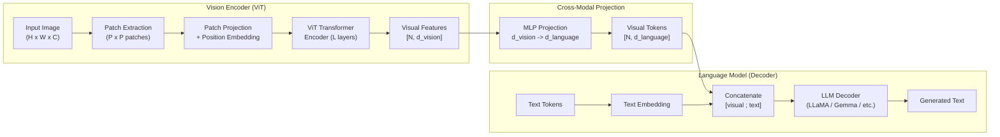

# Multi-Modal Vision-Language Models

**Multi-modal models** extend language models to process both text and images
within a single architecture.  Rather than building entirely new models, the
dominant approach connects a pre-trained **vision encoder** (typically a Vision
Transformer, ViT) to a pre-trained **language model** through a learned
**projection layer**.  This modular design allows each component to be trained
separately and then aligned, reducing the enormous cost of training a
multi-modal system from scratch[^1].

---

## 1. Architecture Overview

!!! info "The Vision-Language Paradigm"

    The modern vision-language model architecture was popularized by LLaVA
    (Liu et al., 2023)[^1] and subsequently adopted by models including
    LLaVA-1.5, Qwen-VL, InternVL, and Gemma's multi-modal variants.  The
    core insight is simple: if images can be represented as sequences of
    embeddings, they can be processed by the same transformer that handles
    text tokens.

The high-level pipeline is:

1. Split the image into fixed-size patches
2. Encode patches with a Vision Transformer to get visual features
3. Project visual features into the language model's embedding space
4. Concatenate visual tokens with text tokens
5. Process the combined sequence with the language model

---

## 2. Key Innovations

### 2.1 Vision Transformer (ViT)

The Vision Transformer (Dosovitskiy et al., 2021)[^2] treats an image as a
sequence of patches, analogous to how a language model treats text as a
sequence of tokens:

!!! definition "Image Patching"

    For an image \( I \in \mathbb{R}^{H \times W \times C} \) and patch size
    \( P \):

    \[
        N_{\text{patches}} = \frac{H}{P} \times \frac{W}{P}
    \]

    Each patch \( p_i \in \mathbb{R}^{P \times P \times C} \) is flattened
    and linearly projected:

    \[
        z_i = \text{flatten}(p_i) \, W_{\text{patch}} + b_{\text{patch}}, \quad
        W_{\text{patch}} \in \mathbb{R}^{P^2 C \times d_v}
    \]

    A learnable `[CLS]` token is prepended and positional embeddings are
    added:

    \[
        Z^{(0)} = [\,z_{\text{cls}} \;;\; z_1 \;;\; z_2 \;;\; \ldots \;;\; z_N\,] + E_{\text{pos}}
    \]

The patch embeddings are then processed by a standard transformer encoder
(bidirectional attention, like BERT).

### 2.2 Cross-Modal Projection

The vision encoder produces features in its own embedding space
(\( d_v \)-dimensional).  The language model operates in a different space
(\( d_l \)-dimensional).  A projection layer bridges the two:

!!! definition "Vision-Language Projection"

    \[
        h_{\text{visual}} = f_{\text{project}}(Z_{\text{vision}})
    \]

    Common projection types:

    | Type | Formula | Parameters |
    |------|---------|-----------|
    | Linear | \( h = ZW + b \) | \( d_v \times d_l \) |
    | MLP (2-layer) | \( h = \text{GELU}(ZW_1 + b_1)W_2 + b_2 \) | \( d_v \times d_h + d_h \times d_l \) |
    | Cross-attention | \( h = \text{CrossAttn}(Q_{\text{lang}}, K_{\text{vis}}, V_{\text{vis}}) \) | Attention params |

    LLaVA uses a simple 2-layer MLP, which was found to be sufficient for
    strong performance[^1].

### 2.3 Sequence Construction

After projection, the visual tokens are treated identically to text tokens:

\[
    \text{input} = [\underbrace{v_1, v_2, \ldots, v_N}_{\text{visual tokens}}, \underbrace{t_1, t_2, \ldots, t_M}_{\text{text tokens}}]
\]

The language model processes this combined sequence autoregressively.  The
visual tokens provide context; the model generates text tokens conditioned on
both the image and the text prompt.

---

## 3. Architecture Diagram



---

## 4. Configuration Parameters

### 4.1 Vision Encoder

| Parameter | CLIP ViT-L/14 | SigLIP-400M |
|-----------|:---:|:---:|
| `image_size` | 336 | 384 |
| `patch_size` | 14 | 14 |
| `n_patches` | 576 | 729 |
| `d_vision` | 1024 | 1152 |
| `n_layers` | 24 | 27 |
| `n_heads` | 16 | 16 |
| `activation` | QuickGELU | GELU |

### 4.2 Multi-Modal Configuration

| Parameter | LLaVA-1.5-7B | LLaVA-1.5-13B | Qwen-VL |
|-----------|:---:|:---:|:---:|
| Vision encoder | CLIP ViT-L/14 | CLIP ViT-L/14 | ViT-bigG |
| Language model | Vicuna-7B | Vicuna-13B | Qwen-7B |
| `d_vision` | 1024 | 1024 | 1664 |
| `d_language` | 4096 | 5120 | 4096 |
| Projection type | 2-layer MLP | 2-layer MLP | Cross-attention |
| `n_visual_tokens` | 576 | 576 | 256 |

---

## 5. Mathematical Formulation

### 5.1 Patch Embedding

For image \( I \in \mathbb{R}^{H \times W \times 3} \) with patch size \( P \):

\[
    p_i \in \mathbb{R}^{P^2 \cdot 3}, \quad i = 1, \ldots, \frac{HW}{P^2}
\]

\[
    z_i = p_i W_E + b_E, \quad W_E \in \mathbb{R}^{3P^2 \times d_v}
\]

### 5.2 Vision Transformer Forward Pass

\[
    Z^{(0)} = [z_{\text{cls}}; z_1; \ldots; z_N] + E_{\text{pos}}
\]

For each layer \( l \):

\[
    Z'^{(l)} = Z^{(l)} + \text{MHA}(\text{LN}(Z^{(l)}))
\]
\[
    Z^{(l+1)} = Z'^{(l)} + \text{FFN}(\text{LN}(Z'^{(l)}))
\]

### 5.3 MLP Projection (LLaVA-style)

\[
    H_{\text{visual}} = \text{GELU}(Z_{\text{vis}} W_1 + b_1) W_2 + b_2
\]

where \( W_1 \in \mathbb{R}^{d_v \times d_h} \),
\( W_2 \in \mathbb{R}^{d_h \times d_l} \), and typically \( d_h = d_l \).

### 5.4 Combined Sequence Processing

\[
    S = [\,H_{\text{visual}} \;;\; E_{\text{text}}(t_1, \ldots, t_M)\,]
\]

\[
    P(t_{M+i} \mid I, t_1, \ldots, t_{M+i-1}) = \text{LM}(S)_{M+i}
\]

The language model attends over both visual and text tokens when generating.

### 5.5 Image Preprocessing

!!! algorithm "Standard Image Preprocessing"

    **Input:** Raw image \( I \)

    **Output:** Normalized tensor \( \hat{I} \in \mathbb{R}^{H' \times W' \times 3} \)

    1. Resize to target resolution (e.g., 336x336) with bicubic interpolation
    2. Convert to float32, scale to \([0, 1]\)
    3. Normalize per channel:
        \( \hat{I}_c = \frac{I_c - \mu_c}{\sigma_c} \)
        with ImageNet statistics: \( \mu = [0.485, 0.456, 0.406] \),
        \( \sigma = [0.229, 0.224, 0.225] \)
    4. Extract \( N = (H'/P)^2 \) non-overlapping patches

---

## 6. Zig Implementation

### 6.1 Configuration Structs

```zig
pub const VisionConfig = struct {
    image_size: u32 = 336,
    patch_size: u32 = 14,
    d_vision: u32 = 1024,
    n_layers: u32 = 24,
    n_heads: u32 = 16,
    d_ff: u32 = 4096,
    norm_eps: f32 = 1e-6,
    activation: ActivationType = .quick_gelu,

    pub fn numPatches(self: VisionConfig) u32 {
        const grid = self.image_size / self.patch_size;
        return grid * grid;
    }
};

pub const ProjectionConfig = struct {
    d_vision: u32,
    d_language: u32,
    d_hidden: ?u32 = null,    // null = use d_language
    projection_type: enum { linear, mlp, cross_attention } = .mlp,
};

pub const MultiModalConfig = struct {
    vision: VisionConfig,
    projection: ProjectionConfig,
    language_model: anytype,     // LLaMA, Gemma, etc.
    max_visual_tokens: u32 = 576,
};
```

### 6.2 Patch Embedding

```zig
pub const PatchEmbedding = struct {
    proj: Linear,             // [patch_size^2 * 3, d_vision]
    cls_token: Tensor(f32),   // [1, d_vision]
    pos_embed: Tensor(f32),   // [1 + n_patches, d_vision]

    pub fn forward(self: *PatchEmbedding, image: Tensor(f32)) !Tensor(f32) {
        const patches = extractPatches(image, self.patch_size);
        var embeddings = try self.proj.forward(patches);

        // Prepend [CLS] token
        var with_cls = try prependToken(self.cls_token, embeddings);

        // Add positional embeddings
        return elementWiseAdd(with_cls, self.pos_embed);
    }
};
```

### 6.3 Vision-Language Projection

```zig
pub const VisionLanguageProjection = struct {
    w1: Linear,     // [d_vision, d_hidden]
    w2: Linear,     // [d_hidden, d_language]

    pub fn forward(self: *VisionLanguageProjection, vis_features: Tensor(f32)) !Tensor(f32) {
        // 2-layer MLP: GELU(x @ W1 + b1) @ W2 + b2
        const hidden = gelu(try self.w1.forward(vis_features));
        return self.w2.forward(hidden);
    }
};
```

### 6.4 Multi-Modal Forward Pass

```zig
pub const MultiModalModel = struct {
    vision_encoder: VisionTransformer,
    projection: VisionLanguageProjection,
    language_model: LLaMAModel,
    config: MultiModalConfig,

    pub fn forward(
        self: *MultiModalModel,
        image: ?Tensor(f32),      // null for text-only
        text_tokens: []const u32,
    ) ![]f32 {
        var combined_embeds: Tensor(f32) = undefined;

        if (image) |img| {
            // 1. Encode image through ViT
            const vis_features = try self.vision_encoder.forward(img);

            // 2. Project to language embedding space
            const vis_tokens = try self.projection.forward(vis_features);

            // 3. Get text embeddings
            const text_embeds = self.language_model.embedding.lookup(text_tokens);

            // 4. Concatenate: [visual_tokens, text_tokens]
            combined_embeds = try concatenate(vis_tokens, text_embeds);
        } else {
            combined_embeds = self.language_model.embedding.lookup(text_tokens);
        }

        // 5. Process through language model decoder
        return self.language_model.forwardEmbeddings(combined_embeds);
    }
};
```

---

## 7. Variants

| Model | Vision Encoder | LLM | Projection | Year |
|-------|---------------|-----|------------|------|
| **LLaVA** | CLIP ViT-L/14 | Vicuna-13B | Linear | 2023[^1] |
| **LLaVA-1.5** | CLIP ViT-L/14 | Vicuna-7B/13B | 2-layer MLP | 2023 |
| **LLaVA-NeXT** | CLIP ViT-L/14 | Various | MLP | 2024 |
| **Qwen-VL** | ViT-bigG | Qwen-7B | Cross-Attention | 2023 |
| **InternVL** | InternViT-6B | InternLM | QLLaMA | 2024 |
| **PaliGemma** | SigLIP | Gemma-2B | Linear | 2024 |
| **Llama 3.2 Vision** | ViT | Llama 3.2 | Cross-Attention | 2024 |

---

## 8. Educational Value

!!! tip "What Multi-Modal Models Teach"

    1. **Modality as token type**: The fundamental insight is that images,
       when patched and projected, are just another type of token.  The
       language model does not know whether a token came from text or an
       image -- it processes the same embedding vectors.  This unification
       demystifies multi-modal AI.

    2. **Vision Transformers**: Understanding ViT requires the same
       transformer knowledge used for text models, applied to a different
       domain.  The patch extraction step makes the connection between
       convolutional receptive fields and attention explicit.

    3. **Cross-modal alignment**: The projection layer is a lesson in
       representation alignment -- mapping two independently learned embedding
       spaces into a shared space where visual and textual concepts can
       interact.  This is a core concept in multi-modal learning.

    4. **Modular architecture design**: The vision encoder, projection, and
       language model are independent components.  Students learn how to
       compose pre-trained modules, a practical skill in modern ML
       engineering.

    5. **Training stages**: Multi-modal models are typically trained in stages
       (freeze vision, train projection; then fine-tune everything).  This
       progressive training strategy teaches efficient use of compute and the
       importance of curriculum design.

---

## 9. References

[^1]: Liu, H. et al. "Visual Instruction Tuning." *NeurIPS*, 2023.
[^2]: Dosovitskiy, A. et al. "An Image is Worth 16x16 Words: Transformers for Image Recognition at Scale." *ICLR*, 2021.
[^3]: Radford, A. et al. "Learning Transferable Visual Models From Natural Language Supervision." *ICML*, 2021.
[^4]: Zhai, X. et al. "Sigmoid Loss for Language Image Pre-Training." *ICCV*, 2023.
