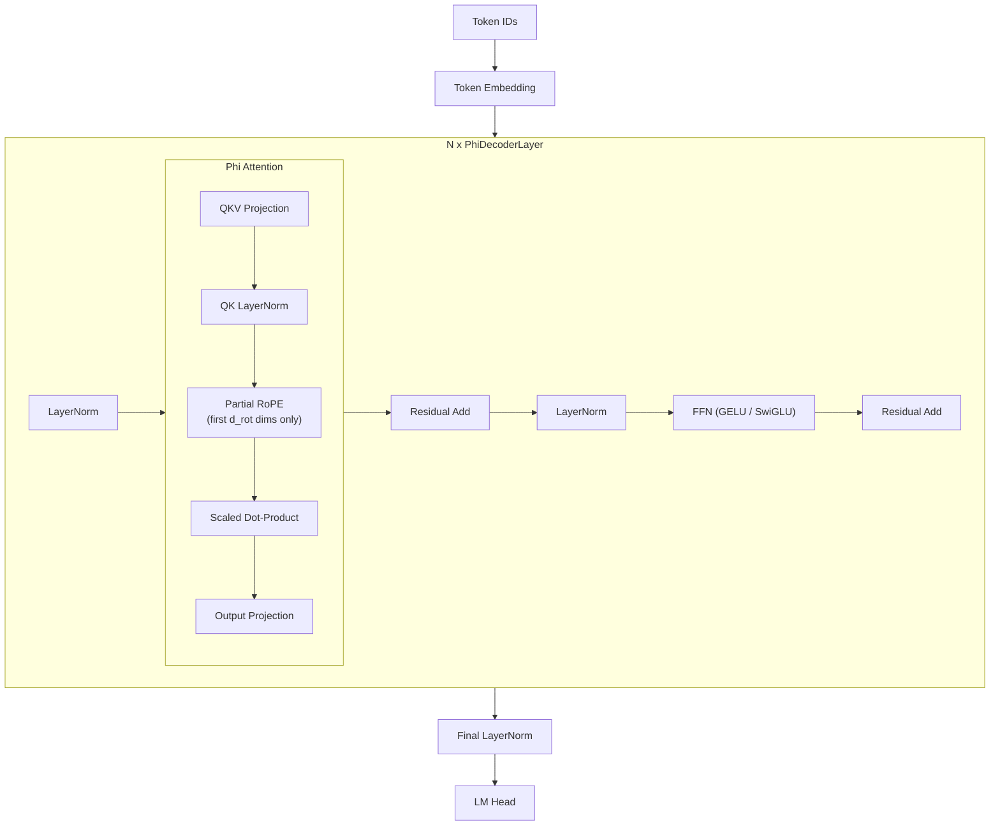

# Phi

The **Phi** family represents Microsoft Research's sustained investigation into
the hypothesis that high-quality training data can compensate for reduced
parameter counts.  Beginning with Phi-1 (2023) and continuing through Phi-3
(2024), each generation demonstrated that small models trained on carefully
curated "textbook-quality" data can match or exceed models several times their
size on standard benchmarks.

---

## 1. Architecture Overview

!!! info "Lineage"

    | Model | Year | Parameters | Key Paper |
    |-------|------|-----------|-----------|
    | Phi-1 | 2023 | 1.3B | Gunasekar et al. 2023[^1] |
    | Phi-2 | 2023 | 2.7B | Microsoft Research Blog |
    | Phi-3 Mini | 2024 | 3.8B | Abdin et al. 2024[^2] |
    | Phi-3 Medium | 2024 | 14B | Abdin et al. 2024[^2] |

Phi-1 targeted code generation exclusively.  Phi-2 broadened to general
language understanding while retaining the "small but capable" philosophy.
Phi-3 introduced long-context variants (up to 128K tokens) and a Mixture of
Experts variant (PhiMoE).

---

## 2. Key Innovations

### 2.1 Partial Rotary Embeddings

Unlike LLaMA, which applies Rotary Position Embeddings (RoPE) to the full
head dimension, Phi applies RoPE to only a fraction of the query and key
dimensions.  The remaining dimensions receive no positional encoding.

!!! definition "Partial RoPE"

    Given head dimension \( d_h \) and a partial ratio \( r \in (0, 1] \),
    define \( d_{\text{rot}} = \lfloor r \cdot d_h \rfloor \).  For a query
    vector \( q \in \mathbb{R}^{d_h} \):

    \[
        q_{\text{out}} = \begin{bmatrix}
            \text{RoPE}(q_{1:d_{\text{rot}}}, \, m) \\
            q_{d_{\text{rot}}+1:d_h}
        \end{bmatrix}
    \]

    where \( m \) is the token position.  The non-rotated dimensions carry
    content-only information, providing the model with a mix of positional and
    purely semantic features.

### 2.2 QK LayerNorm

Phi-2 and later variants apply LayerNorm to the query and key projections
before computing attention scores.  This stabilizes the magnitude of the dot
products, reducing the need for careful learning-rate tuning.

\[
    \hat{Q} = \text{LayerNorm}(XW_Q), \quad \hat{K} = \text{LayerNorm}(XW_K)
\]

### 2.3 Data-Centric Training

The Phi series was among the first to demonstrate that a 1.3B model trained on
"textbook-quality" synthetic data could outperform 10B+ models trained on raw
web crawls.  This is an architectural-agnostic insight but deeply influenced
the model's design constraints.

---

## 3. Architecture Diagram



---

## 4. Configuration Parameters

| Parameter | Phi-1 (1.3B) | Phi-2 (2.7B) | Phi-3 Mini (3.8B) | Phi-3 Medium (14B) |
|-----------|:---:|:---:|:---:|:---:|
| `n_layers` | 24 | 32 | 32 | 40 |
| `d_model` | 2048 | 2560 | 3072 | 5120 |
| `n_heads` | 32 | 32 | 32 | 40 |
| `n_kv_heads` | 32 | 32 | 32 | 40 |
| `d_ff` | 8192 | 10240 | 8192 | 17920 |
| `partial_rotary_factor` | 0.5 | 0.5 | 1.0 | 1.0 |
| `max_seq_len` | 2048 | 2048 | 4096 | 8192 |
| `vocab_size` | 51200 | 51200 | 32064 | 32064 |
| `activation` | GELU | GELU | SwiGLU | SwiGLU |
| `qk_layernorm` | No | Yes | Yes | Yes |

---

## 5. Mathematical Formulation

### 5.1 Partial RoPE Application

For position \( m \) and head dimension index \( i \):

\[
    \theta_i = \frac{1}{10000^{2i/d_{\text{rot}}}}, \quad i = 0, 1, \ldots, \frac{d_{\text{rot}}}{2} - 1
\]

The rotation is applied only to the first \( d_{\text{rot}} \) dimensions of
\( q \) and \( k \), leaving the remaining \( d_h - d_{\text{rot}} \)
dimensions unchanged.

### 5.2 Attention with QK Norm

\[
    \text{Attention}(Q, K, V) = \text{softmax}\!\left(
        \frac{\text{LN}(Q) \cdot \text{LN}(K)^T}{\sqrt{d_h}}
    \right) V
\]

where \(\text{LN}\) denotes LayerNorm applied independently to Q and K.

### 5.3 Feed-Forward (Phi-3 SwiGLU Variant)

\[
    \text{FFN}(x) = (\text{SiLU}(xW_{\text{gate}}) \odot xW_{\text{up}}) W_{\text{down}}
\]

Earlier Phi models use standard GELU activation without gating:

\[
    \text{FFN}(x) = \text{GELU}(xW_1 + b_1)W_2 + b_2
\]

---

## 6. Zig Implementation

### 6.1 PhiConfig

```zig
pub const PhiConfig = struct {
    n_layers: u32,
    d_model: u32,
    n_heads: u32,
    n_kv_heads: u32,
    d_ff: u32,
    vocab_size: u32,
    max_seq_len: u32,
    partial_rotary_factor: f32,     // fraction of head dim to rotate
    qk_layernorm: bool,            // apply LayerNorm to Q and K
    rope_theta: f32 = 10000.0,
    norm_eps: f32 = 1e-5,
    activation: ActivationType = .gelu,

    pub fn headDim(self: PhiConfig) u32 {
        return self.d_model / self.n_heads;
    }

    pub fn rotaryDim(self: PhiConfig) u32 {
        return @intFromFloat(@as(f32, @floatFromInt(self.headDim()))
            * self.partial_rotary_factor);
    }
};
```

### 6.2 Forward Pass Overview

```zig
pub fn forward(self: *PhiModel, tokens: []const u32, pos: u32) ![]f32 {
    var hidden = self.embedding.lookup(tokens);

    for (self.layers) |*layer| {
        const normed = layer.input_norm.forward(hidden);

        // QKV projection
        var q = layer.wq.forward(normed);
        var k = layer.wk.forward(normed);
        const v = layer.wv.forward(normed);

        // Optional QK LayerNorm
        if (self.config.qk_layernorm) {
            q = layer.q_norm.forward(q);
            k = layer.k_norm.forward(k);
        }

        // Partial RoPE -- rotate only first rotary_dim dimensions
        const rot_dim = self.config.rotaryDim();
        applyPartialRoPE(&q, &k, pos, rot_dim);

        const attn_out = layer.attention.forward(q, k, v);
        hidden = residualAdd(hidden, attn_out);

        const ff_normed = layer.post_norm.forward(hidden);
        const ff_out = layer.ffn.forward(ff_normed);
        hidden = residualAdd(hidden, ff_out);
    }

    return self.output_norm.forward(hidden);
}
```

---

## 7. Variants

| Variant | Description |
|---------|-------------|
| **Phi-1** | Code-only, 1.3B, GELU activation, no QK norm |
| **Phi-1.5** | Extended to natural language, same architecture as Phi-1 |
| **Phi-2** | 2.7B, introduced QK LayerNorm, partial RoPE at 0.5 |
| **Phi-3 Mini** | 3.8B, switched to SwiGLU, full RoPE, long context support |
| **Phi-3 Medium** | 14B, larger hidden dims |
| **PhiMoE** | Mixture of Experts variant with sparse activation |

---

## 8. Educational Value

!!! tip "What Phi Teaches"

    1. **Data quality vs. scale**: Phi demonstrated that training data curation
       can be more impactful than parameter count -- a foundational insight for
       understanding model capabilities.

    2. **Partial positional encoding**: The partial RoPE mechanism illustrates
       that not all dimensions need positional information.  Some heads may
       benefit from purely content-based attention.

    3. **QK normalization**: Applying LayerNorm to queries and keys is a simple
       technique that stabilizes attention scores, especially at initialization.
       This is an accessible lesson in training stability.

    4. **Incremental architecture evolution**: Tracing Phi-1 through Phi-3
       shows how a model family evolves -- adding gating (SwiGLU), expanding
       context, and incorporating MoE -- while preserving core design choices.

---

## 9. References

[^1]: Gunasekar, S. et al. "Textbooks Are All You Need." *arXiv:2306.11644*, 2023.
[^2]: Abdin, M. et al. "Phi-3 Technical Report: A Highly Capable Language Model Locally on Your Phone." *arXiv:2404.14219*, 2024.
[^3]: Su, J. et al. "RoFormer: Enhanced Transformer with Rotary Position Embedding." *arXiv:2104.09864*, 2021.
[^4]: Ba, J. L. et al. "Layer Normalization." *arXiv:1607.06450*, 2016.
