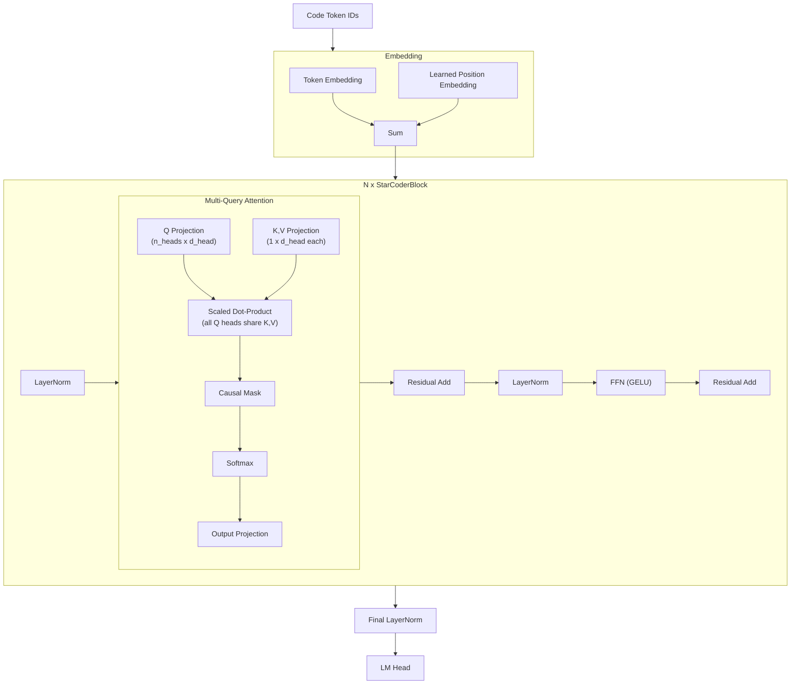

# StarCoder

**StarCoder** is a family of code-generation language models developed by the
BigCode open-science collaboration.  Released in 2023, StarCoder demonstrated
that specialized code models trained on permissively licensed data could match
or exceed proprietary alternatives.  Its architecture introduces two key ideas
relevant to code generation: **Multi-Query Attention** (MQA) for efficient
inference during long code completions, and **Fill-in-the-Middle** (FIM)
training for non-left-to-right code generation[^1].

---

## 1. Architecture Overview

!!! info "The BigCode Project"

    BigCode is an open-science collaboration hosted by Hugging Face, involving
    researchers from over 60 institutions.  StarCoder was trained on The
    Stack v1, a 6.4TB dataset of permissively licensed source code from
    GitHub covering 86 programming languages[^1].

StarCoder is a decoder-only autoregressive transformer optimized for code.
It uses Multi-Query Attention (a single KV head shared across all query
heads), learned absolute position embeddings, and a context length of 8,192
tokens -- sufficient for most single-file code completions.

---

## 2. Key Innovations

### 2.1 Multi-Query Attention (MQA)

MQA, introduced by Shazeer (2019)[^2], uses a single key and value head
shared across all query heads:

!!! definition "Multi-Query Attention"

    \[
        Q = xW_Q \in \mathbb{R}^{s \times n_h \times d_h}
    \]
    \[
        K = xW_K \in \mathbb{R}^{s \times 1 \times d_h}
    \]
    \[
        V = xW_V \in \mathbb{R}^{s \times 1 \times d_h}
    \]

    All query heads share the same K and V:

    \[
        \text{Attn}_i(Q, K, V) = \text{softmax}\!\left(\frac{Q_i K^T}{\sqrt{d_h}}\right) V
    \]

    **Memory savings:** The KV cache stores only 1 set of K/V per layer
    instead of \( n_h \) sets, reducing KV cache memory by a factor of
    \( n_h \).

### 2.2 Fill-in-the-Middle (FIM)

Standard left-to-right training cannot generate code that fills a gap between
existing code.  FIM transforms training examples by splitting them into
prefix, middle, and suffix, then reordering:

!!! algorithm "FIM Training Transformation"

    **Input:** Code sequence \( [t_1, t_2, \ldots, t_n] \)

    1. Choose random split points \( a \) and \( b \) where \( a < b \)
    2. Define:
        - Prefix: \( P = [t_1, \ldots, t_a] \)
        - Middle: \( M = [t_{a+1}, \ldots, t_b] \)
        - Suffix: \( S = [t_{b+1}, \ldots, t_n] \)
    3. Rearrange as: `<fim_prefix> P <fim_suffix> S <fim_middle> M`
    4. Train autoregressively on this reordered sequence

    At inference time, the model can be prompted with prefix and suffix to
    generate the middle portion -- enabling code infilling, not just
    completion.

### 2.3 Code-Specific Tokenizer

StarCoder uses a byte-level BPE tokenizer with special handling for code:

- **Whitespace grouping**: Sequences of spaces are tokenized as single tokens
  (e.g., 4 spaces = one token), critical for indentation-sensitive languages
- **Repository context tokens**: Special tokens encode file paths and
  repository structure
- **FIM special tokens**: `<fim_prefix>`, `<fim_middle>`, `<fim_suffix>`

---

## 3. Architecture Diagram



---

## 4. Configuration Parameters

| Parameter | StarCoder-1B | StarCoder-3B | StarCoder-7B | StarCoder-15B |
|-----------|:---:|:---:|:---:|:---:|
| `n_layers` | 24 | 36 | 42 | 40 |
| `d_model` | 2048 | 2816 | 4096 | 6144 |
| `n_heads` | 16 | 22 | 32 | 48 |
| `n_kv_heads` | 1 | 1 | 1 | 1 |
| `d_ff` | 8192 | 11264 | 16384 | 24576 |
| `vocab_size` | 49152 | 49152 | 49152 | 49152 |
| `max_seq_len` | 8192 | 8192 | 8192 | 8192 |
| `activation` | GELU | GELU | GELU | GELU |
| `norm_type` | LayerNorm | LayerNorm | LayerNorm | LayerNorm |
| `positional_encoding` | Learned | Learned | Learned | Learned |
| `attention_type` | MQA | MQA | MQA | MQA |

---

## 5. Mathematical Formulation

### 5.1 MQA Attention Scores

For query head \( i \) with shared key and value:

\[
    A^{(i)} = \text{softmax}\!\left(\frac{Q^{(i)} K^T}{\sqrt{d_h}} + M_{\text{causal}}\right)
\]

\[
    O^{(i)} = A^{(i)} V
\]

The final output concatenates all heads:

\[
    O = \text{Concat}(O^{(1)}, \ldots, O^{(n_h)}) W_O
\]

### 5.2 KV Cache Memory Comparison

!!! complexity "KV Cache Size: MHA vs. MQA"

    For sequence length \( s \), model dimension \( d \), number of heads
    \( n_h \), head dimension \( d_h \), number of layers \( L \), and
    precision \( p \) bytes:

    | Attention Type | KV Cache Size |
    |---------------|--------------|
    | MHA | \( 2 \cdot L \cdot s \cdot n_h \cdot d_h \cdot p \) |
    | GQA (g groups) | \( 2 \cdot L \cdot s \cdot g \cdot d_h \cdot p \) |
    | MQA | \( 2 \cdot L \cdot s \cdot d_h \cdot p \) |

    For StarCoder-15B with \( n_h = 48 \), MQA uses \( 48\times \) less KV
    cache memory than MHA.

### 5.3 FIM Probability Factorization

Standard autoregressive:

\[
    P(x) = \prod_{i=1}^{n} P(x_i \mid x_{<i})
\]

FIM reorders the factorization:

\[
    P(x) = P(\text{prefix}) \cdot P(\text{suffix} \mid \text{prefix}) \cdot P(\text{middle} \mid \text{prefix}, \text{suffix})
\]

This allows the model to condition on both prefix and suffix when generating
the middle segment.

---

## 6. Zig Implementation

### 6.1 StarCoderConfig

```zig
pub const StarCoderConfig = struct {
    n_layers: u32,
    d_model: u32,
    n_heads: u32,
    n_kv_heads: u32 = 1,        // MQA: always 1
    d_ff: u32,
    vocab_size: u32 = 49152,
    max_seq_len: u32 = 8192,
    norm_eps: f32 = 1e-5,
    activation: ActivationType = .gelu,
    use_bias: bool = true,

    pub fn headDim(self: StarCoderConfig) u32 {
        return self.d_model / self.n_heads;
    }

    /// KV cache is dramatically smaller with MQA
    pub fn kvCacheSize(self: StarCoderConfig, seq_len: u32) u64 {
        // Only 1 KV head per layer
        return 2 * @as(u64, self.n_layers) * seq_len
            * self.headDim() * @sizeOf(f32);
    }
};
```

### 6.2 Multi-Query Attention

```zig
pub const MultiQueryAttention = struct {
    wq: Linear,    // [d_model, n_heads * d_head]
    wk: Linear,    // [d_model, d_head]  -- single head
    wv: Linear,    // [d_model, d_head]  -- single head
    wo: Linear,    // [n_heads * d_head, d_model]
    n_heads: u32,
    d_head: u32,

    pub fn forward(
        self: *MultiQueryAttention,
        x: Tensor(f32),
        pos: u32,
        kv_cache: *KVCache,
    ) !Tensor(f32) {
        // Q: [seq, n_heads * d_head]
        const q = self.wq.forward(x);

        // K, V: [seq, d_head] -- single head, shared by all query heads
        const k = self.wk.forward(x);
        const v = self.wv.forward(x);

        // Update KV cache (only 1 head to cache)
        kv_cache.update(k, v, pos);

        // Each query head attends to the SAME K, V
        var outputs: [MAX_HEADS]Tensor(f32) = undefined;
        for (0..self.n_heads) |h| {
            const q_h = q.headSlice(h, self.d_head);
            const cached_k = kv_cache.keys(pos);
            const cached_v = kv_cache.values(pos);

            const scores = scaledDotProduct(q_h, cached_k, self.d_head);
            applyCausalMask(scores, pos);
            const attn = softmax(scores);
            outputs[h] = matmul(attn, cached_v);
        }

        const concat = try concatenateHeads(outputs[0..self.n_heads]);
        return self.wo.forward(concat);
    }
};
```

### 6.3 FIM Prompt Construction

```zig
pub const FIMFormatter = struct {
    prefix_token: u32,    // <fim_prefix>
    suffix_token: u32,    // <fim_suffix>
    middle_token: u32,    // <fim_middle>

    /// Transform code into FIM format for infilling
    pub fn formatInfill(
        self: FIMFormatter,
        prefix: []const u32,
        suffix: []const u32,
        allocator: Allocator,
    ) ![]u32 {
        var tokens = std.ArrayList(u32).init(allocator);

        try tokens.append(self.prefix_token);
        try tokens.appendSlice(prefix);
        try tokens.append(self.suffix_token);
        try tokens.appendSlice(suffix);
        try tokens.append(self.middle_token);
        // Model generates the middle portion autoregressively

        return tokens.toOwnedSlice();
    }
};
```

---

## 7. Variants

| Model | Year | Parameters | Key Improvements |
|-------|------|-----------|-----------------|
| **StarCoder** | 2023 | 15B | Original, MQA, FIM, trained on The Stack v1 |
| **StarCoderBase** | 2023 | 15B | Without Python fine-tuning |
| **StarCoder2-3B** | 2024 | 3B | Trained on The Stack v2, GQA option |
| **StarCoder2-7B** | 2024 | 7B | Improved data filtering |
| **StarCoder2-15B** | 2024 | 15B | Best code generation quality |

!!! info "StarCoder2 Improvements"

    StarCoder2 (Lozhkov et al., 2024)[^3] trained on The Stack v2 (67.5B
    tokens vs. 35B), used improved data deduplication, and offered GQA
    options alongside MQA.  The architectural changes are minimal --
    primarily data and training improvements.

---

## 8. Educational Value

!!! tip "What StarCoder Teaches"

    1. **Multi-Query Attention**: StarCoder is the clearest practical example
       of MQA.  With a single KV head shared across 48 query heads (in the
       15B variant), students can directly observe the memory savings and
       understand the quality-efficiency trade-off.

    2. **Fill-in-the-Middle**: FIM is a simple but powerful technique that
       challenges the assumption that language models can only generate
       left-to-right.  The reordering trick (prefix-suffix-middle) demonstrates
       how training data formatting can expand model capabilities without
       architecture changes.

    3. **Code-specific design**: StarCoder shows how domain-specific
       requirements (indentation sensitivity, long contexts for full files,
       repository structure) influence tokenizer design and context length
       decisions.

    4. **MQA vs. GQA vs. MHA spectrum**: Comparing StarCoder (MQA, 1 KV
       head) with LLaMA (GQA, 8 KV heads) and GPT-J (MHA, all heads) provides
       a concrete understanding of the full attention efficiency spectrum.

    5. **Data licensing and ethics**: BigCode's commitment to permissive
       licenses only raises important questions about training data
       provenance that are integral to understanding modern LLM development.

---

## 9. References

[^1]: Li, R. et al. "StarCoder: May the Source Be with You!" *arXiv:2305.06161*, 2023.
[^2]: Shazeer, N. "Fast Transformer Decoding: One Write-Head is All You Need." *arXiv:1911.02150*, 2019.
[^3]: Lozhkov, A. et al. "StarCoder 2 and The Stack v2: The Next Generation." *arXiv:2402.19173*, 2024.
[^4]: Bavarian, M. et al. "Efficient Training of Language Models to Fill in the Middle." *arXiv:2207.14255*, 2022.
