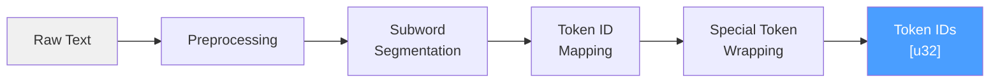
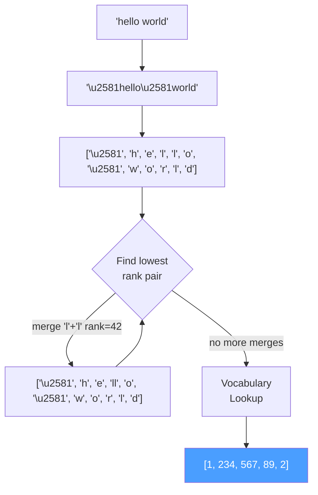

# Tokenization

## Overview

Tokenization is the bridge between human-readable text and the numerical
representations consumed by transformer models. ZigLLM implements a complete
tokenization pipeline in `src/models/tokenizer.zig`, providing both a
simple word-level tokenizer for prototyping and a full BPE (Byte Pair Encoding)
tokenizer compatible with SentencePiece models used by LLaMA and its derivatives.



---

## The Vocabulary

The `Vocabulary` struct manages the bidirectional mapping between text pieces and
integer token IDs.

```zig
pub const Vocabulary = struct {
    allocator: Allocator,
    piece_to_id: HashMap([]const u8, TokenId, ...),  // text -> ID
    id_to_piece: ArrayList(TokenPiece),               // ID -> text + metadata
    vocab_size: usize,
};
```

Each entry in the vocabulary is a `TokenPiece`:

```zig
pub const TokenPiece = struct {
    piece: []const u8,    // The text content (e.g., "hello", "ing", "<s>")
    score: f32,           // SentencePiece score (higher = more preferred)
    id: TokenId,          // Numeric ID
    is_special: bool,     // Whether this is a control token
};
```

### Special Tokens

Special tokens carry structural information rather than linguistic content. They are
always present at fixed positions in the vocabulary.

| Token | ID | Symbol | Purpose |
|:------|:--:|:-------|:--------|
| UNK | 0 | `<unk>` | Unknown / out-of-vocabulary fallback |
| BOS | 1 | `<s>` | Beginning of sequence marker |
| EOS | 2 | `</s>` | End of sequence marker |
| PAD | 3 | `<pad>` | Padding for batch alignment |

```zig
pub const SpecialTokens = struct {
    pub const UNK: TokenId = 0;
    pub const BOS: TokenId = 1;
    pub const EOS: TokenId = 2;
    pub const PAD: TokenId = 3;

    pub fn isSpecial(token_id: TokenId) bool {
        return token_id <= 3;
    }
};
```

!!! info "Role of Special Tokens"
    BOS signals to the model that a new sequence is starting and activates
    the model's initial state distribution. EOS signals completion and is
    used during generation as a stopping criterion. PAD tokens are masked
    in attention so they do not influence computation.

### Vocabulary Initialization

```zig
var vocab = try Vocabulary.init(allocator, 32000); // LLaMA vocab size
// Special tokens are added automatically: <unk>, <s>, </s>, <pad>

// Add regular tokens
try vocab.addToken("hello", -1.0, 4, false);
try vocab.addToken("world", -1.5, 5, false);
```

---

## SimpleTokenizer

The `SimpleTokenizer` provides a word-level tokenizer suitable for testing and
prototyping. It splits text on whitespace and performs exact vocabulary lookups.

### Encoding

```zig
pub fn encode(self: SimpleTokenizer, text: []const u8) ![]TokenId {
    var tokens = ArrayList(TokenId).init(self.allocator);

    // 1. Prepend BOS
    try tokens.append(SpecialTokens.BOS);

    // 2. Split on spaces, look up each word
    var word_iter = std.mem.split(u8, text, " ");
    while (word_iter.next()) |word| {
        if (self.vocabulary.getTokenId(word)) |token_id| {
            try tokens.append(token_id);
        } else {
            try tokens.append(SpecialTokens.UNK);  // Fallback
        }
    }

    // 3. Append EOS
    try tokens.append(SpecialTokens.EOS);

    return try tokens.toOwnedSlice();
}
```

!!! tip "When to Use SimpleTokenizer"
    Use `SimpleTokenizer` for unit tests and educational examples where you want
    deterministic, easily verifiable tokenization. For production inference with
    real model weights, always use `BPETokenizer`.

### Decoding

Decoding reverses the process: look up each token ID, concatenate pieces, and skip
special tokens.

```zig
pub fn decode(self: SimpleTokenizer, token_ids: []const TokenId) ![]u8 {
    var result = ArrayList(u8).init(self.allocator);
    for (token_ids, 0..) |token_id, i| {
        if (token_id == SpecialTokens.BOS or
            token_id == SpecialTokens.EOS or
            token_id == SpecialTokens.PAD) continue;

        if (self.vocabulary.getTokenPiece(token_id)) |piece| {
            if (i > 0 and result.items.len > 0) try result.append(' ');
            try result.appendSlice(piece.piece);
        }
    }
    return try result.toOwnedSlice();
}
```

---

## BPETokenizer

The `BPETokenizer` implements the full Byte Pair Encoding algorithm used by
SentencePiece, which is the standard tokenizer for LLaMA, Mistral, and most
modern decoder-only models.

### Data Structures

```zig
pub const BPETokenizer = struct {
    vocabulary: Vocabulary,
    allocator: Allocator,
    merges: ArrayList(MergePair),         // Ordered merge rules
    merge_ranks: HashMap([]const u8, u32, ...), // "left right" -> rank
};

pub const MergePair = struct {
    left: []const u8,     // Left symbol
    right: []const u8,    // Right symbol
    rank: u32,            // Priority (lower = merged first)
};
```

### BPE Encoding Algorithm

The encoding procedure follows five steps.

!!! algorithm "BPE Encode"
    **Input**: raw text string  
    **Output**: sequence of token IDs

    1. **Prepare text**: prepend the SentencePiece marker `\u{2581}` (Unicode
       LOWER ONE EIGHTH BLOCK) and replace all spaces with `\u{2581}`.
    2. **Initial split**: segment the prepared text into individual UTF-8
       characters as initial symbols.
    3. **Iterative merging**: repeatedly find the adjacent pair with the
       lowest merge rank and concatenate them into a single symbol. Stop when
       no more merges are applicable.
    4. **Vocabulary lookup**: map each final symbol to its token ID. Symbols
       not found in the vocabulary map to `UNK` (ID 0).
    5. **Wrap**: prepend `BOS` (ID 1) and append `EOS` (ID 2).



### Implementation

```zig
pub fn encode(self: *const BPETokenizer, text: []const u8) ![]TokenId {
    var tokens = ArrayList(TokenId).init(self.allocator);
    try tokens.append(SpecialTokens.BOS);

    // Step 1: Prepare text with SentencePiece marker
    var prepared = ArrayList(u8).init(self.allocator);
    try prepared.appendSlice("\xe2\x96\x81"); // U+2581 in UTF-8
    for (text) |c| {
        if (c == ' ') {
            try prepared.appendSlice("\xe2\x96\x81");
        } else {
            try prepared.append(c);
        }
    }

    // Step 2: Split into UTF-8 characters
    var symbols = ArrayList([]const u8).init(self.allocator);
    var pos: usize = 0;
    while (pos < prepared.items.len) {
        const byte = prepared.items[pos];
        const char_len: usize = if (byte < 0x80) 1
            else if (byte < 0xE0) 2
            else if (byte < 0xF0) 3
            else 4;
        const end = @min(pos + char_len, prepared.items.len);
        try symbols.append(try self.allocator.dupe(u8, prepared.items[pos..end]));
        pos = end;
    }

    // Step 3: BPE merge loop
    while (symbols.items.len > 1) {
        var best_rank: u32 = std.math.maxInt(u32);
        var best_idx: ?usize = null;

        for (0..symbols.items.len - 1) |i| {
            const key = try std.fmt.allocPrint(self.allocator,
                "{s} {s}", .{ symbols.items[i], symbols.items[i + 1] });
            defer self.allocator.free(key);

            if (self.merge_ranks.get(key)) |rank| {
                if (rank < best_rank) { best_rank = rank; best_idx = i; }
            }
        }
        if (best_idx == null) break;

        // Merge the pair at best_idx
        const idx = best_idx.?;
        const merged = try std.fmt.allocPrint(self.allocator,
            "{s}{s}", .{ symbols.items[idx], symbols.items[idx + 1] });
        self.allocator.free(symbols.items[idx]);
        self.allocator.free(symbols.items[idx + 1]);
        symbols.items[idx] = merged;
        _ = symbols.orderedRemove(idx + 1);
    }

    // Step 4: Vocabulary lookup
    for (symbols.items) |sym| {
        if (self.vocabulary.getTokenId(sym)) |id| {
            try tokens.append(id);
        } else {
            try tokens.append(SpecialTokens.UNK);
        }
    }

    try tokens.append(SpecialTokens.EOS);
    return try tokens.toOwnedSlice();
}
```

!!! complexity "BPE Complexity"
    The naive BPE merge loop is \( O(n^2 \cdot M) \) where \( n \) is the number
    of symbols and \( M \) is the number of merge rules. Production implementations
    use a priority queue to achieve \( O(n \cdot M \log n) \). ZigLLM's
    implementation uses the simpler approach for clarity.

---

## Batch Encoding and Padding

For batch inference, multiple sequences must be encoded and padded to equal length.

```zig
// Encode a batch of texts
const texts = [_][]const u8{ "hello world", "hi there friend" };
const encoded = try tokenizer.batchEncode(&texts);

// Pad to uniform length
try tokenizer.padSequences(encoded, null);  // null = pad to longest
// Result: all sequences are now the same length, padded with PAD (3)
```

The padding procedure:

1. Find the maximum sequence length in the batch (or use a specified `max_length`).
2. Extend shorter sequences with `PAD` tokens.
3. Truncate longer sequences if `max_length` is specified and shorter than the sequence.

!!! tip "Attention Masking"
    Padded tokens must be masked in attention computation. The attention mask should
    be `0` for real tokens and `-inf` for pad positions. This prevents the model from
    attending to meaningless padding content.

---

## Subword Tokenization Theory

Three major subword algorithms are used in modern LLMs. ZigLLM implements BPE;
the others are documented here for comparison.

### BPE (Byte Pair Encoding)

Used by: LLaMA, Mistral, GPT-2, Falcon

**Training**: Start with character vocabulary. Iteratively count all adjacent
pairs in the training corpus, merge the most frequent pair, and add the merged
symbol to the vocabulary. Repeat until the desired vocabulary size is reached.

**Inference**: Apply learned merge rules in rank order (greedy, left-to-right).

### WordPiece

Used by: BERT, DistilBERT

**Training**: Similar to BPE but selects merges by maximizing the likelihood of
the training data, not raw frequency. The merge score is:

\[
\text{score}(a, b) = \frac{\text{freq}(ab)}{\text{freq}(a) \cdot \text{freq}(b)}
\]

**Inference**: Greedy longest-match-first from left to right. Unknown subwords
are prefixed with `##`.

### Unigram

Used by: SentencePiece (T5, mBART)

**Training**: Start with a large vocabulary and iteratively remove tokens that
least reduce the corpus likelihood. Uses the EM algorithm.

**Inference**: Find the segmentation that maximizes the product of unigram
probabilities using the Viterbi algorithm.

### Comparison

| Property | BPE | WordPiece | Unigram |
|:---------|:----|:----------|:--------|
| Merge criterion | Frequency | Likelihood ratio | Marginal likelihood |
| Inference | Greedy merge | Greedy longest-match | Viterbi (optimal) |
| Deterministic | Yes | Yes | Can produce multiple segmentations |
| OOV handling | Falls back to bytes | `##` prefix | Log-probability fallback |
| Typical vocab size | 32K--64K | 30K | 32K |

---

## API Summary

| Type | Method | Description |
|:-----|:-------|:------------|
| `Vocabulary` | `init(allocator, vocab_size)` | Create empty vocabulary with special tokens |
| `Vocabulary` | `addToken(piece, score, id, is_special)` | Register a token |
| `Vocabulary` | `getTokenId(piece)` | Look up ID by text |
| `Vocabulary` | `getTokenPiece(id)` | Look up text by ID |
| `SimpleTokenizer` | `encode(text)` | Word-level tokenization |
| `SimpleTokenizer` | `decode(token_ids)` | Reconstruct text from IDs |
| `SimpleTokenizer` | `batchEncode(texts)` | Encode multiple texts |
| `SimpleTokenizer` | `padSequences(seqs, max_len)` | Pad batch to uniform length |
| `BPETokenizer` | `addMerge(left, right, rank)` | Register a BPE merge rule |
| `BPETokenizer` | `encode(text)` | Full BPE tokenization |
| `BPETokenizer` | `decode(token_ids)` | Reconstruct text from IDs |

---

## References

[^1]: Sennrich, R., Haddow, B., and Birch, A. "Neural Machine Translation of Rare Words with Subword Units." ACL, 2016.
[^2]: Kudo, T. and Richardson, J. "SentencePiece: A simple and language independent subword tokenizer and detokenizer for Neural Text Processing." EMNLP, 2018.
[^3]: Kudo, T. "Subword Regularization: Improving Neural Network Translation Models with Multiple Subword Candidates." ACL, 2018.
