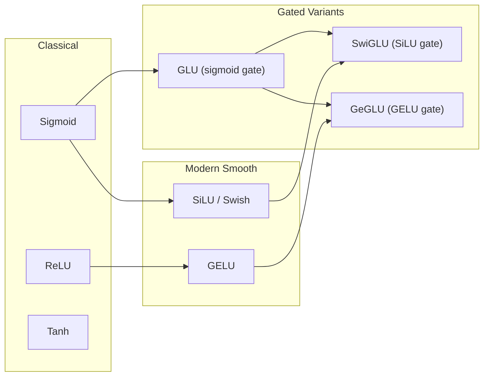

# Activation Functions

Activation functions are the non-linear transformations applied element-wise
(or gate-wise) inside neural networks.  Without them, any composition of linear
layers collapses to a single linear map, and the network can represent only
affine functions.  This page provides a rigorous treatment of the activations
used in modern transformer models, together with their ZigLlama
implementations.

---

## 1. Why Non-Linearity?

### 1.1 The Linear Collapse Problem

!!! theorem "Linear Collapse"

    Let \( f_i(x) = W_i x + b_i \) for \( i = 1, \dots, L \).  The composition
    \( f_L \circ \cdots \circ f_1 \) is itself an affine map:

    \[
        f_L(\cdots f_1(x)) = W' x + b'
    \]

    where \( W' = W_L W_{L-1} \cdots W_1 \) and \( b' \) is a corresponding
    accumulated bias.

    **Proof sketch.**  Induction on \( L \).  Base case (\(L=1\)) is trivial.
    If \( g = f_{L-1} \circ \cdots \circ f_1 = W''x + b'' \), then
    \( f_L(g(x)) = W_L(W''x + b'') + b_L = (W_L W'')x + (W_L b'' + b_L) \),
    which is affine.  \(\square\)

This means a 100-layer "deep" network of purely linear transformations has
exactly the same representational capacity as a single matrix multiply.
Stacking layers buys us nothing without non-linearity.

### 1.2 Universal Approximation

!!! theorem "Universal Approximation Theorem (Cybenko 1989, Hornik 1991)"

    A feed-forward network with a single hidden layer and a non-polynomial
    activation function can approximate any continuous function on a compact
    subset of \(\mathbb{R}^n\) to arbitrary precision, given sufficiently many
    hidden units.[^1]

The theorem guarantees *existence* of a good approximation but says nothing
about how efficiently the network can be trained.  In practice, deeper networks
with well-chosen activations learn more efficiently than wide shallow ones.

---

## 2. Classical Activations

### 2.1 Rectified Linear Unit (ReLU)

!!! definition "ReLU"

    \[
        \operatorname{ReLU}(x) = \max(0,\, x)
    \]

**Derivative:**

\[
    \operatorname{ReLU}'(x) =
    \begin{cases}
        1 & x > 0 \\
        0 & x \leq 0
    \end{cases}
\]

The derivative is the Heaviside step function (undefined at exactly zero, where
a sub-gradient of 0 is conventionally used).

**Properties:**

| Property | Value |
|---|---|
| Range | \([0, +\infty)\) |
| Smoothness | Piecewise linear, not differentiable at 0 |
| Gradient | Constant 1 for \(x>0\); exactly 0 for \(x<0\) |
| Computational cost | One comparison |

!!! warning "Dying ReLU Problem"

    If a neuron's pre-activation is always negative (e.g., due to a large
    negative bias learned during training), its gradient is permanently zero and
    the neuron can never recover.  In wide networks, a significant fraction of
    neurons can "die" this way, wasting capacity.  Leaky ReLU and modern smooth
    activations were designed partly to address this.

### 2.2 Sigmoid

!!! definition "Sigmoid (Logistic)"

    \[
        \sigma(x) = \frac{1}{1 + e^{-x}}
    \]

**Derivative:** \(\sigma'(x) = \sigma(x)(1 - \sigma(x))\).

| Property | Value |
|---|---|
| Range | \((0, 1)\) |
| Smoothness | Infinitely differentiable |
| Gradient at saturation | Approaches 0 for \(\lvert x \rvert \gg 0\) |

!!! warning "Vanishing Gradient"

    For inputs with large magnitude, the sigmoid saturates and its derivative
    is near zero.  In deep networks, this causes gradients to shrink
    exponentially through layers -- the *vanishing gradient problem* -- making
    early layers nearly impossible to train.

### 2.3 Hyperbolic Tangent

!!! definition "Tanh"

    \[
        \tanh(x) = \frac{e^x - e^{-x}}{e^x + e^{-x}}
    \]

Equivalently, \(\tanh(x) = 2\sigma(2x) - 1\).

| Property | Value |
|---|---|
| Range | \((-1, 1)\) |
| Smoothness | Infinitely differentiable |
| Zero-centered | Yes (unlike sigmoid) |
| Gradient at saturation | Approaches 0 |

Tanh was the default activation in early neural networks.  Its zero-centered
output is advantageous for gradient dynamics, but it still suffers from
vanishing gradients in the saturated regime.

---

## 3. Modern Activations

### 3.1 GELU -- Gaussian Error Linear Unit

!!! definition "GELU (Hendrycks & Gimpel 2016)"

    \[
        \operatorname{GELU}(x) = x \cdot \Phi(x)
    \]

    where \(\Phi(x) = \frac{1}{2}\bigl[1 + \operatorname{erf}(x/\sqrt{2})\bigr]\)
    is the CDF of the standard normal distribution.[^2]

**Intuition.**  GELU weights the input \(x\) by the probability that a
standard Gaussian random variable is less than \(x\).  Large positive inputs
pass through nearly unchanged (\(\Phi(x) \approx 1\)); large negative inputs
are suppressed (\(\Phi(x) \approx 0\)); and intermediate values are smoothly
interpolated.

**Fast approximation (tanh-based):**

\[
    \operatorname{GELU}(x) \approx 0.5\, x \left(1 + \tanh\!\left[\sqrt{\frac{2}{\pi}}\left(x + 0.044715\, x^3\right)\right]\right)
\]

This approximation avoids computing the error function and is used in most
production implementations, including ZigLlama.

| Property | Value |
|---|---|
| Range | \(\approx (-0.17, +\infty)\) |
| Smoothness | Infinitely differentiable |
| Dead neurons | None (gradient never exactly zero) |
| Used in | BERT, GPT-2, GPT-3, T5 |

### 3.2 SiLU / Swish

!!! definition "SiLU (Ramachandran et al. 2017)"

    \[
        \operatorname{SiLU}(x) = x \cdot \sigma(x) = \frac{x}{1 + e^{-x}}
    \]

    Also known as **Swish** with a fixed \(\beta = 1\).[^3]

SiLU is self-gated: the input acts as both the signal and the gate.  It shares
many properties with GELU -- smooth, non-monotonic near zero, and asymptotically
linear for large positive inputs -- but uses the simpler sigmoid rather than the
Gaussian CDF.

| Property | Value |
|---|---|
| Range | \(\approx (-0.28, +\infty)\) |
| Smoothness | Infinitely differentiable |
| Dead neurons | None |
| Used in | LLaMA, PaLM, Switch Transformer |

### 3.3 SwiGLU -- SiLU-Gated Linear Unit

!!! definition "SwiGLU (Shazeer 2020)"

    \[
        \operatorname{SwiGLU}(x,\, W_1,\, W_2) = \bigl(\operatorname{SiLU}(x W_1)\bigr) \odot (x W_2)
    \]

    where \(\odot\) is element-wise multiplication and \(W_1, W_2 \in \mathbb{R}^{d \times d_{ff}}\).[^4]

SwiGLU is a *gated linear unit* variant that uses SiLU as its gating activation.
The key idea is to split the computation into two parallel streams -- one
processed through SiLU (the gate), the other left linear (the content) -- and
then combine them via element-wise multiplication.

This architecture requires **three** weight matrices per feed-forward layer
(gate, up, down) rather than two, but empirically yields better model quality
at the same compute budget.

| Property | Value |
|---|---|
| Parameters | \(3 \cdot d_{\text{model}} \cdot d_{ff}\) |
| Gating | Learned, via SiLU |
| Used in | LLaMA, LLaMA 2, PaLM |

### 3.4 GeGLU -- GELU-Gated Linear Unit

!!! definition "GeGLU (Shazeer 2020)"

    \[
        \operatorname{GeGLU}(x,\, W_1,\, W_2) = \bigl(\operatorname{GELU}(x W_1)\bigr) \odot (x W_2)
    \]

GeGLU replaces the SiLU gate in SwiGLU with GELU.  The two variants perform
comparably in practice; the choice often follows from consistency with the rest
of the architecture (e.g., if the model already uses GELU elsewhere).

---

## 4. Comparison Table

| Activation | Range | Smooth | Dead Neurons | FLOPs/elem | Notable Models |
|---|---|---|---|---|---|
| ReLU | \([0, \infty)\) | No | Yes | 1 | Early CNNs, some MLPs |
| Sigmoid | \((0, 1)\) | Yes | No (but vanishing grad) | ~10 | Gates in LSTMs, GLU |
| Tanh | \((-1, 1)\) | Yes | No (but vanishing grad) | ~10 | LSTMs, early RNNs |
| GELU | \(\approx(-0.17, \infty)\) | Yes | No | ~15 | BERT, GPT-2/3, T5 |
| SiLU | \(\approx(-0.28, \infty)\) | Yes | No | ~10 | LLaMA, PaLM |
| SwiGLU | \(\mathbb{R}\) | Yes | No | ~20 (+ extra matmul) | LLaMA, LLaMA 2 |
| GeGLU | \(\mathbb{R}\) | Yes | No | ~25 (+ extra matmul) | Some T5 variants |

!!! tip "Choosing an Activation"

    For modern decoder-only LLMs, **SwiGLU** is the dominant choice (LLaMA,
    Mistral, PaLM).  For encoder models and older architectures, **GELU**
    remains standard (BERT, GPT-2).  **ReLU** is rarely used in transformers
    today but remains pedagogically important.

---

## 5. Activation Function Landscape



---

## 6. Implementation in ZigLlama

### 6.1 Type Enum and Dispatcher

ZigLlama defines all supported activations in a single enum and provides a
compile-time dispatcher:

```zig
/// Activation function types supported in transformers
pub const ActivationType = enum {
    ReLU,
    GELU,
    SiLU,    // Also known as Swish
    GLU,     // Gated Linear Unit
    GeGLU,   // GELU-based Gated Linear Unit
    SwiGLU,  // SiLU-based Gated Linear Unit
    Tanh,
    Sigmoid,
};

/// Generic activation function dispatcher
pub fn applyActivation(
    comptime T: type,
    activation_type: ActivationType,
    input: Tensor(T),
    allocator: Allocator,
) TensorError!Tensor(T) {
    return switch (activation_type) {
        .ReLU   => relu(T, input),
        .GELU   => gelu(T, input, allocator),
        .SiLU   => silu(T, input, allocator),
        .GLU    => glu(T, input, allocator),
        .GeGLU  => geglu(T, input, allocator),
        .SwiGLU => swiglu(T, input, allocator),
        .Tanh   => tanh_activation(T, input, allocator),
        .Sigmoid => sigmoid(T, input, allocator),
    };
}
```

### 6.2 Scalar Activation Functions

Each scalar activation operates element-wise over a `Tensor(T)`.

```zig
/// ReLU: max(0, x)
pub fn relu(comptime T: type, input: Tensor(T)) TensorError!Tensor(T) {
    var result = try Tensor(T).init(input.allocator, input.shape);
    for (0..input.size) |i| {
        result.data[i] = @max(0.0, input.data[i]);
    }
    return result;
}

/// GELU: tanh-based approximation
pub fn gelu(comptime T: type, input: Tensor(T), allocator: Allocator) TensorError!Tensor(T) {
    var result = try Tensor(T).init(allocator, input.shape);
    for (0..input.size) |i| {
        const x = input.data[i];
        const inner = 0.7978845608 * (x + 0.044715 * x * x * x);
        result.data[i] = 0.5 * x * (1.0 + std.math.tanh(inner));
    }
    return result;
}

/// SiLU / Swish: x * sigmoid(x)
pub fn silu(comptime T: type, input: Tensor(T), allocator: Allocator) TensorError!Tensor(T) {
    var result = try Tensor(T).init(allocator, input.shape);
    for (0..input.size) |i| {
        const x = input.data[i];
        result.data[i] = x * (1.0 / (1.0 + @exp(-x)));
    }
    return result;
}
```

### 6.3 Gated Activations

Gated variants split the input tensor along the last dimension.  The first
half is the *content* stream; the second half passes through the gating
activation.

```zig
/// SwiGLU: content * SiLU(gate)
pub fn swiglu(comptime T: type, input: Tensor(T), allocator: Allocator) TensorError!Tensor(T) {
    const last_dim = input.shape[input.shape.len - 1];
    const half_size = input.size / 2;
    // ... shape validation omitted for brevity ...
    var result = try Tensor(T).init(allocator, output_shape);
    for (0..half_size) |i| {
        const a = input.data[i];                          // content
        const b = input.data[i + half_size];              // gate
        const sigmoid_b = 1.0 / (1.0 + @exp(-b));
        result.data[i] = a * (b * sigmoid_b);             // a * SiLU(b)
    }
    return result;
}
```

!!! info "Source File"

    Full implementation: `src/neural_primitives/activations.zig`
    (approximately 380 lines including tests).

---

## 7. Numerical Considerations

### 7.1 GELU Approximation Accuracy

The tanh-based GELU approximation has a maximum absolute error of
approximately \(4 \times 10^{-4}\) relative to the exact \(x\Phi(x)\) form.
For inference in `f32`, this is well within acceptable precision.

### 7.2 Sigmoid Overflow

For very large negative inputs, \(e^{-x}\) overflows `f32`.  ZigLlama relies
on IEEE 754 semantics: \(\exp(-x) = +\infty\) yields \(1/(1+\infty) = 0\),
which is the correct saturated value.  No explicit clamping is required.

### 7.3 SiLU Near Zero

\(\operatorname{SiLU}(0) = 0\) exactly, and the derivative at zero is 0.5.
Unlike ReLU, the gradient is non-zero at the origin, so neurons do not die.

---

## 8. Exercises

1. **Prove** that \(\operatorname{SiLU}'(x) = \sigma(x)(1 + x(1 - \sigma(x)))\).
2. **Implement** a "leaky" GELU variant where negative outputs are scaled by
   a small constant \(\alpha\) instead of suppressed.
3. **Benchmark** the per-element cost of GELU vs. SiLU on a 4096-element
   tensor using `std.time.Timer`.  Which is faster and why?
4. **Explain** why SwiGLU requires three weight matrices while standard FFN
   requires only two, and show that the parameter counts match when
   \(d_{ff}^{\text{SwiGLU}} = \frac{2}{3} d_{ff}^{\text{standard}}\).

---

## References

[^1]: Cybenko, G. "Approximation by Superpositions of a Sigmoidal Function." *Mathematics of Control, Signals, and Systems*, 2(4):303--314, 1989.
[^2]: Hendrycks, D. & Gimpel, K. "Gaussian Error Linear Units (GELUs)." *arXiv:1606.08415*, 2016.
[^3]: Ramachandran, P., Zoph, B. & Le, Q. V. "Searching for Activation Functions." *arXiv:1710.05941*, 2017.
[^4]: Shazeer, N. "GLU Variants Improve Transformer." *arXiv:2002.05202*, 2020.
[^5]: Nair, V. & Hinton, G. E. "Rectified Linear Units Improve Restricted Boltzmann Machines." *ICML*, 2010.
