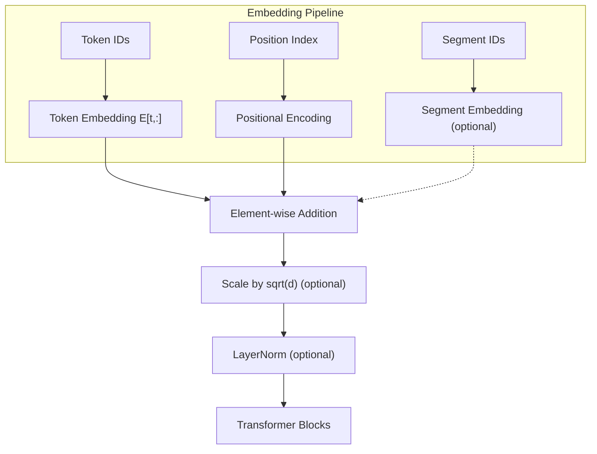

# Embedding Systems

Transformer models operate on continuous vectors, yet their inputs are
*discrete* tokens drawn from a finite vocabulary.  Embedding systems bridge
this gap: they map each token to a dense vector and inject positional
information so the model can reason about sequence order.  This page covers
every embedding technique used in production LLMs, from the classical
sinusoidal scheme of the original Transformer to the Rotary Position Embeddings
(RoPE) that power LLaMA, Mistral, and most modern decoder models.

---

## 1. Token Embeddings

### 1.1 Definition

!!! definition "Token Embedding"

    A token embedding is a learnable lookup table \( E \in \mathbb{R}^{V \times d} \),
    where \( V \) is the vocabulary size and \( d \) is the embedding dimension.
    For a token with integer ID \( t \):

    \[
        \operatorname{Embed}(t) = E[t, :] \in \mathbb{R}^d
    \]

### 1.2 Why Learned Embeddings Instead of One-Hot?

A one-hot encoding represents token \(t\) as a vector
\(\mathbf{e}_t \in \{0,1\}^V\) with a single 1 at position \(t\).
Multiplying by the embedding matrix gives
\(\mathbf{e}_t^\top E = E[t, :]\), which is exactly the lookup operation.
The learned embedding is therefore equivalent to a one-hot input followed by a
linear layer -- but implemented as a direct index operation, which is
\(O(d)\) rather than \(O(Vd)\).

### 1.3 Scaling

Some architectures (the original Transformer, T5) scale the embedding output
by \(\sqrt{d}\) to match the magnitude of positional encodings:

\[
    x_t = \sqrt{d}\; E[t, :]
\]

LLaMA and GPT-2 omit this scaling factor.

### 1.4 Memory Footprint

For LLaMA-7B with \(V = 32{,}000\) and \(d = 4{,}096\):

\[
    |E| = V \times d = 32{,}000 \times 4{,}096 = 131{,}072{,}000 \approx 131\text{M parameters}
\]

At `f16`, this is approximately 250 MB -- a non-trivial fraction of the total
model size.

---

## 2. Sinusoidal Positional Encoding

### 2.1 Definition

!!! definition "Sinusoidal Positional Encoding (Vaswani et al. 2017)"

    For position \(\text{pos}\) and dimension index \(i\):

    \[
        \text{PE}(\text{pos},\, 2i) = \sin\!\left(\frac{\text{pos}}{10000^{\,2i/d}}\right)
    \]

    \[
        \text{PE}(\text{pos},\, 2i{+}1) = \cos\!\left(\frac{\text{pos}}{10000^{\,2i/d}}\right)
    \][^1]

### 2.2 Properties

**Unique encoding.** Each position has a distinct encoding vector because the
frequencies \(1/10000^{2i/d}\) form a geometric progression, creating a unique
"fingerprint" for each position.

**Relative position as linear transformation.** For any fixed offset \(k\),
there exists a linear matrix \(M_k\) such that:

\[
    \text{PE}(\text{pos}+k) = M_k \cdot \text{PE}(\text{pos})
\]

This follows from the trigonometric addition formulas.  The model can therefore
learn to attend to relative positions by learning linear functions of the
positional encodings.

**Frequency spectrum.**  Low dimension indices correspond to high frequencies
(fast oscillation with position); high dimension indices correspond to low
frequencies (slow oscillation).  This multi-scale representation helps the
model capture both local and long-range positional patterns.

!!! info "Fixed vs. Learned"

    Sinusoidal encodings are **not learnable** -- they are computed
    deterministically.  This means the model can generalize to sequence lengths
    not seen during training.  However, many models (GPT-2, BERT) opt for
    learned positional embeddings instead, trading generalization for
    expressivity.

---

## 3. Rotary Position Embeddings (RoPE)

### 3.1 Core Idea

!!! definition "RoPE (Su et al. 2021)"

    Rather than *adding* a positional vector, RoPE encodes position by
    *rotating* the query and key vectors in 2D subspaces.  For a pair of
    dimensions \((2i, 2i{+}1)\) at position \(m\):[^2]

    \[
        R_{\theta_i,m} =
        \begin{pmatrix}
            \cos(m\theta_i) & -\sin(m\theta_i) \\
            \sin(m\theta_i) & \phantom{-}\cos(m\theta_i)
        \end{pmatrix}
    \]

    where \(\theta_i = 10000^{-2i/d}\).

The full rotation is applied to \(d/2\) independent 2D subspaces:

\[
    \operatorname{RoPE}(x, m) =
    \begin{pmatrix}
        R_{\theta_0,m} & & \\
        & \ddots & \\
        & & R_{\theta_{d/2-1},m}
    \end{pmatrix}
    x
\]

### 3.2 The Key Property: Relative Position in Dot Products

!!! theorem "RoPE Relative Position Property"

    For query \(q\) at position \(m\) and key \(k\) at position \(n\):

    \[
        (R_m\, q)^\top (R_n\, k) = q^\top R_m^\top R_n\, k = q^\top R_{n-m}\, k
    \]

    The dot product depends only on the *relative* position \(n - m\), not on
    the absolute positions.

**Why this matters.**  The attention score between positions \(m\) and \(n\)
naturally encodes their distance \(|m-n|\) without the model needing to learn
this relationship from scratch.  This is a strict improvement over additive
positional encodings, where relative position must be inferred implicitly.

### 3.3 Efficient Implementation

RoPE can be implemented without constructing explicit rotation matrices.  For
each pair \((x_{2i}, x_{2i+1})\):

\[
\begin{aligned}
    x'_{2i}   &= x_{2i}\cos(m\theta_i) - x_{2i+1}\sin(m\theta_i) \\
    x'_{2i+1} &= x_{2i}\sin(m\theta_i) + x_{2i+1}\cos(m\theta_i)
\end{aligned}
\]

This requires only \(2d\) multiplications and \(d\) additions per position --
negligible compared to the attention matrix multiply.

### 3.4 Context Length Extension

RoPE's frequency-based design enables several context-length extension
techniques:

**NTK-Aware Scaling.** Modify the base frequency to scale the effective
context window:

\[
    \theta_i' = \left(\alpha \cdot 10000\right)^{-2i/d}
\]

where \(\alpha > 1\) compresses the frequency spectrum, allowing the model to
handle longer sequences with minimal quality loss.

**YaRN (Yet another RoPE extensioN).** Combines NTK-aware scaling with an
attention temperature correction factor and a partitioned frequency strategy
that preserves high-frequency components while extending low-frequency ones.[^3]

---

## 4. ALiBi -- Attention with Linear Biases

!!! definition "ALiBi (Press et al. 2021)"

    Instead of modifying embeddings, ALiBi adds a **position-dependent bias**
    directly to the attention scores:[^4]

    \[
        \text{Attention}(Q, K, V) = \text{softmax}\!\left(\frac{QK^\top}{\sqrt{d_k}} - \lambda \cdot |i - j|\right) V
    \]

    where \(\lambda\) is a head-specific slope (not learned; set by a geometric
    sequence) and \(|i-j|\) is the absolute distance between positions.

**Advantages:**

- No positional embeddings to store or compute.
- Naturally handles extrapolation to longer sequences.
- Simple implementation: just add a pre-computed bias matrix to attention logits.

**Disadvantage:** The linear decay may not capture complex positional patterns
as expressively as RoPE.

| Model | Positional Encoding |
|---|---|
| BLOOM | ALiBi |
| MPT | ALiBi |

---

## 5. Segment Embeddings

!!! definition "Segment Embeddings"

    A small learnable lookup table \( S \in \mathbb{R}^{N_s \times d} \) that
    maps a segment ID to a vector, where \(N_s\) is the number of segment types
    (typically 2 for BERT).

Segment embeddings allow the model to distinguish between different input
parts.  The canonical use case is BERT's next-sentence prediction:

```
[CLS] Sentence A tokens [SEP] Sentence B tokens [SEP]
  0       0        0       0       1        1       1   <-- segment IDs
```

Each token receives a segment embedding corresponding to its segment ID,
which is added to the token and positional embeddings:

\[
    x_t = E_{\text{token}}[t] + E_{\text{pos}}[\text{pos}] + E_{\text{seg}}[\text{seg}]
\]

Segment embeddings are **not used** in decoder-only models (GPT, LLaMA) since
those models process a single contiguous sequence.

---

## 6. Comparison of Positional Encoding Methods

| Method | Type | Learnable | Relative Position | Length Extrapolation | Models |
|---|---|---|---|---|---|
| Sinusoidal | Additive | No | Implicit (linear transform) | Good | Original Transformer |
| Learned Absolute | Additive | Yes | No | Poor | GPT-2, BERT |
| RoPE | Multiplicative (rotation) | No | **Explicit** (in dot product) | Moderate (extensible) | LLaMA, Mistral, Qwen, Phi |
| ALiBi | Attention bias | No (fixed slopes) | **Explicit** (linear penalty) | Good | BLOOM, MPT |
| Relative Bias (T5) | Attention bias | Yes (learned) | **Explicit** | Moderate | T5 |



---

## 7. Implementation in ZigLlama

### 7.1 Token Embedding Struct

```zig
pub const TokenEmbedding = struct {
    weights: Tensor(f32),     // [vocab_size x embedding_dim]
    vocab_size: usize,
    embedding_dim: usize,
    allocator: Allocator,

    pub fn init(allocator: Allocator, vocab_size: usize, embedding_dim: usize) !TokenEmbedding {
        var weights = try Tensor(f32).init(allocator, &[_]usize{ vocab_size, embedding_dim });
        // Xavier initialization ...
        return TokenEmbedding{ .weights = weights, ... };
    }

    /// Lookup: token_ids -> [batch_size, embedding_dim]
    pub fn forward(self: *const TokenEmbedding, token_ids: []const u32) !Tensor(f32) {
        var output = try Tensor(f32).init(self.allocator, &[_]usize{ token_ids.len, self.embedding_dim });
        for (token_ids, 0..) |tid, idx| {
            // Copy row tid from weights into output row idx
            for (0..self.embedding_dim) |d| {
                const val = try self.weights.get(&[_]usize{ tid, d });
                try output.set(&[_]usize{ idx, d }, val);
            }
        }
        return output;
    }
};
```

### 7.2 Sinusoidal Positional Encoding

```zig
pub fn sinusoidalPositionalEncoding(
    allocator: Allocator,
    max_seq_len: usize,
    d_model: usize,
) !Tensor(f32) {
    var pe = try Tensor(f32).init(allocator, &[_]usize{ max_seq_len, d_model });
    for (0..max_seq_len) |pos| {
        for (0..d_model / 2) |i| {
            const freq = @as(f32, @floatFromInt(pos)) /
                math.pow(f32, 10000.0, 2.0 * @as(f32, @floatFromInt(i)) / @as(f32, @floatFromInt(d_model)));
            try pe.set(&[_]usize{ pos, 2 * i }, @sin(freq));
            if (2 * i + 1 < d_model) {
                try pe.set(&[_]usize{ pos, 2 * i + 1 }, @cos(freq));
            }
        }
    }
    return pe;
}
```

### 7.3 Rotary Position Embeddings

```zig
pub fn rotaryPositionalEmbedding(
    allocator: Allocator,
    seq_len: usize,
    d_model: usize,
    embeddings: Tensor(f32),
) !Tensor(f32) {
    var result = try Tensor(f32).init(allocator, embeddings.shape);
    for (0..seq_len) |pos| {
        for (0..d_model / 2) |i| {
            const theta = @as(f32, @floatFromInt(pos)) /
                math.pow(f32, 10000.0, 2.0 * @as(f32, @floatFromInt(i)) / @as(f32, @floatFromInt(d_model)));
            const x = try embeddings.get(&[_]usize{ pos, 2 * i });
            const y = if (2 * i + 1 < d_model)
                try embeddings.get(&[_]usize{ pos, 2 * i + 1 })
            else
                0.0;
            // 2D rotation
            try result.set(&[_]usize{ pos, 2 * i }, x * @cos(theta) - y * @sin(theta));
            if (2 * i + 1 < d_model) {
                try result.set(&[_]usize{ pos, 2 * i + 1 }, x * @sin(theta) + y * @cos(theta));
            }
        }
    }
    return result;
}
```

### 7.4 Segment Embedding Struct

```zig
pub const SegmentEmbedding = struct {
    weights: Tensor(f32),     // [num_segments x embedding_dim]
    num_segments: usize,
    embedding_dim: usize,
    allocator: Allocator,

    pub fn forward(self: *const SegmentEmbedding, segment_ids: []const u32) !Tensor(f32) {
        // Identical lookup logic to TokenEmbedding
    }
};
```

### 7.5 Complete Embedding Combination

```zig
pub fn completeEmbedding(
    token_emb: Tensor(f32),
    pos_emb: Tensor(f32),
    seg_emb: ?Tensor(f32),
    allocator: Allocator,
) !Tensor(f32) {
    var result = try token_emb.add(pos_emb, allocator);
    if (seg_emb) |s| {
        var temp = result;
        result = try temp.add(s, allocator);
        temp.deinit();
    }
    return result;
}
```

!!! info "Source File"

    Full implementation: `src/neural_primitives/embeddings.zig`
    (approximately 510 lines including tests).

---

## 8. Embedding Dimension Trade-offs

!!! complexity "Memory and Compute Costs"

    | Component | Parameters | FLOPs per Token |
    |---|---|---|
    | Token embedding lookup | \(V \times d\) | \(O(d)\) (index) |
    | Sinusoidal PE | 0 (computed) | \(O(d)\) |
    | RoPE per head | 0 (computed) | \(O(d_k)\) per head |
    | ALiBi | 0 (computed) | \(O(1)\) per attention pair |
    | Segment embedding | \(N_s \times d\) | \(O(d)\) |

    For inference, embedding lookup is memory-bandwidth bound (loading a row
    from a large table), not compute bound.

---

## 9. Visualization: Positional Encoding Heatmap

The sinusoidal encoding matrix for a short sequence looks like alternating
bands of sine and cosine waves at different frequencies:

| Position | dim 0 (sin) | dim 1 (cos) | dim 2 (sin) | dim 3 (cos) | ... |
|---|---|---|---|---|---|
| 0 | 0.000 | 1.000 | 0.000 | 1.000 | ... |
| 1 | 0.841 | 0.540 | 0.010 | 1.000 | ... |
| 2 | 0.909 | -0.416 | 0.020 | 1.000 | ... |
| 3 | 0.141 | -0.990 | 0.030 | 1.000 | ... |

Low-index dimensions oscillate rapidly; high-index dimensions change slowly.
This creates a unique "fingerprint" for each position analogous to binary
counting at different bit positions.

---

## 10. Exercises

1. **Prove** that for sinusoidal encodings,
   \(\text{PE}(\text{pos}+k)\) can be expressed as a linear transformation
   of \(\text{PE}(\text{pos})\) using the angle addition formulas.
2. **Show** that RoPE preserves the \(\ell_2\) norm of the input:
   \(\|R_m x\|_2 = \|x\|_2\).
3. **Implement** ALiBi in ZigLlama by modifying the attention score computation
   to add a pre-computed distance bias matrix.
4. **Calculate** the total embedding parameter count for a model with
   \(V = 128{,}000\), \(d = 8{,}192\), and 2 segment types.

---

## References

[^1]: Vaswani, A. et al. "Attention Is All You Need." *NeurIPS*, 2017.
[^2]: Su, J. et al. "RoFormer: Enhanced Transformer with Rotary Position Embedding." *arXiv:2104.09864*, 2021.
[^3]: Peng, B. et al. "YaRN: Efficient Context Window Extension of Large Language Models." *arXiv:2309.00071*, 2023.
[^4]: Press, O., Smith, N. A. & Lewis, M. "Train Short, Test Long: Attention with Linear Biases Enables Input Length Generalization." *ICLR*, 2022.
[^5]: Devlin, J. et al. "BERT: Pre-training of Deep Bidirectional Transformers for Language Understanding." *NAACL*, 2019.
