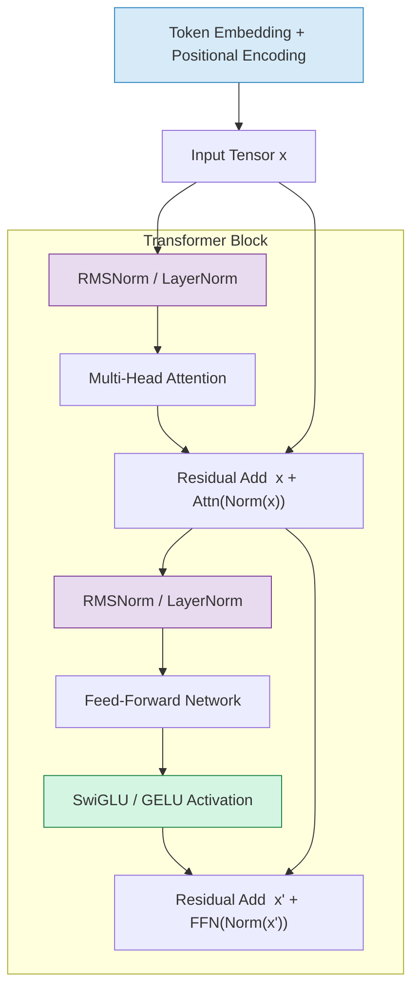
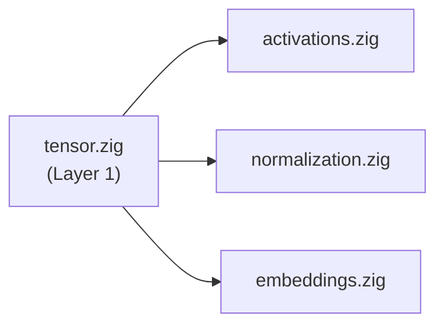

# Layer 3: Neural Primitives

The **Neural Primitives** layer implements the differentiable components that
give neural networks their expressive power.  Where Layer 2 provides raw
linear algebra (matrix multiplies, quantized dot products), this layer wraps
those operations into *semantically meaningful* units -- activations that
introduce non-linearity, normalizations that stabilize training, and embeddings
that bridge discrete tokens and continuous vector spaces.

Every transformer block in Layer 4 is assembled from the primitives defined
here.  Understanding them individually, with their mathematical properties and
computational trade-offs, is essential before studying the full attention
mechanism.

---

## Learning Objectives

After completing the three modules in this layer you will be able to:

1. **Explain** why non-linear activation functions are necessary and how they
   enable universal function approximation.
2. **Derive** the forward pass for ReLU, GELU, SiLU, and the gated variants
   (SwiGLU, GeGLU), including their derivatives.
3. **Compare** Layer Normalization and RMS Normalization in terms of
   mathematical formulation, computational cost, and gradient flow.
4. **Implement** sinusoidal and Rotary Position Embeddings (RoPE) from
   first principles and explain why relative positional information emerges
   from rotation matrices.
5. **Map** each primitive to its usage in real architectures -- LLaMA, GPT,
   BERT, Mistral, Falcon -- and justify why certain models prefer certain
   primitives.

---

## Prerequisites

!!! info "Required Background"

    This layer assumes familiarity with:

    - **Layer 1 -- Tensors**: `Tensor(T)` struct, shape semantics, element-wise
      operations, and the allocator pattern.
    - **Layer 2 -- Linear Algebra**: Matrix multiplication, SIMD vectorization,
      and quantization basics (helpful but not strictly required).
    - **Basic Calculus**: Derivatives, chain rule, and the concept of gradient
      flow through a computational graph.
    - **Probability**: Normal distribution CDF \(\Phi(x)\) and its relation to
      the error function (for GELU).

---

## Components Overview

| Module | Page | Source | Key Types |
|---|---|---|---|
| **Activation Functions** | [activation-functions.md](activation-functions.md) | `src/neural_primitives/activations.zig` | `ActivationType`, `relu`, `gelu`, `silu`, `swiglu`, `geglu` |
| **Normalization Layers** | [normalization.md](normalization.md) | `src/neural_primitives/normalization.zig` | `NormalizationType`, `layerNorm`, `rmsNorm`, `batchNorm`, `groupNorm` |
| **Embedding Systems** | [embeddings.md](embeddings.md) | `src/neural_primitives/embeddings.zig` | `TokenEmbedding`, `SegmentEmbedding`, `sinusoidalPositionalEncoding`, `rotaryPositionalEmbedding` |

---

## How Neural Primitives Compose Inside a Transformer

The following diagram shows where each primitive appears in a single
transformer block.  Arrows represent tensor data flow; labels name the
primitive responsible for each transformation.

---

## Notation Conventions

!!! notation "Symbols Used in This Layer"

    | Symbol | Meaning |
    |---|---|
    | \( x \in \mathbb{R}^d \) | Input vector to a primitive |
    | \( \gamma, \beta \in \mathbb{R}^d \) | Learnable scale and shift (normalization) |
    | \( \sigma(x) = \frac{1}{1+e^{-x}} \) | Logistic sigmoid |
    | \( \Phi(x) \) | CDF of the standard normal distribution |
    | \( \odot \) | Element-wise (Hadamard) product |
    | \( V \) | Vocabulary size |
    | \( d \) | Embedding / model dimension |
    | \( \epsilon \) | Small constant for numerical stability (typically \(10^{-6}\)) |

---

## Dependency Graph

Within the Neural Primitives layer the modules depend on each other as
follows.  All three modules depend on `tensor.zig` from Layer 1.

The `activations` module has **no** dependency on `normalization` or
`embeddings`; each primitive is self-contained.  The transformer layer (Layer 4)
is responsible for composing them.

---

## Suggested Reading Order

1. **[Activation Functions](activation-functions.md)** -- start with the
   simplest primitive; understand why non-linearity matters and how modern
   activations like GELU and SwiGLU improve upon classical ReLU.
2. **[Normalization Layers](normalization.md)** -- learn how normalization
   stabilizes deep networks and why LLaMA switched from LayerNorm to RMSNorm.
3. **[Embedding Systems](embeddings.md)** -- finish with embeddings, which
   connect the discrete vocabulary to the continuous vector space that
   activations and normalizations operate on.

---

## Key Design Decisions in ZigLlama

!!! tip "Compile-Time Polymorphism"

    ZigLlama uses an `ActivationType` enum dispatched through
    `applyActivation()` rather than function pointers.  Because the activation
    type is typically known at model-load time, the compiler can inline the
    selected branch and eliminate dead code.

!!! tip "No Separate Backward Pass"

    ZigLlama is an *inference* engine.  None of the primitives implement
    backward passes or gradient accumulation.  The documentation still
    discusses derivatives because understanding gradient flow explains *why*
    certain activations and normalizations are preferred.

---

## References

[^1]: Hendrycks, D. & Gimpel, K. "Gaussian Error Linear Units (GELUs)." *arXiv:1606.08415*, 2016.
[^2]: Ba, J. L., Kiros, J. R. & Hinton, G. E. "Layer Normalization." *arXiv:1607.06450*, 2016.
[^3]: Su, J. et al. "RoFormer: Enhanced Transformer with Rotary Position Embedding." *arXiv:2104.09864*, 2021.
[^4]: Vaswani, A. et al. "Attention Is All You Need." *NeurIPS*, 2017.
[^5]: Touvron, H. et al. "LLaMA: Open and Efficient Foundation Language Models." *arXiv:2302.13971*, 2023.
